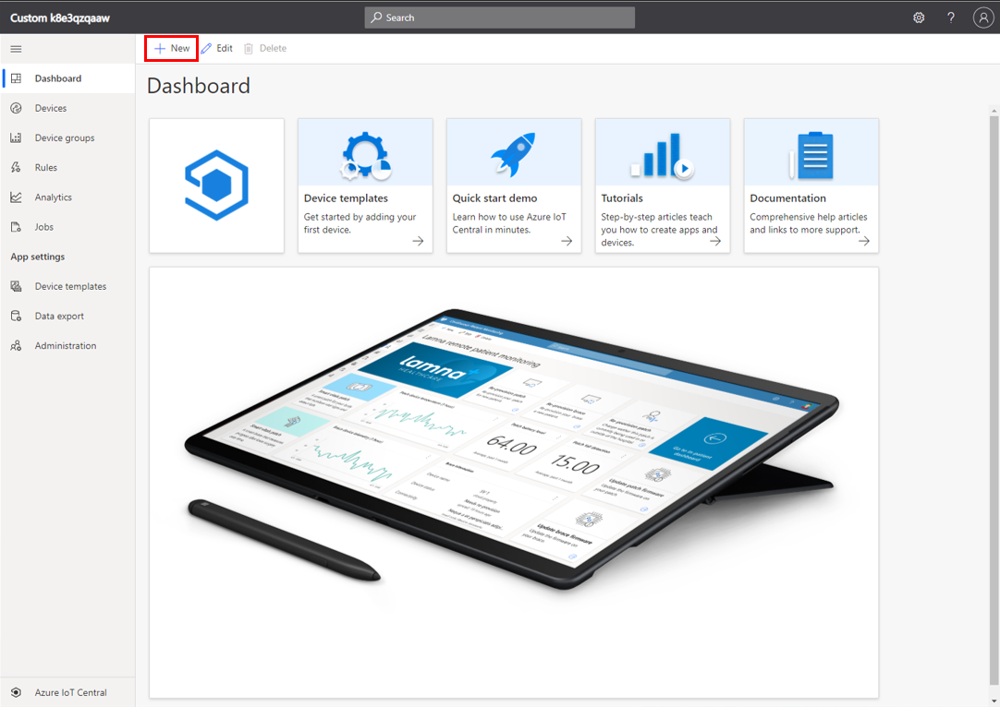
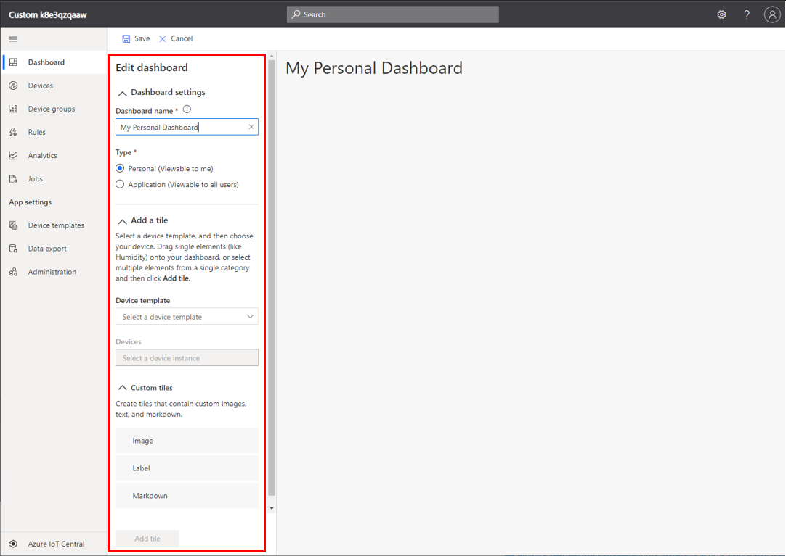
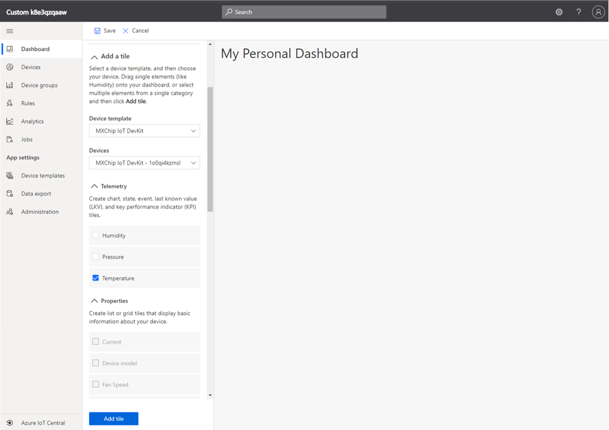
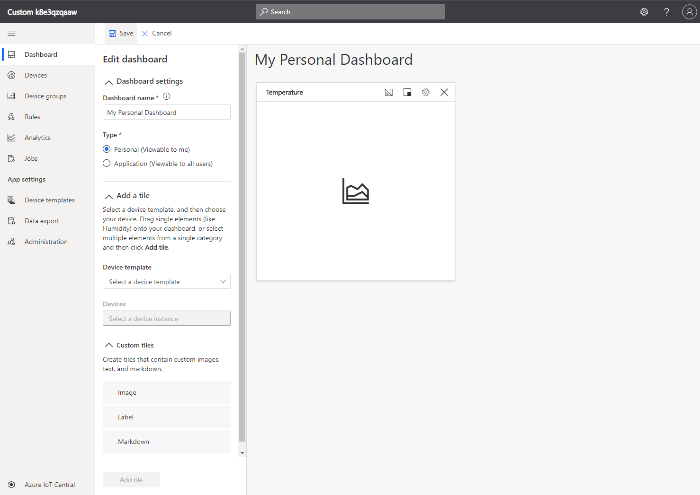
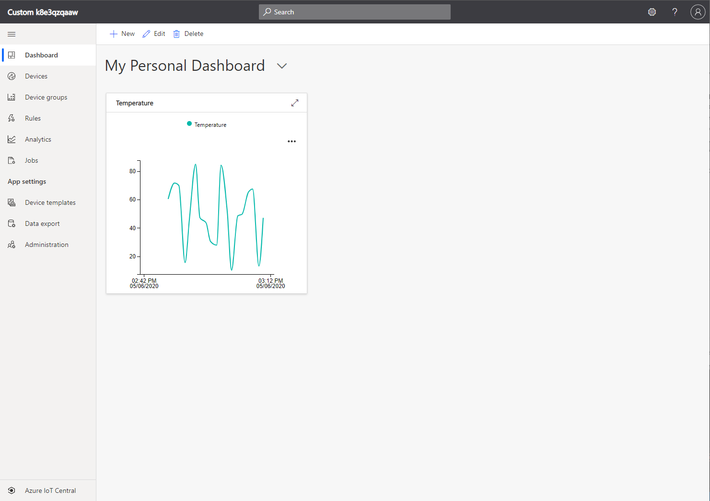
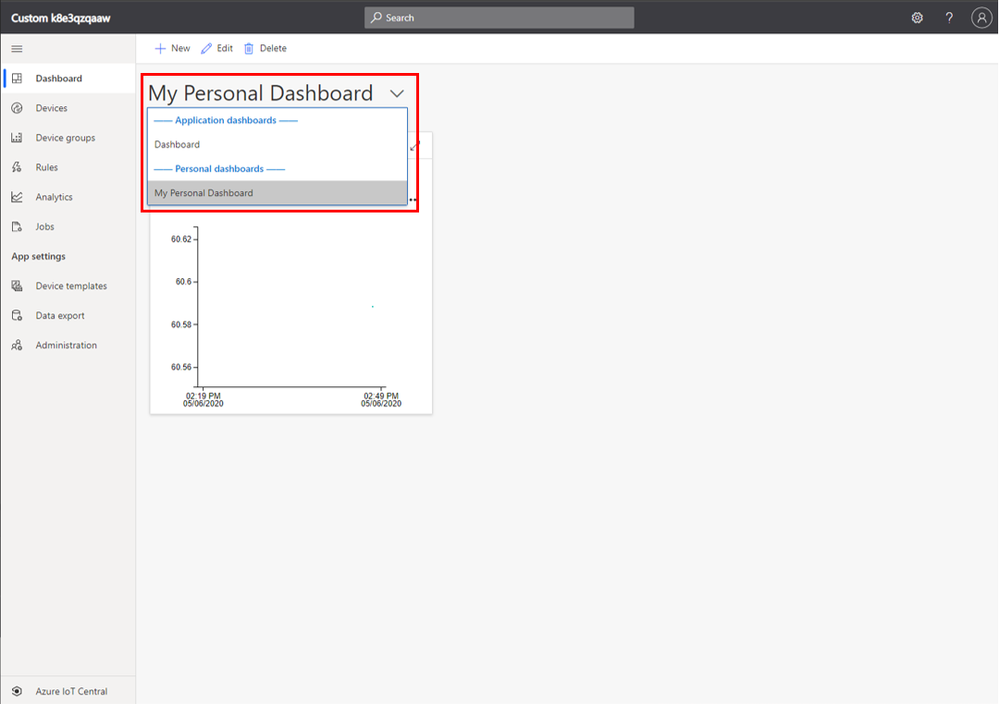
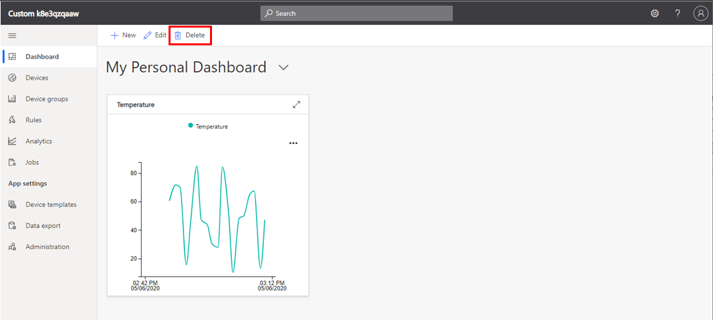

# Create and manage multiple dashboards

The **Dashboard** is the page that loads when you first navigate to your application. An **builder** in your application defines the default application dashboard for all users. You can replace this default dashboard with your own, personalized application dashboard. You can have several dashboards that display different data and switch between them. 

If you are an **admin** of the application, you also can create up to 10 application level dashboards to share with other users of the application. Only **admins** have the ability to create, edit, and delete application level dashboards. 

## Create dashboard

The following screenshot shows the dashboard in an application created from the **Custom Application** template. You can replace the default application dashboard with a personal dashboard, or if you are an admin, another application level dashboard. To do so, select **+ New** at the top left of the page.
 
> [!div class="mx-imgBorder"]
> 

Selecting **+ New** opens the dashboard editor. In the editor, you can give your dashboard a name and chose items from the library. The library contains the tiles and dashboard primitives you can use to customize the dashboard.

> [!div class="mx-imgBorder"]
> 

If you are an **admin** of the application, you will be given the option to toggle if you want to create a personal level dashboard or an application level dashboard. If you create a personal level dashboard, only you will be able to see it. If you create an application level dashboard, every user of the application will be able to see it. After entering a title and selecting the type of dashboard you want to create, you can save and add tiles later. Or if you are ready now and have added a device template and device instance, you can go ahead and create your first tile. 

> [!div class="mx-imgBorder"]
> 

For example, you can add a **Telemetry** tile for the current temperature of the device. To do so:
1. Select a **Device Template**
1. Select a **Device Instance** for the device you want to see on a dashboard tile. Then you will see a list of the device's properties that can be used on the tile.
1. To create the tile on the dashboard, click on **Temperature** and drag it to the dashboard area. You can also click the checkbox next to **Temperature** and click **Combine**. The following screenshot shows selecting a Device Template and Device Instance then creating a Temperature Telemetry tile on the dashboard.
1. Select **Save** in the top left to save the tile to the dashboard.

> [!div class="mx-imgBorder"]
> 

Now when you view your personal dashboard, you see the new tile with the **Temperature** setting for the device:

> [!div class="mx-imgBorder"]
> 

You can explore other tile types in the library to discover how to further customize your personal dashboards.

To learn more about how to use tiles in Azure IoT Central, see [Add Tiles to your Dashboard](howto-add-tiles-to-your-dashboard.md).

## Manage dashboards

You can have several personal dashboards and switch between them or choose from one of the default application dashboards:

> [!div class="mx-imgBorder"]
> 

You can edit your personal dashboards and delete any dashboards you no longer need. If you are an **admin**, you also have the ability to edit or delete application level dashboards as well.

> [!div class="mx-imgBorder"]
> 

## Next steps

Now that you've learned how to create and manage personal dashboards, you can [Learn how to manage your application preferences](howto-manage-preferences.md)