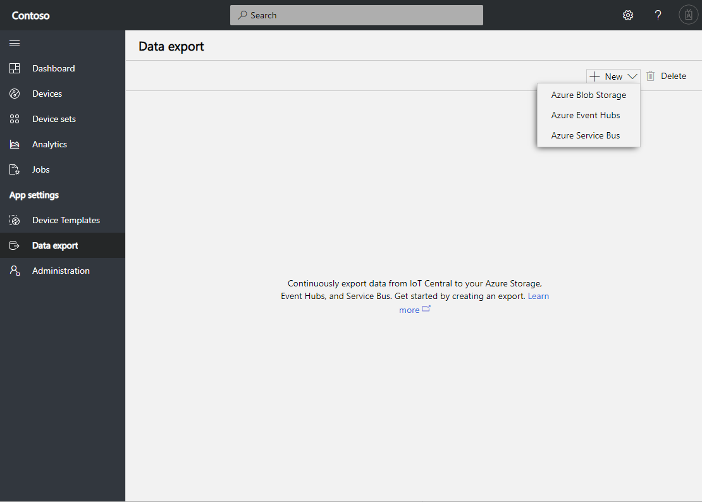
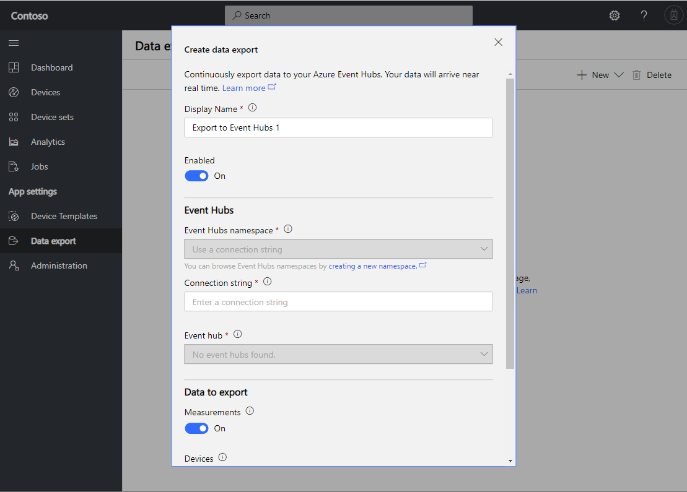

# Export your data in Azure IoT Central

[!INCLUDE [iot-central-original-pnp](../../../includes/iot-central-original-pnp-note.md)]

*This topic applies to administrators.*

This article describes how to use the continuous data export feature in Azure IoT Central to export your data to your own **Azure Event Hubs**, and **Azure Service Bus** instances. You can export **measurements**, **devices**, and **device templates** to your own destination for warm path insights and analytics. This includes triggering custom rules in Azure Stream Analytics, triggering custom workflows in Azure Logic Apps, or transforming the data and passing it through Azure Functions. 

> [!Note]
> Once again, when you turn on continuous data export, you get only the data from that moment onward. Currently, data can't be retrieved for a time when continuous data export was off. To retain more historical data, turn on continuous data export early.


## Prerequisites

- You must be an administrator in your IoT Central application

## Set up export destination

If you don't have an existing Event Hubs/Service Bus to export to, follow these steps to create one:

### Create Event Hubs namespace

1. Create a [new Event Hubs namespace in the Azure portal](https://ms.portal.azure.com/#create/Microsoft.EventHub). You can learn more in [Azure Event Hubs docs](https://docs.microsoft.com/azure/event-hubs/event-hubs-create).
2. Choose a subscription. 

    > [!Note] 
    > You can now export data to other subscriptions that are **not the same** as the one for your Pay-As-You-Go IoT Central application. You will connect using a connection string in this case.
3. Create an event hub in your Event Hubs namespace. Go to your namespace, and select **+ Event Hub** at the top to create an event hub instance.

### Create Service Bus namespace

1. Create a [new Service Bus namespace in the Azure portal](https://ms.portal.azure.com/#create/Microsoft.ServiceBus.1.0.5) . You can learn more in [Azure Service Bus docs](https://docs.microsoft.com/azure/service-bus-messaging/service-bus-create-namespace-portal).
2. Choose a subscription. 

    > [!Note] 
    > You can now export data to other subscriptions that are **not the same** as the one for your Pay-As-You-Go IoT Central application. You will connect using a connection string in this case.

3. Go to your Service Bus namespace, and select **+ Queue** or **+ Topic** at the top to create a queue or topic to export to.


## Set up continuous data export

Now that you have a Event Hubs/Service Bus destination to export data to, follow these steps to set up continuous data export. 

1. Sign in to your IoT Central application.

2. In the left menu, select **Continuous Data Export**.

    > [!Note]
    > If you don't see Continuous Data Export in the left menu, you are not an administrator in your app. Talk to an administrator to set up data export.

3. Select the **+ New** button in the top right. Choose one of **Azure Event Hubs** or **Azure Service Bus** as the destination of your export. 

    > [!NOTE] 
    > The maximum number of exports per app is five. 

    

4. In the drop-down list box, select your **Event Hubs namespace/Service Bus namespace**. You can also pick the last option in the list which is **Enter a connection string**. 

    > [!NOTE] 
    > You will only see Storage Accounts/Event Hubs namespaces/Service Bus namespaces in the **same subscription as your IoT Central app**. If you want to export to a destination outside of this subscription, choose **Enter a connection string** and see step 5.

    > [!NOTE] 
    > For 7 day trial apps, the only way to configure continuous data export is through a connection string. This is because 7 day trial apps do not have an associated Azure subscription.

    

5. (Optional) If you chose **Enter a connection string**, a new box appears for you to paste your connection string. To get the connection string for your:
    - Event Hubs or Service Bus, go to the namespace in the Azure portal.
        - Under **Settings**, select **Shared Access Policies**
        - Choose the default **RootManageSharedAccessKey** or create a new one
        - Copy either the primary or secondary connection string
 
6. Choose a Event hub/Queue or Topic from the drop-down list box.

7. Under **Data to export**, specify each type of data to export by setting the type to **On**.

8. To turn on continuous data export, make sure the **Data export** toggle is **On**. Select **Save**.

9. After a few minutes, your data will appear in your chosen destination.


## Data format

Measurements, devices, and device templates data are exported to your event hub or Service Bus queue or topic in near-realtime. Exported measurements data contains the entirety of the message your devices sent to IoT Central, not just the values of the measurements themselves. Exported devices data contains changes to properties and settings of all devices, and exported device templates contains changes to all device templates. The exported data is in the "body" property and is in JSON format.

> [!NOTE]
> When choosing a Service Bus as an export destination, the queues and topics **must not have Sessions or Duplicate Detection enabled**. If either of those options are enabled, some messages won't arrive in your queue or topic.

### Measurements

A new message is exported quickly after IoT Central receives the message from a device. Each exported message in Event Hubs and Service Bus contains the full message the device sent in the "body" property in JSON format. 

> [!NOTE]
> The devices that send the measurements are represented by device IDs (see the following sections). To get the names of the devices, export device data and correlate each messsage by using the **connectionDeviceId** that matches the **deviceId** of the device message.

The following example shows a message about measurements data received in event hub or Service Bus queue or topic.

```json
{
  "body": {
    "humidity": 29.06963648666288,
    "temp": 8.4503795661685,
    "pressure": 1075.8334910110093,
    "magnetometerX": 408.6966458887116,
    "magnetometerY": -532.8809796603962,
    "magnetometerZ": 174.70653875528205,
    "accelerometerX": 1481.546749013788,
    "accelerometerY": -1139.4316656437406,
    "accelerometerZ": 811.6928695575307,
    "gyroscopeX": 442.19879163299856,
    "gyroscopeY": 123.23710975717177,
    "gyroscopeZ": 708.5397575786151,
    "deviceState": "DANGER"
  },
  "annotations": {
    "iothub-connection-device-id": "<connectionDeviceId>",
    "iothub-connection-auth-method": "{\"scope\":\"hub\",\"type\":\"sas\",\"issuer\":\"iothub\",\"acceptingIpFilterRule\":null}",
    "iothub-connection-auth-generation-id": "<generationId>",
    "iothub-enqueuedtime": 1539381029965,
    "iothub-message-source": "Telemetry",
    "x-opt-sequence-number": 25325,
    "x-opt-offset": "<offset>",
    "x-opt-enqueued-time": 1539381030200
  },
  "sequenceNumber": 25325,
  "enqueuedTimeUtc": "2018-10-02T21:50:30.200Z",
  "offset": "<offset>",
  "properties": {
    "content_type": "application/json",
    "content_encoding": "utf-8"
  }
}
```

### Devices

Messages containing device data are sent to your event hub or Service Bus queue or topic once every few minutes. This means that every few minutes, a batch of messages will arrive with data about
- New devices that were added
- Devices with changed property and setting values

Each message represents one or more changes to a device since the last exported message. Information that will be sent in each message includes:
- `id` of the device in IoT Central
- `name` of the device
- `deviceId` from [Device Provisioning Service](https://aka.ms/iotcentraldocsdps)
- Device template information
- Property values
- Setting values

> [!NOTE]
> Devices deleted since the last batch aren't exported. Currently, there are no indicators in exported messages for deleted devices.
>
> The device template that each device belongs to is represented by a device template ID. To get the name of the device template, be sure to export device template data too.

The following example shows a message about device data in event hub or Service Bus queue or topic:


```json
{
  "body": {
    "id": "<id>",
    "name": "<deviceName>",
    "simulated": true,
    "deviceId": "<deviceId>",
    "deviceTemplate": {
      "id": "<templateId>",
      "version": "1.0.0"
    },
    "properties": {
      "cloud": {
        "location": "Seattle"
      },
      "device": {
        "dieNumber": 5445.5862873026645
      }
    },
    "settings": {
      "device": {
        "fanSpeed": 0
      }
    }
  },
  "annotations": {
    "iotcentral-message-source": "devices",
    "x-opt-partition-key": "<partitionKey>",
    "x-opt-sequence-number": 39740,
    "x-opt-offset": "<offset>",
    "x-opt-enqueued-time": 1539274959654
  },
  "partitionKey": "<partitionKey>",
  "sequenceNumber": 39740,
  "enqueuedTimeUtc": "2018-10-02T16:22:39.654Z",
  "offset": "<offset>",
}
```

### Device templates

Messages containing device templates data are sent to your event hub or Service Bus queue or topic once every few minutes. This means that every few minutes, a batch of messages will arrive with data about
- New device templates that were added
- Device templates with changed measurements, property, and setting definitions

Each message represents one or more changes to a device template since the last exported message. Information that will be sent in each message includes:
- `id` of the device template
- `name` of the device template
- `version` of the device template
- Measurement data types and min/max values
- Property data types and default values
- Setting data types and default values

> [!NOTE]
> Device templates deleted since the last batch aren't exported. Currently, there are no indicators in exported messages for deleted device templates.

The following example shows a message about device templates data in event hub or Service Bus queue or topic:

```json
{ 
  "body":{ 
    "id":"<id>",
    "version":"1.0.0",
    "name":"<templateName>",
    "measurements":{ 
      "telemetry":{ 
        "humidity":{ 
          "dataType":"double",
          "name":"humidity"
        },
        "pressure":{ 
          "dataType":"double",
          "name":"pressure"
        },
        "temp":{ 
          "dataType":"double",
          "name":"temperature"
        }
      }
    },
    "properties":{ 
      "cloud":{ 
        "location":{ 
          "dataType":"string",
          "name":"Location"
        }
      },
      "device":{ 
        "dieNumber":{ 
          "dataType":"double",
          "name":"Die Number"
        }
      }
    },
    "settings":{ 
      "device":{ 
        "fanSpeed":{ 
          "dataType":"double",
          "name":"Fan Speed",
          "initialValue":0
        }
      }
    }
  },
  "annotations":{ 
    "iotcentral-message-source":"deviceTemplates",
    "x-opt-partition-key":"<partitionKey>",
    "x-opt-sequence-number":25315,
    "x-opt-offset":"<offset>",
    "x-opt-enqueued-time":1539274985085
  },
  "partitionKey":"<partitionKey>",
  "sequenceNumber":25315,
  "enqueuedTimeUtc":"2018-10-02T16:23:05.085Z",
  "offset":"<offset>"
}
```

## Next steps

Now that you know how to export your data to Azure Event Hubs and Azure Service Bus, continue to the next step:

> [!div class="nextstepaction"]
> [How to trigger Azure Functions](howto-trigger-azure-functions.md)
