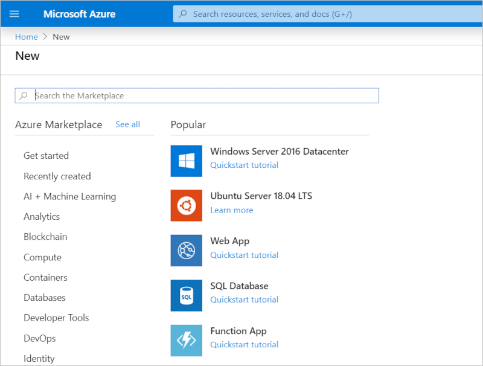
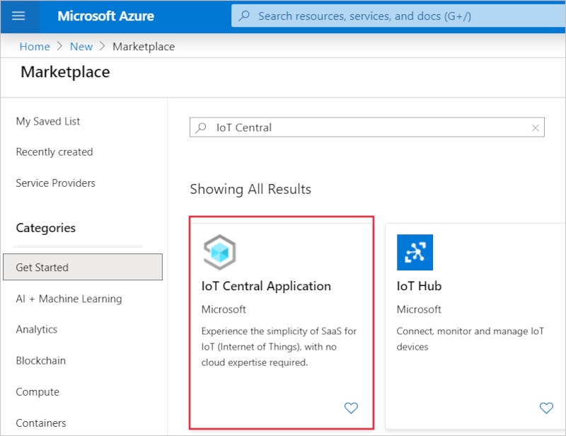
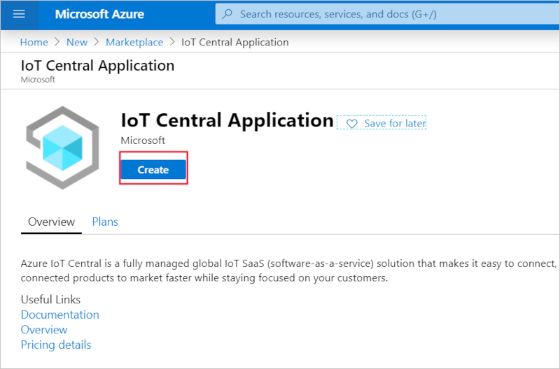

# Manage IoT Central from the Azure portal

[!INCLUDE [iot-central-selector-manage](../../../includes/iot-central-selector-manage.md)]

Instead of creating and managing IoT Central applications on the [Azure IoT Central application manager](https://aka.ms/iotcentral) website, you can use the [Azure portal](https://portal.azure.com) to manage your applications.

## Create IoT Central applications

To create an application, navigate to the [Azure portal](https://ms.portal.azure.com) and select **Create a resource** in the main pane on the left.

In search bar, type **IoT Central**.

Select the **IoT Central Application** line-item in the search results.

Now, select **Create**.

Fill in all the fields in the form. This form is similar to the form you fill out to create applications on the [Azure IoT Central application manager](https://aka.ms/iotcentral) website. For more information, see the [Create an IoT Central application](quick-deploy-iot-central.md) quickstart.

**Location** is the [geography](https://azure.microsoft.com/global-infrastructure/geographies/) where you'd like to create your application. Typically, you should choose the location that's physically closest to your devices to get optimal performance. Azure IoT Central is currently available in the **United States**, **Australia**, **Asia Pacific**, or in **Europe**.  Once you choose a location, you can't move your application to a different location later.

  

After filling out all fields, select **Create**.

## Manage existing IoT Central applications

If you already have an Azure IoT Central application you can delete it, or move it to a different subscription or resource group in the Azure portal.

> [!NOTE]
> You can't see Trial applications in the Azure portal because they are not associated with your subscription.

To get started, select **All resources** in the main pane on the left. Use the search box to type in the name of your application to find it in your list of resources. Then select the IoT Central application you'd like to manage.

To navigate to the application, select the IoT Central Application URL.

To move the application to a different resource group, select **change** beside the resource group. On the **Move resources** page, pick the resource group you'd like to migrate this application to.

To move the application to a different subscription, select the **change** link beside the subscription. Pick the subscription to which you'd like to migrate this application in the dialog that appears.

## Next steps

Now that you've learned how to manage Azure IoT Central applications from the Azure portal, here is the suggested next step:

> [!div class="nextstepaction"]
> [Administer your application](howto-administer.md)