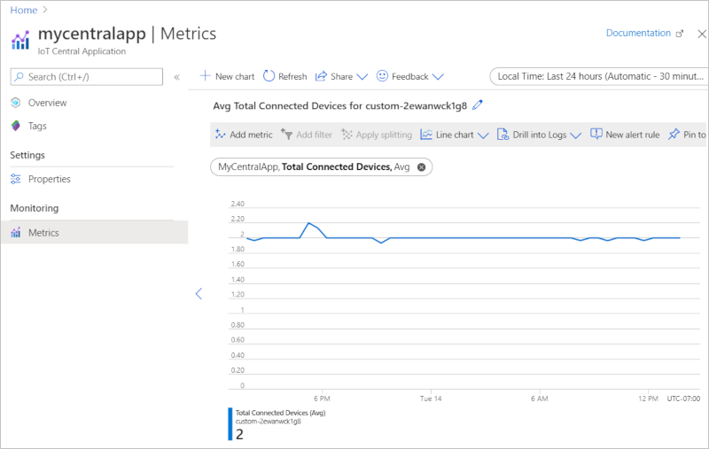

# Monitor the overall health of the devices connected to an IoT Central application

> [!NOTE]
> Metrics only works for version 3 IoT Central application. To learn how to check your application version, see [About your application](./howto-get-app-info.md).

*This article applies to operators and administrators.*

In this article, you learn how to use the set of metrics provided by IoT Central to assess the overall health of the devices connected to your IoT Central application.

Metrics are enabled by default for your IoT Central application and you access them from the [Azure portal](https://portal.azure.com/). The [Azure Monitor data platform exposes these metrics](../../azure-monitor/platform/data-platform-metrics.md) and provides several ways for you to interact with them. For example, you can use charts in the Azure portal, a REST API, or queries in PowerShell or the Azure CLI.

### Trial applications

Applications that use the free trial plan don't have an associated Azure subscription and so don't support Azure Monitor metrics. You can [convert an application to a standard pricing plan](./howto-view-bill.md#move-from-free-to-standard-pricing-plan) and get access to these metrics.

## View metrics in the Azure portal

The following steps assume you have an [IoT Central application](./quick-deploy-iot-central.md) with some [connected devices](./tutorial-connect-device-nodejs.md).

To view IoT Central metrics in the portal:

1. Navigate to your IoT Central application resource in the portal. By default, IoT Central resources are located in a resource group called **IOTC**.
1. To create a chart from your application's metrics, select **Metrics** in the **Monitoring** section.

### Azure portal permissions

Access to metrics in the Azure portal is managed by [Azure role based access control](../../role-based-access-control/overview.md). Use the Azure portal to add users to the IoT Central application/resource group/subscription to grant them access. You must add a user in the portal even they're already added to the IoT Central application. Use [Azure built-in roles](../../role-based-access-control/built-in-roles.md) for finer grained access control.

## IoT Central metrics

The metrics that are currently available for IoT Central are [here](https://docs.microsoft.com/en-us/azure/azure-monitor/platform/metrics-supported#microsoftiotcentraliotapps).

### Metrics and invoices

Metrics may differ from the numbers shown on your Azure IoT Central invoice. This situation occurs for a number of reasons such as:

- IoT Central [standard pricing plans](https://azure.microsoft.com/pricing/details/iot-central/) include two devices and varying message quotas for free. While the free items are excluded from billing, they're still counted in the metrics.

- IoT Central autogenerates one test device ID for each device template in the application. This device ID is visible on the **Manage test device** page for a device template. Solution builders may choose to [validate their device templates](./overview-iot-central.md#create-device-templates) before publishing them by generating code that uses these test device IDs. While these devices are excluded from billing, they're still counted in the metrics.

- While metrics may show a subset of device-to-cloud communication, all communication between the device and the cloud [counts as a message for billing](https://azure.microsoft.com/pricing/details/iot-central/).

## Next steps

Now that you've learned how to use application templates, the suggested next step is to learn how to [Manage IoT Central from the Azure portal](howto-manage-iot-central-from-portal.md)
