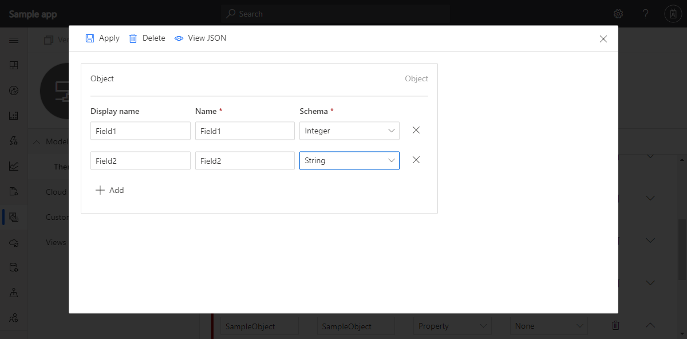
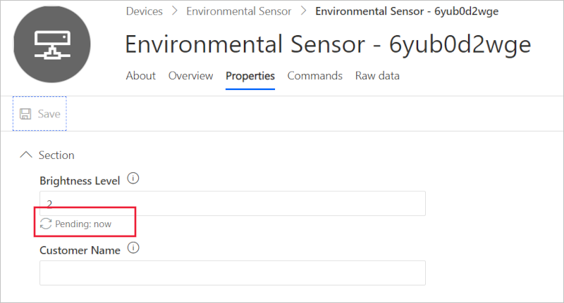

# How to use properties in an Azure IoT Central solution

This article shows you how to use device properties that are defined in a device template in your Azure IoT Central application.

You can also define cloud properties in an IoT Central application. Cloud property values are never exchanged with a device and are out of scope for this article.

## Define your properties

Properties are data fields that represent the state of your device. Use properties to represent the durable state of the device, such as the on-off state of a device. Properties can also represent basic device properties, such as the software version of the device. You can declare properties as read-only or writable.

The properties can be defined in an interface in a device template as below:


```json
{
  "@type": "Property",
  "displayName": "Device State",
  "description": "The state of the device. Two states online/offline are available.",
  "name": "state",
  "schema": "boolean"
},
{
  "@type": "Property",
  "displayName": "Customer Name",
  "description": "The name of the customer currently operating the device.",
  "name": "name",
  "schema": "string",
  "writable": true
},
{
"@type": "Property",
"displayName": "Date ",
"description": "The date on which the device is currently operating",
"name": "date",
"writable": true,
"schema": "date"
},
{
"@type": "Property",
"displayName": "Location",
"description": "The current location of the device",
"name": "location",
"writable": true,
"schema": "geopoint"
},
{
"@type": "Property",
"displayName": "Vector Level",
"description": "The Vector level of the device",
"name": "vector",
"writable": true,
"schema": "vector"
}
```

This example shows five properties, a minimal field description has a:

- `@type` to specify the type of capability: `Property`
- `name` for the property value.
- `schema` specify the data type for the property. This value can be a primitive type, such as double, integer, boolean, or string. Complex object types, arrays, and maps are also supported.
- `writable` By default, properties are read-only. You can mark a property as writeable, by using this field

Optional fields, such as display name and description, let you add more details to the interface and capabilities.


You can create a property capability for the device template in your IoT Central application, as follows:


When you select the complex schema such as **Object**, you need to define the object as well.



## Implement read-only properties

By default, properties are read-only. Read-only properties mean that the device reports property value updates to your IoT Central application. Your IoT Central application can't set the value of a read-only property.


The following snippet from a device capability model shows the definition of a read-only property type:

```json
    {
    "@type": "Property",
    "name": "model",
    "displayName": "Device model",
    "schema": "string",
    "comment": "Device model name or ID. Ex. Surface Book 2."
    }
```
Read-only properties are sent by the device to IoT Central. The properties are sent as JSON payload, for more information, see [payloads](./concepts-telemetry-properties-commands.md).


You can use the Azure IoT device SDK to send a property update to your IoT Central application.

Device twin properties can be sent to your Azure IoT Central application by using the below function:

```javascript
    // Send device twin reported properties.
    function sendDeviceProperties(twin, properties) {
      twin.properties.reported.update(properties, (err) => console.log(`Sent device properties: ${JSON.stringify(properties)}; ` +
        (err ? `error: ${err.toString()}` : `status: success`)));
    }
```

IoT Central uses device twins to synchronize property values between the device and the IoT Central application. Device property values use device twin reported properties

This article uses Node.js for simplicity, for complete information about device application examples see the [Create and connect a client application to your Azure IoT Central application (Node.js)](tutorial-connect-device-nodejs.md) and [Create and connect a client application to your Azure IoT Central application (Python)](tutorial-connect-device-python.md) tutorials.

The following view in Azure IoT Central application shows the properties, you can see the view automatically makes the Device model property a _read-only device property_.


## Implement writable properties

Writable properties are set by an operator in the IoT Central application on a form. IoT Central sends the property to the device. IoT Central expects an acknowledgment from the device. 

The following snippet from a device capability model shows the definition of a writable property type:

```json
    {
     "@type": "Property",
     "displayName": "Brightness Level",
     "description": "The brightness level for the light on the device. Can be specified as 1 (high), 2 (medium), 3 (low)",
     "name": "brightness",
     "writable": true,
     "schema": "long"
    }
```

To define and handle the writeable properties your device responds to, you can use the following code. The message the device sends in response to the [writeable property update](concepts-telemetry-properties-commands.md#writeable-property-types) must include the `av` and `ac` fields. The `ad` field is optional:

```javascript
    // Add any writeable properties your device supports,
    // mapped to a function that's called when the writeable property
    // is updated in the IoT Central application.
    var writeableProperties = {
      'brightness': (newValue, callback) => {
        setTimeout(() => {
        callback(newValue, 'completed', 200);
        }, 5000);
      }
    };


    // Handle writeable property updates that come from IoT Central via the device twin.
    function handleWriteablePropertyUpdates(twin) {
      twin.on('properties.desired', function (desiredChange) {
        for (let setting in desiredChange) {
          if (writeableProperties[setting]) {
            console.log(`Received setting: ${setting}: ${desiredChange[setting]}`);
            writeableProperties[setting](desiredChange[setting], (newValue, status, code) => {
              var patch = {
                [setting]: {
                  value: newValue,
                  ad: status,
                  ac: code,
                  av: desiredChange.$version
                }
              }
              sendDeviceProperties(twin, patch);
            });
          }
        }
      });
    }
```

When the operator sets a writeable property in the IoT Central application, the application uses a device twin desired property to send the value to the device. The device then responds using a device twin reported property. When IoT Central receives the reported property value, it updates the property view with a status of **Accepted**.

The names of the properties must match the names used in the device template.

The following view shows the writable properties. When you enter the value and **save**, the initial status is **pending**, when the device accepts the change, the status changes to **Accepted**.




## Next steps

Now that you've learned how to use properties in your Azure IoT Central application, you can see [Payloads](concepts-telemetry-properties-commands.md) and [Create and connect a client application to your Azure IoT Central application (Node.js)](tutorial-connect-device-nodejs.md).