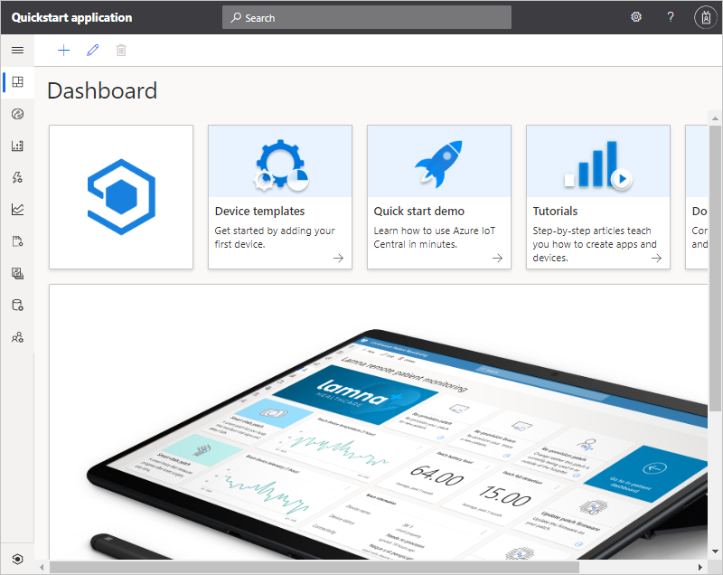

# Create an Azure IoT Central application

This quickstart shows you how to create an Azure IoT Central application.

## Create an application

Navigate to the [Azure IoT Central Build](https://aka.ms/iotcentral) site. Then sign in with a Microsoft personal, work, or school account.

You create a new application either from the list of industry-relevant IoT Central templates to help you get started quickly, or start from scratch using the **Custom app** template. In this quickstart, you use the **Custom app** template.

To create a new Azure IoT Central application from the **Custom app** template:

1. Navigate to the **Build** page:

    

1. Choose **Custom app** and make sure that the **Preview application** template is selected.

1. Azure IoT Central automatically suggests an **application name** based on the application template you've selected. You can use this name or enter your own friendly application name.

1. Azure IoT Central also generates a unique **application URL** prefix for you, based on the application name. You use this URL to access your application. Change this URL prefix to something more memorable if you'd like.

    

    > [!NOTE]
    > If you chose **Custom app** on the previous page, you see an **Application template** dropdown. From here you can switch between preview and legacy templates. You might also see other templates that have been made available for your organization.

1. Choose to create this application using a 7-day free trial, or a pay-as-you-go subscription:

    - **Trial** applications are free for seven days and support up to five devices. You can convert trial applications to pay-as-you-go at any time before they expire. If you create a trial application, you need to enter your contact information and choose whether to receive information and tips from Microsoft. You can complete all the IoT Central quickstarts with trial application.
    - **Pay-As-You-Go** applications are charged on a per device basis, with the first five devices free. To learn more, see [IoT Central pricing](https://aka.ms/iotcentral-pricing). If you create a pay-as-you-go application, you need to select your *Directory*, *Azure Subscription*, and *Location*:
        - *Directory* is the Azure Active Directory in which you create your application. An Azure Active Directory contains user identities, credentials, and other organizational information. If you don't have an Azure Active Directory, one is created for you when you create an Azure subscription.
        - An *Azure Subscription* enables you to create instances of Azure services. IoT Central provisions resources in your subscription. If you don't have an Azure subscription, you can create one for free on the [Azure sign-up page](https://aka.ms/createazuresubscription). After you create the Azure subscription, navigate back to the **New application** page. Your new subscription now appears in the **Azure Subscription** drop-down.
        - *Location* is the [geography](https://azure.microsoft.com/global-infrastructure/geographies/) where you'd like to create your application. Typically, you should choose the location that's physically closest to your devices to get optimal performance. Once you choose a location, you can't later move your application to a different location.

1. Review the Terms and Conditions, and select **Create** at the bottom of the page. After a few minutes, you IoT Central application is ready to use:

    

## Next steps

In this quickstart, you created an IoT Central application. Here's the suggested next step:

> [!div class="nextstepaction"]
> [Add a simulated device to your IoT Central application](./quick-create-pnp-device.md)
