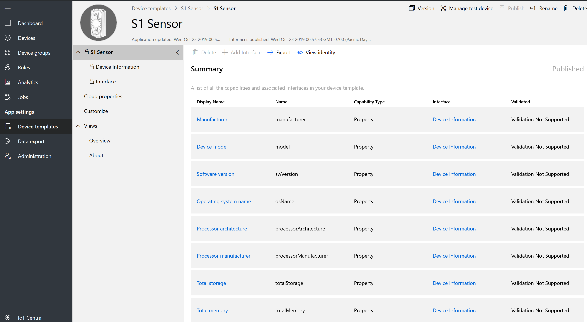
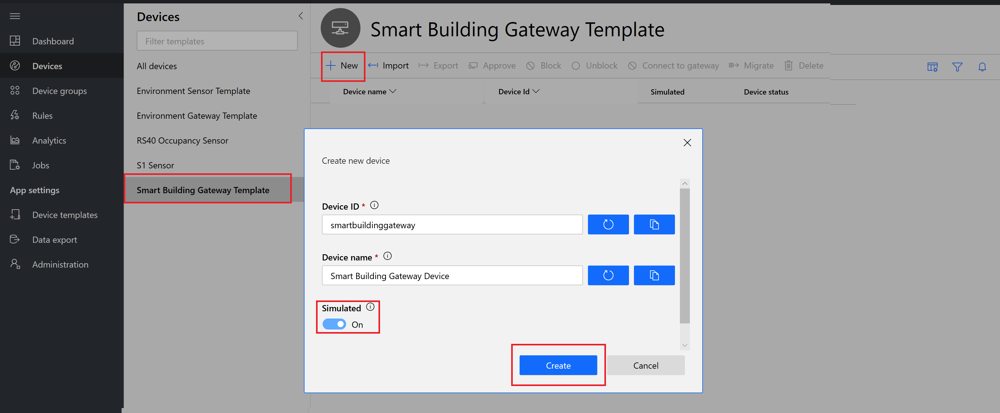

# Tutorial: Define a new IoT device as a gateway device type in your Azure IoT Central application (preview features)

[!INCLUDE [iot-central-pnp-original](../../../includes/iot-central-pnp-original-note.md)]

This tutorial shows you, as a builder, how to use a device template to define a new type of Azure IoT gateway device in your Azure IoT Central application. 

A **device template** defines the capabilities of your IoT gateway device. Capabilities include telemetry the gateway sends, properties, and the commands a gateway responds to.

In this tutorial, you create an **Smart Building Gateway** device template. An Smart Building gateway device:

* Sends telemetry such as temperature and occupancy.
* Responds to writeable properties when updated in the cloud such as telemetry send interval.
* Responds to commands such as resetting temperature.
* Allows relationships to other device capability models

In this tutorial, you learn how to:

> [!div class="checklist"]
> * Create a new IoT device as a gateway device template.
> * Create a downstream device template
> * Add relationships between downstream devices and IoT gateway device
> * Create capabilities including telemetry, properties and commands for each module
> * Define a visualization for the module telemetry.
> * Publish your device template.

## Downstream Device Relationships with Gateway & Modules

Downstream devices can connect to Azure IoT gateway device 

## Prerequisites

To complete this tutorial, you need an Azure IoT Central application. Follow this quick start to [Create an Azure IoT Central application](quick-deploy-iot-central-pnp.md?toc=/azure/iot-central-pnp/toc.json&bc=/azure/iot-central-pnp/breadcrumb/toc.json).

### Create Downstream Device Templates

You will create downstream device templates which will be used during the gateway device template creation. 

Click on Device Templates in the left navigation, click **+ New**, select **IoT Device** tile and select occupancy sensor tile and click **Next: Customize**

You will be presented the review page. Click **Create** button. 

New device template is created. 

You will create a device template for S1 Sensor. 

Click on Device Templates in the left navigation, click **+ New**, select **IoT Device** tile and select occupancy sensor tile and click **Next: Customize**

You will be presented the review page. Click **Create** button. 

New device template is created. 

## Create a Gateway template

As a builder, you can create and edit Azure IoT gateway device templates in your application. After you publish a device template, you can connect real devices that implement the device template.

### Select Device Template Type 

To add a new device template to your application, go to the **Device Templates** page. To do so select the **Device Templates** tab on the left navigation menu.

Click **+ New** to start creating a new device template.

You will land on device template type selection page. Select **Azure IoT ** Tile and click **Next: Customize** button at the bottom

You will land on device template type selection page. Select **Azure IoT** Tile and click **Next: Customize** button at the bottom

Select Gateway checkbox and click **Create** 

You will be presented with a review page, click **Create** 

Enter the gateway template name **Smart Building Gateway Template**. Click **Custom** tile.

Add a standard interface **Device Information**.

### Add Relationships

You can add downstream relationships to device capability models for devices you will connect to gateway device.

Create relationships to downstream device capability models. Click **Save**

### Add cloud properties

A device template can include cloud properties. Cloud properties only exist in the IoT Central application and are never sent to, or received from, a device.

1. Select **Cloud Properties** and then **+ Add Cloud Property**. Use the information in the following table to add a cloud property to your device template.

    | Display Name      | Semantic Type | Schema |
    | ----------------- | ------------- | ------ |
    | Last Service Date | None          | Date   |
    | Customer name     | None          | String |

2. Select **Save** to save your changes:

### Add customizations

Use customizations when you need to modify an interface or add IoT Central-specific features to a capability that doesn't require you to version your device capability model. You can customize fields when the capability model is in a draft or published state. You can only customize fields that don't break interface compatibility. For example, you can:

- Customize the display name and units of a capability.
- Add a default color to use when the value appears on a chart.
- Specify initial, minimum, and maximum values for a property.

You can't customize the capability name or capability type. Click **Save**

### Create views

As a builder, you can customize the application to display relevant information about the environmental sensor device to an operator. Your customizations enable the operator to manage the environmental sensor devices connected to the application. You can create two types of views for an operator to use to interact with devices:

* Forms to view and edit device and cloud properties.
* Dashboards to visualize devices.

### Generate default views

For this tutorial click on Generate default views. Overview & About dashboards are generated. 

## Publish device template

Before you can create a simulated environmental sensor, or connect a real environmental sensor, you need to publish your device template.

To publish a device template:

1. Go to your device template from the **Device Templates** page.

2. Select **Publish**.

3. On the **Publish a Device Template** dialog, choose **Publish**:

After a device template is published, it's visible on the **Devices** page and to the operator. In a published device template, you can't edit a device capability model without creating a new version. However, you can make updates to cloud properties, customizations, and views, in a published device template without versioning. After making any changes, select **Publish**  to push those changes out to your operator.

## Create Gateway Simulated Device

From the device explorer create a simulated smart building gateway. 

## Create Downstream Simulated Devices

From the device explorer create a simulated occupancy sensor. 

From the device explorer create a simulated s1 sensor. 

## Add Downstream Devices relationships to Gateway DEvice

Select S1 Sensor and Occupancy Sensor and click **Connect to gateway**. 

Select gateway device template, gateway device instance and click **Join**.

## Summary

In this tutorial, you learned how to:

* Create a new IoT gateway as a  device template
* Create cloud properties.
* Create customizations.
* Define a visualization for the device telemetry.
* Add relationships
* Publish your device template.
