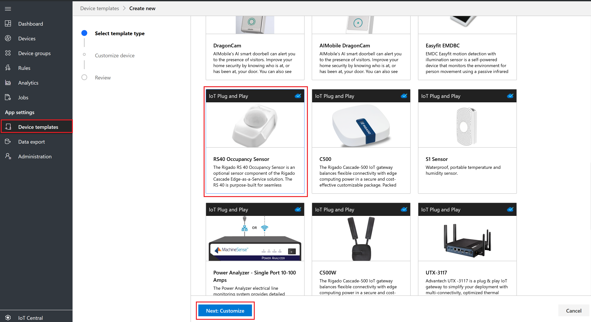
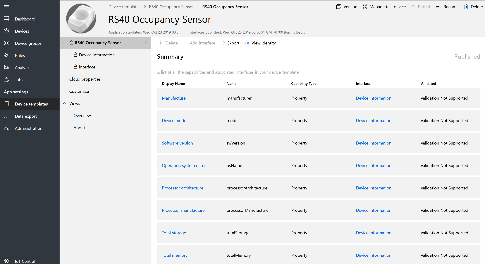
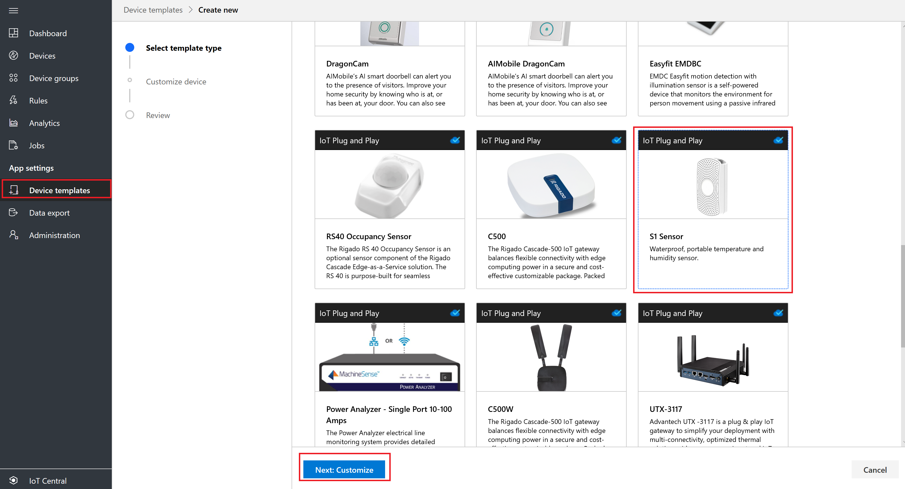
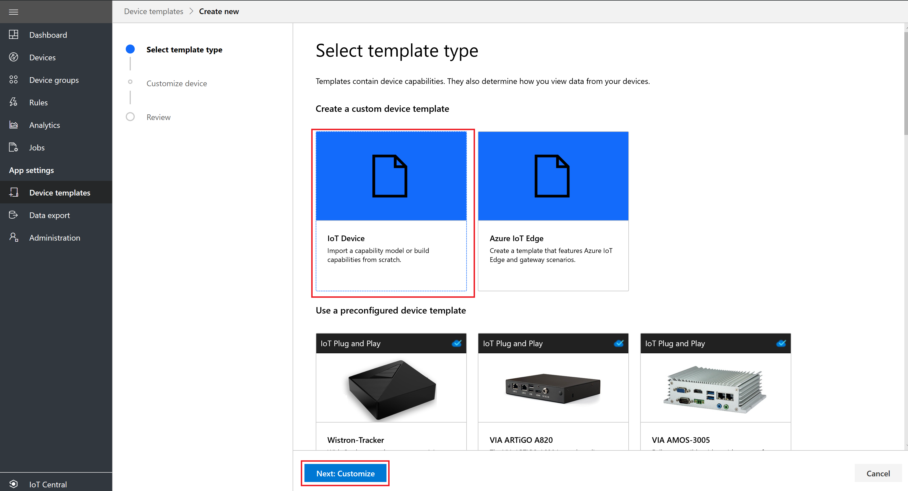
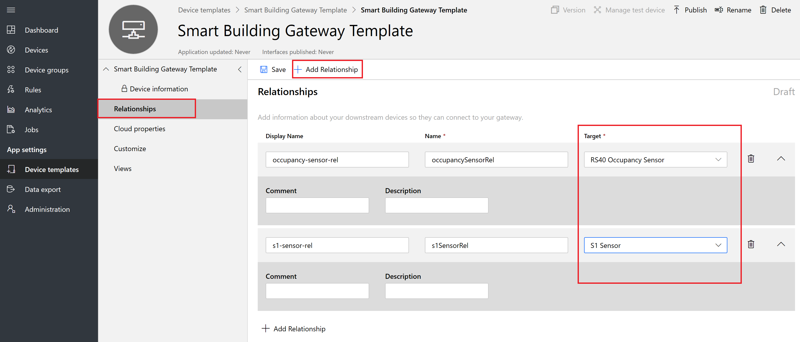
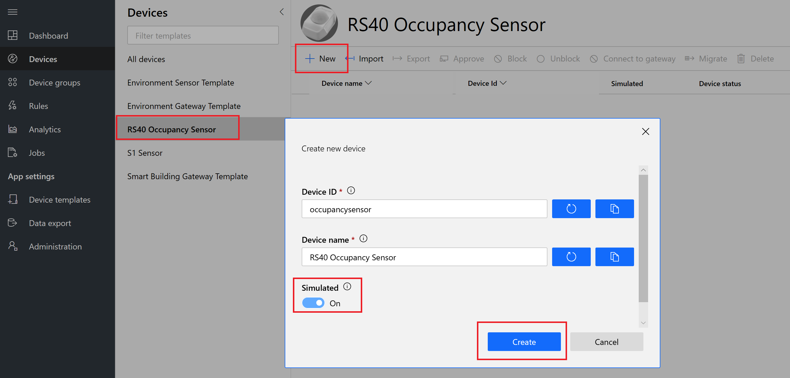
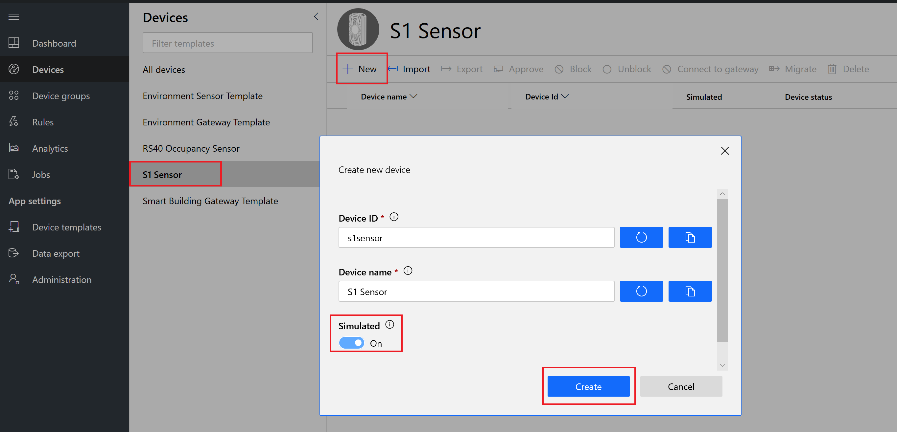

# Set up and manage a device template (preview features)

[!INCLUDE [iot-central-pnp-original](../../../includes/iot-central-pnp-original-note.md)]

A device template is a blueprint that defines the characteristics and behaviors of a type of device that connects to an Azure IoT Central application.

For example, a builder can create a device template for a connected fan that has the following characteristics:

- Sends temperature telemetry
- Sends location property
- Sends fan motor error events
- Sends fan operating state
- Writeable fan speed property
- Command to restart the device
- Dashboard that gives you an overall view of the device

From this device template, an operator can create and connect real fan devices. All these fans have measurements, properties, and commands that operators use to monitor and manage then. Operators use the device dashboards and forms to interact with the fan devices.

> [!NOTE]
> Only builders and administrators can create, edit, and delete device templates. Any user can create devices on the **Devices** page from existing device templates.

[IoT Plug and Play](../../iot-pnp/overview-iot-plug-and-play.md) enables IoT Central to integrate devices without you writing any embedded device code. At the core of IoT Plug and Play is a device capability model schema that describes device capabilities. In an IoT Central Preview application, device templates use these IoT Plug and Play device capability models.

As a builder, you have several options for creating device templates:

- Design the device template in IoT Central and then implement its device capability model in your device code.
- Import a device capability model from the [Azure Certified for IoT device catalog](https://aka.ms/iotdevcat) and then add any cloud properties, customizations, and dashboards your IoT Central application needs.
- Create a device capability model using Visual Studio code. Implement your device code from the model. Manually import the device capability model into your IoT Central application and then add any cloud properties, customizations, and dashboards your IoT Central application needs.
- Create a device capability model using Visual Studio code. Implement your device code from the model, and connect your real device to your IoT Central application using a device-first connection. IoT Central finds and imports the device capability model from the public repository for you. You can then add any cloud properties, customizations, and dashboards your IoT Central application needs to the device template.

## Create a device template from the device catalog

As a builder, you can quickly start building out your solution using an IoT Plug and Play certified device listed in the [Azure IoT Device Catalog](https://catalog.azureiotsolutions.com/alldevices). IoT Central integrates with the device catalog to let you import a device capability model from any of these IoT Plug and Play certified devices. To create a device template from one of these devices in IoT Central:

1. Go to the **Device Templates** page in your IoT Central application.
1. Select **+ New**, then select any of the IoT Plug and Play certified devices from the catalog listed below. IoT Central creates a device template based on this device capability model.
1. Add any cloud properties, customizations, or views to your device template.
1. Select **Publish** to publish this device template to make it available for operators to view and connect devices.

## Create a device template from scratch

A device template contains:

- A _device capability model_ that specifies the telemetry, properties, and commands that the device implements. These capabilities are organized into one or more interfaces.
- _Cloud properties_ that define information that your IoT Central application stores about your devices. For example, a cloud property might record the data a device was last serviced. This information is never shared with the device.
- _Customizations_ let the builder override some of the definitions in the device capability model. For example, the builder could override the name of a device property. Property names appear in IoT Central dashboards and forms.
- _Dashboards and forms_ let the builder create a UI that lets operators monitor and manage the devices connected to your application.

To create a device template in IoT Central:

1. Go to the **Device Templates** page in your IoT Central application.
1. Select **+ New**, then select **Custom**.
1. Enter a name for your template, such as **Environmental Sensor**.
1. Press **Enter**. IoT Central creates an empty device template.

## Manage a device template

You can rename or delete a template from the template's home page.

After you've added a device capability model to your template, you can publish it. You can't connect a device based on this template for your operators to see in the **Devices** page until you've published the template.

## Create a capability model

To create a device capability model, you can:

- Use IoT Central to create a custom model from scratch.
- Import a model from a JSON file. A device builder may have used Visual Studio Code to author a device capability model for your application.
- Select one of the devices from the Device Catalog. This option imports the device capability model that the manufacturer has published for this device. A device capability model imported like this is automatically published.

## Manage a capability model

After you create a device capability model, you can:

- Add interfaces to the model. A model must have at least one interface.
- Edit model metadata such as its ID, namespace, and name.
- Delete the model.

## Create an interface

A device capability must have at least one interface. An interface is a reusable collection of capabilities.

To create an interface:

1. Go to your device capability model and choose **+ Add Interface**.

1. On the **Select an Interface** page, you can:

    - Create a custom interface from scratch.
    - Import an existing interface from a file. A device builder may have used Visual Studio Code to author an interface for your device.
    - Choose one of the standard interfaces such as the **Device Information** interface. Standard interfaces specify the capabilities common to many devices. These standard interfaces are published by Microsoft Azure IoT and cannot be versioned or edited.

1. After you create an interface, choose **Edit Identity** to change the display name of the interface.

1. If you choose to create a custom interface from scratch, you can add your device's capabilities. Device capabilities are telemetry, properties, and commands.

### Telemetry

Telemetry is a stream of values sent from the device, typically from a sensor. For example, a sensor could report the ambient temperature.

The following table shows the configuration settings for a  telemetry capability:

| Field | Description |
| ----- | ----------- |
| Display Name | The display name for the telemetry value used on dashboards and forms. |
| Name | The name of the field in the telemetry message. IoT Central generates a value for this field from the display name, but you can choose your own value if necessary. |
| Capability Type | Telemetry. |
| Semantic Type | The semantic type of the telemetry such as temperature, state, or event. The choice of semantic type determines which of the following fields are available. |
| Schema | The telemetry data type, such as double, string, or vector. The available choices are determined by the semantic type. Schema isn't available for the event and state semantic types. |
| Severity | Only available for the event semantic type. **Error**, **Information**, or **Warning**. |
| State Values | Only available for the state semantic type. Define the possible state values, each of which has display name, name, enumeration type, and value. |
| Unit | A unit for the telemetry value such as **mph**, **%**, or **&deg;C**. |
| Display Unit | A display unit for use on dashboards and forms. |
| Comment | Any comments about the telemetry capability. |
| Description | A description of the telemetry capability. |

### Properties

Properties represent point in time values. For example, a device could use a property to report the target temperature it's trying to reach. You can set writeable properties from IoT Central.

The following table shows the configuration settings for a  property capability:

| Field | Description |
| ----- | ----------- |
| Display Name | The display name for the property value used on dashboards and forms. |
| Name | The name of the property. IoT Central generates a value for this field from the display name, but you can choose your own value if necessary. |
| Capability Type | Property. |
| Semantic Type | The semantic type of the property such as temperature, state, or event. The choice of semantic type determines which of the following fields are available. |
| Schema | The property data type, such as double, string, or vector. The available choices are determined by the semantic type. Schema isn't available for the event and state semantic types. |
| Writeable | If the property isn't writeable, the device can report property values to IoT Central. If the property is writeable, the device can report property values to IoT Central and IoT Central can send property updates to the device.
| Severity | Only available for the event semantic type. **Error**, **Information**, or **Warning**. |
| State Values | Only available for the state semantic type. Define the possible state values, each of which has display name, name, enumeration type, and value. |
| Unit | A unit for the property value such as **mph**, **%**, or **&deg;C**. |
| Display Unit | A display unit for use on dashboards and forms. |
| Comment | Any comments about the property capability. |
| Description | A description of the property capability. |

### Commands

You can call device commands from IoT Central. Commands optionally pass parameters to the device and receive a response from the device. For example, you could call a command to reboot a device in 10 seconds.

The following table shows the configuration settings for a  command capability:

| Field | Description |
| ----- | ----------- |
| Display Name | The display name for the command used on dashboards and forms. |
| Name | The name of the command. IoT Central generates a value for this field from the display name, but you can choose your own value if necessary. |
| Capability Type | Command |
| Command | SynchronousExecutionType. |
| Comment | Any comments about the command capability. |
| Description | A description of the command capability. |
| Request | If enabled, a definition of the request parameter including: name, display name, schema, unit, and display unit. |
| Response | If enabled, a definition of the command response including: name, display name, schema, unit, and display unit. |

## Manage an interface

Provided you haven't published the interface, you can edit the capabilities defined by the interface. Once the interface has been published, you'll need to create a new version of the device template and version the interface to make any changes. Changes that don't require versioning, such as display names or units, can be made in the **Customize** section.

You can also export the interface as a JSON file if you want to reuse it in another capability model.

## Add cloud properties

Use cloud properties to store information about devices in IoT Central. Cloud properties are never sent to a device. For example, you could use cloud properties to store the name of the customer who has installed the device, or the device's last service date.

The following table shows the configuration settings for a  cloud property:

| Field | Description |
| ----- | ----------- |
| Display Name | The display name for the cloud property value used on dashboards and forms. |
| Name | The name of the cloud property. IoT Central generates a value for this field from the display name, but you can choose your own value if necessary. |
| Semantic Type | The semantic type of the property such as temperature, state, or event. The choice of semantic type determines which of the following fields are available. |
| Schema | The cloud property data type, such as double, string, or vector. The available choices are determined by the semantic type. |

## Add customizations

Use customizations when you need to modify an imported interface or add IoT Central-specific features to a capability. You can only customize fields that don't break interface compatibility. For example, you can:

- Customize the display name and units of a capability.
- Add a default color to use when the value appears on a chart.
- Specify initial, minimum, and maximum values for a property.

You can't customize the capability name or capability type. If there are changes you can't make in the **Customize** section, you'll need to version your device template and interface to modify the capability.

### Generate default views

Generating default views is a quick way to get started with visualizing your important device information. You will have up to three default views generated for your device template:

1. **Commands** will provide a view with device commands and will allow your operator to dispatch them to your device.
1. **Overview** will provide a view with device telemetry, displaying charts and metrics.
1. **About** will provide a view with device information, displaying device properties.

Once you have selected **Generate default views** you will see that they have been automatically added under the **Views** section of your device template.

## Add dashboards

Add dashboards to a device template to enable operators to visualize a device using charts and metrics. You can have multiple dashboards for a device template.

To add a dashboard to a device template:

1. Go to your device template and select **Views**.
1. Then choose **Visualizing the Device**.
1. Enter a name for your dashboard in **Dashboard Name**.
1. Add tiles to your dashboard from the list of static, property, cloud property, telemetry, and command tiles. Drag and drop the tiles you would like to add to your dashboard.
1. To plot multiple telemetry values on a single chart tile, select the telemetry values and then select **Combine**.
1. Configure each tile you add to customize how it displays data by selecting the gear icon or by selecting the **Change configuration** button on your chart tile.
1. Arrange and resize the tiles on your dashboard.
1. Save the changes.

### Configure preview device to view dashboard

To view and test your dashboard, you can select **Configure preview device**,  which lets you see the dashboard as your operator sees after it's published. This option lets you validate that your views show the correct data. You can choose from no preview device, the real test device you've configured for your device template, or an existing device in your application by using the Device ID.

## Add forms

Add forms to a device template to enable operators to manage a device by viewing and setting properties. Operators can only edit cloud properties and writeable device properties. You can have multiple forms for a device template.

To add a form to a device template:

1. Go to your device template and select **Views**.
1. Then choose **Editing Device and Cloud data**.
1. Enter a name for your form in **Form Name**.
1. Select the number of columns to use to lay out your form.
1. Add properties to an existing section on your form, or select properties and choose **Add Section**. Use sections to group properties on your form. You can add a title to a section.
1. Configure each property on the form to customize its behavior.
1. Arrange the properties on your form.
1. Save the changes.

## Publish a device template

Before you can connect a device that implements your device capability model, you must publish your device template.

After you publish a device template, you can only make limited changes to the device capability model. To modify an interface, you need to [create and publish a new version](./howto-version-device-template-pnp.md).

To publish a device template, go to you your device template and select **Publish**.

After you publish a device template, an operator can go to the **Devices** page and add either real or simulated devices that use your device template. You can continue to modify and save your device template as you are making changes, however, when you want to push these changes out to the operator to view under the **Devices** page you must select **Publish** each time.

# Tutorial: Define a new IoT device type in your Azure IoT Central application (preview features)

[!INCLUDE [iot-central-pnp-original](../../../includes/iot-central-pnp-original-note.md)]

This tutorial shows you, as a builder, how to use a device template to define a new type of Azure IoT device in your Azure IoT Central application. 

A **device template** defines the capabilities of your IoT device. Capabilities include telemetry the device sends, properties, and the commands the device responds to.

In this tutorial, you create an **Smart Building** device template. A Smart Building gateway device:

* Sends telemetry such as temperature and occupancy.
* Responds to writeable properties when updated in the cloud such as telemetry send interval.
* Responds to commands such as resetting temperature.
* Allows relationships to other device capability models

In this tutorial, you learn how to:

> [!div class="checklist"]
> * Create a IoT device templates 
> * Create a new IoT device as a gateway device template. The above created templates will act as downstream devices
> * Add relationships between downstream devices and IoT gateway device
> * Create capabilities including telemetry, properties and commands for each module
> * Define a visualization for the module telemetry.
> * Publish your device template.

## Prerequisites

To complete this tutorial, you need an Azure IoT Central application. Follow this quick start to [Create an Azure IoT Central application](quick-deploy-iot-central-pnp.md?toc=/azure/iot-central-pnp/toc.json&bc=/azure/iot-central-pnp/breadcrumb/toc.json).

### Create IoT Device Templates

You will create IoT device templates. 

Click on Device Templates in the left navigation, click **+ New**, select **IoT Device** tile and select occupancy sensor tile and click **Next: Customize**

You will be presented the review page. Click **Create** button. 

New device template is created. 

You will create a device template for S1 Sensor. 

Click on Device Templates in the left navigation, click **+ New**, select **IoT Device** tile and select occupancy sensor tile and click **Next: Customize**

You will be presented the review page. Click **Create** button. 

New device template is created. 

## Create an IoT Gateway Device template

You can choose to create an IoT gateway device template. Gateway device will have relationships with downstream devices which connect into IoT Central through the gateway device. 

### Downstream Device Relationships with Gateway Device

IoT devices can connect to Azure IoT gateway device 

As a builder, you can create and edit Azure IoT gateway device templates in your application. After you publish a device template, you can connect real devices that implement the device template.

### Select Device Template Type 

To add a new device template to your application, go to the **Device Templates** page. To do so select the **Device Templates** tab on the left navigation menu.

Click **+ New** to start creating a new device template.

You will land on device template type selection page. Select **Azure IoT ** Tile and click **Next: Customize** button at the bottom

You will land on device template type selection page. Select **Azure IoT** Tile and click **Next: Customize** button at the bottom

Select Gateway checkbox and click **Create** 

You will be presented with a review page, click **Create** 

Enter the gateway template name **Smart Building Gateway Template**. Click **Custom** tile.

Add a standard interface **Device Information**.

### Add Relationships

You can add downstream relationships to device capability models for devices you will connect to gateway device.

Create relationships to downstream device capability models. Click **Save**

### Add cloud properties

A device template can include cloud properties. Cloud properties only exist in the IoT Central application and are never sent to, or received from, a device.

1. Select **Cloud Properties** and then **+ Add Cloud Property**. Use the information in the following table to add a cloud property to your device template.

    | Display Name      | Semantic Type | Schema |
    | ----------------- | ------------- | ------ |
    | Last Service Date | None          | Date   |
    | Customer name     | None          | String |

2. Select **Save** to save your changes:

### Add customizations

Use customizations when you need to modify an interface or add IoT Central-specific features to a capability that doesn't require you to version your device capability model. You can customize fields when the capability model is in a draft or published state. You can only customize fields that don't break interface compatibility. For example, you can:

- Customize the display name and units of a capability.
- Add a default color to use when the value appears on a chart.
- Specify initial, minimum, and maximum values for a property.

You can't customize the capability name or capability type. Click **Save**

### Create views

As a builder, you can customize the application to display relevant information about the environmental sensor device to an operator. Your customizations enable the operator to manage the environmental sensor devices connected to the application. You can create two types of views for an operator to use to interact with devices:

* Forms to view and edit device and cloud properties.
* Dashboards to visualize devices.

### Generate default views

For this tutorial click on Generate default views. Overview & About dashboards are generated. 

## Publish device template

Before you can create a simulated environmental sensor, or connect a real environmental sensor, you need to publish your device template.

To publish a device template:

1. Go to your device template from the **Device Templates** page.

2. Select **Publish**.

3. On the **Publish a Device Template** dialog, choose **Publish**:

After a device template is published, it's visible on the **Devices** page and to the operator. In a published device template, you can't edit a device capability model without creating a new version. However, you can make updates to cloud properties, customizations, and views, in a published device template without versioning. After making any changes, select **Publish**  to push those changes out to your operator.

## Create Gateway Simulated Device

From the device explorer create a simulated smart building gateway. 

## Create Downstream Simulated Devices

From the device explorer create a simulated occupancy sensor. 

From the device explorer create a simulated s1 sensor. 

## Add Downstream Devices relationships to Gateway DEvice

Select S1 Sensor and Occupancy Sensor and click **Connect to gateway**. 

Select gateway device template, gateway device instance and click **Join**.

## Summary

In this tutorial, you learned how to:

* Create a new IoT gateway as a  device template
* Create cloud properties.
* Create customizations.
* Define a visualization for the device telemetry.
* Add relationships
* Publish your device template.
