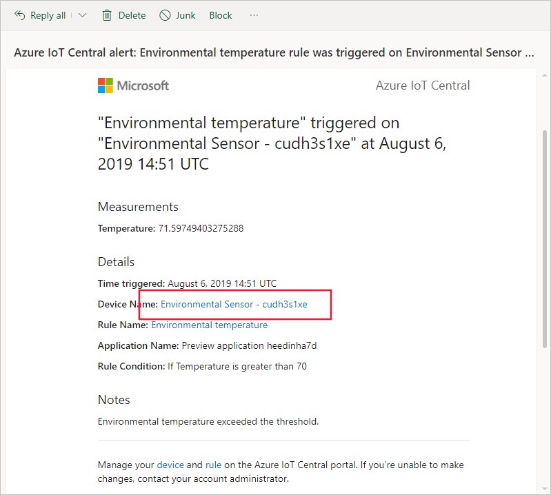
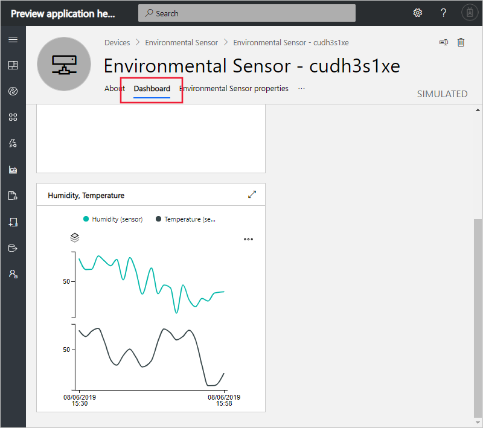
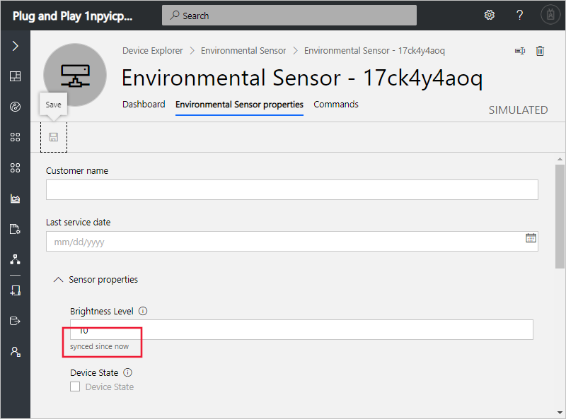
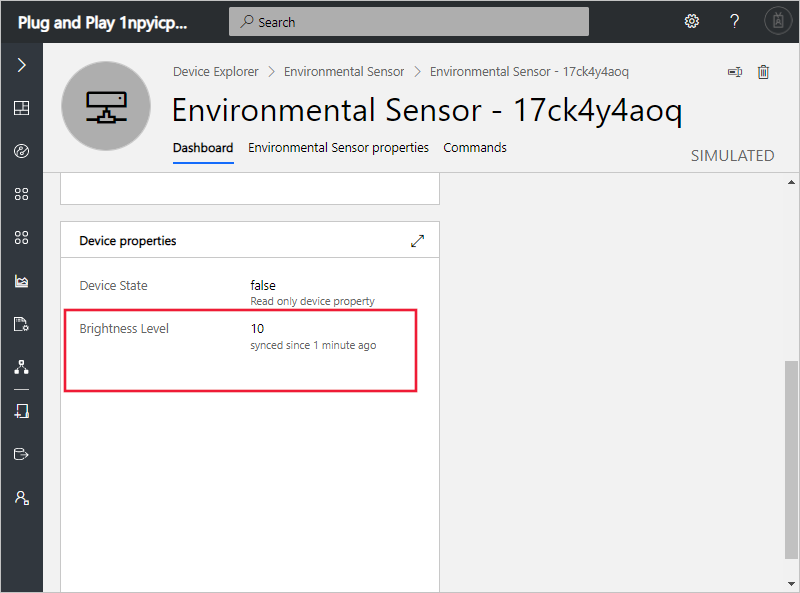

# Tutorial: Use Azure IoT Central to monitor your devices (preview features)

[!INCLUDE [iot-central-pnp-original](../../../includes/iot-central-pnp-original-note.md)]

This tutorial shows you, as an operator, how to use your Microsoft Azure IoT Central application to monitor your devices and change settings.

In this tutorial, you learn how to:

> [!div class="checklist"]
> * Receive a notification
> * Investigate an issue
> * Remediate an issue

## Prerequisites

Before you begin, the builder should complete the two builder quickstarts to create the Azure IoT Central application:

* [Add a simulated device to your IoT Central application](./quick-create-pnp-device-pnp.md?toc=/azure/iot-central-pnp/toc.json&bc=/azure/iot-central-pnp/breadcrumb/toc.json)
* [Configure rules and actions for your device](quick-configure-rules-pnp.md?toc=/azure/iot-central-pnp/toc.json&bc=/azure/iot-central-pnp/breadcrumb/toc.json)

## Receive a notification

Azure IoT Central sends notifications about devices as email messages. The builder added a rule to send a notification when the temperature in a connected environmental sensor device exceeded a threshold. Check the emails sent to the account the builder chose to receive notifications.

Open the email message you received at the end of the [Configure rules and actions for your device](quick-configure-rules-pnp.md?toc=/azure/iot-central-pnp/toc.json&bc=/azure/iot-central-pnp/breadcrumb/toc.json) tutorial. In the email, select the link to the device:

The **Dashboard** view for the environmental sensor simulated device you created in the previous tutorials opens in your browser:

## Investigate an issue

As an operator, you can view information about the device on the **Dashboard**, **Environmental Sensor properties**, and **Commands** pages. The builder customized the **Dashboard** and **Environmental Sensor properties** pages to display important information about a connected environmental sensor device.

Choose the **Dashboard** view to see information about the device.

The chart on the dashboard shows a plot of the device temperature. You can also see the current target temperature for the device in the **Device properties** tile. You decide that the target temperature is too high.

## Remediate an issue

To make a change to the device, use the **Environmental Sensor properties** page:

1. Choose **Environmental Sensor properties**. Change **Brightness Level** to 10. Choose **Save** to update the device. When the device confirms the settings change, the status of the property changes to **synced**:

    

2. Choose **Dashboard** and verify the new property value:

    

## Next steps

In this tutorial, you learned how to:

* Receive a notification
* Investigate an issue
* Remediate an issue

Now that you know now to monitor your device, the suggested next step is to:

> [!div class="nextstepaction"]
> [Configure rules and actions for your device](tutorial-configure-rules.md?toc=/azure/iot-central-pnp/toc.json&bc=/azure/iot-central-pnp/breadcrumb/toc.json).