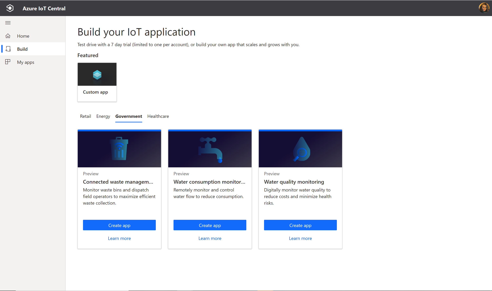
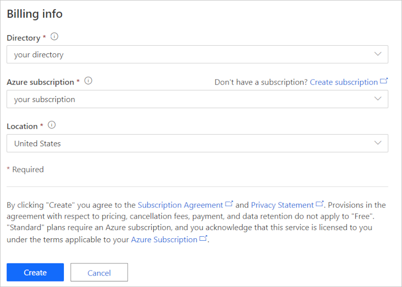
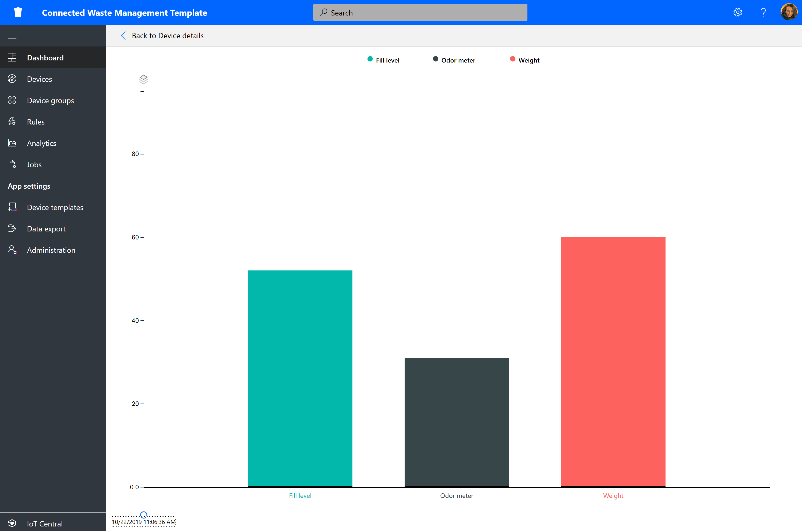
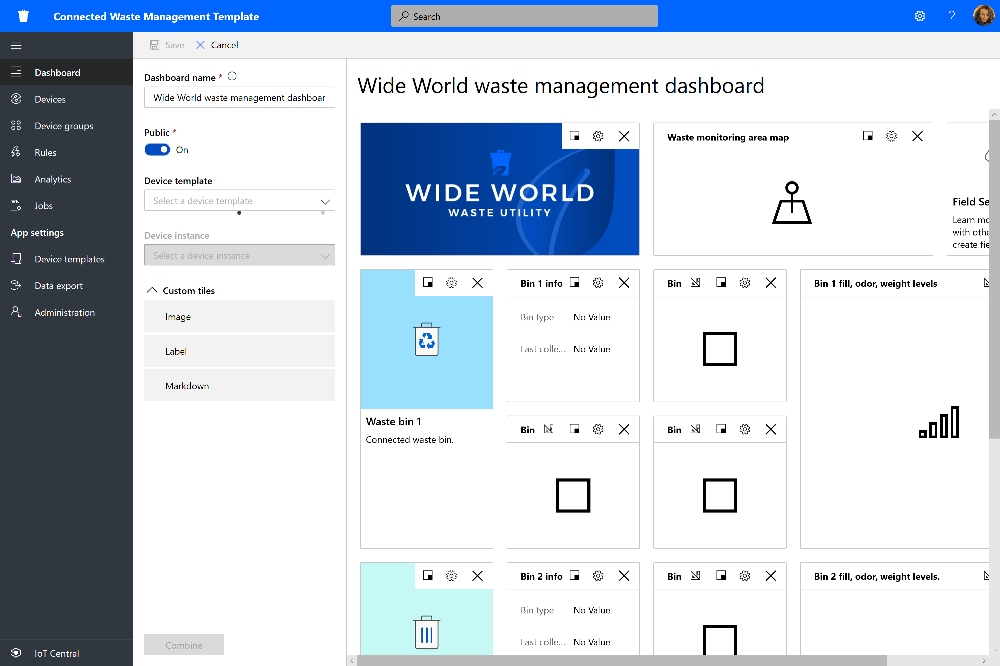
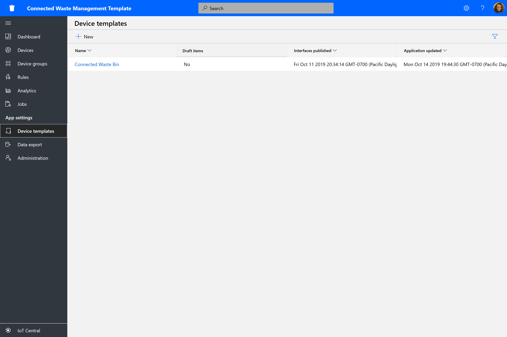
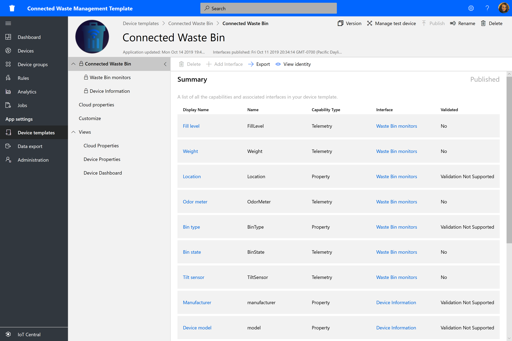
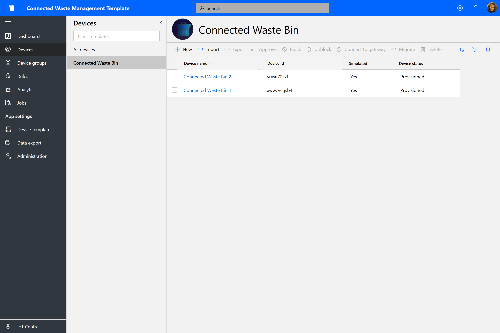
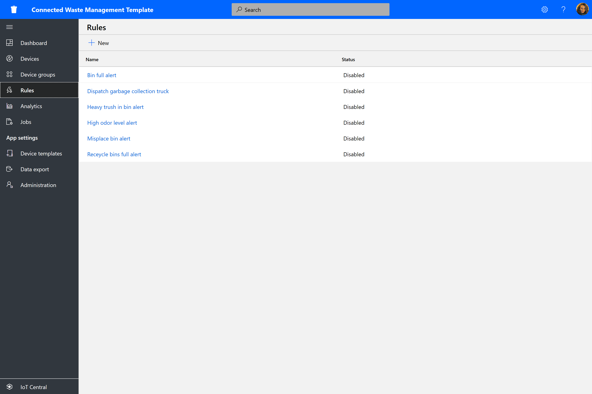
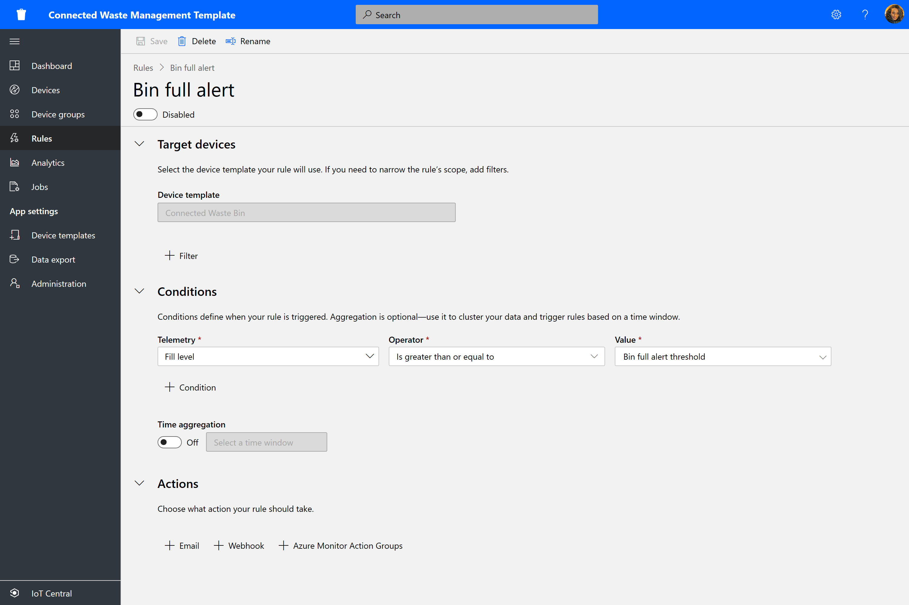

# Tutorial: Create a connected waste management application in IoT Central

This tutorial guides you to create an Azure IoT Central connected waste management application from the IoT Central **Connected waste management** application template. 

The tutorial will learn how to: 

> [!div class="checklist"]
> * Use the Azure IoT Central **Connected waste management** template to create your connected waste management application
> * Explore and customize operator dashboard 
> * Explore connected waste bin device template
> * Explore simulated devices
> * Explore and configure rules
> * Configure jobs
> * Customize your application branding using whitelabeling

## Prerequisites

To complete this tutorial you need:
-  An Azure subscription is recommended. You can optionally use a free 7-day trial. If you don't have an Azure subscription, you can create one on the [Azure sign-up page](https://aka.ms/createazuresubscription).

## Create Connected Waste Management app in IoT Central

In this section, we will use the Azure IoT Central **Connected waste management template** to create your connected waste management application in IoT Central.

To create a new Azure IoT Central connected waste management application:  

1. Navigate to the [Azure IoT Central Home page](https://aka.ms/iotcentral) website.

    If you have an Azure subscription, sign in with the credentials you use to access it, otherwise sign in using a Microsoft account:

    

2. Click on **Build** from the left pane and select the **Government** tab. The government page displays several government application templates.

    

1. Select the **Connected Waste Management** application template. 
This template includes sample connected waste bin device template, simulated device, operator dashboard, and pre-configured monitoring rules.    

2. Click **Create app**, which will open **New application** creation form with the following fields:
    * **Application name**. By default the application  uses *Connected waste management* followed by a unique ID string that IoT Central generates. Optionally, choose a friendly application name. You can change the application name later too.
    * **URL** – Optionally, you can choose to your desired URL. You can change the URL later too. 
    * If you have an Azure subscription, enter your *Directory, Azure subscription, and Region*. If you don't have a subscription, you can enable **7-day free trial** and complete the required contact information.  

    For more information about directories and subscriptions, see the [create an application quickstart](../core/quick-deploy-iot-central.md).

5. Click **Create** button at the bottom of the page. 

    

     

6. You now have created a connected waste management app using the Azure IoT Central **Connected waste management template**. 

Congratulations! Your newly created application comes with pre-configured:
* Sample operator dashboards
* Sample pre-defined connected waste bin device templates
* Simulated connected waste bin devices
* Pre-configured rules and jobs
* Sample Branding using white labeling 

It is your application and you can modify it anytime. Let's now explore the application and make some customizations.  

## Explore and customize operator dashboard 
After creating the application you land in the **Wide Waste connected waste management dashboard**.

   

As a builder, you can create and customize views on the dashboard for operators. Before you try to customize, let's explore the dashboard. 

> [!NOTE]
> All data displayed in the dashboard is based on simulated device data, which will be explored in the next section. 

The dashboard consists of different kinds of tiles:

* ***Wide World Waste utility image tile***: the first tile in the dashboard is an image tile of a fictitious Waste utility "Wide World Waste". You can customize the tile and put your own image or remove it. 

* ***Waste bin image tile***: you can use image and content tiles to create a visual representation of the device that is being monitored along with a descriptive text. 

* ***Fill level KPI tile***: the tile displays a value reported by a *fill level* sensor in a waste bin. *Fill level* and other sensors like *odor meter* or *weight* in a waste bin can be remotely monitored. An operator can take action, like dispatching trash collection truck. 

*  ***Waste monitoring area map***: the map is using Azure Maps, which you can configure directly in Azure IoT Central. The map tile is displaying device location. Try to hover over the map and try the controls over the map, like zoom-in, zoom-out or expand.

     

* ***Fill, odor, weight level bar chart**: you can visualize one or multiple device telemetry data in a bar chart. You can also expand the bar chart.  

  

* **Field Services content tile**: the dashboard includes link to how to integrate with Dynamics 365 Field Services from your Azure IoT Central application. As an example, you can use Field Services to create tickets for dispatching trash collection services. 

### Customize dashboard 

As a builder, you can customize views in dashboard for operators. You can try:
1. Click on **Edit** to customize the **Wide World connected waste management dashboard**. You can customize the dashboard by clicking on the **Edit** menu. Once the dashboard is in **edit** mode, you can add new tiles, or you can configure 

    

2. You can also click on **+ New** to create new dashboard and configure from scratch. You can have multiple dashboards and you can navigate between your dashboards from the dashboard menu. 

## Explore connected waste bin device template

A device template in Azure IoT Central defines the capability of a device, which can be telemetry, properties, or command. As a builder, you can define device templates that represent the capability of the devices you will connect. 
 

The **Connected waste management** application comes with a sample connected waste bin device template.

To view the device template:

1. Click on **Device templates** from the left navigation pane of your application in IoT Central. 

    

2. In the Device templates list you will see **Connected Waste Bin**. Open by clicking on the name.

3. Familiarize with the device template capabilities. You can see it defines sensors like *Fill level*, *Odor meter*, *weight*, *location* etc.

   

   

### Customizing the device template

Try to customize the following:
1. Navigate to **Customize** from the device template menu
2. Find the `Odor meter` telemetry type
3. Update the **Display name** of `Odor meter` to `Odor level`
4. You can also try update unit of measurement, or set *Min value* and *Max value*
5. **Save** any changes 

### Add a cloud property 

1. Navigate to **Cloud property** from the device template menu
2. Add a new cloud property by clicking **+ Add Cloud Property**. In IoT Central, you can add a property that is relevant to the device but not expected to be sent by a device. As an example, a cloud property could be an alerting threshold specific to installation area, asset information, or maintenance information etc. 
3. **Save** any changes 
 
### Views 
* The connected waste bin device template comes with pre-defined views. Explore the views and you can make updates. The views define how operators will see the device data but also inputting cloud properties. 

  

### Publish 

* If you made any changes make sure to **Publish** the device template. 

### Create a new device template 

* Select **+ New** to create a new device template and follow the creation process. 
You will be able to create a custom device template from scratch or you can choose a device template from the Azure Device Catalog. 

## Explore simulated devices

In IoT Central, you can create simulated devices to test your device template and application. 

The **Connected waste management** application has two simulated devices mapped to the connected waste bin device template. 

### To view the devices:

1. Navigate to **Device** from IoT Central left navigation pane. 

   

2. Select and click on Connected Waste Bin device.  

     

3. Navigate to the **Cloud Properties** tab try updating the `Bin full alert threshold` value from `95` to `100`. 
* Explore the **Device Properties** tab and **Device Dashboard** tab. 

> [!NOTE]
> Note that all the tabs have been configured from the **Device template Views**.

### Add new devices

* You can add new devices by clicking on **+ New** on the **Devices** tab. 

## Explore and configure rules

In Azure IoT Central, you can create rules to automatically monitor on device telemetry, and trigger actions when one or more conditions are met. The actions may include sending email notifications, triggering a Microsoft Flow action, or a webhook action to send data to other services.

The **Connected waste management** application has four sample rules.

### To view rules:
1. Navigate to **Rules** from IoT Central left navigation pane

   

2. Select the **Bin full alert**

     

 3. The `Bin full alert` checks when **Condition** `Fill level is greater than or equal to Bin full alert threshold`.

    The `Bin full alert threshold` is a *cloud property* defined in the `Connected waste bin` device template. 

Now let's create an email action.

### Create an email action
To configure an email action in the Rule's actions list:
1. Select **+ Email**. 
2. Enter *High pH alert* as the friendly **Display name** for the action.
3. Enter the email address associated with your IoT Central account in **To**. 
4. Optionally, enter a note to include in text of the email.
5. Select **Done** to complete the action.
6. Select **Save** to save and activate the new rule. 

You should receive email when the configured **condition** is met.

> [!NOTE]
> The application will send email each time a condition is met. **Disable** the rule to stop receiving email from the automated rule. 
  
To create a new rule: 
1. Select **+New** on the **Rules** from the left navigation pane.

## Configure Jobs

In IoT Central, jobs allow you to trigger device or cloud properties updates on multiple devices. In addition to properties, you can also use jobs to trigger device commands on multiple devices. IoT Central will automate the workflow for you. 

1. Go to **Jobs** from the left navigation pane. 
2. Click **+New** and configure one or more jobs. 

## Customize your application 

As a builder, you can change several settings to customize the user experience in your application.

### To change the application theme:

1. Go to **Administration > Customize your application**.
3. Use the **Change** button to choose an image to upload as the **Application logo**.
4. Use the **Change** button to choose a **Browser icon** image that will appear on browser tabs.
5. You can also replace the default **Browser colors** by adding HTML hexadecimal color codes.

   

6. You can also change application images by going to the **Administration > Application settings** and **Select image** button to choose an image to upload as the application image.
7. Finally, you can also change the **Theme** by clicking **Settings** on the masthead of the application.

  
## Clean up resources

If you're not going to continue to use this application, delete your application with the following steps:

1. Open the Administration tab from the left pane of your IoT Central application.
2. Select Application settings and click Delete button at the bottom of the page.

  

## Next steps

* Learn about more about [Connected waste management concepts](./concepts-connectedwastemanagement-architecture.md)
