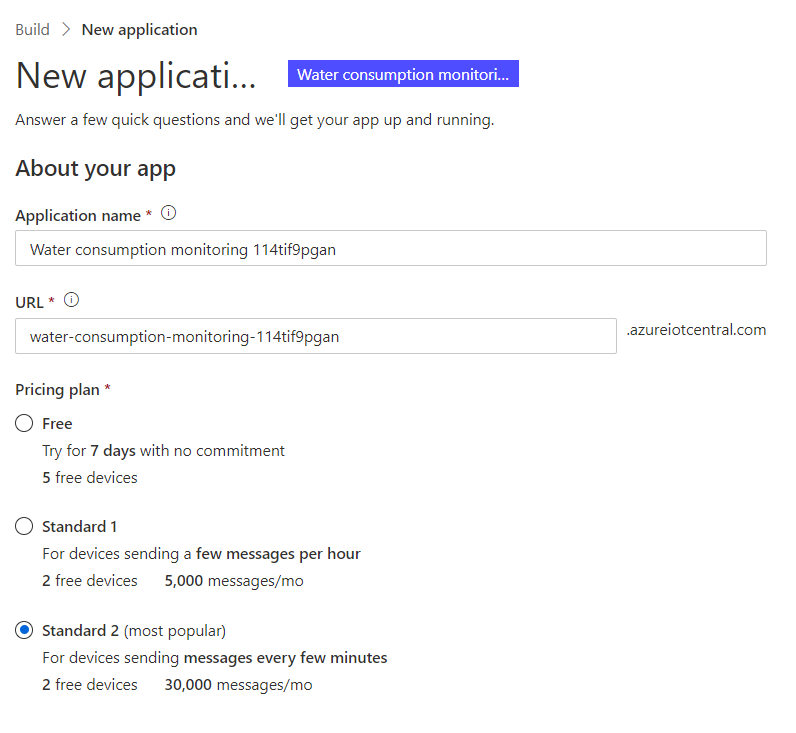
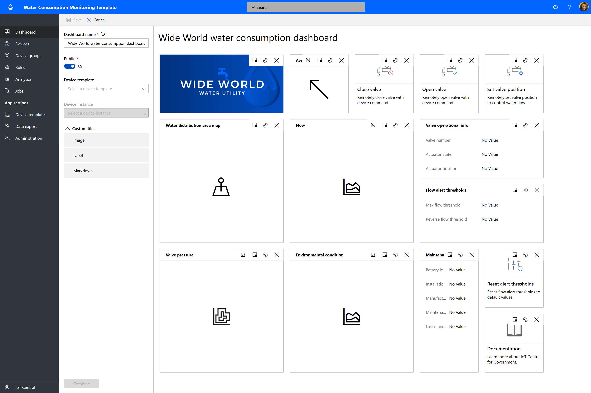
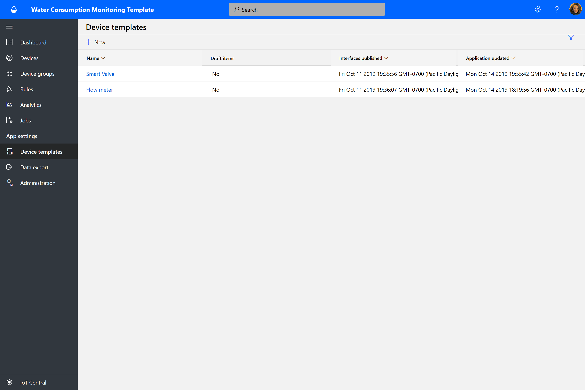

<!---Recommended: Removal all the comments in this template before you sign-off or merge to master.--->

<!---Tutorials are scenario-based procedures for the top customer tasks identified in milestone one of the [APEX content model](contribute-get-started-mvc.md).
You only use tutorials to show the single best procedure for completing an approved top 10 customer task.
--->

# Tutorial: Create a water consumption monitoring application in IoT Central
This tutorial guides you to create an Azure IoT Central water consumption monitoring application from the IoT Central Water Consumption Monitoring application template. 

This tutorial shows you, as a builder, how to create an Azure IoT Central water consumption monitoring application using the **IoT Central Water consumption monitoring application template**. 

The tutorial will learn how to: 

> [!div class="checklist"]
> * Use the Azure IoT Central **Water consumption monitoring** template to create your water consumption monitoring application
> * Explore and customize operator dashboard 
> * Explore water consumption monitor device template
> * Explore simulated devices
> * Explore and configure rules
> * Configure jobs
> * Customize your application branding using whitelabeling

## Prerequisites

To complete this tutorial you need:
-  An Azure subscription is recommended. You can optionally use a free 7-day trial. If you don't have an Azure subscription, you can create one on the [Azure sign-up page](https://aka.ms/createazuresubscription).

## Create Water consumption Monitoring app in IoT Central

In this section, we will use the Azure IoT Central **Water consumption monitoring template** to create your water consumption monitoring application in IoT Central.

To create a new Azure IoT Central water consumption monitoring application:  

1. Navigate to the [Azure IoT Central Home page](https://aka.ms/iotcentral) website.

* If you have an Azure subscription, sign in with the credentials you use to access it, otherwise sign in using a Microsoft account:

    

2. Click on **Build** from the left navigation menu and select the **Government** tab. The government page displays several government application templates.

   

1. Select the **Water consumption monitoring** application template. 
This template includes sample water consumption device template, simulated device, operator dashboard, and pre-configured monitoring rules.    

2. Click **Create app**, which will open **New application** creation form with the following fields:
* **Application name**: by default the application  uses *Water consumption monitoring* followed by a unique ID string that IoT Central generates. Optionally, choose a friendly application name. You can change the application name later too.
* **URL**: IoT Central will autogenerate a URL for you based on the application name. You can choose to update the URL to your liking. You can change the URL later too. 
* If you have an Azure subscription, enter your *Directory, Azure subscription, and Region*. If you don't have a subscription, you can enable **7-day free trial** and complete the required contact information.  

    For more information about directories and subscriptions, see the [create an application quickstart](../core/quick-deploy-iot-central-pnp.md?toc=/azure/iot-central-pnp/toc.json&bc=/azure/iot-central-pnp/breadcrumb/toc.json).

5. Click **Create** button at the bottom of the page. 

    

6. You now have created a water consumption monitoring app using the Azure IoT Central **Water consumption monitoring** template. IoT Central deploys the application and you'll land on the application **Dashboard**.

Congratulations! You have finished creating your water quality monitoring application, which comes with pre-configured:
* Sample operator dashboards
* Sample pre-defined water flow and valve device templates
* Simulated water flow and smart valve devices
* Pre-configured rules and jobs
* Sample Branding using white labeling 

It is your application and you can modify it anytime. Let’s now explore the application and make some customizations.  

## Explore and customize operator dashboard 
After creating the application you land in the sample operator dashboard called **Wide World water consumption monitoring dashboard**.

   

As a builder, you can create and customize views on the dashboard for operators. Before you try to customize, let's explore the dashboard. 

> [!NOTE]
> All data displayed in the dashboard is based on simulated device data, which we will be explored in the next section. 
  
The dashboard consists of different kinds of tiles:

* **Wide World Water utility image tile**: the first tile in the dashboard is an image tile of a fictitious Water utility "Wide World Water". You can customize the tile and put your own image or remove it. 

* **Average water flow KPI tile**: the KPI tile is configured to display as an example *the average in the last 30 minutes*. You can customize KPI tiles and set to a different type and time range.

* Then it has right in the dashboard *Device Command* tiles to **Close valve**, **Open valve**, or **Set valve position**. Clicking on the commands will take you to the simulated device device command page. In IoT Central a *Command* is a *device capability* type which we will explore later in the [device template section of this tutorial.](tba)

*  **Water distribution area map**: the map is using Azure Maps, which you can configure directly in Azure IoT Central. The map tile is displaying device location. Try to hover over the map and try the controls over the map, like *zoom-in*, *zoom-out* or *expand*. 

    

* **Average water flow line chart** and **Environment conditions line chart**: you can visualize one or multiple device telemetries plotted as a line chart over a desired time range.  

* **Average valve pressure heatmap chart**: you can choose heatmap visualization type of device telemetry data you are interested to look at the distribution over a time range with a color index.

* **Reset alert threshold content tile**: you can include call to action content tiles embedding the link to an action page. In this case reset alert threshold will take you to the application **Jobs** where you can run updates to devices properties, which we will explore later in the [configure jobs section of this tutorial.](tba)

* **Property tiles**: the dashboard displays **Valve operational info**, **Flow alert thresholds**, and **Maintenance info** which are device properties.  

### Customize dashboard 

As a builder, you can customize views in dashboard for operators. You can try:
* Click on **Edit** to customize the **Wide World water consumption monitoring dashboard**. You can customize the dashboard by clicking on the **Edit** menu. Once the dashboard is in **edit** mode, you can add new tiles, or you can configure 

     

* You can also click on **+ New** to create new dashboard and configure from scratch. You can have multiple dashboards and you can navigate between your dashboards from the dashboard menu. 

## Explore water consumption monitor device template
A device template in Azure IoT Central defines the capability of a device, which can be telemetry, properties, and commands. As a builder, you can define device templates in IoT Central that represent the capability of the devices that will be connected. In IoT Central, you can also create simulated devices to test your device template and application. 
 

The **Water consumption monitoring** application you have created from the application template comes with a reference water consumption monitor device template.

To view the device template:

* Click on **Device templates** from the left navigation pane of your application in IoT Central. 
* In the Device templates list you will see **Water consumption Monitor**. Open by clicking on the name.

    

### Customizing the device template

Try to customize the following:
* Navigate to **Customize** from the device template menu
* Find the `Temperature` telemetry type
* Update the **Display name** of `Temperature` to `Reported temperature`
* You can also try update unit of measurement, or set *Min value* and *Max value*
* **Save** any changes 

#### Add a cloud property 
* Navigate to **Cloud property** from the device template menu
* Add a new cloud property by clicking **+ Add Cloud Property**. In IoT Central, you can add a property that is relevant to the device but not expected to be sent by a device. As an example, a cloud property could be an alerting threshold specific to installation area, asset information, or maintenance information etc. 
* **Save** any changes 
 
#### Views 
* The water consumption monitor device template comes with pre-defined views. Explore the views and you can make updates. The views define how operators will see the device data but also inputting cloud properties. 

  

#### Publish 

* If you made any changes make sure to **Publish** the device template. 

### Create a new device template 
* Select **+ New** to create a new device template and follow the creation process. 
You will be able to create a custom device template from scratch or you can choose a device template from the Azure Device Catalog. 

## Explore simulated devices

The **Water consumption monitoring** application you have created from the application template has two simulated devices mapped to the water consumption monitor device template. 

### To view the devices:
* Navigate to **Device** from IoT Central left navigation pane. 

   

* Select and click on one simulated device 

    

* From the  **Cloud Properties** tab try updating the `Acidity (pH) Threshold` value from `8` to `9`. 
* Explore the **Device Properties** tab and **Device Dashboard** tab. 

> [!NOTE]
> Note that all the tabs have been configured from the **Device template Views**.

### Add new devices
You can add new devices by clicking on **+ New** on the **Devices** tab. 

## Explore and configure rules

In Azure IoT Central you can create rules to automatically monitor on device telemetry, and trigger an action when one or more conditions are met. The actions may include sending email notifications, or triggering a Microsoft Flow action or a webhook action to send data to other services.

The **Water consumption monitoring** application you have created template has two pre-configured rules.

### To view rules:
* Navigate to **Rules** from IoT Central left navigation pane. 

   

* Select and click on **High pH alert** which is one of the pre-configured rules in the application. 

     

* The `High pH alert` rule is configured to check against the condition `Acidity (pH) is greater than 8`. 

Now let's create an email action.

To add an action to the rule:

* Select **+ Email**. 
* Enter *High pH alert* as the friendly **Display name** for the action.
* Enter the email address associated with your IoT Central account in **To**. 
* Optionally, enter a note to include in text of the email.
* Select **Done** to complete the action.
* Select **Save** to save and activate the new rule. 

Within a few minutes, you should receive email when the configured **condition** is met.

> [!NOTE]
> The application will send email each time a condition is met. **Disable** the rule to stop receiving email from the automated rule. 
  
To create a new rule: 
* Select **+New** on the **Rules** from the left navigation pane.

## Configure jobs

## Customize your application 
As a builder, you can change several settings to customize the user experience in your application.

### To change the application theme:

* You can change the **Theme** by clicking the **Settings** on the masthead.

### To change the application logo and browser icon:

* Select **Administration > Customize your application**.
* Use the **Change** button to choose an image to upload as the **Application logo**.
* Use the **Change** button to choose a **Browser icon** image that will appear on browser tabs.
* You can also replace the default **Browser colors** by adding HTML hexadecimal color codes.

   

### To update the application image:

* Select **Administration > Application settings**.

* Use the **Select image** button to choose an image to upload as the application image. 

  
## Clean up resources

If you're not going to continue to use this application, delete your application with the following steps:

1. Open the Administration tab from the left navigation menu of your IoT Central application. 
2. Select Application settings and click Delete button at the bottom of the page. 

            

<!---Required:
To avoid any costs associated with following the tutorial procedure, a Clean up resources (H2) should come just before Next steps (H2)
--->

## Next steps

Advance to the next article to learn how to create...
> [!div class="nextstepaction"]

<!--- Required:
Tutorials should always have a Next steps H2 that points to the next logical tutorial in a series, or, if there are no other tutorials, to some other cool thing the customer can do. A single link in the blue box format should direct the customer to the next article - and you can shorten the title in the boxes if the original one doesn’t fit.
Do not use a "More info section" or a "Resources section" or a "See also section". --->
