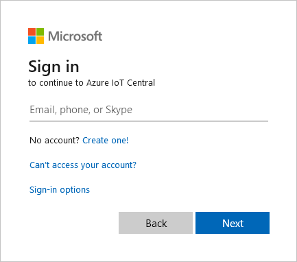
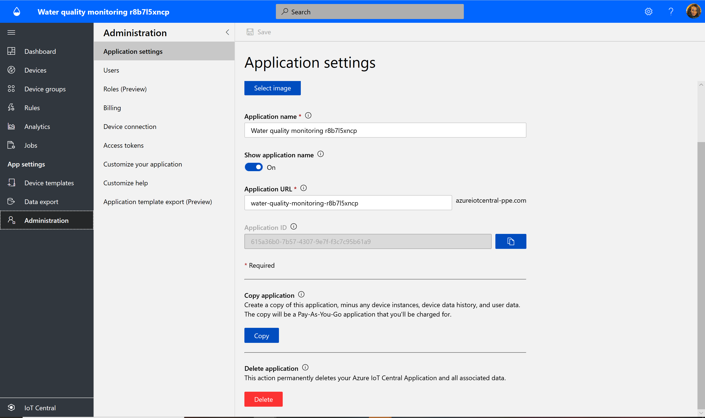

<!---Recommended: Removal all the comments in this template before you sign-off or merge to master.--->

<!---Tutorials are scenario-based procedures for the top customer tasks identified in milestone one of the [APEX content model](contribute-get-started-mvc.md).
You only use tutorials to show the single best procedure for completing an approved top 10 customer task.
--->

# Tutorial: Create a water quality monitoring application in IoT Central

Introductory paragraph (Revisit)
<!---Required:
Lead with a light intro that describes, in customer-friendly language, what the customer will learn, or do, or accomplish. Answer the fundamental “why would I want to do this?” question.
--->
This tutorial guides you to create an Azure IoT Central water quality monitoring application from the IoT Central Water Quality Monitoring application template. 

In this tutorial, you learn how to:

> [!div class="checklist"]
> * Use the Azure IoT Central **Water quality monitoring** template to create your water quality monitoring application
> * Explore and customize operator dashboard 
> * Explore sample water quality monitor device template
> * Explore simulated devices
> * Customize pre-configured rules and add actions. 
> * Configure jobs.
> * Customize your application branding using whitelabeling. 

## Prerequisites

To complete this tutorial you need:
-  An Azure subscription is recommended. You can optionally use a free 7-day trial. If you don't have an Azure subscription, you can create one on the [Azure sign-up page](https://aka.ms/createazuresubscription).

## Create Water Quality Monitoring app in IoT Central

In this section we will use the Azure IoT Central **Water quality monitoring template** to create your water quality monitoring application in IoT Central.

To create a new Azure IoT Central water quality monitoring application:  

1. Navigate to the [Azure IoT Central Home page](https://aka.ms/iotcentral) website.

* If you have an Azure subscription, sign in with the credentials you use to access it, otherwise sign in using a Microsoft account:

    

2. Click on **Build** from the left navigation menu and select the **Government** tab. The government page displays several government application templates.

    

1. Select the **Water Quality Monitoring** application template. 
This template includes sample water quality monitoring device template, with simulated device, sample operator dashboard, pre-configured monitoring rules.    

2. Click **Create app** which will open **New application** creation form with the following fields:
* **Application name**. By default the application  uses *Water quality monitoring* followed by a unique ID string that IoT Central generates. Optionally, choose a friendly application name. You will be able to change this later too.
* **URL** – Optionally, you can choose to your desired URL. You will be ablet to change this later too. 
* If you have an Azure subscription, enter your *Directory, Azure subscription, and Region*. If you don't have a subscription, you can enable **7 day free trial** and complete the required contact information.  

    For more information about directories and subscriptions, see the [create an application quickstart](../core/quick-deploy-iot-central-pnp.md?toc=/azure/iot-central-pnp/toc.json&bc=/azure/iot-central-pnp/breadcrumb/toc.json).

5. Click **Create** button at the bottom of the page. 

    

6. You now have created a water quality monitoring app using the Azure IoT Central **Water quality monitoring template**. IoT Central provisions the application with everything that it is included and you will land on the application dashboard which will look like the picture below.

   

Your newly created application comes with pre-configured:
* Sample operator dashboards
* Sample pre-defined water quality monitor device templates
* Simulated water quality monitor devices
* Pre-configured rules and jobs
* Sample Branding using white labeling 

It is your application and you can modify it anytime. Let’s now explore the application and make some customizations.  

## Explore and cusomize operator dashboard 
After creating your water quality monitoring application you land in the operator **Wilde Water water quality monitoring dashboard** which has been configured from the **Water quality monitoring app template**, which you used to create your application in IoT Central.

As a builder, you can create and customize views on the dashboard for operators. Before you try to customize, let's explore the dashboard. 

Note that all the data displayed in the dashboard is based on simulated device data which we will explore in the next section. 

### Viewing **Wide World water quality monitoring dashboard**
The dashboard consists of a variety of tiles

* **Wide World Water utility image tile**: the first tile in the dashbord is an image tile of a fictitious Water utility "Wide World Water". You can customize the tile and put your own image or remove it. 

* **Average pH KPI tile**: you can see that there are KPI tiles at the top like **Average pH in the last 30 minutes**. You can customize KPI tiles and set to a different type and time range.

*  **Water monitoring area map**: IoT Central uses Azure Maps which you can directly set in your application and display device location. You can also map location information to your device from the application and be able to use Azure Maps to disaplay it on a map. Try to hoover over the map and try the controls over the map. 

* **Average pH distribution Heatmap chart**: you can choose different visualization charts to display device telemetry data in the way that is most appropriate to your application. Heatmap 

* **Cirtical quality indicators line chart**: you can visualize one or multiple device telemetry plotted as a line chart over a desired time range.  

* **Concentration of chemical agents bar chart**: you can visualize one or multiple device telemetry data in a bar chart as in the sample. 

* **Action button**: the dashboard includes an example of an action tile that an operator can initiate directly from the monitoring dashboar, like initiating an action to reset device properties. 

* **Properties list tiles**: the dashboard has multiple properties tiles representing critical threshold information, device health info and maintenance info. 

### Customize dashboard 

As a builder, you can customize views in dashboard for operators. Try:
* Click on **Edit** to customize the **Wil World water quality monitoring dashboard**. You can customize the dashboard by clicking on the **Edit** menu. Once the dashboard is in **edit** mode, you can add new tiles, or you can configure 
* Click on **+ New** to create new dashboard and configure from scratch. Note that you can have multiple dashboards and you can navigate between your dashboards from the dashboard menu. 

    

## Explore sample water quality monitor device template

## Explore devices

## Customize pre-configured rules and add actions. 

## Configure jobs.

## Customize your application 
As a builder, you can change several settings to customize the user experience in your application.

To change the application theme:

1. You can change the **Theme** by clicking the **Settings** on the masthead.

 <!-- --> 

To change the application logo and browser icon:

1. Expand the left pane, if not already expanded.
2. Select **Administration > Customize your application**.
3. Use the **Change** button to choose an image to upload as the **Application logo**.  
4. Use the **Change** button to choose a **Browser icon** image that will appear on browser tabs.
5. You can also replace the default **Browser colors** by adding HTML hexadecimal color codes.

   

3. To update the application image:

* Select **Administration > Application settings**.

* Use the **Select image** button to choose an image to upload as the application image. This image appears on the application tile in the **My Apps** page in the Azure IoT Central application manager.

   

## Clean up resources

If you're not going to continue to use this application, delete your application with the following steps:

1. Open the Administration tab from the left navigation menu of your IoT Central application. 
2. Select Application settings and click Delete button at the bottom of the page. 

            

<!---Required:
To avoid any costs associated with following the tutorial procedure, a Clean up resources (H2) should come just before Next steps (H2)
--->

## Next steps

Advance to the next article to learn how to create...
> [!div class="nextstepaction"]

<!--- Required:
Tutorials should always have a Next steps H2 that points to the next logical tutorial in a series, or, if there are no other tutorials, to some other cool thing the customer can do. A single link in the blue box format should direct the customer to the next article - and you can shorten the title in the boxes if the original one doesn’t fit.
Do not use a "More info section" or a "Resources section" or a "See also section". --->
