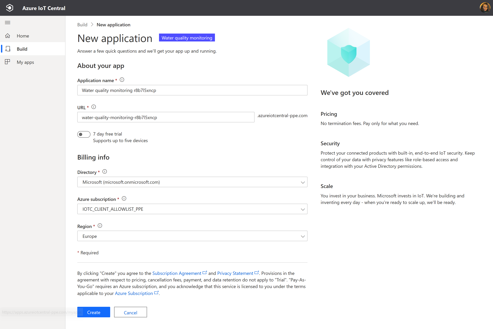
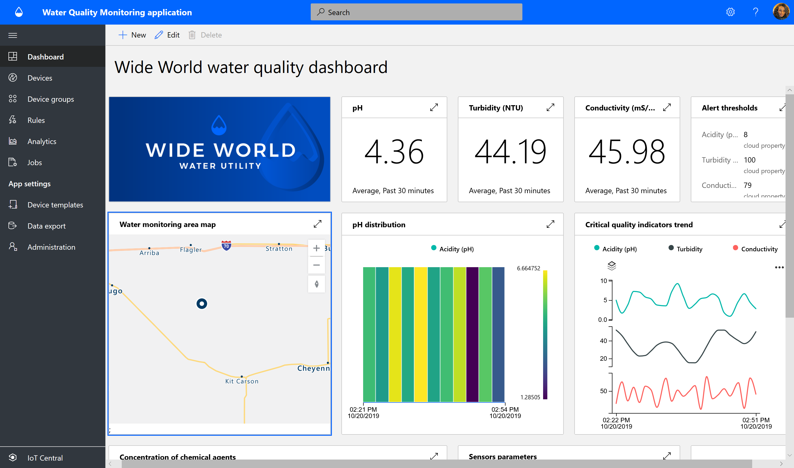

<!---Recommended: Removal all the comments in this template before you sign-off or merge to master.--->

<!---Tutorials are scenario-based procedures for the top customer tasks identified in milestone one of the [APEX content model](contribute-get-started-mvc.md).
You only use tutorials to show the single best procedure for completing an approved top 10 customer task.
--->

# Tutorial: Create a water quality monitoring application in IoT Central
<!---Required:
Starts with "Tutorial: "
Make the first word following "Tutorial:" a verb.
--->

Introductory paragraph (Revisit)
<!---Required:
Lead with a light intro that describes, in customer-friendly language, what the customer will learn, or do, or accomplish. Answer the fundamental “why would I want to do this?” question.
--->
This tutorial guides you to create an Azure IoT Central water quality monitoring application from the IoT Central Water Quality Monitoring application template. 

In this tutorial, you learn how to:

> [!div class="checklist"]
> * Use the Azure IoT Central **Water quality monitoring** template to create your water quality monitoring application
> * Explore sample operator dashboard 
> * Explore sample water quality monitor device template
> * Explore simulated devices
> * Customize pre-configured rules and add actions. 
> * Configure jobs.
> * Customize your application branding using whitelabeling. 

<!--- >> * Customize your application.
> * All tutorials include a list summarizing the steps to completion
> * Each of these bullet points align to a key H2
> * Use these green checkboxes in a tutorial
--->
<!---Required:
The outline of the tutorial should be included in the beginning and at the end of every tutorial. These will align to the **procedural** H2 headings for the activity. You do not need to include all H2 headings. Leave out the prerequisites, clean-up resources and next steps--->

<!--- Required, if a free trial account exists
Because tutorials are intended to help new customers use the product or service to complete a top task, include a link to a free trial before the first H2, if one exists. You can find listed examples in [Write tutorials](contribute-how-to-mvc-tutorial.md)
--->

<!---Avoid notes, tips, and important boxes. Readers tend to skip over them. Better to put that info directly into the article text.--->

## Prerequisites

<!---If you need them, make Prerequisites your first H2 in a tutorial. If there’s something a customer needs to take care of before they start (for example, creating a VM) it’s OK to link to that content before they begin.--->

To complete this tutorial you need:
-  An Azure subscription is recommended. You can optionally use a free 7-day trial. If you don't have an Azure subscription, you can create one on the [Azure sign-up page](https://aka.ms/createazuresubscription).

## Create Water Quality Monitoring app in IoT Central

<!-- Sign in to the [<service> portal](url). --->
<!---If you need to sign in to the portal to do the tutorial, this H2 and link are required.--->

In this section we will use the Azure IoT Central **Water quality monitoring template** to create your water quality monitoring application in IoT Central.

To create a new Azure IoT Central water quality monitoring application:  

1. Navigate to the [Azure IoT Central Home page](https://aka.ms/iotcentral) website.

* If you have an Azure subscription, sign in with the credentials you use to access it, otherwise sign in using a Microsoft account:

    

2. Click on **Build** from the left navigation menu and select the **Government** tab. The government page displays several government application templates.

    

1. Select the **Water Quality Monitoring** application template. 
This template includes sample water quality monitoring device template, with simulated device, sample operator dashboard, pre-configured monitoring rules.    

2. Click **Create app** which will open **New application** creation form with the following fields:
* **Application name**. By default the application  uses *Water quality monitoring* followed by a unique ID string that IoT Central generates. Optionally, choose a friendly application name. You will be able to change this later too.
* **URL** – Optionally, you can choose to your desired URL. You will be ablet to change this later too. 
* If you have an Azure subscription, enter your *Directory, Azure subscription, and Region*. If you don't have a subscription, you can enable **7 day free trial** and complete the required contact information.  

    For more information about directories and subscriptions, see the [create an application quickstart](../core/quick-deploy-iot-central-pnp.md?toc=/azure/iot-central-pnp/toc.json&bc=/azure/iot-central-pnp/breadcrumb/toc.json).

5. Click **Create** button at the bottom of the page. 

    

You now have created a water quality monitoring app using the Azure IoT Central **Water quality monitoring template**. IoT Central provisions the application with everything that it is included and you will land on the application dashboard which will look like the picture below. 

   

Your newly created application comes with pre-configured:
* Sample operator dashboards
* Sample pre-defined water quality monitor device templates
* Simulated water quality monitor devices
* Pre-configured rules and jobs
* Sample Branding using white labeling 

It is your application and you can modify it anytime. Let’s explore the application and make some customizations.  

## Explore sample operator dashboard 

## Explore sample water quality monitor device template

## Explore devices

## Customize pre-configured rules and add actions. 

## Configure jobs.

## Customize your application 
As a builder, you can change several settings to customize the user experience in your application.

To change the application theme:

1. You can change the **Theme** by clicking the **Settings** on the masthead.

 <!-- --> 

To change the application logo and browser icon:

1. Expand the left pane, if not already expanded.
2. Select **Administration > Customize your application**.
3. Use the **Change** button to choose an image to upload as the **Application logo**.  
4. Use the **Change** button to choose a **Browser icon** image that will appear on browser tabs.
5. You can also replace the default **Browser colors** by adding HTML hexadecimal color codes.

   

3. To update the application image:

* Select **Administration > Application settings**.

* Use the **Select image** button to choose an image to upload as the application image. This image appears on the application tile in the **My Apps** page in the Azure IoT Central application manager.

   

## Clean up resources

If you're not going to continue to use this application, delete your application with the following steps:

1. Open the Administration tab from the left navigation menu of your IoT Central application. 
2. Select Application settings and click Delete button at the bottom of the page. 

            

<!---Required:
To avoid any costs associated with following the tutorial procedure, a Clean up resources (H2) should come just before Next steps (H2)
--->

## Next steps

Advance to the next article to learn how to create...
> [!div class="nextstepaction"]

<!--- Required:
Tutorials should always have a Next steps H2 that points to the next logical tutorial in a series, or, if there are no other tutorials, to some other cool thing the customer can do. A single link in the blue box format should direct the customer to the next article - and you can shorten the title in the boxes if the original one doesn’t fit.
Do not use a "More info section" or a "Resources section" or a "See also section". --->
