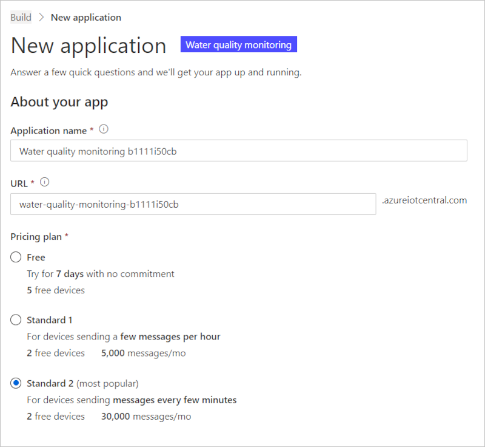
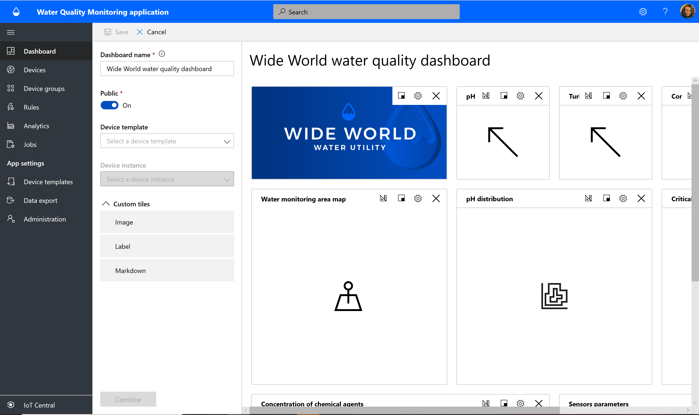
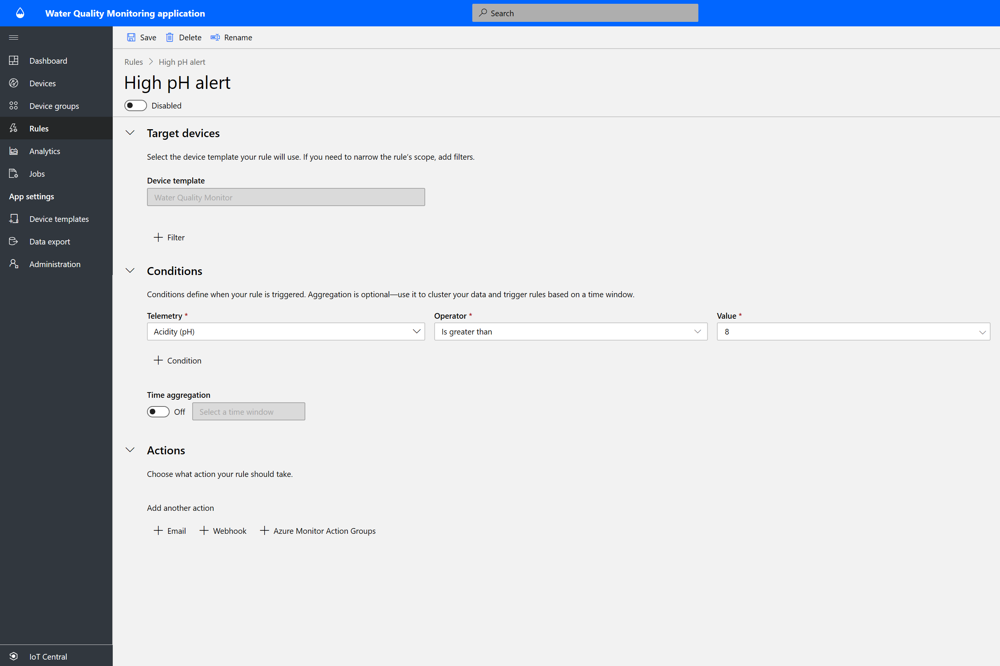
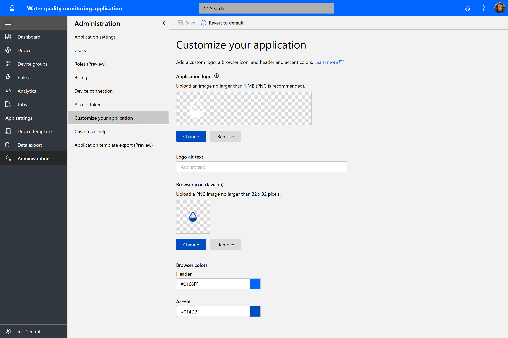

# Tutorial: Create a water quality monitoring application in Azure IoT Central

[!INCLUDE [iot-central-pnp-original](../../../includes/iot-central-pnp-original-note.md)]

This tutorial guides you through the creation of a water quality monitoring application in Azure IoT Central. You create the application from the Azure IoT Central **Water quality monitoring** application template.

In this tutorial, you learn to:

> [!div class="checklist"]
> * Use the **Water quality monitoring** template to create a water quality monitoring application.
> * Explore and customize an operator dashboard.
> * Explore a water quality monitoring device template.
> * Explore simulated devices.
> * Explore and configure rules.
> * Configure jobs.
> * Customize application branding by using white labeling.

## Prerequisites

We recommend that you have an Azure subscription to complete this tutorial. If you don't have an Azure subscription, you can create one on the [Azure sign-up page](https://aka.ms/createazuresubscription).

## Create a water quality monitoring application in Azure IoT Central

In this section, you use the Azure IoT Central **Water quality monitoring** template to create a water quality monitoring application.

1. Go to the [Azure IoT Central home page](https://aka.ms/iotcentral).

    If you have an Azure subscription, sign in with the credentials you use to access it. Otherwise, sign in with a Microsoft account:

    

1. Select **Build** on the leftmost pane of Azure IoT Central and select the **Government** tab. The government pane shows several government application templates.

    

1. Select the **Water quality monitoring** application template. This application template includes a water quality device template, simulated devices, an operator dashboard, and preconfigured monitoring rules.

1. Select **Create app**. The **New application** pane opens and shows the following elements:

    * **Application name**: By default, the application name is **Water quality monitoring** followed by a unique ID string that Azure IoT Central generates. If you want, you can enter a display name or change the application name later.
    * **URL**: You can enter any URL you want or change the URL value later.
    * If you have an Azure subscription, enter values for **Directory**, **Azure subscription**, and **Region**. If you don't have a subscription, you can turn on **7-day free trial** and complete the required contact information.

    For more information about directories and subscriptions, see the [Create an application](../core/quick-deploy-iot-central-pnp.md?toc=/azure/iot-central-pnp/toc.json&bc=/azure/iot-central-pnp/breadcrumb/toc.json) quickstart.

1. Select the **Create** button on the lower-left part of the page.

    

You've now created a water quality monitoring application by using the Azure IoT Central **Water quality monitoring** template.

Your new application comes with these preconfigured components:

* Operator dashboards.
* Water quality monitoring device templates.
* Simulated water quality monitoring devices.
* Rules and jobs.
* Branding that uses white labeling.

You can modify your application at any time.

Next, explore the application and make some customizations.

## Explore and customize the operator dashboard

After you create the application, the **Wide World water quality dashboard** pane opens.

   

As a builder, you can create and customize views on the dashboard for use by operators. But before you try to customize, first explore the dashboard.

All data shown in the dashboard is based on simulated device data, which is discussed in the next section.

The dashboard includes the following kinds of tiles:

* **Wide World water utility image tile**: The first tile in the upper-left corner of the dashboard is an image that shows the fictitious utility named Wide World. You can customize the tile to use your own image, or you can remove the tile.

* **Average pH KPI tiles**: KPI tiles like **Average pH in the last 30 minutes** are at the top of the dashboard pane. You can customize KPI tiles and set each to a different type and time range.

* **Water monitoring area map**: Azure IoT Central uses Azure Maps, which you can directly set in your application to show device location. You can also map location information from your application to your device and then use Azure Maps to show the information on a map. Hover over the map and try the controls.

* **Average pH distribution heat-map chart**: You can select different visualization charts to show device telemetry in the way that is most appropriate for your application. Heat map

* **Critical quality indicators line chart**: You can visualize device telemetry plotted as a line chart over a time range.  

* **Concentration of chemical agents bar chart**: You can visualize device telemetry in a bar chart.

* **Action button**: The dashboard includes a tile for actions that an operator can initiate directly from the monitoring dashboard. Resetting a device's properties is an example of such actions.

* **Property list tiles**: The dashboard has multiple property tiles that represent threshold information, device health information, and maintenance information.

### Customize the dashboard

As a builder, you can customize views on the dashboard for use by operators.

1. Select **Edit** to customize the **Wide World water quality dashboard** pane. You can customize the dashboard by selecting commands on the **Edit** menu. Once the dashboard is in edit mode, you can add new tiles, or you can configure

    

1. Select **+ New** to create a new dashboard that you can configure. You can have multiple dashboards and can navigate among them from the dashboard menu.

## Explore a water quality monitoring device template

A device template in Azure IoT Central defines the capabilities of a device. Available capabilities are telemetry, properties, and commands. As a builder, you can define device templates in Azure IoT Central that represent the capabilities of the connected devices. You can also create simulated devices to test your device template and application.

The water quality monitoring application you created comes with a water quality monitoring device template.

To view the device template:

1. Select **Device templates** on the leftmost pane of your application in Azure IoT Central.
1. From the list of device templates, select **Water Quality Monitor**. That device template opens.

    

### Customize the device template

Practice customizing the following device template settings:

1. From the device template menu, select **Customize**.
1. Go to the **Temperature** telemetry type.
1. Change the **Display name** value to **Reported temperature**.
1. Change the unit of measurement, or set **Min value** and **Max value**.
1. Select **Save**.

#### Add a cloud property

1. From the device template menu, select **Cloud property**.
1. To add a new cloud property, select **+ Add Cloud Property**. In Azure IoT Central, you can add a property that is relevant to a device but not expected to be sent by the device. One example of such a property is an alert threshold specific to installation area, asset information, or maintenance information.
1. Select **Save**.

### Explore views

The water quality monitoring device template comes with predefined views. The views define how operators see the device data and set cloud properties. Explore the views and practice making changes.

  

### Publish the device template

If you make any changes, be sure to select **Publish** to publish the device template.

### Create a new device template

1. Select **+ New** to create a new device template and follow the creation process.
1. Create a custom device template or choose a device template from the Azure IoT device catalog.

## Explore simulated devices

The water quality monitoring application you created from the application template has two simulated devices. These devices map to the water quality monitoring device template.

### View the devices

1. Select **Devices** on the leftmost pane of your application.

   

1. Select one simulated device.

    

1. On the **Cloud Properties** tab, change the **Acidity (pH) threshold** value from **8** to **9**.
1. Explore the **Device Properties** tab and the **Device Dashboard** tab.

> [!NOTE]
> All tabs have been configured from **Device template views**.

### Add new devices

On the **Devices** tab, select **+ New** to add a new device.

## Explore and configure rules

In Azure IoT Central, you can create rules that automatically monitor device telemetry. These rules trigger an action when any of their conditions are met. One possible action is to send email notifications. Other possibilities include a Microsoft Flow action or a webhook action to send data to other services.

The water quality monitoring application you created has two preconfigured rules.

### View rules

1. Select **Rules** on the leftmost pane of your application.

   

1. Select **High pH alert**, which is one of the preconfigured rules in the application.

   

   The **High pH alert** rule is configured to check the condition of acidity (pH) being greater than 8.

Next, add an email action to the rule:

1. Select **+ Email**.
1. In the **Display name** box, enter **High pH alert**.
1. In the **To** box, enter the email address associated with your Azure IoT Central account.
1. Optionally, enter a note to include in the text of the email.
1. Select **Done** to complete the action.
1. Select **Save** to save and activate the new rule.

Within a few minutes, you should receive email when the configured condition is met.

> [!NOTE]
> The application sends email each time a condition is met. Select **Disable** for a rule to stop receiving automated email from that rule.
  
To create a new rule, select **Rules** on the leftmost pane of your application and then select **+New**.

## Configure jobs

With Azure IoT Central jobs, you can trigger updates to device or cloud properties on multiple devices. You can also use jobs to trigger device commands on multiple devices. Azure IoT Central automates the workflow for you.

1. Select **Jobs** on the leftmost pane of your application.
1. Select **+New** and configure one or more jobs.

## Customize your application

As a builder, you can change several settings to customize the user experience in your application.

1. Select **Administration** > **Customize your application**.
1. Under **Application logo**, select **Change** to choose the image to upload as the logo.
1. Under **Browser icon**, select **Change** to choose the image that appears on browser tabs.
1. Under **Browser colors**, you can replace the default values with HTML hexadecimal color codes.
1. Select **Settings** to change the value of **Theme**.

   

### Update the application image

1. Select **Administration** > **Application settings**.

1. Use the **Select image** button to choose an image to upload as the application image.

## Clean up resources

If you're not going to continue to use your application, delete the application with the following steps:

1. Open the **Administration** tab on the leftmost pane of your application.
1. Select **Application settings** and select the **Delete** button.

    

## Next steps

* Learn more about [water quality monitoring concepts](./concepts-waterqualitymonitoring-architecture.md).
