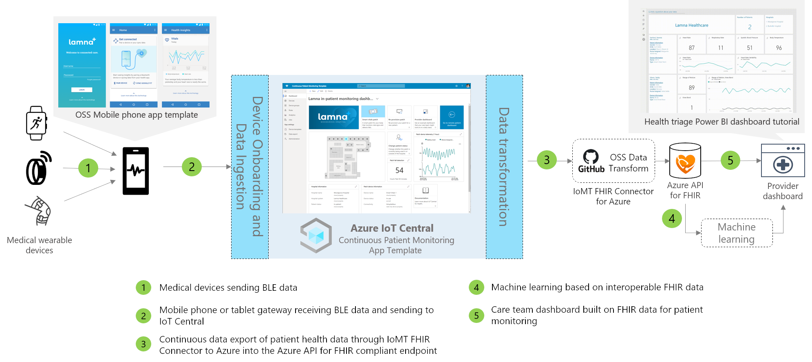

# Continuous patient monitoring architecture

Continuous patient monitoring solutions can be built by using the app template provided and using the architecture outlined below as guidance.

>[!div class="mx-imgBorder"] 
>

1. Medical devices communicating via Bluetooth Low Energy (BLE)
1. Mobile phone gateway receiving BLE data and sending to IoT Central
1. Continuous data export of patient health data to the Azure API for FHIR&reg;
1. Machine learning based on interoperable data
1. Care team dashboard built on FHIR data

## Details
This section outlines each part of the architecture diagram in more detail.

### BLE medical devices
Many medical wearables used in the healthcare IoT space are Bluetooth Low Energy devices, which mean they're unable to speak directly to the cloud and will need to pass through a gateway. This architecture suggests using a mobile phone application as this gateway.

### Mobile phone gateway
The mobile phone application's primary function is to ingest BLE data from medical devices and communicate it to Azure IoT Central. Additionally, the app can help guide patients through a device setup and provisioning flow and help them see a view of their personal health data. Other solutions can use a tablet gateway or a static gateway if inside a hospital room to achieve the same communication flow.

### Export to Azure API for FHIR&reg;
Azure IoT Central is HIPAA compliant and HITRUST&reg; certified, but you may also want to send patient health-related data to the Azure API for FHIR. [Azure API for FHIR](../../healthcare-apis/overview.md) is a fully managed, standards-based, compliant API for clinical health data that enables you to create new systems of engagement with your health data. It enables rapid exchange of data through FHIR APIs, backed by a managed Platform-as-a Service (PaaS) offering in the cloud. Using the Continuous Data Export functionality of IoT Central, you can send data to the Azure API for FHIR.

### Machine learning
After aggregating your data and translating it into FHIR format, you can build machine learning models that can enrich insights and enable smarter decision-making for your care team. There are different kinds of services that can be used to build, train, and deploy machine learning models. More information about how to use Azure's machine learning offerings can be found in our [machine learning documentation](../../machine-learning/index.yml).

### Provider dashboard
The data located in the Azure API for FHIR can be used to build a patient insights dashboard or can be directly integrated into an EMR to help care teams visualize patient status. Care teams can use this dashboard to take action for patients in need of assistance and spot early warning signs of deterioration. To learn how to build a Power BI real-time provider dashboard, follow our [how-to guide](howto-health-data-triage.md).

## Next steps
* [Learn how to deploy a continuous patient monitoring application template](tutorial-continuous-patient-monitoring.md)