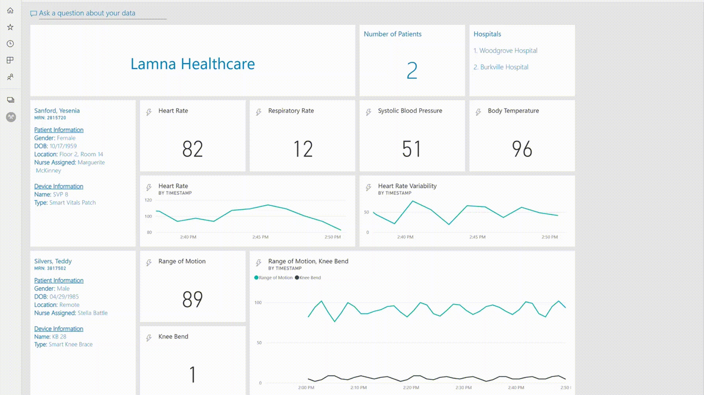
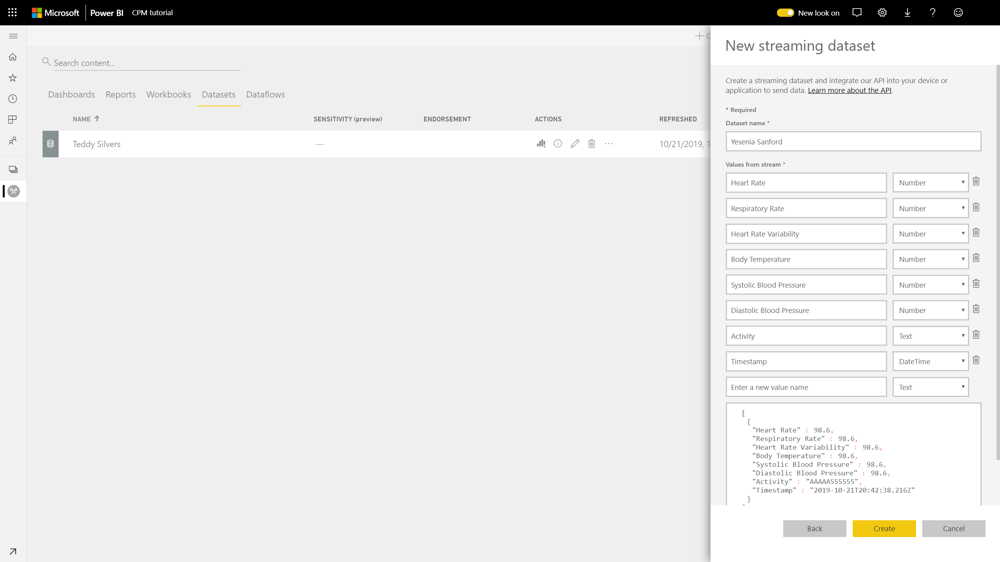
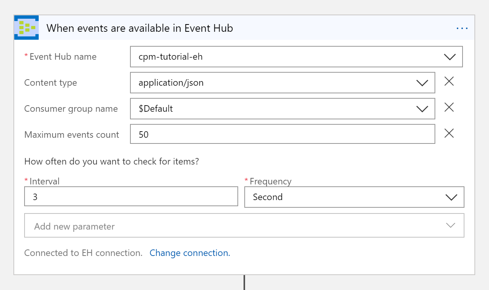
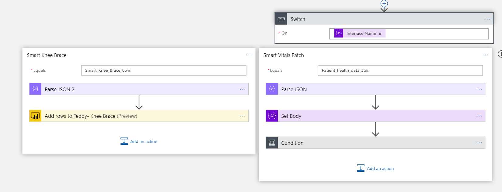
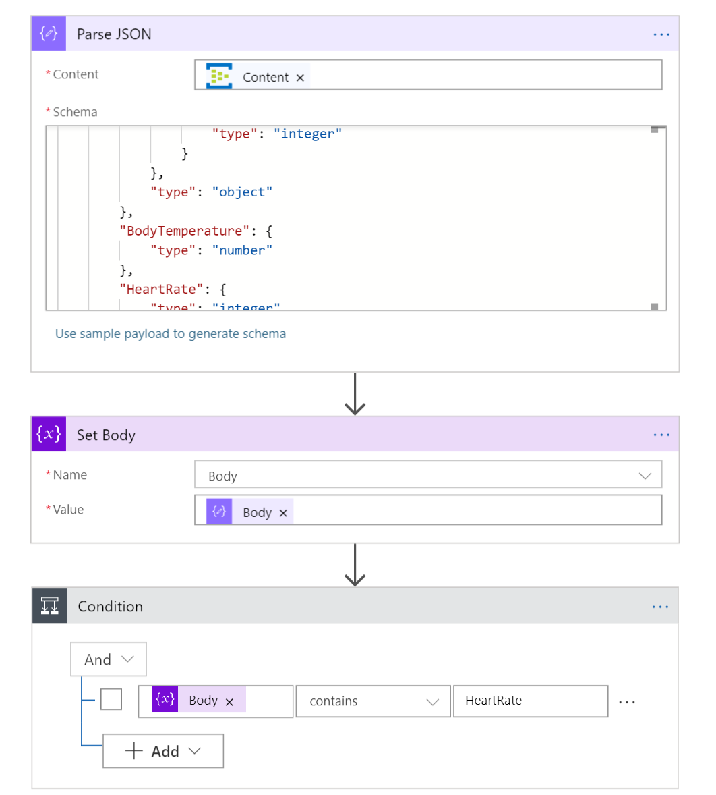
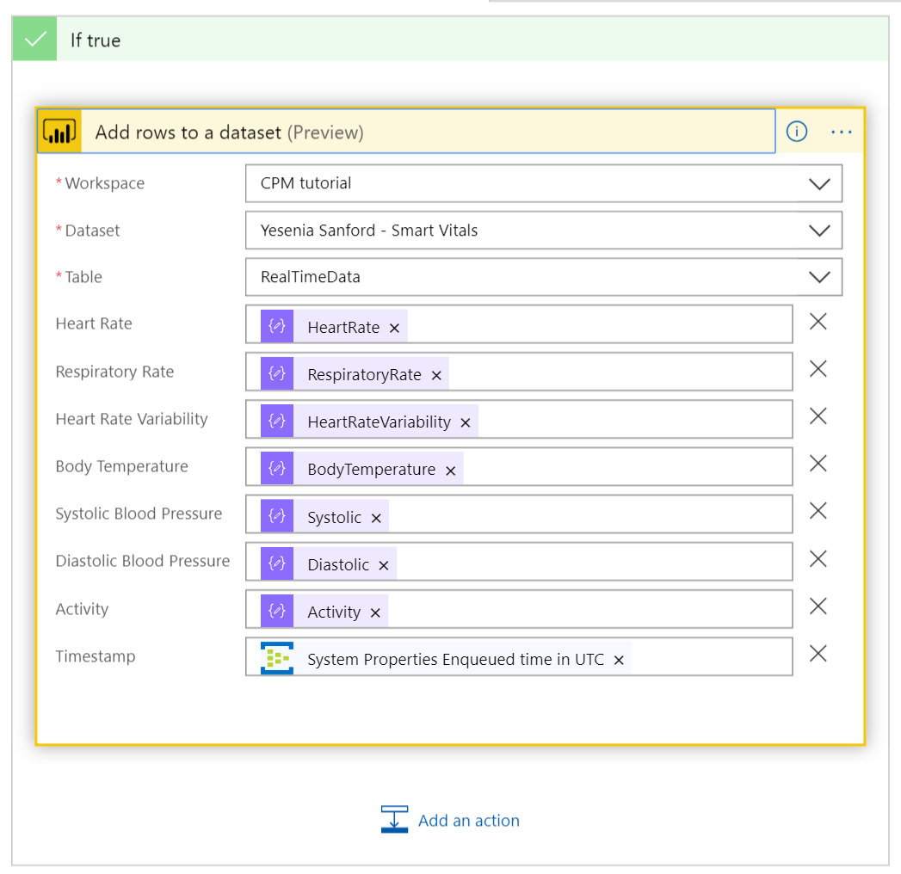
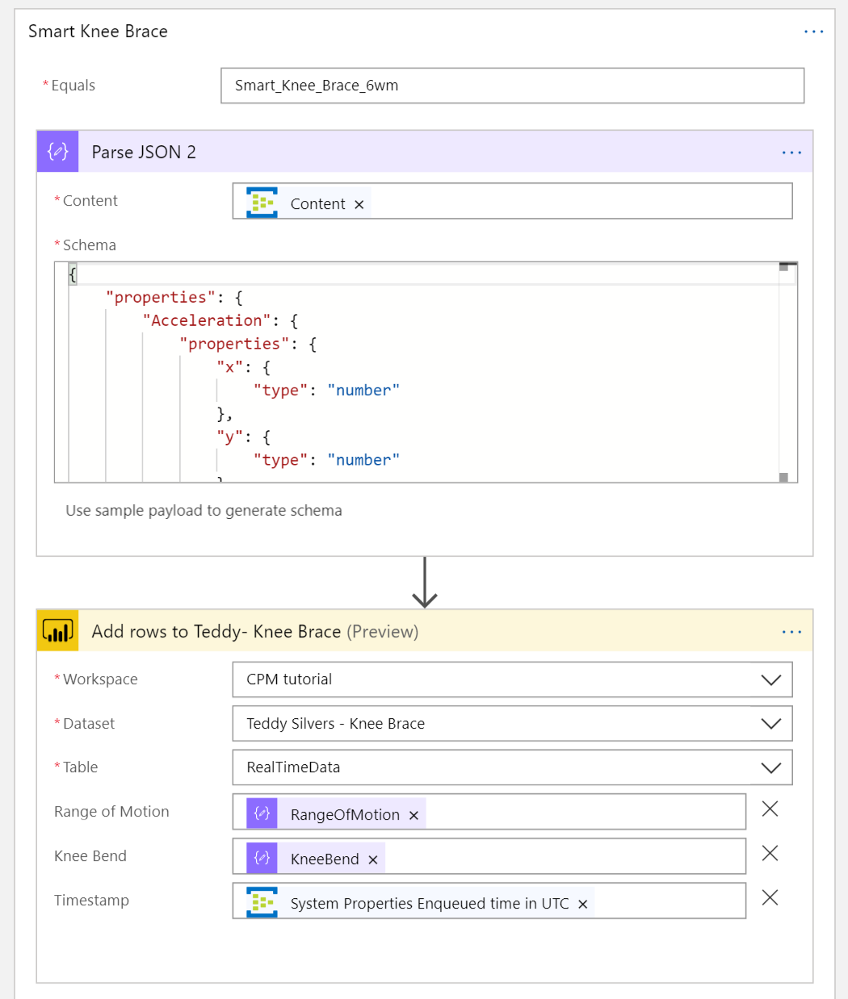
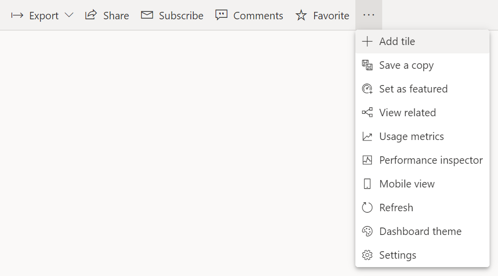

# Tutorial: Build a Power BI provider dashboard

When building your continuous patient monitoring solution, you may want to also create a dashboard for a hospital care team to visualize patient data. This tutorial will walk you through the steps to be able to create a Power BI real-time streaming dashboard from your IoT Central Continuous Patient Monitoring application template. 

[!div class="mx-imgBorder"] 


The basic architecture will follow this structure: 

[!div class="mx-imgBorder"] 


In this tutorial, you learn how to:

> [!div class="checklist"]
> * Export data from Azure IoT Central to Azure Event Hubs
> * Set up a Power BI streaming dataset
> * Connect your Logic App to Azure Event Hubs
> * Stream data to Power BI from your Logic App
> * Build a real-time dashboard for patient vitals

## Prerequisites

* An Azure subscription. If you don't have an Azure subscription, [sign up for a free Azure account](https://azure.microsoft.com/free/).

* An Azure IoT Central continuous patient monitoring application template. If you don't have one already, you can follow steps to [Deploy an application template](overview-iot-central-cpm.md).

* An Azure [Event Hubs namespace and Event Hub](https://docs.microsoft.com/azure/event-hubs/event-hubs-create).

* The logic app where you want to access your Event Hub. To start your logic app with an Azure Event Hubs trigger, you need a [blank logic app](https://docs.microsoft.com/azure/logic-apps/quickstart-create-first-logic-app-workflow).

* A Power BI service account. If you don't have one already, you can [create a free trial account for Power BI service](https://app.powerbi.com/). If you haven't used Power BI before, it might be helpful to go through [Get started with Power BI](https://docs.microsoft.com/power-bi/service-get-started).

## Set up a continuous data export to Azure Event Hubs
You will first need to set up a continuous data export from your Azure IoT Central app template to the Azure Event Hub in your subscription. You can do so by following the steps in this Azure IoT Central tutorial for [Exporting to Event Hubs](https://docs.microsoft.com/azure/iot-central/howto-export-data-event-hubs-service-bus-pnp). You will only need to export for the telemetry for the purposes of this tutorial.

## Create a Power BI streaming dataset

1. Sign in to your Power BI account.

2. In your preferred Workspace, create a new streaming dataset by clicking the **+ Create** button in the top-right corner. You will need to create a separate dataset for  each patient that you would like to have on your dashboard.

[!div class="mx-imgBorder"] 


3. Choose **API** for the source of your dataset.

4. Enter a **name** (for example, a patient's name) for your dataset and then fill out the values from your stream. You can see an example below based on values coming from the simulated devices in the Continuous Patient Monitoring application template. The example has two patients:

    * Teddy Silvers, who has data from the Smart Knee Brace
    * Yesenia Sanford, who has data from the Smart Vitals Patch

[!div class="mx-imgBorder"] 


To learn more about streaming datasets in Power BI, you can read this document on [real-time streaming in Power BI](https://docs.microsoft.com/power-bi/service-real-time-streaming).

## Connect your Logic App to Azure Event Hubs
To connect your Logic Azure Event Hubs, you can follow the instructions outlined in this document on [Sending events with Azure Event Hubs and Azure Logic Apps](https://docs.microsoft.com/azure/connectors/connectors-create-api-azure-event-hubs#add-event-hubs-action). Here are some suggested parameters:

|Parameter|Value|
|---|---|
|Content type|application/json|
|Interval|3|
|Frequency|Second|

At the end of this step, your Logic Apps Designer should look like this:

[!div class="mx-imgBorder"] 


## Stream data to Power BI from your Logic App
The next step will be to parse the data coming from your Event Hub to stream it into the Power BI datasets that you have previously created.

Before you can do this, you will need to understand the JSON payload that is being sent from your device to your Event Hub. You can do so by looking at this [sample schema](https://docs.microsoft.com/azure/iot-central/howto-export-data-event-hubs-service-bus-pnp#telemetry) and modifying it to match your schema or using [Service Bus explorer](https://github.com/paolosalvatori/ServiceBusExplorer) to inspect the messages. If you are using the Continuous Patient Monitoring applications, your messages will look like this:

### Smart Vitals Patch telemetry

```json
{
  "HeartRate": 80,
  "RespiratoryRate": 12,
  "HeartRateVariability": 64,
  "BodyTemperature": 99.08839032397609,
  "BloodPressure": {
    "Systolic": 23,
    "Diastolic": 34
  },
  "Activity": "walking"
}
```

### Smart Knee Brace telemetry

```json
{
  "Acceleration": {
    "x": 72.73510947763711,
    "y": 72.73510947763711,
    "z": 72.73510947763711
  },
  "RangeOfMotion": 123,
  "KneeBend": 3
}
```

### Properties

```json
{
  "iothub-connection-device-id": "1qsi9p8t5l2",
  "iothub-connection-auth-method": "{\"scope\":\"device\",\"type\":\"sas\",  \"issuer\":\"iothub\",\"acceptingIpFilterRule\":null}",
  "iothub-connection-auth-generation-id": "637063718586331040",
  "iothub-enqueuedtime": 1571681440990,
  "iothub-message-source": "Telemetry",
  "iothub-interface-name": "Patient_health_data_3bk",
  "x-opt-sequence-number": 7,
  "x-opt-offset": "3672",
  "x-opt-enqueued-time": 1571681441317
}
```

1. Now that you have understood your JSON payloads, go back to your Logic App Designer and click **+ New Step**. Search and add **Initialize variable** as your next step and enter the following parameters:

    |Parameter|Value|
    |---|---|
    |Name|Interface Name|
    |Type|String|

    Hit **Save**. 

2. Add another variable called **Body** with Type as **String**. Your logic app will have these actions added:

[!div class="mx-imgBorder"]


3. Click **+ New Step** and add a **Parse JSON** action. Rename this to **Parse Properties**. For the Content, choose **Properties** coming from the Event Hub. Click **Use sample payload to generate schema** at the bottom, and paste the sample payload from the Properties section above.

4. Next, choose the **Set variable** action and update your **Interface Name** variable with the **iothub-interface-name** from the parsed JSON properties.

5. Add a **Split** Control as your next action and choose the **Interface Name** variable as the On parameter. You will use this to funnel the data to the correct dataset.

6. In your Azure IoT Central application that you're using, find the Interface Name for the Smart Vitals Patch health data and the Smart Knee Brace health data from the **Device Templates** view. Create two different cases for the Switch Control for each Interface Name and rename the control appropriately. You can set the Default case to use the **Terminate** Control and choose what status you would like to show.

[!div class="mx-imgBorder"] 


7. For the **Smart Vitals Patch** case, add a **Parse JSON** action. For the Content, choose **Content** coming from the Event Hub. Copy and paste the sample payloads for the Smart Vitals Patch above to generate the schema.

8. Add a **Set variable** action and update the **Body** variable with the **Body** from the parsed JSON in Step 7.

9. Add a **Condition** Control as your next action and set the condition to **Body**, **contains**, **HeartRate**. This will make sure that you have the right set of data coming from the Smart Vitals Patch before populating the Power BI dataset. Steps 7-9 will look like this:

[!div class="mx-imgBorder"] 


10. For the **True** case of the Condition, add an action that calls the **Add rows to a dataset** Power BI functionality. You will have to sign into Power BI for this. Your **False** case can again use the **Terminate** control.

11. Choose the appropriate **Workspace**, **Dataset**, and **Table**. Map the parameters that you specified when creating your streaming dataset in Power BI to the parsed JSON values that are coming from your Event Hub. Your filled out actions should look like this:



12. For the **Smart Knee Brace** switch case, add a **Parse JSON** action to parse the content similar to Step 7. Then **Add rows to a dataset** to update your Teddy Silvers dataset in Power BI.

[!div class="mx-imgBorder"] 


13 Press **Save** and then run your logic app.

## Build a real-time dashboard for patient vitals
Now go back to Power BI and select **+ Create** to create a new **Dashboard**. Give your dashboard a name and hit **Create**.

Click the three dots in the top navigation bar and then select **+ Add tile**.

[!div class="mx-imgBorder"] 


Choose the type of tile you would like to add and customize your app how you would like.

## Clean up resources

If you're not going to continue to use this application, delete your resources with the following steps:

1. From the Azure portal, you can delete the Event Hub and Logic Apps resources that you created.

2. For your IoT Central application, go to the Administration tab and click Delete.

## Next steps

* Review the [Continuous Patient Monitoring architecture guidance](concept-cpm-architecture.md)
