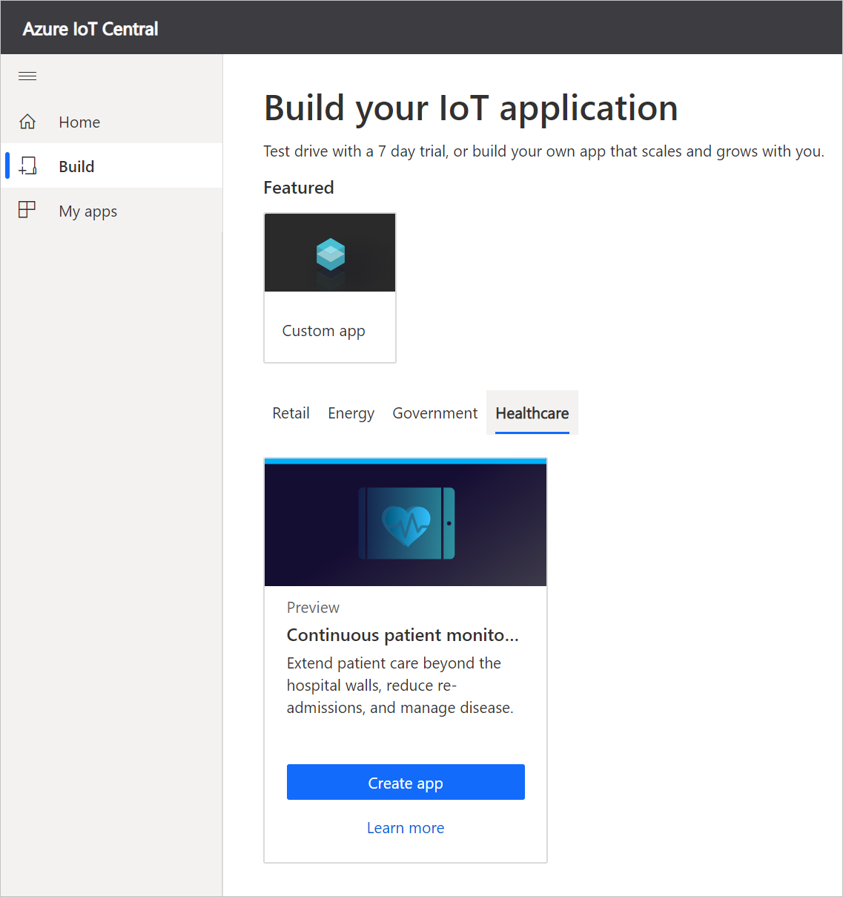
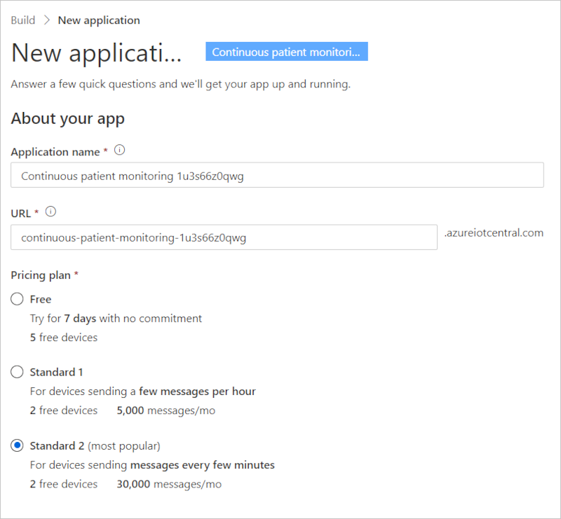
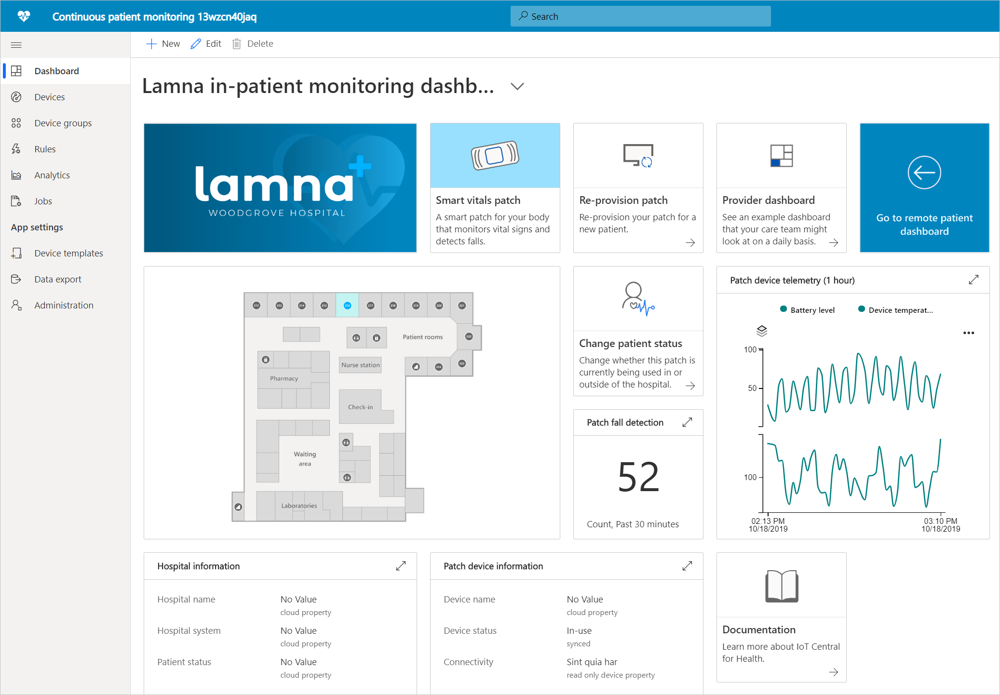
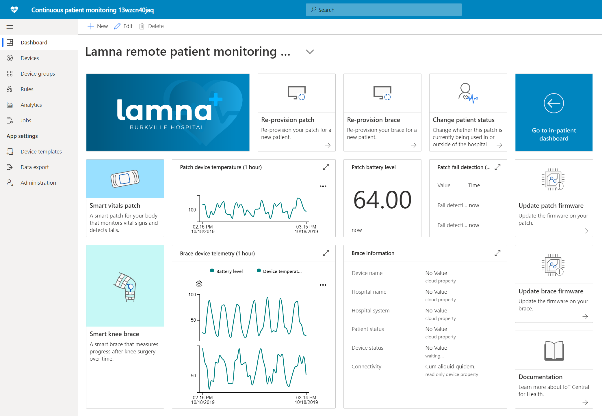
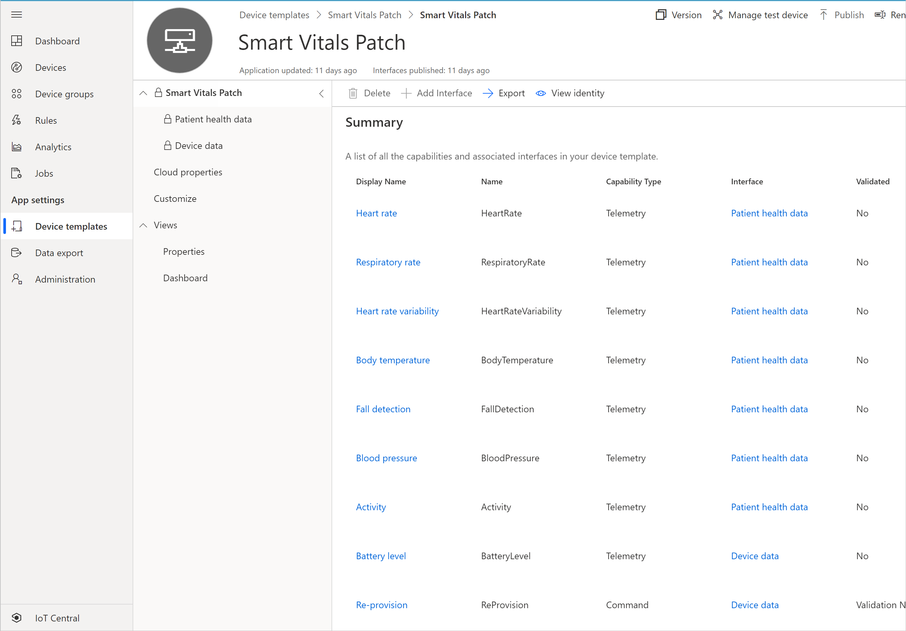
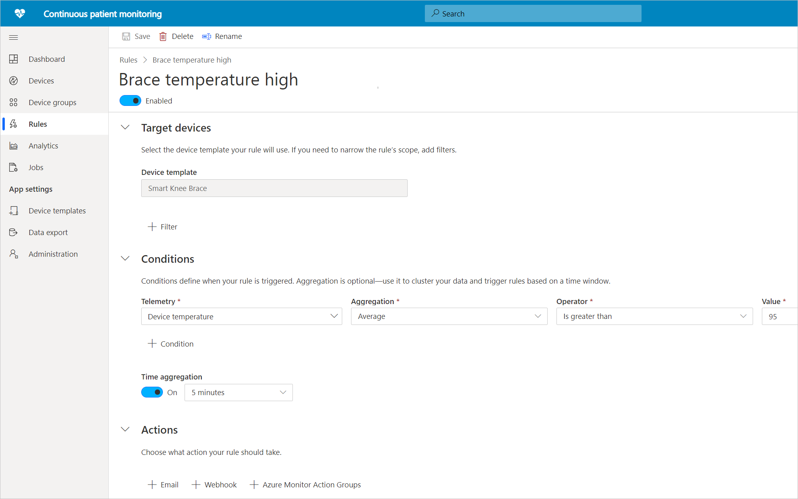
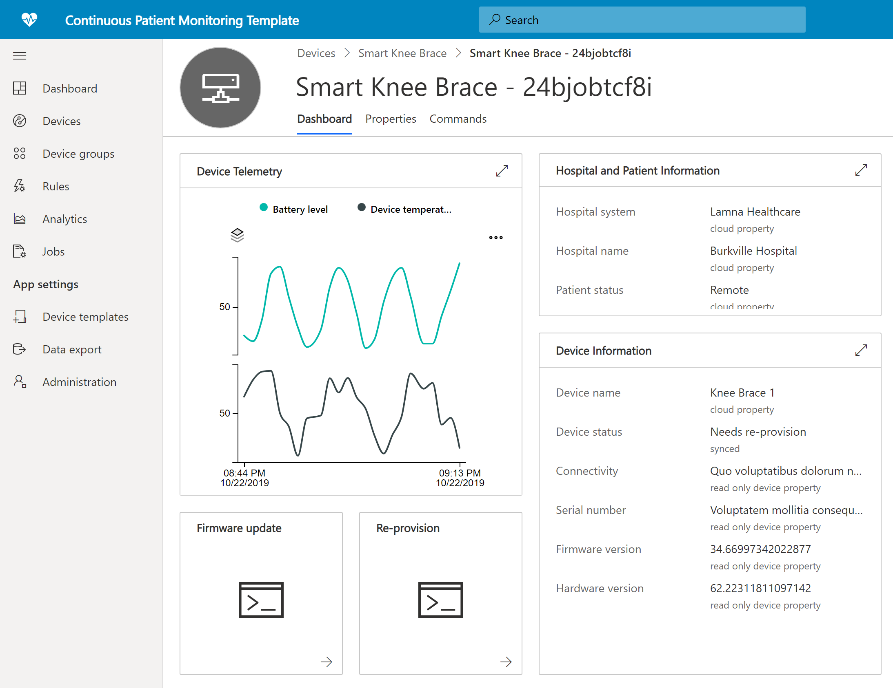
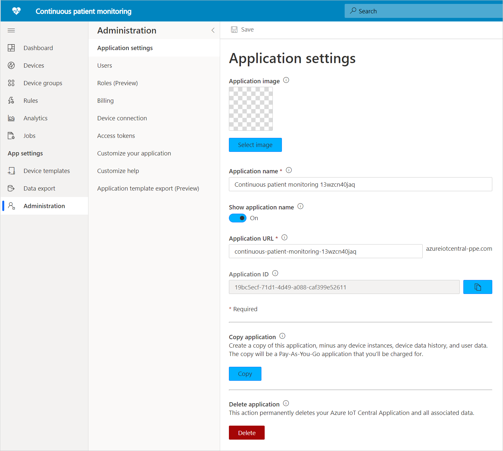

# Tutorial: Deploy and walkthrough a continuous patient monitoring app template

This tutorial shows you, as a solution builder, how to get started by deploying an IoT Central continuous patient monitoring application template. You will learn how to deploy the template, what's included out of the box, and what you can do next.

In this tutorial, you learn how to:

> [!div class="checklist"]
> * Create an application template
> * Walk through the application template

## Create an application template

Navigate to the [Azure IoT Central application manager website](https://apps.azureiotcentral.com/). Select **Build** from the left-hand navigation bar and then click the **Healthcare** tab. 

>[!div class="mx-imgBorder"] 
>

Click the **Create app** button to begin creating your application and then sign in with a Microsoft personal, work, or school account. It will take you to the **New application** page.

To create your application:

1. Azure IoT Central automatically suggests an application name based on the template you've selected. You can accept this name or enter your own friendly application name, such as **Continuous Patient Monitoring**. Azure IoT Central also generates a unique URL prefix for you based on the application name. You're free to change this URL prefix to something more memorable if you'd like.

2. You can select whether you would like to create the application using the *free* pricing plan or one of the *standard* pricing plans. Applications you create using the free plan are free for seven days before they expire and allow up to five free devices. You can move an application from the free plan to a standard pricing plan at any time before it expires. If you choose the free plan, you need to enter your contact information and choose whether to receive information and tips from Microsoft. Applications you create using a standard plan support up to two free devices and require you to enter your Azure subscription information for billing.

3. Select **Create** at the bottom of the page to deploy your application.

## Walk through the application template

### Dashboards

After deploying the app template, you'll first land on the **Lamna in-patient monitoring dashboard**. Lamna Healthcare is a fictitious hospital system that contains two hospitals: Woodgrove Hospital and Burkville Hospital. On this operator dashboard for Woodgrove Hospital, you'll see information and telemetry about the devices in this template along with a set of commands, jobs, and actions that you can take. From the dashboard you can:

* See device telemetry and properties such as the **battery level** of your device or its **connectivity** status.

* View the **floor plan** and location of the Smart Vitals Patch device.

* **Reprovision** the Smart Vitals Patch for a new patient.

* See an example of a **provider dashboard** that a hospital care team might see to track their patients.

* Change the **patient status** of your device to indicate if the device is being used for an in-patient or remote scenario.

>[!div class="mx-imgBorder"] 
>

You can also click on **Go to remote patient dashboard** to see the second operator dashboard used for Burkville Hospital. This dashboard contains a similar set of actions, telemetry, and information. In addition, you can see multiple devices being used and have the ability to **update the firmware** on each.

>[!div class="mx-imgBorder"] 
>

On both dashboards, you can always link back to this documentation.

### Device templates

If you click on the **Device templates** tab, you will see that there are two different device types that are part of the template:

* **Smart Vitals Patch**: This device represents a patch that measures different types of vitals signs. It can be used for monitoring patients in and outside of the hospital. If you click on the template, you'll see that in addition to sending device data such as battery level and device temperature, the patch is also sending patient health data such as respiratory rate and blood pressure.

* **Smart Knee Brace**: This device represents a knee brace that patients might use when recovering from a knee replacement surgery. If you click on this template, you'll see capabilities such as range of motion and acceleration, in addition to device data.

>[!div class="mx-imgBorder"] 
>

### Device groups 
Device groups allow you to logically group a set of devices to then perform bulk queries or operations over them. 

If you click on the device groups tab, you will see that we've created some default device groups for each of the device templates in the application. You'll notice we have also created two additional sample device groups called 'Provision devices' and 'Devices with outdated firmware.' We'll use these sample device groups as inputs to run some [Jobs](#Jobs).

### Rules

When jumping to the rules tab, you will see three rules that exist in the application template:

* **Brace temperature high**: This rule is triggered when the device temperature of the Smart Knee Brace is greater than 95&deg;F over a 5-minute window. You could use this rule to alert the patient and care team, and cool the device down remotely.

* **Fall detected**: This rule is triggered if a patient fall is detected. You could use this rule to configure an action to deploy an operational team to assist the patient who has fallen.

* **Patch battery low**: This rule is triggered when the battery level on the device goes below 10%. You could use this rule to trigger a notification to the patient to charge their device.

>[!div class="mx-imgBorder"] 
>

### Jobs

Jobs allow you to run bulk operations on a set of devices, using [device groups](#Device&nbsp;groups) as the input. We've seeded the application template with two sample jobs that a solution operator might need to run at some point of the devices' lifecycle:
* **Update knee brace firmware**: This job will find devices in the device group 'devices with outdated firmware' and run a command to update those devices to the latest firmware version of the knee brace. This sample job assumes that the devices has capabilities to receive an 'update' command and fetch the firmware files from the cloud directly.  

* **Re-provision devices**: If you have a set of devices that have recently been returned to the hospital and need to be re-provisioned for the next set of patients, you can run this job to bulk update your provision devices. In this case we're taking all devices from a device group called 'provision devices', and we're executing a command to 're-provision' them. 

### Devices

Click on the **Devices** tab and then select an instance of the **Smart Knee Brace**. You will see that there are three views to explore information about the particular device that you've selected. These views are created and published when building the device template for your device, which means they'll be consistent across all devices that you connect or simulate.

The **Dashboard** view gives an overview of telemetry and properties that are coming from the device that are operator-oriented.

The **Properties** tab will allow you to edit cloud properties and read/write device properties.

The **Commands** tab will allow you to run commands that have been modeled as part of your device template.

>[!div class="mx-imgBorder"] 
>

### Data export

Data export allows you to export your IoT Central device data continuously to other Azure services, including the [Azure API for FHIR](concept-continuous-patient-monitoring-architecture#export-to-azure-api-for-fhir).

## Clean up resources

If you're not going to continue to use this application, delete the application by visiting **Administration > Application settings** and click **Delete**.

>[!div class="mx-imgBorder"] 
>

## Next steps

Advance to the next article to learn how to create a provider dashboard that connects to your IoT Central application.

> [!div class="nextstepaction"]
> [Build a provider dashboard](howto-health-data-triage.md)