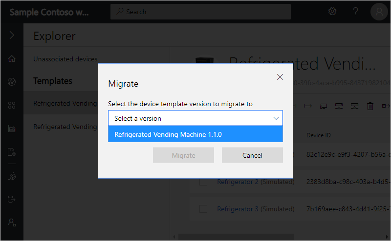

# Create a new device template version

Azure IoT Central allows rapid development of IoT Applications. You can quickly iterate over your device template designs by adding, editing, or deleting measurements, settings, or properties. Some of these changes could be intrusive for the currently connected devices. Azure IoT Central identifies these breaking changes and provides a way to safely deploy these updates to the devices.

A device template has a version number when you create it. By default, the version number is 1.0.0. If you edit a device template, and if that change could impact live connected devices, Azure IoT Central prompts you to create a new device template version.

> [!NOTE]
> To learn more about how to create a device template see [Set up a device template](howto-set-up-template.md)

## Changes that prompt a version change

In general changes to settings or properties of your device template prompt a version change.

> [!NOTE]
> Changes made to the device template do not prompt for the creation of a new version when no device or at-most one device is connected.

The following list describes the user actions that could require a new version:

* Properties (Required)
    * Adding or deleting a required property
    * Changing the field name of a property, field name that is used by your devices to send messages.
*  Properties (Optional)
    * Deleting an optional property
    * Changing the field name of a property, field name that is used by your devices to send messages.
    * Changing an optional property to a required property
*  Settings
    * Adding or deleting a setting
    * Changing the field name of a setting, field name that is used by your devices to send and receive messages.

## What happens on version change?

What happens to rules and device dashboards when there is a version change?

**Rules** could contain conditions that are dependent on properties. If you have removed one or more of these properties, these rules could be broken in your new device template version. You can go to these specific rules and update the conditions to fix the rules. Rules for your previous version should work with no impact.

**Device dashboards** can contain several types of tiles. Some of the tiles may contain settings and properties. When a property or setting used in a tile is removed, the tile is fully or partially broken. You can go to the tile and fix the issue either by removing the tile or updating the contents of the tile.

## Migrate a device across device template versions

You can create multiple versions of the device template. Over time, you will have multiple connected devices using these device templates. You can migrate devices from one version of your device template to another. The following steps describe how to migrate a device:

1. Go to the **Device Explorer** page.
1. Select the device you need to migrate to another version.
1. Choose **Migrate Device**.
1. Select the version number you want to migrate the device to and choose **Migrate**.

## Next steps

Now that you have learned how to use device template versions in your Azure IoT Central application, here is the suggested next step:

> [!div class="nextstepaction"]
> [How to create telemetry rules](howto-create-telemetry-rules.md)