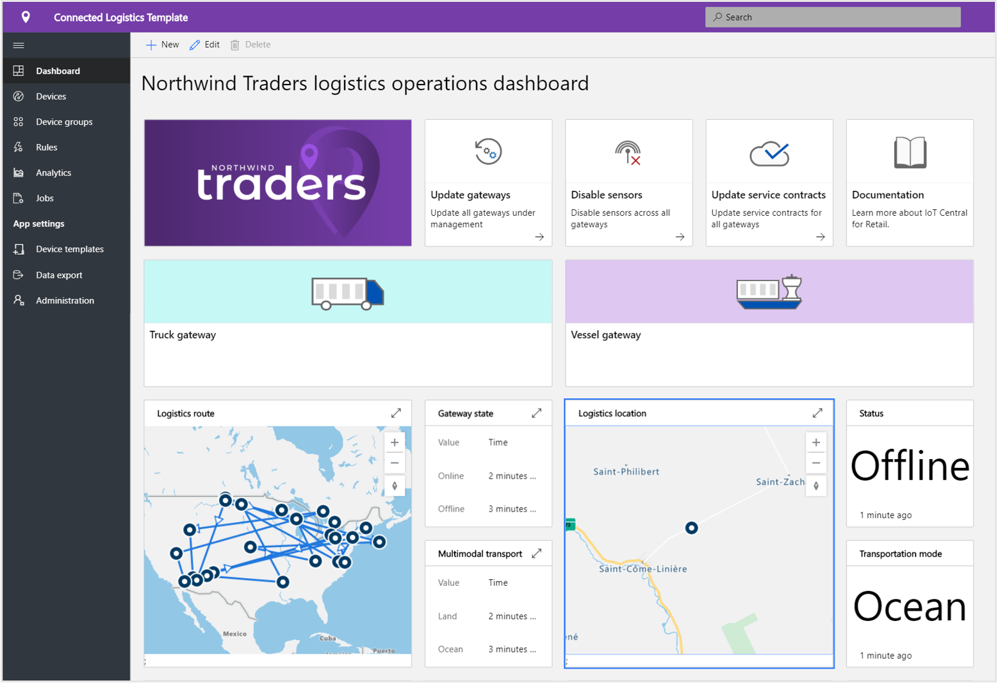
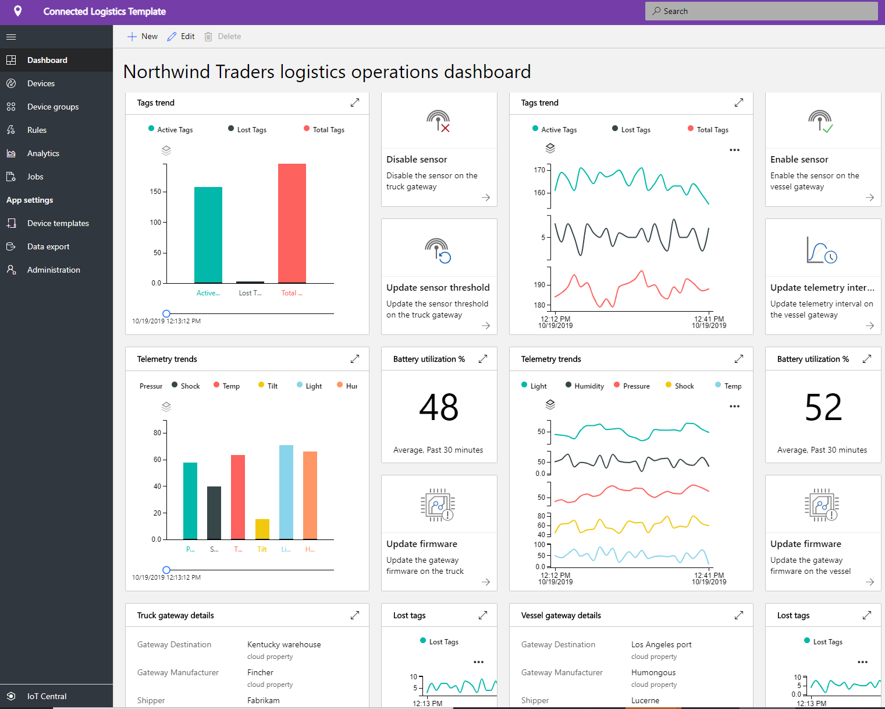

# Overview - What is connected logistics solution?
Global logistics spending is expected to reach $10.6trn in 2020, the largest GDP by industry. Transportation of goods is the majority (70%) of total logistics expenses. Shipping providers are under intense competitive pressure and constraints. 3PL providers are dealing with ever-decreasing time frames and rising compensation costs. Logistics is further strained by the risks posed by geopolitical, extreme climatic events, and crime. 

With the help of IoT sensors, we can collect & monitor ambient conditions i.e., Temperature, Humidity, Tilt, Shock, Light, and shipment’s location via GPS across multi-modal transformation i.e., Air, Water, Ground. Data gathered from sensors, devices, weather, & events can be integrated with cloud-based Business Intelligence systems. 
Connected logistics solution benefits are,
* Shipment transference with real-time tracing & tracking 
* Shipment integrity with real-time ambient conditions monitoring & cold chain
* Security from theft, loss, or damage of shipment
* Geo-Fencing, Route Optimization, Fleet management. Vehicle analytics
* Forecasting & predictability with the departure & arrivals 

Partners can leverage template to develop end to end Connected Logistics solutions & outlined benefits. This published template is focused on device connectivity, configuration & management of devices in IoT Central. 

## Next steps
To get started building a Connected logistics solution:
* Deploy the application template
* For detailed documentation, refer to [tutorial section]
* Learn more about IoT Central refer to [IoT Central overview]