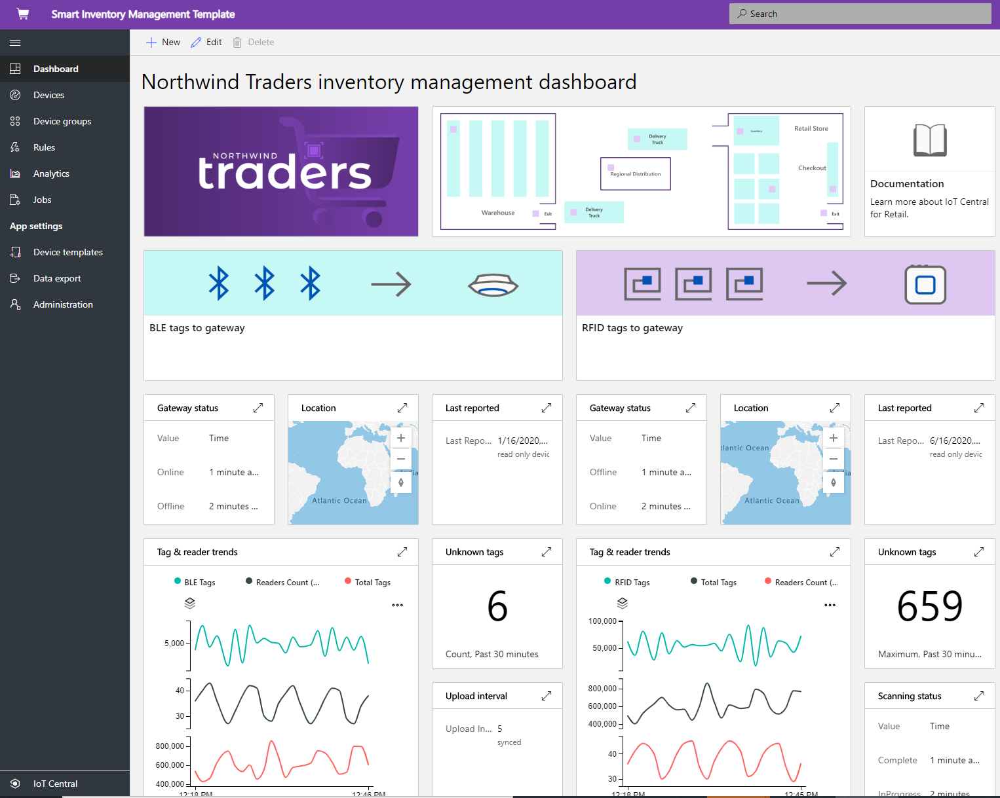

# Overview - What is smart inventory management solution?
"Inventory" is the stock of goods held by a retailer. Every retailer needs inventory to take care of supply and logistics lead time. Inventory is arguably the most valuable resource that every retailer needs to trade. In today's omnichannel world, inventory management is a critical requirement to ensure the right product is in the right place at the right time. Storing too much or too little inventory could hurt the retailer's business. Every year retailers are losing 8-10% of the revenue due to lack of inventory management capabilities.

IoT data enabled by Radio-frequency identification(RFID), Beacons & Camera is the opportunity to tackle this massive challenge in scale. The connectivity and real-time analytics inherent in IoT signals have become 
the game-changer for the retailer's inventory woes.  Data gathered from sensors, devices, weather, & events can be integrated with cloud-based Business Intelligence systems.  
Smart Inventory management benefits are, 
* Safeguards the organization against stock-outs and ensures the desired customer service level. 
* In-depth analysis & insights into inventory accuracy in near real time
* Decide on the right amount of inventory that suffices the customer orders

Partners can leverage template to develop end to end Smart inventory management solutions & outlined benefits.This published template is focused on device connectivity, configuration & management of RFID & Bluetooth low energy (BLE) readers in IoT Central. 

## Next steps
To get started building a Smart inventory management:
* Deploy the application template
* For detailed documentation, refer to [tutorial section]
* Learn more about IoT Central refer to [IoT Central overview]