# Tutorial: Create an in-store analytics application in Azure IoT Central

The tutorial shows solution builders how to create an Azure IoT Central in-store analytics application. The sample application is for a retail store. It's a solution to the common business need to monitor and adapt to occupancy and environmental conditions.

The sample application that you build includes three real devices: a Rigado Cascade 500 gateway, and two RuuviTag sensors. The tutorial also shows how to use the simulated occupancy sensor included in the application template for testing purposes. The Rigado C500 gateway serves as the communication hub in your application. It communicates with sensors in your store and manages their connections to the cloud. The RuuviTag is an environmental sensor that provides telemetry including temperature, humidity, and pressure. The simulated occupancy sensor provides a way to track motion and presence in the checkout areas of a store. 

This tutorial includes directions for connecting the Rigado and RuuviTag devices to your application. If you have another gateway and sensors, you can still follow the steps to build your application. The tutorial also shows how to create simulated RuuviTag sensors. The simulated sensors enable you to build the application if you don't have real devices. 

You develop the checkout and condition monitoring solution in three parts:

* Create the application and connect devices to monitor conditions
* Customize the dashboard to enable operators to monitor and manage devices
* Configure data export to enable store managers to run analytics and visualize insights

In this tutorial, you learn how to:
> [!div class="checklist"]
> * Use the Azure IoT Central **In-store analytics - checkout** template to create a retail store application
> * Customize the application settings
> * Create and customize IoT device templates
> * Connect devices to your application
> * Add rules and actions to monitor conditions

## Prerequisites

To complete this tutorial series, you need:
* An Azure subscription is recommended. You can optionally use a free 7-day trial. If you don't have an Azure subscription, you can create one on the [Azure sign-up page](https://aka.ms/createazuresubscription).
* Access to a gateway device and two environmental sensors (you can optionally use simulated devices as described in the tutorial)
* Device templates for the devices you use (templates are provided for all devices used in the tutorial)

## Create an application
In this section, you create a new Azure IoT Central application from a template. You'll use this application throughout the tutorial series to build a complete solution.

To create a new Azure IoT Central application:

1. Navigate to the [Azure IoT Central application manager](https://aka.ms/iotcentral) website.

1. If you have an Azure subscription, sign in with the credentials you use to access it, otherwise sign in using a Microsoft account:

    

1. To start creating a new Azure IoT Central application, select **New Application**.

1. Select **Retail**.  The retail page displays several retail application templates.

To create a new in-store analytics checkout application:  

1. Select the **In-store analytics - checkout** application template. This template includes device templates for all devices used in the tutorial except for RuuviTag sensors. The template also provides an operator dashboard for monitoring checkout and environmental conditions, and device status. 

1. Optionally, choose a friendly **Application name**. This application is based on a fictional retail store named Contoso. The tutorial uses the **Application name** *Contoso checkout*. The application template is based on the fictional company Northwind. In this tutorial, you use Contoso to learn how to customize the application.

    > [!NOTE]
    > If you use a friendly **Application name**, you still must use a unique value for the application **URL**.

1. If you have an Azure subscription, enter your *Directory, Azure subscription, and Region*. If you don't have a subscription, you can enable **7-day free trial** and complete the required contact information.  

    For more information about directories and subscriptions, see the [create an application quickstart](../core/quick-deploy-iot-central.md).

1. Select **Create**.

    

## Customize application settings
As a builder, you can change several settings to customize the user experience in your application. In this section, you'll select a predefined application theme. Optionally, you'll learn how to create a custom theme, and update the application image. A custom theme enables you to set the application browser colors, browser icon, and the application logo that appears in the masthead.

To select a predefined application theme:

1. Select **Settings** on the masthead.

    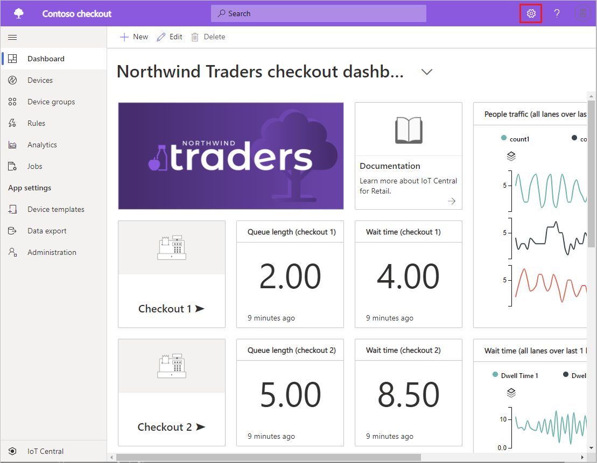

2. Select a new **Theme**.

3. Select **Save**.

Rather than use a predefined theme, you can create a custom theme. If you want to use a set of sample images to customize the application and complete the tutorial, download the [Contoso sample images](https://github.com/Azure-Samples/iot-central-docs-samples/tree/master/retail).

To create a custom theme:

1. Expand the left pane, if not already expanded.

    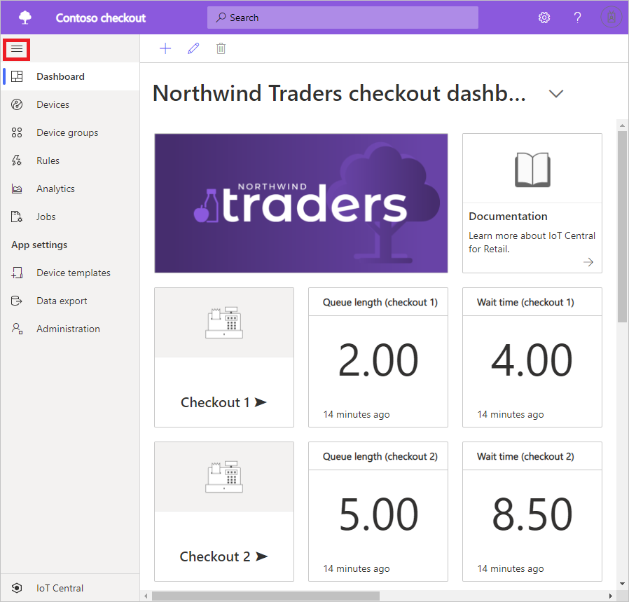

1. Select **Administration > Customize your application**.

1. Use the **Change** button to choose an image to upload as the **Application logo**. Optionally, specify a value for **Logo alt text**. 

1. Use the **Change** button to choose a **Browser icon** image that will appear on browser tabs.

1. Optionally, replace the default **Browser colors** by adding HTML hexadecimal color codes. For the **Header**, add *#008575*.  For the **Accent**, add *#A1F3EA*. 

1. Select **Save**. 

    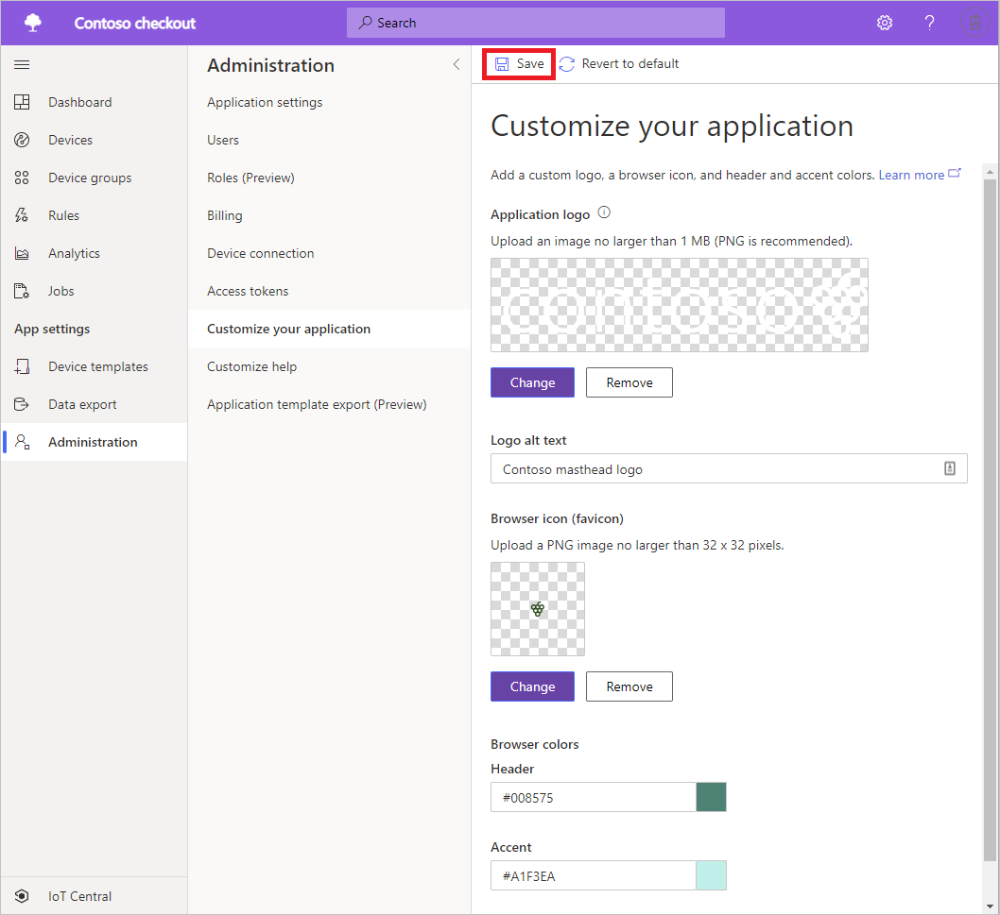

    After you save, the application updates the browser colors, the logo in the masthead, and the browser icon. 

    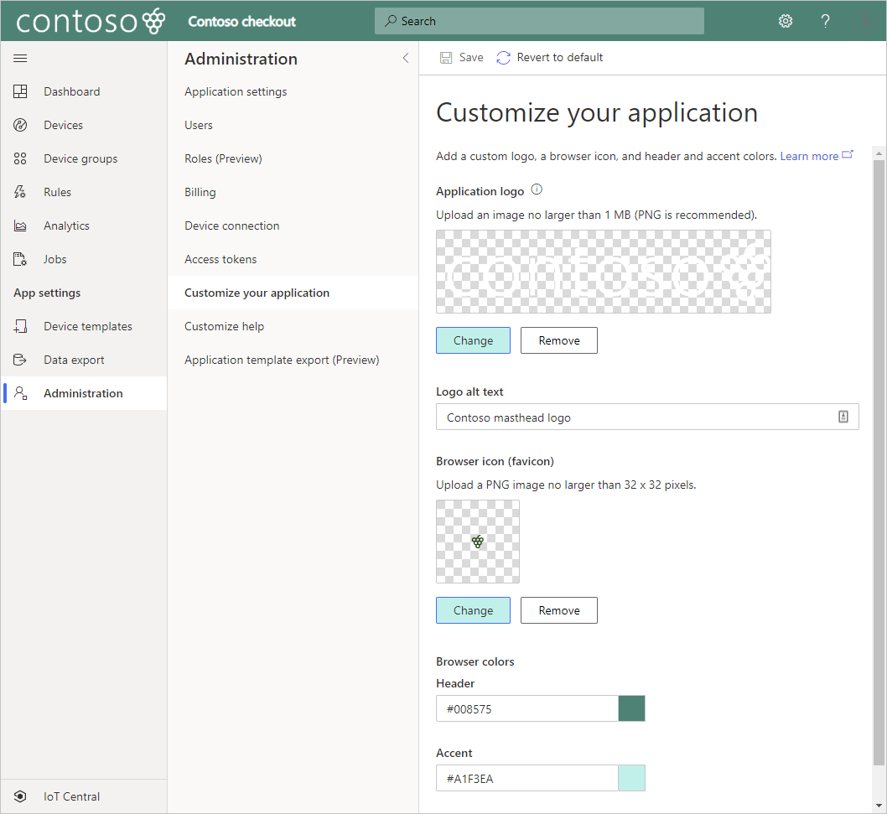

To update the application image:

1. Select **Administration > Application settings**.

1. Use the **Select image** button to choose an image to upload as the application image. This image appears on the application tile in the **My Apps** page of the IoT Central application manager.

1. Select **Save**.

1. Optionally, navigate to the **My Apps** view on the [Azure IoT Central application manager](https://aka.ms/iotcentral) website. The application tile displays the updated application image.

    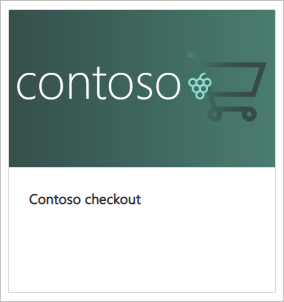

## Create device templates
As a builder, you can create device templates that enable you and the application operators to configure and manage devices. You create a template by building a custom one, by importing an existing template file, or by importing a template from the Azure IoT device catalog. After you create and customize a device template, use it to connect real devices to your application. Optionally, use a device template to generate simulated devices for testing.

The **In-store analytics - checkout** application template has device templates for several devices.  There are device templates for two of the three devices you use in the application. The RuuviTag device template isn't included in the **In-store analytics - checkout** application template. In this section, you add a device template for RuuviTag sensors to your application.

To add a RuuviTag device template to your application:

1. Select **Device Templates** in the left pane.

1. Select **+ New** to create a new device template.

1. Find and select the **RuuviTag** sensor device template in the Azure IoT device catalog. 

1. Select **Next: Customize**.

    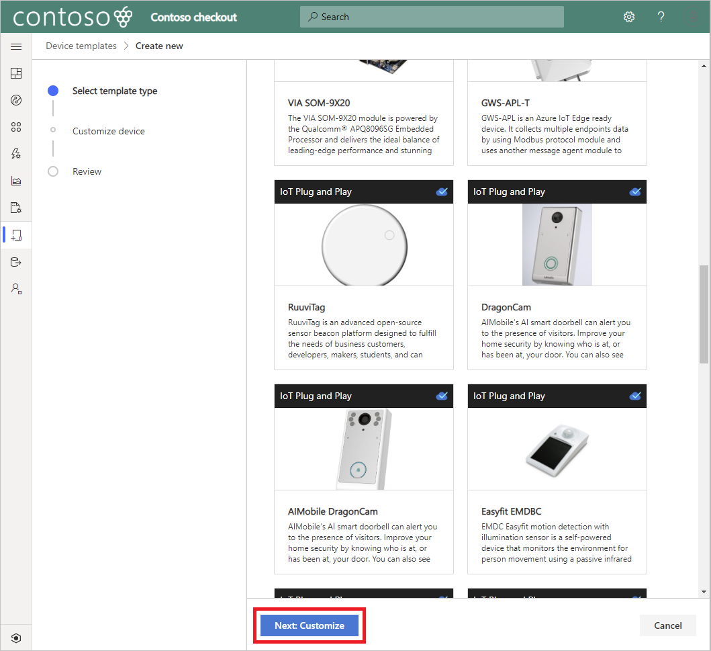

1. Select **Create**. The application adds the RuuviTag device template.

1. Select **Device templates** on the left pane. The page displays all device templates included in the application template, and the RuuviTag device template you just added.

    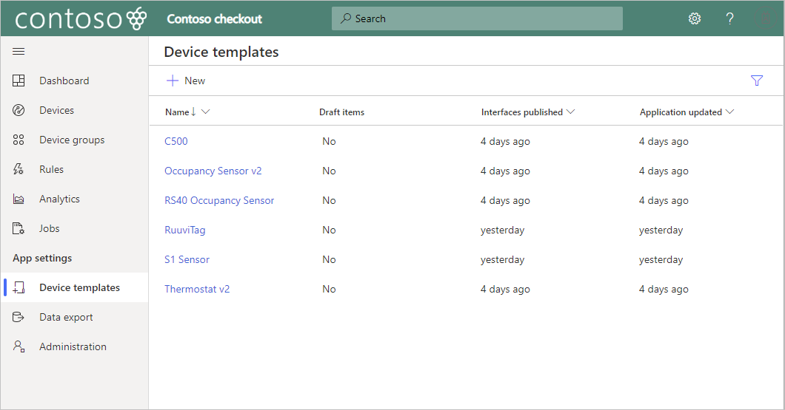

## Customize device templates
You can customize the device templates in your application in three ways. First, you customize the native built-in interfaces in your devices by changing the device capabilities. For example, with a temperature sensor, you can change details such as the display name of the temperature interface, the data type, the units of measurement, and minimum and maximum operating ranges. 

Second, customize your device templates by adding cloud properties. Cloud properties aren't part of the built-in device capabilities. Cloud properties are custom data that your Azure IoT Central application creates, stores, and associates with your devices. An example of a cloud property could be a calculated value, or metadata such as a location that you want to associate with a set of devices. 

Third, customize device templates by building custom views. Views provide a way for operators to visualize telemetry and metadata for your devices, such as device metrics and health.

Here, you use the first two methods to customize the device template for your RuuviTag sensors. For information about creating views for your sensors, see the [Add a simulated device to your IoT Central application](../core/quick-create-pnp-device.md) quickstart.

To customize the built-in interfaces of the RuuviTag device template:

1. Select **Device Templates** in the left pane. 

1. Select the template for RuuviTag sensors. 

1. Hide the left pane. The summary view of the template displays the device capabilities.

    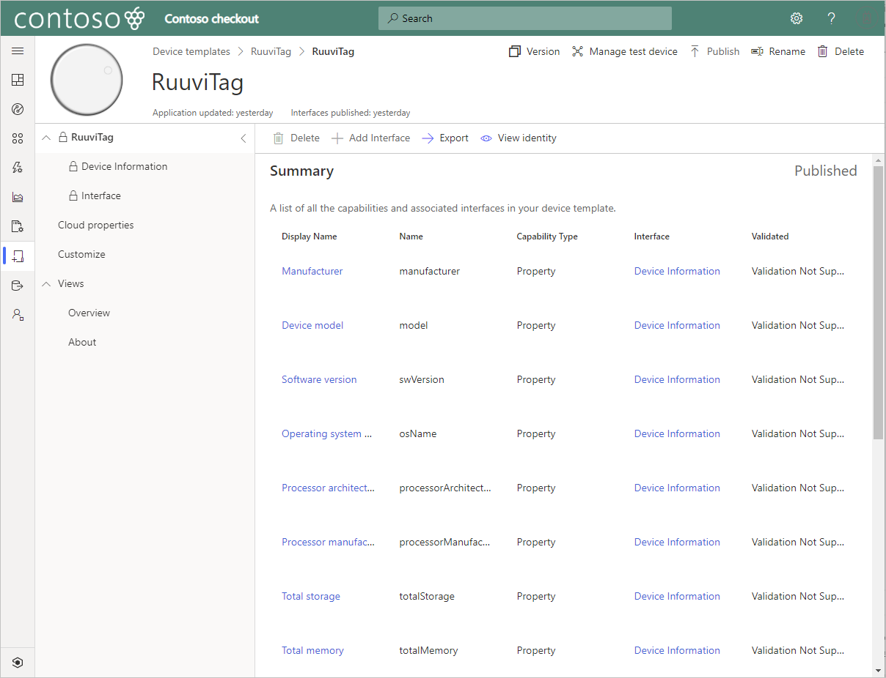

1. Select **Customize** in the RuuviTag device template menu. 

1. Scroll in the list of capabilities and find the `humidity` telemetry type. It's the row item with the editable **Display name** value of *humidity*.

In the following steps, you customize the `humidity` telemetry type for the RuuviTag sensors. Optionally, customize some of the other telemetry types.

For the `humidity` telemetry type, make the following changes:

1. Select the **Expand** control to expand the schema details for the row.

1. Update the **Display Name** value from *humidity* to a custom value such as *Relative humidity*.

1. Change the **Semantic Type** option from *None* to *Humidity*.  Optionally, set schema values for the humidity telemetry type in the expanded schema view. Schema settings allow you to create detailed validation requirements for the data that your sensors track. For example, you could set minimum and maximum operating range values for a given interface.

1. Select **Save** to save your changes.

    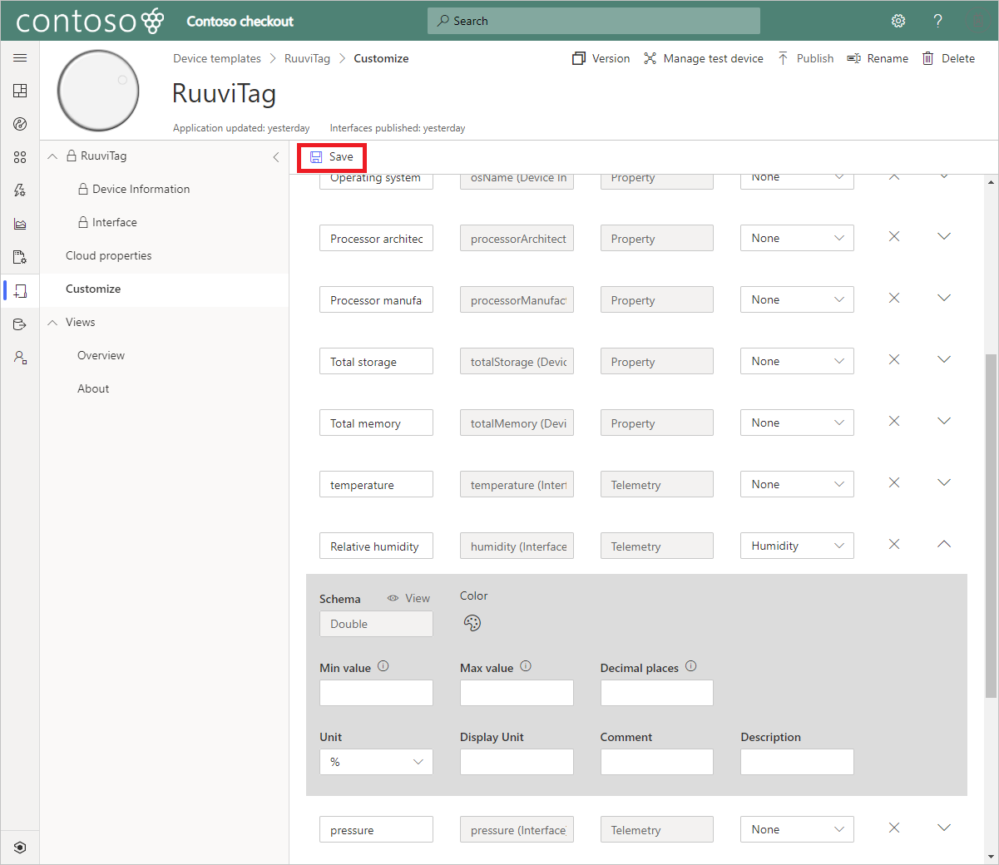

To add a cloud property to a device template in your application:

1. Select **Cloud Properties** in the RuuviTag device template menu.

1. Select **Add Cloud Property**. 

Specify the following values to create a custom property to store the location of each device:

1. Enter the value *Location* for the **Display Name**. This value is automatically copied to the **Name** field, which is a friendly name for the property. You can use the copied value or change it.

1. Select *String* in the **Schema** dropdown. A string type enables you to associate a location name string with any device based on the template. For instance, you could associate an area in a store with each device. Optionally, you can set the **Semantic Type** of your property to *Location*, and this automatically sets the **Schema** to *Geopoint*. It enables you to associate GPS coordinates with a device. 

1. Set **Minimum Length** to *2*. 

1. Set **Trim Whitespace** to **On**.

1. Select **Save** to save your custom cloud property.

    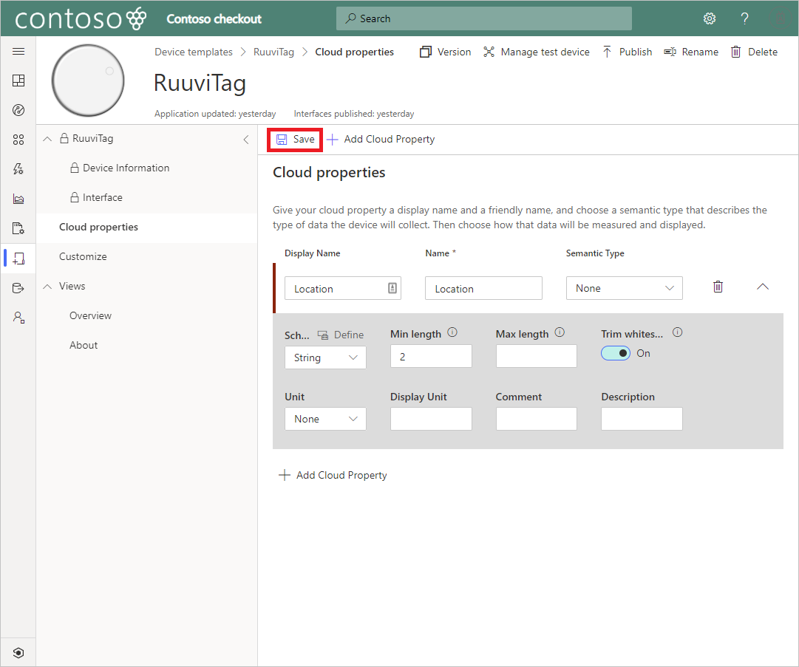

1. Select **Publish**. 

    Publishing a device template makes it visible to application operators. After you've published a template, use it to generate simulated devices for testing, or to connect real devices to your application. If you already have devices connected to your application, publishing a customized template pushes the changes to the devices.

## Add devices
After you have created and customized device templates, it's time to add devices. 

For this tutorial, you use the following set of real and simulated devices to build the application:
- A real Rigado C500 gateway
- Two real RuuviTag sensors
- A simulated **Occupancy** sensor. The simulated sensor is included in the application template, so you don't need to create it. 

> [!NOTE]
> If you don't have real devices, you can still complete this tutorial by creating simulated RuuviTag sensors. The following directions include steps to create a simulated RuuviTag. You don't need to create a simulated gateway.

Complete the steps in the following two articles to connect a real Rigado gateway and RuuviTag sensors. After you're done, return to this tutorial. Because you already created device templates in this tutorial, you don't need to create them again in the following set of directions.

- To connect a Rigado gateway, see [Connect a Rigado Cascade 500 to your Azure IoT Central application](../core/howto-connect-rigado-cascade-500.md?toc=/azure/iot-central/retail/toc.json&bc=/azure/iot-central/retail/breadcrumb/toc.json).
- To connect RuuviTag sensors, see [Connect a RuuviTag sensor to your Azure IoT Central application](../core/howto-connect-ruuvi.md?toc=/azure/iot-central/retail/toc.json&bc=/azure/iot-central/retail/breadcrumb/toc.json). You can also use these directions to create two simulated sensors, if needed.

## Add rules and actions
As part of using sensors in your Azure IoT Central application to monitor conditions, you can create rules to run actions when certain conditions are met. A rule is associated with a device template and one or more devices, and contains conditions that must be met based on device telemetry or events. A rule also has one or more associated actions. The actions may include sending email notifications, or triggering a webhook action to send data to other services. The **In-store analytics - checkout** application template includes some predefined rules for the devices in the application.

In this section, you create a new rule that checks the maximum relative humidity level based on the RuuviTag sensor telemetry. You add an action to the rule so that if the humidity exceeds the maximum, the application sends email. 

To create a rule: 

1. Expand the left pane.

1. Select **Rules**.

1. Select **+ New**.

1. Enter *Humidity level* as the name of the rule. 

1. Choose the RuuviTag device template in **Scopes**. The rule you define will apply to all sensors based on that template. Optionally, you could create a filter that would apply the rule only to a defined subset of the sensors. 

1. Choose `Relative humidity` as the **Telemetry**. It's the device capability that you customized in a previous step.

1. Choose `Is greater than` as the **Operator**. 

1. Enter a typical upper range indoor humidity level for your environment as the **Value**. For example, enter *65*. You've set a condition for your rule that occurs when relative humidity in any RuuviTag real or simulated sensor exceeds this value. You may need to adjust the value up or down depending on the normal humidity range in your environment.  

   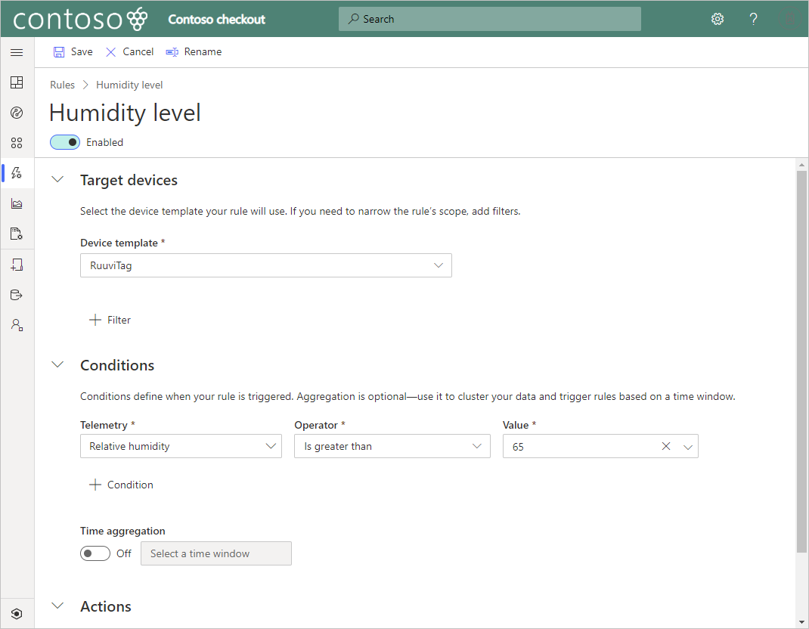

To add an action to the rule:

1. Select **+ Email**. 

1. Enter *High humidity notification* as the friendly **Display name** for the action. 

1. Enter the email address associated with your account in **To**. If you use a different email, the address you use must be for a user who has been added to the application. The user also needs to sign in and out at least once.

1. Optionally, enter a note to include in text of the email.

1. Select **Done** to complete the action.

   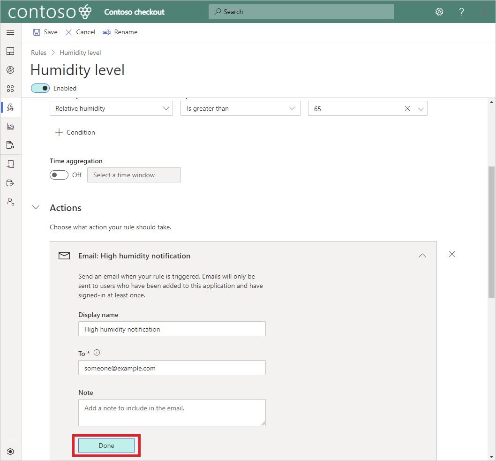

1. Select **Save** to save and activate the new rule. 

    Within a few minutes, the specified email account should begin to receive emails. The application sends email each time a sensor indicates that the humidity level exceeded the value in your condition.

## Next steps
In this tutorial, you learned how to:

* Use the Azure IoT Central **In-store analytics - checkout** template to create a retail store application
* Customize the application settings
* Create and customize IoT device templates
* Connect devices to your application
* Add rules and actions to monitor conditions

Now that you've created an Azure IoT Central condition monitoring application, here is the suggested next step:

> [!div class="nextstepaction"]
> [Customize the operator dashboard](./tutorial-in-store-analytics-customize-dashboard-pnp.md)
