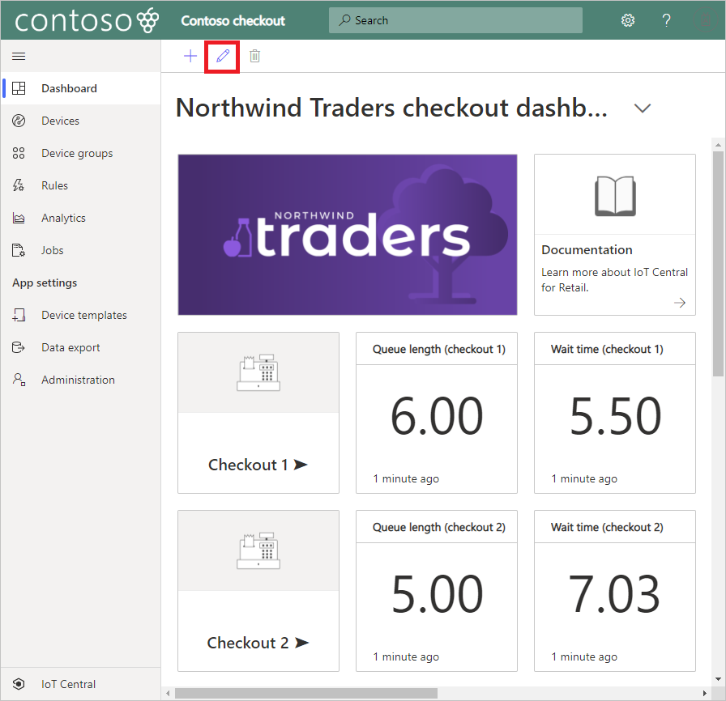
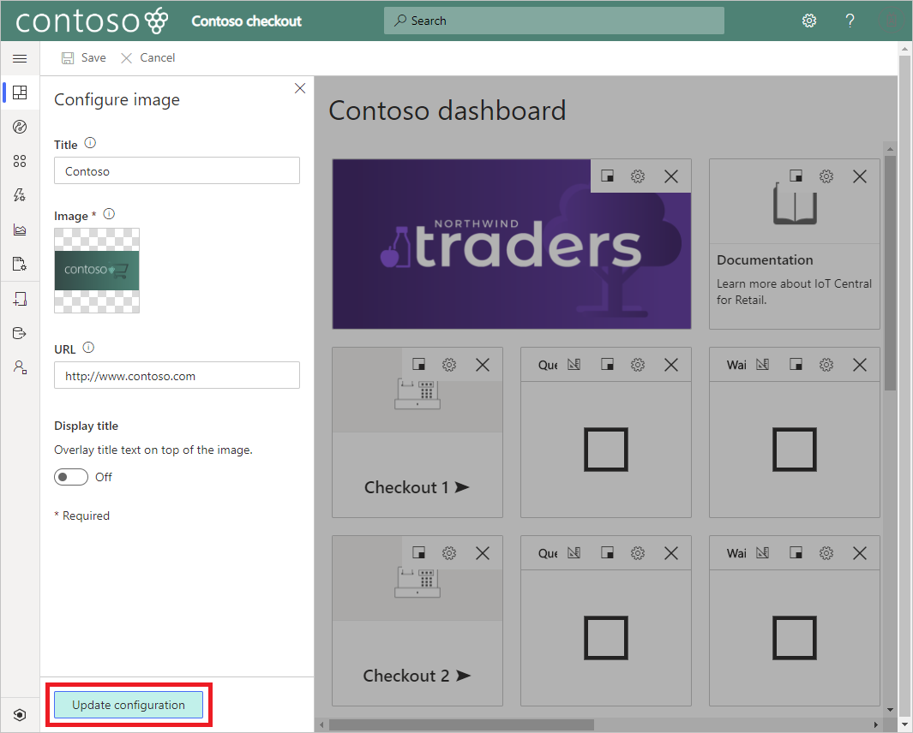
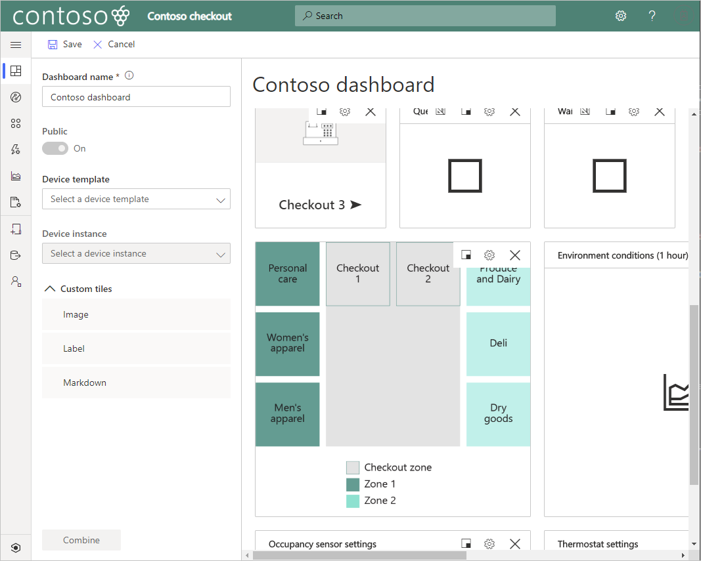

# Tutorial:  Customize the operator dashboard and manage devices in Azure IoT Central

[!INCLUDE [iot-central-pnp-original](../../../includes/iot-central-pnp-original-note.md)]

This tutorial shows you, as a builder, how to customize the operator dashboard in your Azure IoT Central in-store analytics application. Application operators can use the customized dashboard to run the application and manage the attached devices.

In this tutorial, you learn how to:
> [!div class="checklist"]
> * Change the dashboard name
> * Customize image tiles on the dashboard
> * Arrange tiles to modify the layout
> * Add tiles to show telemetry
> * Add tiles to visualize device health

## Prerequisites

Before you begin this tutorial, the builder should complete the first tutorial, to create the Azure IoT Central in-store analytics application and add devices:

* [Create an in-store analytics application in Azure IoT Central](./tutorial-in-store-analytics-create-app-pnp.md?toc=/azure/iot-central-pnp/toc.json&bc=/azure/iot-central-pnp/breadcrumb/toc.json) (Required)

## Change the dashboard name
To customize the operator dashboard, you edit the default dashboard in your application. Optionally, you can create additional new dashboards. The first step to customize the dashboard in your application is to change the name.

1. Navigate to the [Azure IoT Central application manager](https://aka.ms/iotcentral) website.

1. Open the condition monitoring application that you created in the [Create an in-store analytics application in Azure IoT Central](./tutorial-in-store-analytics-create-app-pnp.md?toc=/azure/iot-central-pnp/toc.json&bc=/azure/iot-central-pnp/breadcrumb/toc.json) tutorial.

1. Select **Edit** on the dashboard toolbar. In edit mode, you can customize the appearance, layout, and content of the dashboard.

    

1. Optionally, hide the left pane. Hiding the left pane gives you a larger working area for editing the dashboard.

1. Enter a friendly name for your dashboard in **Dashboard name.** This tutorial uses a fictional company named Contoso, and the example dashboard name is *Contoso checkout dashboard*. 

1. Select **Save**. This saves your changes to the dashboard and disables edit mode.

    

## Customize image tiles on the dashboard
An Azure IoT Central application dashboard consists of one or more tiles. A tile is a rectangular container for displaying content on a dashboard. You associate various types of content with tiles, and you drag, drop, and resize tiles to customize a dashboard layout. There are four types of tiles for displaying content. Image tiles contain images. Label tiles display plain text. Markdown tiles contain formatted content and let you set an image, a URL, a title, and markdown code that renders as HTML. Data tiles generate a real-time display of device data based on telemetry, properties, or commands. 

In this section, you learn how to customize image tiles on the dashboard.

To customize the image tile that displays a brand image on the dashboard:

1. Select **Edit** on the dashboard toolbar. 

1. Select **Configure** on the image tile that displays the Northwind brand image. 

    

1. Change the **Title**. The title appears when a user hovers over the image.

1. Select **Image**. A dialog opens and enables you to upload a custom image. 

1. Optionally, specify a URL for the image.

1. Select **Update configuration**. The **Update configuration** button saves changes to the dashboard and leaves edit mode enabled.

    

1. Optionally, select **Configure** on the titled **Documentation**, and specify a URL for support content. 

To customize the image tile that displays a map of the sensor zones in the store:

1. Select **Configure** on the image tile that displays the default store zone map. 

1. Select **Image**, and use the dialog to upload a custom image of a store zone map. 

1. Select **Update configuration**.

    

    The example Contoso store map shows three zones: a central zone for checkout lines, a zone for apparel and personal care, and a zone for groceries and deli. Each zone has an associated sensor to provide telemetry. 

    

1. Select **Save**. 

## Arrange tiles to modify the layout
A key step in customizing a dashboard is to rearrange the tiles to create a useful view. Application operators use the dashboard to visualize device telemetry, manage devices, and monitor conditions in a store. Azure IoT Central simplifies the application builder task of creating a dashboard. The dashboard edit mode enables you to quickly add, move, resize, and delete tiles. The **In-store analytics - checkout** application template also simplifies the task of creating a dashboard. It provides a working dashboard layout, with sensors connected, and tiles that display checkout line counts and environmental conditions.

In this section, you rearrange the dashboard in the **In-store analytics - checkout** application template to create a custom layout.

To remove tiles that you don't plan to use:

1. Select **Edit** on the dashboard toolbar. 

1. Select **X Delete** on each tile in the right-hand column of the dashboard. The Contoso store dashboard does not use these tiles. 

    

1. Select **Save**. Removing unused tiles frees up space in the edit page, and simplifies the dashboard view for operators.

To delete the remaining unused tiles:

1. Select **Edit** on the dashboard toolbar. 

1. Delete the tile titled **Thermostat settings**. This tutorial uses the RuuviTag environmental sensors, and you add a tile for those in a later step.

1. Delete the two tiles titled **Warm-up checkout zone** and **Cool-down checkout zone**. 

1. Delete the three tiles grouped with **Checkout 3**. This tutorial uses the occupancy sensor and monitors only two checkout areas.

    

1. Select **Save**.

    

After you remove unused tiles, rearrange the remaining tiles to create an organized layout. The new layout includes space for tiles you add in a later step.

To rearrange the remaining tiles:

1. Select **Edit**.

1. Move the **Wait time** tile to the right of the **People traffic** tile.

    

To create a placeholder label tile: 

1. Select **Custom Tiles > Label**, and drag and drop it in the dashboard layout. A new tile typically appears at an open space in the layout.

    

1. Select **Configure** on the label tile. 

1. Replace the value in **Text** with a single white space. You can use the blank label tile as a placeholder to preserve the layout in your dashboard. 

1. Select **Update configuration**. 

1. Drag and drop the blank label tile below the **People traffic** tile. 

    

1. Use the sizing handle on the label tile to widen the tile. Widen it to the full width of the combined **People traffic** and **Wait time** tiles.

    

1. Select **Save** to save your customized layout. 

## Add tiles to show telemetry
After you customize the dashboard layout, you are ready to add tiles to show telemetry. To create a data tile, you select a device template and device instance, then you select device-specific telemetry, properties, or commands, to generate the data. The **In-store analytics - checkout** application template includes several data tiles in the dashboard. The four tiles in the two checkout zones display telemetry from the simulated occupancy sensor. The **People traffic** and **Wait time** tiles show combined views of the checkout zone telemetry. 

In this section, you add two more data tiles to show environmental telemetry from the RuuviTag sensors you added in the [Create an in-store analytics application in Azure IoT Central](./tutorial-in-store-analytics-create-app-pnp.md?toc=/azure/iot-central-pnp/toc.json&bc=/azure/iot-central-pnp/breadcrumb/toc.json) tutorial. 

To add tiles to display environmental data from the RuuviTag sensors:

1. Select **Edit**.

1. Delete the tile titled **Environment conditions**. This tile displays telemetry from the thermostat sensor. In this tutorial, you use the RuuviTag sensors to monitor environment conditions. 

1. Select `RuuviTag` in the **Device template** list. 

1. Select an instance of one of the two RuuviTag sensors. In the example Contoso store, one RuuviTag sensor monitors **Zone 1**, and the other monitors **Zone 2**. 

1. Select `Relative humidity` and `temperature` in the **Telemetry** list. These are the telemetry items that display for each zone on the tile.

1. Select **Combine**. 

    

    A new tile appears to display combined humidity and temperature telemetry for the selected sensor. 

1. Select **Configure** on the new tile for the RuuviTag sensor. 

1. Change the **Title** to *Zone 1 humidity, temperature*. 

1. Select **Update configuration**.

1. Repeat the previous steps to create a tile for the second RuuviTag sensor instance. Set the **Title** to *Zone 2, humidity, temperature* and then select **Update configuration.**

1. Drag and drop the tile titled **Zone 2 humidity, temperature** alongside the title titled **Zone 1 humidity, temperature**.

1. Select **Save**. The dashboard displays zone telemetry in the two new tiles.

    

1. Optionally, remove both the **People traffic** and **Wait list** tiles, and add them back to the dashboard. These tiles are based on the simulated **Occupancy Sensor v2**. Reuse all existing settings on each tile, except show data for only two checkout zones rather than three. 

    

## Add tiles to visualize device health
Application operators use the dashboard to manage devices and monitor device status. Add a tile for the simulated occupancy sensor to display its status and connectivity.

To add a tile for the Occupancy Sensor v2:

1. Select **Edit**.

1. Select `Occupancy Sensor v2` in the **Device template** list. 

1. Select `Occupancy` in **Device instance**.

1. Select **Properties > Connectivity** and **Properties > Device status**. 

1. Select **Combine**. 

1. Select **Configure** on the new tile titled **Connectivity, Device status**. 

1. Change the **Title** to *Occupancy connectivity, status*. 

1. Select **Update configuration**. 

1. Delete the existing title titled **Occupancy sensor settings**. The tile is based on a sensor that this tutorial does not use.

1. Drag and drop the new **Occupancy connectivity, status** tile directly beneath the store map tile. 

1. Select **Save**.  

    

## Next steps
In this tutorial, you learned how to:

* Change the dashboard name
* Customize image tiles on the dashboard
* Arrange tiles to modify the layout
* Add tiles to show telemetry
* Add tiles to visualize device health

Now that you've customized the dashboard in your Azure IoT Central in-store analytics application, here is the suggested next step:

> [!div class="nextstepaction"]
> [Export data and visualize insights](./tutorial-in-store-analytics-export-data-visualize-insights-pnp.md?toc=/azure/iot-central-pnp/toc.json&bc=/azure/iot-central-pnp/breadcrumb/toc.json)
