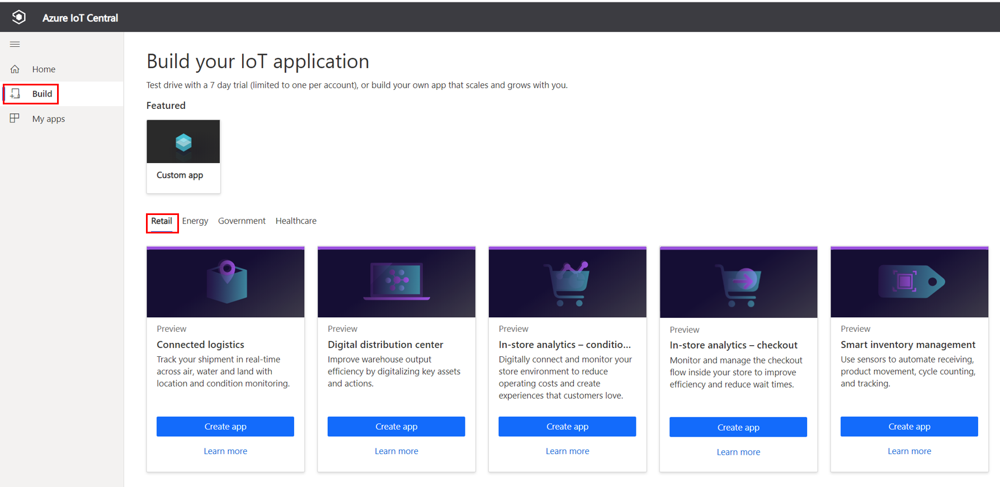
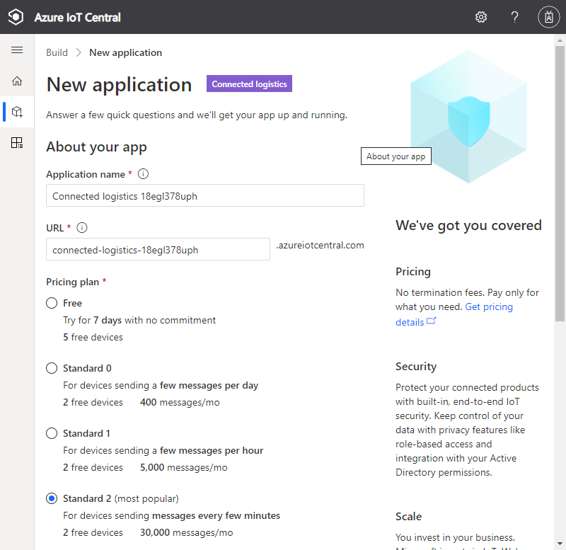
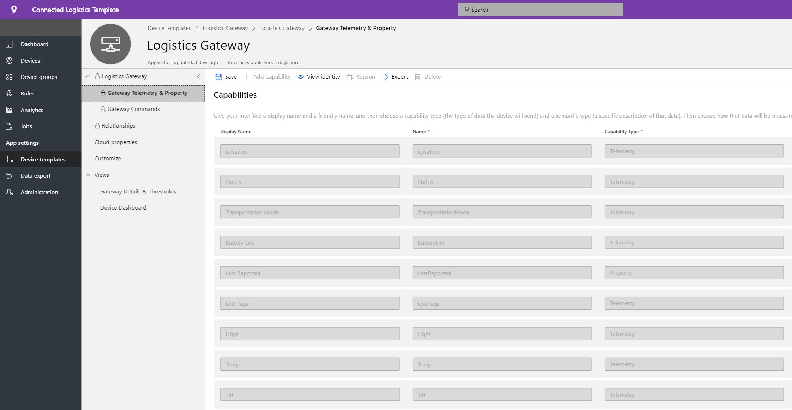
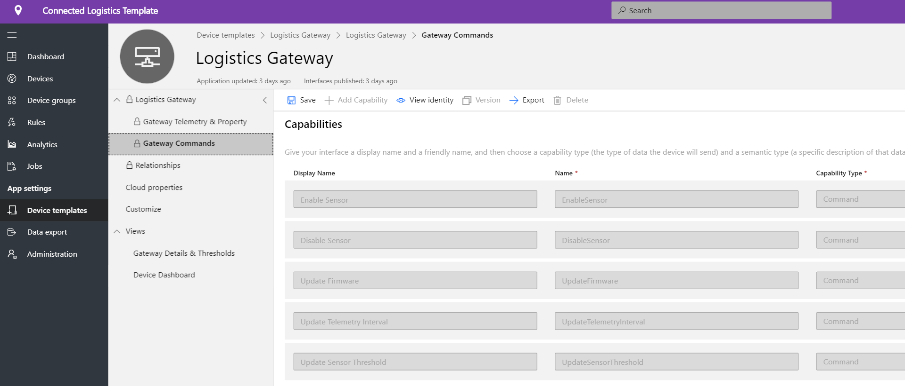
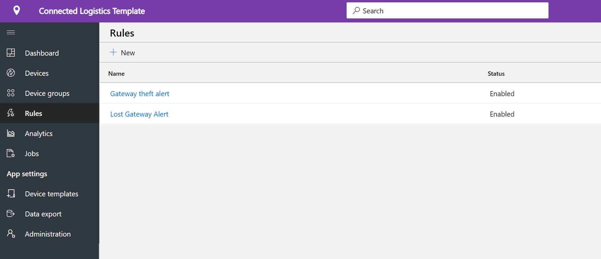
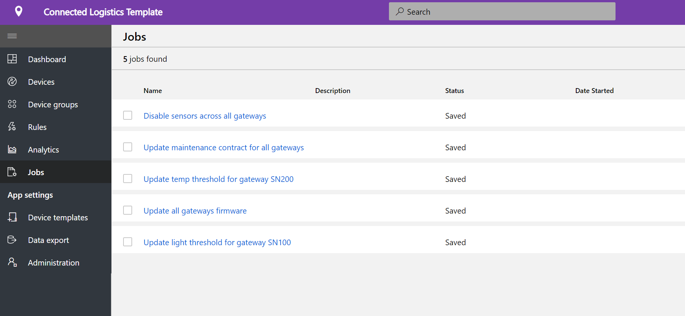
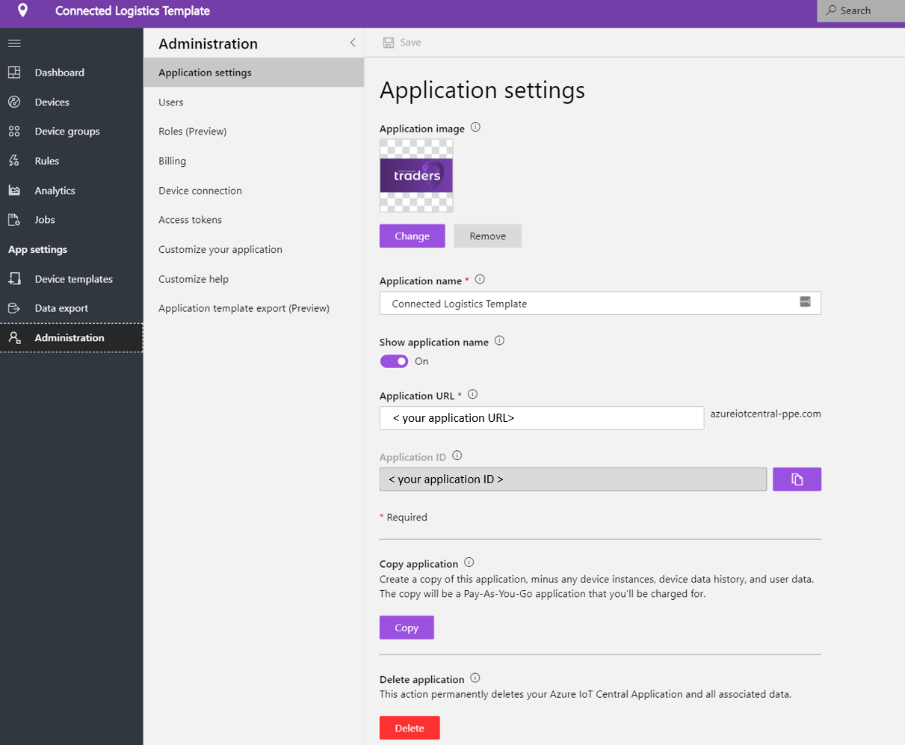

# Tutorial: Deploy and walk through a connected logistics application template

This tutorial shows you how to get started by deploying an IoT Central **connected logistics** application template. You will learn how to deploy the template, what is included out of the box, and what you might want to do next.

In this tutorial, you learn how to, 
* create connected logistics application 
* walk through the application 

## Prerequisites
* No specific pre-requisites required to deploy this app
* Recommended to have Azure subscription, but you can even try without it

## Create connected logistics application template
You can create application using following steps
1. Navigate to the Azure IoT Central application manager website. Select **Build** from the left-hand navigation bar and then click the **Retail** tab.

> [!div class="mx-imgBorder"]
> 

2. Select **Create app** under **Connected Logistics Application**

3. **Create app** will open New application form and fill up the requested details as show below.
   * **Application name**: you can use default suggested name or enter your friendly application name.
   * **URL**: you can use suggested default URL or enter your friendly unique memorable URL. Next, default setting is recommended if you already have an Azure Subscription.Else you can start with seven day free trial and choose to convert to standard at any time before the free trail expiration.
   * **Billing Info**: The Directory, Azure Subscription, and Region details are required to provision the resources.
   * **Create** : Select create at the bottom of the page to deploy your application.

> [!div class="mx-imgBorder"]
> 

## Walk through the application 

## Dashboard

After successfully deploying the app template, your default dashboard is a connected logistics operator focused portal. Northwind Trader is a fictitious logistics provider managing fleet of cargo in the ocean and on the land. In this dashboard, you will see two different gateways providing telemetry about shipments along with associated commands, jobs, and actions that you can perform. 
This dashboard is pre-configured to showcase the critical logistics device operations activity.
The dashboard is logically divided between two different gateway device management operations, 
   * Logistics route for truck shipment and location details of the ocean shipment is an essential element for all the multi-modal transportation
   * View the gateway status & relevant information 

> [!div class="mx-imgBorder"]
> 

   * You can easily track the total number of gateways, active, and unknown tags.
   * You can perform device management operations such as update firmware, disable sensor, enable sensor, update sensor threshold, update telemetry intervals, & update device service contracts.
   * View device battery consumption

> [!div class="mx-imgBorder"]
> 

## Device Template

Click on the Device templates tab, and you will see the gateway capability model. A capability model is structured around two different interfaces **Gateway Telemetry & Property** and **Gateway Commands**

**Gateway Telemetry & Property** - This interface represents all the telemetry related to sensors, location and device info as well as device twin property capability such as sensor thresholds & update intervals.

> [!div class="mx-imgBorder"]
> 

**Gateway Commands** - This interface organizes all the gateway command capabilities

> [!div class="mx-imgBorder"]
> 

## Rules
Select the rules tab to see two different rules that exist in this application template. These rules are configured to email notifications to the operators for further investigations.
 
**Gateway theft alert**: This rule is triggered when there is unexpected light detection by the sensors during the journey. Operators need to be notified ASAP to investigate potential theft.
 
**Unresponsive Gateway**: This rule will trigger if the gateway does not report to the cloud for a prolonged period. Gateway could be unresponsive due to low battery mode, loss of connectivity, device health.

> [!div class="mx-imgBorder"]
> 

## Jobs
Select the jobs tab to see five different jobs that exist as part of this application template:

> [!div class="mx-imgBorder"]
> 

You can leverage jobs feature to perform solution-wide operations. Here jobs are using the device commands & twin capability to perform tasks such as disabling specific sensors across all the gateway or modifying the sensor threshold depending on the shipment mode and route. 
   * It is a standard operation to disable shock sensors during ocean shipment to conserve battery or decrease temperature threshold during cold chain transportation. 
 
   * Jobs enables you to perform system-wide operations such as updating firmware on the gateways or updating service contract to stay current on maintenance activities.

## Clean up resources
If you're not going to continue to use this application, delete the application template by visiting **Administration** > **Application settings** and click **Delete**.

> [!div class="mx-imgBorder"]
> 

## Next steps
* Learn more about [connected logistics concept](./architecture-connected-logistics-pnp.md)
* Learn more about other [IoT Central retail templates](./overview-iot-central-retail-pnp.md)
* Learn more about [IoT Central overview](../core/overview-iot-central.md)
