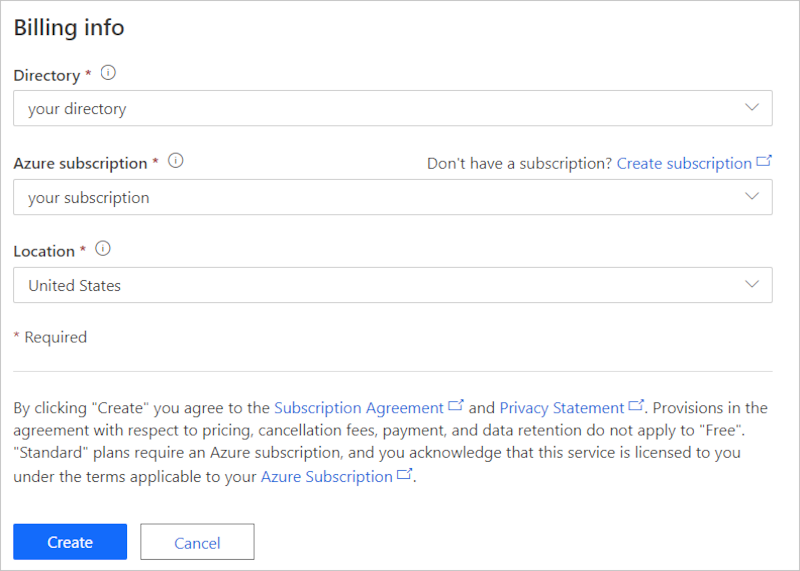
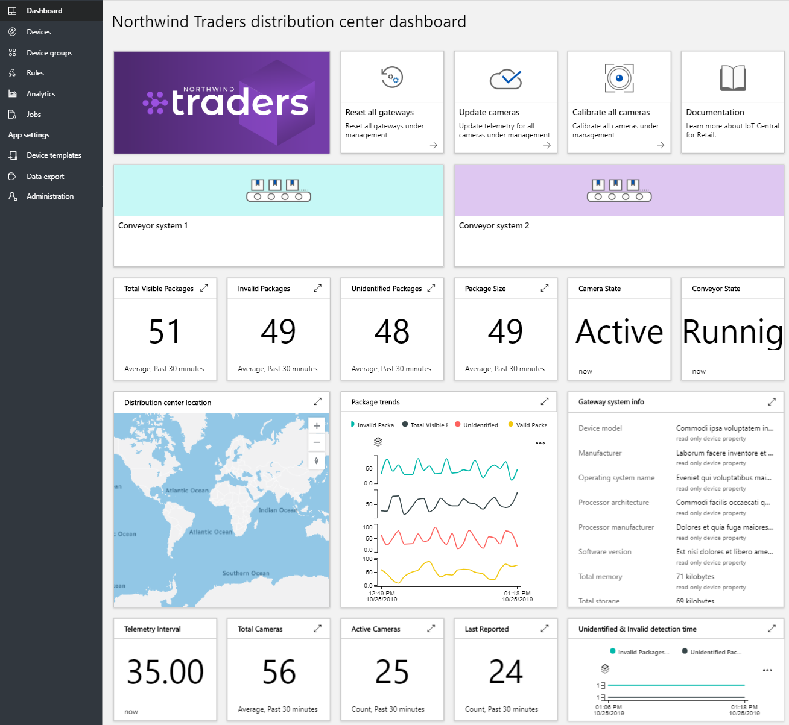
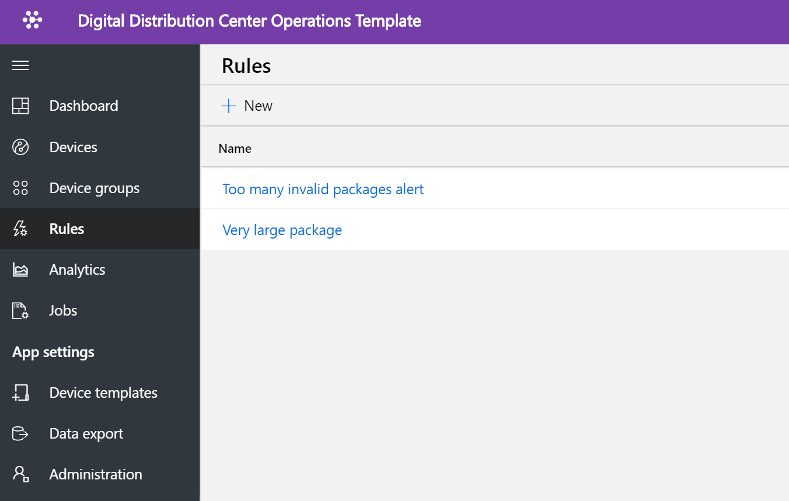
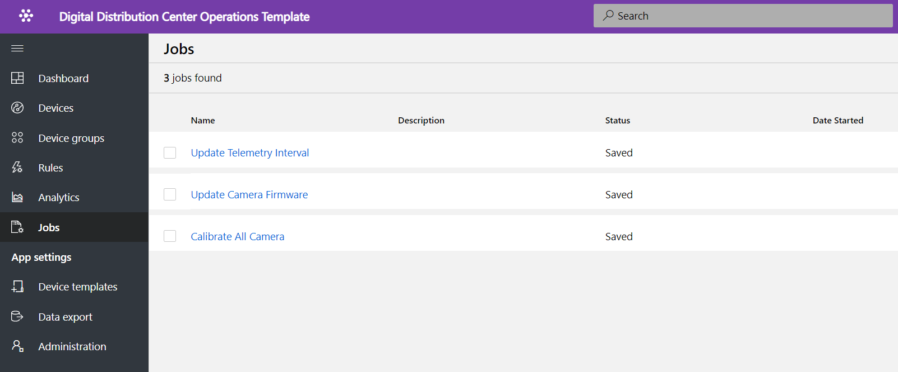
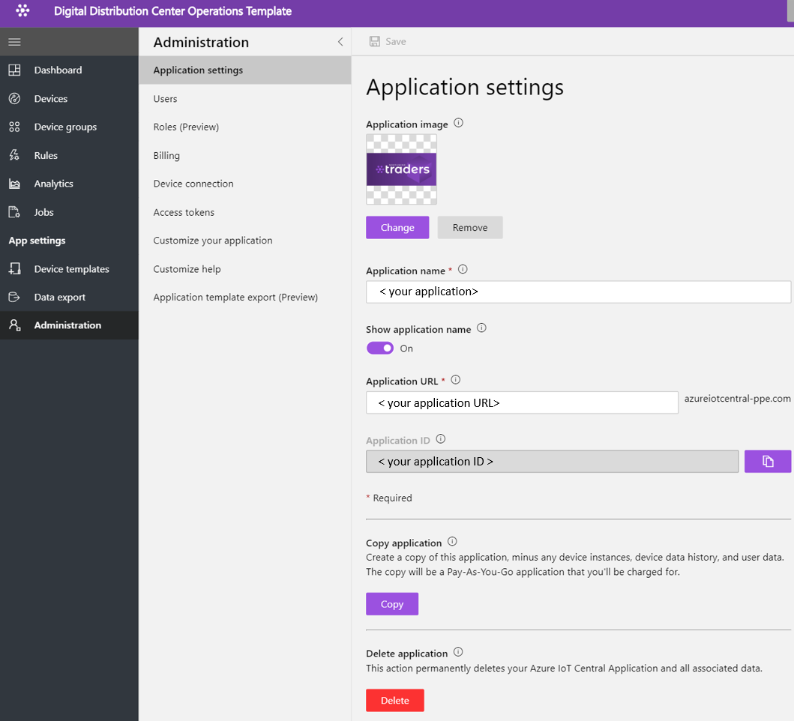

# Tutorial: Deploy and walk through a digital distribution center application template

This tutorial shows you how to get started by deploying an IoT Central **digital distribution center** application template. You will learn how to deploy the template, what is included out of the box, and what you might want to do next.

In this tutorial, you learn how to, 
* Create digital distribution center application 
* Walk through the application 

## Prerequisites
* No specific pre-requisites required to deploy this app
* Recommended to have Azure subscription, but you can even try without it

## Create digital distribution center application template

You can create application using following steps

1. Navigate to the Azure IoT Central application manager website. Select **Build** from the left-hand navigation bar and then click the **Retail** tab.

    > [!div class="mx-imgBorder"]
    > 

2. Select **Retail** tab and select **Create app** under **digital distribution center application**

3. **Create app** will open New application form and fill up the requested details as show below.
   **Application name**: you can use default suggested name or enter your friendly application name.
   **URL**: you can use suggested default URL or enter your friendly unique memorable URL. Next, the default setting is recommended if you already have an Azure Subscription. You can start with 7-day free trial pricing plan and choose to convert to a standard pricing plan at any time before the free trail expires.
   **Billing Info**: The Directory, Azure Subscription, and Region details are required to provision the resources.
   **Create**: Select create at the bottom of the page to deploy your application.

    > [!div class="mx-imgBorder"]
    > 

    > [!div class="mx-imgBorder"]
    > 

## Walk through the application dashboard 

After successfully deploying the app template, your default dashboard is a distribution center operator focused portal. Northwind Trader is a fictitious distribution center solution provider managing conveyor systems. 

In this dashboard, you will see one gateway and one camera acting as an IoT device. Gateway is providing telemetry about packages such as valid, invalid, unidentified, and size along with associated device twin properties. All downstream commands are executed at IoT devices, such as a camera. This dashboard is pre-configured to showcase the critical distribution center device operations activity.

The dashboard is logically organized to show the device management capabilities of the Azure IoT gateway and IoT device.  
   * You can perform gateway command & control tasks
   * Manage all cameras that are part of the solution. 

> [!div class="mx-imgBorder"]
> 

## Device Template

Click on the Device templates tab, and you will see the gateway capability model. A capability model is structured around two different interfaces **Camera** and **Digital Distribution Gateway**

> [!div class="mx-imgBorder"]
> 

**Camera** - This interface organizes all the camera-specific command capabilities 

> [!div class="mx-imgBorder"]
> 

**Digital Distribution Gateway** - This interface represents all the telemetry coming from camera, cloud defined device twin properties and gateway info.

> [!div class="mx-imgBorder"]
> 

## Gateway Commands
This interface organizes all the gateway command capabilities

> [!div class="mx-imgBorder"]
> 

## Rules
Select the rules tab to see two different rules that exist in this application template. These rules are configured to email notifications to the operators for further investigations.

 **Too many invalid packages alert** - This rule is triggered when the camera detects a high number of invalid packages flowing through the conveyor system.
 
**Large package** - This rule will trigger if the camera detects huge package that cannot be inspected for the quality. 

> [!div class="mx-imgBorder"]
> 

## Jobs
Select the jobs tab to see five different jobs that exist as part of this application template:
You can leverage jobs feature to perform solution-wide operations. Here digital distribution center jobs are using the device commands & twin capability to perform tasks such as,
   * calibrating camera before initiating the package detection 
   * periodically updating camera firmware
   * modifying the telemetry interval to manage data upload

> [!div class="mx-imgBorder"]
> 

## Clean up resources
If you're not going to continue to use this application, delete the application template by visiting **Administration** > **Application settings** and click **Delete**.

> [!div class="mx-imgBorder"]
> 

## Next steps
* Learn more about digital distribution center solution architecture 
> [!div class="nextstepaction"]
> [digital distribution center concept](./architecture-digital-distribution-center.md)
* Learn more about other 
[IoT Central retail templates](./overview-iot-central-retail.md)
* Learn more about IoT Central refer to 
[IoT Central overview](../core/overview-iot-central.md)
