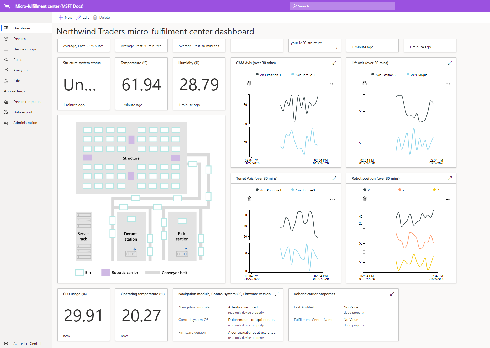

# Tutorial: Deploy and walk through a micro-fulfillment center application template

In this tutorial, you use the Azure IoT Central micro-fulfillment center application template to build a retail solution. You learn about how to deploy the template, what's includeded in it, and what you might want to do next.

## Prerequisites
To complete this tutorial series, you need an Azure subscription. You can optionally use a free 7-day trial. If you don't have an Azure subscription, you can create one on the [Azure sign-up page](https://aka.ms/createazuresubscription).

## Create an application 
In this section, you create a new Azure IoT Central application from a template. You'll use this application throughout the tutorial series to build a complete solution.

To create a new Azure IoT Central application:

1. Go to the [Azure IoT Central application manager](https://aka.ms/iotcentral) website.
1. If you have an Azure subscription, sign in with the credentials you use to access it. Otherwise, sign in by using a Microsoft account:

   

1. To start creating a new Azure IoT Central application, select **New Application**.

1. Select **Retail**.  The retail page displays several retail application templates.

To create a new micro-fulfillment center application that uses preview features:  
1. Select the **Micro-fulfillment center** application template. This template includes device templates for all devices used in the tutorial. The template also provides an operator dashboard for monitoring conditions within your fulfillment center, as well as the conditions for your robotic carriers. 

    
    
1. Optionally, choose a friendly **Application name**. The application template is based on the fictional company Northwind Traders. 

    >[!NOTE]
    >If you use a friendly application name, you still must use a unique value for the application URL.

1. If you have an Azure subscription, enter your directory, Azure subscription, and region. If you don't have a subscription, you can enable 7-day free trial, and complete the required contact information.  

    For more information about directories and subscriptions, see the [create an application quickstart](../preview/quick-deploy-iot-central.md).

1. Select **Create**.

    

## Walk through the application 

After successfully deploying the app template, you see the **Northwind Traders micro-fulfillment center dashboard**. Northwind Traders is a fictitious retailer that has a micro-fulfillment center being managed in this IoT Central application. On this operator dashboard, you see information and telemetry about the devices in this template, along with a set of commands, jobs, and actions that you can take. The dashboard is logically split into two sections. On the left, you can monitor the environmental conditions within the fulfillment structure, and on the right, you can monitor the health of a robotic carrier within the facility.  

From the dashboard, you can:
   * See device telemetry, such as the number of picks, the number of orders processed, and properties, such as the structure system status.  
   * View the floor plan and location of the robotic carriers within the fulfillment structure.
   * Trigger commands, such as resetting the control system, updating the carrier's firmware, and reconfiguring the network.

     
   * See an example of the dashboard that an operator can use to monitor conditions within the fulfillment center. 
   * Monitor the health of the payloads that are running on the gateway device within the fulfillment center.    

     

## Device template
If you select the device templates tab, you see that there are two different device types that are part of the template: 
   * **Robotic Carrier**: This device template represents the definition for a functioning robotic carrier that has been deployed in the fulfillment structure, and is performing appropriate storage and retrieval operations. If you select the template, you see that the robot is sending device data, such as temperature and axis position, and properties like the robotic carrier status. 
   * **Structure Condition Monitoring**: This device template represents a device collection that allows you to monitor environment condition, as well as the gateway device hosting various edge workloads to power your fulfillment center. The device sends telemetry data, such as the temperature, the number of picks, and the number of orders. It also sends information about the state and health of the compute workloads running in your environment. 

     

If you select the device groups tab, you also see that these device templates automatically have device groups created for them.

## Rules
On the **Rules** tab, you see a sample rule that exists in the application template to monitor the temperature conditions for the robotic carrier. You might use this rule to alert the operator if a specific robot in the facility is overheating, and needs to be taken offline for servicing. 

Use the sample rule as inspiration to define rules that are more appropriate for your business functions.

## Clean up resources

If you're not going to continue to use this application, delete the application template. Go to **Administration** > **Application settings**, and select **Delete**.

## Next steps
* Learn more about the [micro-fulfillment center solution architecture](./architecture-micro-fulfillment-center-pnp.md).
* Learn more about other [IoT Central retail templates](./overview-iot-central-retail-pnp.md).
* Read the [IoT Central overview](../preview/overview-iot-central.md).