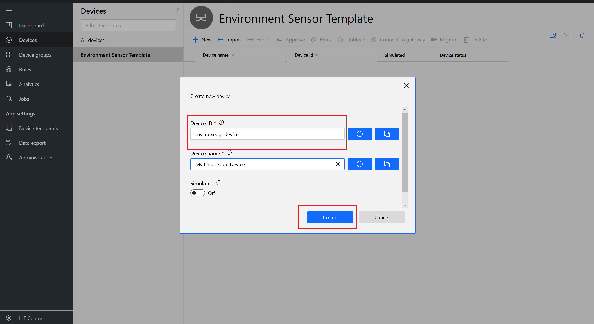
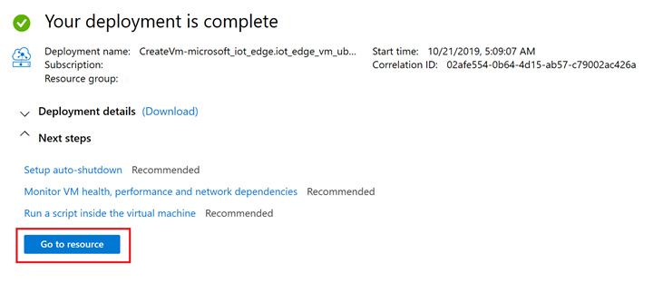
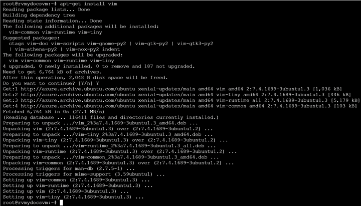
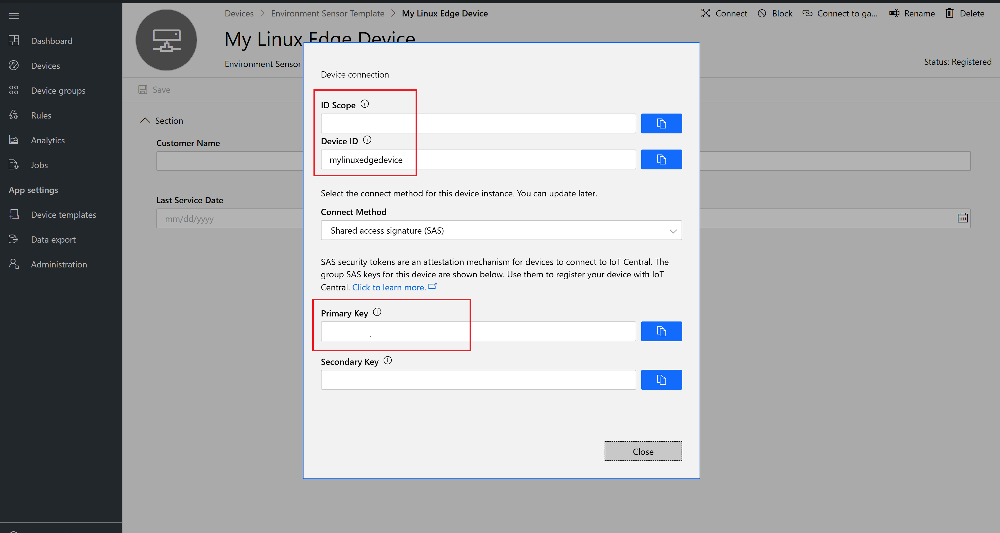

# Tutorial: Add a edge device to your Azure IoT Central application (preview features)

[!INCLUDE [iot-central-pnp-original](../../includes/iot-central-pnp-original-note.md)]

This tutorial shows you how to add and configure a *azure iot edge device* to your Microsoft Azure IoT Central application. In this tutorial, For this we chose an Azure IoT Edge enabled Linux VM from Azure Marketplace.

This tutorial is made up of two parts:

* First, as an operator, you learn how to do cloud first provisioning of an azure iot edge device.
* Then, you will learn how to do device first provisioning of an azure iot edge device.

In this tutorial, you learn how to:

> [!div class="checklist"]
> * Add a new edge device
> * Configure the edge device to help provision using SAS Key
> * View Dashboards, Module Health in IoT Central
> * Send commands to a module running on the edge device
> * Set properties on a module running on the edge device

## Enable Edge Enrollment Group
Enable SAS keys for Azure IoT Edge enrollment group from the Administration page.

## Cloud First Edge Device Provisioning	
In this section you will create a new Azure IoT Edge device using the **environment sensor template** and provision a device. 
Click on Devices on the left navigation and click on Environment Sensor Template. 

Click **+ New** and enter a device ID and name which suits you. 

Device goes into **Registered** mode.

## Deploy an Azure IoT Edge enabled Linux VM

>Note: You can choose to use any machine or device. OS: Linux or Windows)

For this tutorial we chose an Azure IoT enabled Linux VM which can be create on Azure. Click here to create a VM. You will be taken to [Azure marketplace](https://azuremarketplace.microsoft.com/en-us/marketplace/apps/microsoft_iot_edge.iot_edge_vm_ubuntu?tab=Overview)
 and click on **Get IT NOW** button. 

Click **Continue**

You will be taken to Azure Portal. Click **Create** button

Select Subscription, create a new resource group preferably, Select US West 2 for VM availability, enter User and password. Remember User, password will be required for future steps. Click **Review + Create**

Once validated click **Create**

Takes a few minutes to create the resources. Click on Go to **Resource**

### Provision VM as Edge Device 

Under Support + troubleshooting in the left navigation, click on Serial console

You will see a screen like below

Press enter and provide Username and password as prompted and press enter. 

To run a command as administrator/root run the command: **sudo su –**

Check edge runtime version. Current GA version is 1.0.8

Install vim editor or use nano if it’s your preference. 

Edit IoT Edge config.yaml file

Scroll down and comment out connection string portion of the yaml file. 

**Before**

**After** (Press Esc and Press lower case a, to start editing)

Uncomment Symmetric key portion of the yaml file. 

**Before**

**After**

Go to IoT Central and get scope id, device id and symmetric key of the edge device

Go To the Linux box and replace Scope ID, Registration ID with device Id and symmetric key

Press **Esc** and type **:wq!** and press **enter** to save your changes

Restart IoT Edge to process your changes and press **Enter**

Type: **iotedge list**, it will take few minutes, you will see 3 modules deployed

## IoT Central Device Explorer 

In IoT Central your device will move into provisioned state

Modules tab will show the status of the device and module on IoT Central 

Cloud properties will show up in a Form (this is from the device template you created in the previous steps). Enter values and click **Save**. 

Dashboard tile

## Next steps

In this tutorial, you learned how to:

* Add a new edge device
* Configure the edge device to help provision using SAS Key
* View Dashboards, Module Health in IoT Central
* Send commands to a module running on the edge device
* Set properties on a module running on the edge device
