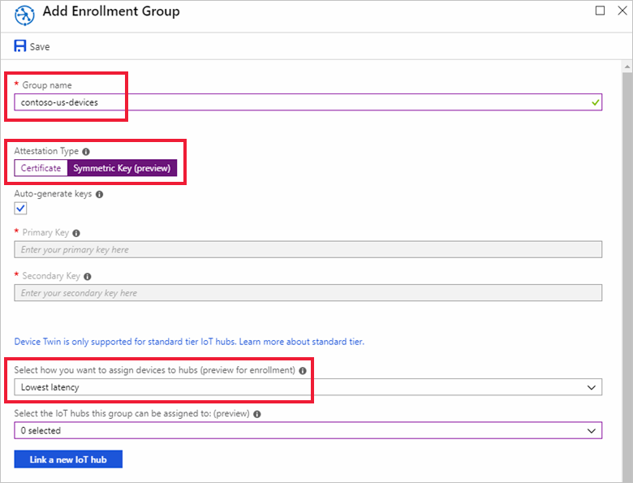
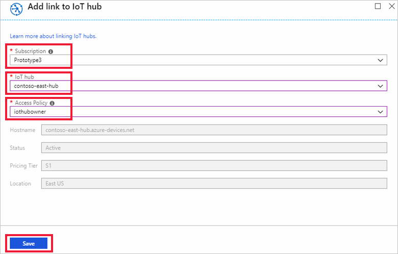
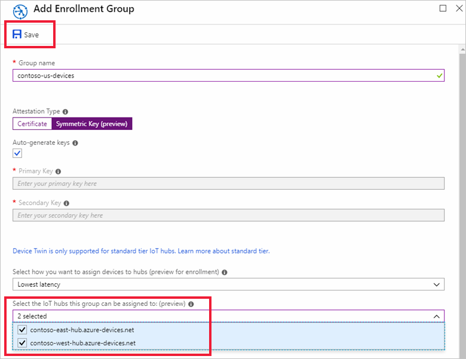

# How to provision for multitenancy 

This article demonstrates how to securely provision multiple symmetric key devices to a group of IoT Hubs using an [allocation policy](concepts-service.md#allocation-policy). Allocation policies defined by the provisioning service support a variety of allocation scenarios. Two common scenarios are:

* **Geolocation / GeoLatency**: As a device moves between locations, network latency is improved by having the device provisioned to the IoT hub closest to each location. In this scenario, a group of IoT hubs, which span across regions, are selected for enrollments. The **Lowest latency** allocation policy is selected for these enrollments. This policy causes the Device Provisioning Service to evaluate device latency and determine the closet IoT hub out of the group of IoT hubs. 

* **Multi-tenancy**: Devices used within an IoT solution may need to be assigned to a specific IoT hub or group of IoT hubs. The solution may require all devices for a particular tenant to communicate with a specific group of IoT hubs. In some cases, a tenant may own IoT hubs and require devices to be assigned to their IoT hubs.

It is common to combine these two scenarios. For example, a multitenant IoT solution will commonly assign tenant devices using a group of IoT hubs that are scattered across regions. These tenant devices can be assigned to the IoT hub in that group, which has the lowest latency based on geographic location.

This article uses a simulated device sample from the [Azure IoT C SDK](https://github.com/Azure/azure-iot-sdk-c) to demonstrate how to provision devices in a multitenant scenario across regions. You will perform the following steps in this article:

* Use the Azure CLI to create two regional IoT hubs (**West US** and **East US**)
* Create a multitenant enrollment
* Use the Azure CLI to create two regional Linux VMs to act as devices in the same regions (**West US** and **East US**)
* Set up the development environment for the Azure IoT C SDK on both Linux VMs
* Simulate the devices to see that they are provisioned for the same tenant in the closest region.


[!INCLUDE [quickstarts-free-trial-note](../../includes/quickstarts-free-trial-note.md)]


## Prerequisites

* Completion of the [Set up IoT Hub Device Provisioning Service with the Azure portal](./quick-setup-auto-provision.md) quickstart.


[!INCLUDE [cloud-shell-try-it.md](../../includes/cloud-shell-try-it.md)]


## Create two regional IoT hubs

In this section, you will use the Azure Cloud Shell to create two new regional IoT hubs in the **West US** and **East US** regions for a tenant.


1. Use the Azure Cloud Shell to create a resource group with the [az group create](/cli/azure/group#az-group-create) command. An Azure resource group is a logical container into which Azure resources are deployed and managed. 

    The following example creates a resource group named *contoso-us-resource-group* in the *eastus* region. It is recommended that you use this group for all resources created in this article. This will make clean up easier after you are finished.

    ```azurecli-interactive 
    az group create --name contoso-us-resource-group --location eastus
    ```

2. Use the Azure Cloud Shell to create an IoT hub in the **eastus** region with the [az iot hub create](/cli/azure/iot/hub#az-iot-hub-create) command. The IoT hub will be added to the *contoso-us-resource-group*.

    The following example creates an IoT hub named *contoso-east-hub* in the *eastus* location. You must use your own unique hub name instead of **contoso-east-hub**.

    ```azurecli-interactive 
    az iot hub create --name contoso-east-hub --resource-group contoso-us-resource-group --location eastus --sku S1
    ```
    
    This command may take a few minutes to complete.

3. Use the Azure Cloud Shell to create an IoT hub in the **westus** region with the [az iot hub create](/cli/azure/iot/hub#az-iot-hub-create) command. This IoT hub will also be added to the *contoso-us-resource-group*.

    The following example creates an IoT hub named *contoso-west-hub* in the *westus* location. You must use your own unique hub name instead of **contoso-west-hub**.

    ```azurecli-interactive 
    az iot hub create --name contoso-west-hub --resource-group contoso-us-resource-group --location westus --sku S1
    ```

    This command may take a few minutes to complete.


## Create the multitenant enrollment

In this section, you will create a new enrollment group for the tenant devices.  

For simplicity, this article uses [Symmetric key attestation](concepts-symmetric-key-attestation.md) with the enrollment. For a more secure solution, consider using [X.509 certificate attestation](concepts-security.md#x509-certificates) with a chain of trust.

1. Sign in to the [Azure portal](https://portal.azure.com), and open your Device Provisioning Service instance.

2. Select the **Manage enrollments** tab, and then click the **Add enrollment group** button at the top of the page. 

3. On **Add Enrollment Group**, enter the following information, and click the **Save** button.

    **Group name**: Enter **contoso-us-devices**.

    **Attestation Type**: Select **Symmetric Key**.

    **Auto Generate Keys**: This checkbox should already be checked.

    **Select how you want to assign devices to hubs**: Select **Lowest latency**.

    


4. On **Add Enrollment Group**, click **Link a new IoT hub** to link both of your regional hubs.

    **Subscription**: If you have multiple subscriptions, choose the subscription where you created the regional IoT hubs.

    **IoT hub**: Select one of the regional hubs you created.

    **Access Policy**: Choose **iothubowner**.

    


5. Once both regional IoT hubs have been linked, you must select them for the enrollment group and click **Save** to create the regional IoT hub group for the enrollment.

    


6. After saving the enrollment, reopen it and make a note of the **Primary Key**. You must save the enrollment first to have the keys generated. This key will be used to generate unique device keys for both simulated devices later.


## Create regional Linux VMs

In this section, you will create two regional Linux virtual machines (VMs). These VMs will run a device simulation sample from each region to demonstrate device provisioning for tenant devices from both regions.

To make clean-up easier, these VMs will be added to the same resource group that contains the IoT hubs that were created, *contoso-us-resource-group*. However, the VMs will run in separate regions (**West US** and **East US**).

1. In the Azure Cloud Shell, execute the following command to create an **East US** region VM after making the following parameter changes in the command:

    **--name**: Enter a unique name for your **East US** regional device VM. 

    **--admin-username**: Use your own admin user name.

    **--admin-password**: Use your own admin password.

    ```azurecli-interactive
    az vm create \
    --resource-group contoso-us-resource-group \
    --name ContosoSimDeviceEast \
    --location eastus \
    --image Canonical:UbuntuServer:18.04-LTS:18.04.201809110 \
    --admin-username contosoadmin \
    --admin-password myContosoPassword2018 \
    --authentication-type password
    ```

    This command will take a few minutes to complete. Once the command has completed, make a note of the **publicIpAddress** value for your East US region VM.

1. In the Azure Cloud Shell, execute the command to create a **West US** region VM after making the following parameter changes in the command:

    **--name**: Enter a unique name for your **West US** regional device VM. 

    **--admin-username**: Use your own admin user name.

    **--admin-password**: Use your own admin password.

    ```azurecli-interactive
    az vm create \
    --resource-group contoso-us-resource-group \
    --name ContosoSimDeviceWest \
    --location westus \
    --image Canonical:UbuntuServer:18.04-LTS:18.04.201809110 \
    --admin-username contosoadmin \
    --admin-password myContosoPassword2018 \
    --authentication-type password
    ```

    This command will take a few minutes to complete. Once the command has completed, make a note of the **publicIpAddress** value for your West US region VM.

1. Open two command-line shells. Connect to one of the regional VMs in each shell using SSH. 

    Pass your admin username, and the public IP address you noted for the VM as parameters to SSH. Enter the admin password when prompted.

    ```bash
    ssh contosoadmin@1.2.3.4

    contosoadmin@ContosoSimDeviceEast:~$
    ```

    ```bash
    ssh contosoadmin@5.6.7.8

    contosoadmin@ContosoSimDeviceWest:~$
    ```


## Prepare the Azure IoT C SDK development environment

In this section, you will clone the Azure IoT C SDK on each VM. The SDK contains a sample that will simulate a tenant's device provisioning from each region.

1. For each VM, install **CMake**, **g++**, **gcc**, and [Git](https://git-scm.com/book/en/v2/Getting-Started-Installing-Git) using the following commands:

    ```bash
    sudo apt-get update
    sudo apt-get install cmake build-essential libssl-dev libcurl4-openssl-dev uuid-dev git-all
    ```

1. Find the tag name for the [latest release](https://github.com/Azure/azure-iot-sdk-c/releases/latest) of the SDK.

1. Clone the [Azure IoT C SDK](https://github.com/Azure/azure-iot-sdk-c) on both VMs.  Use the tag you found in the previous step as the value for the `-b` parameter:

    ```bash
    git clone -b <release-tag> https://github.com/Azure/azure-iot-sdk-c.git
    cd azure-iot-sdk-c
    git submodule update --init
    ```

    You should expect this operation to take several minutes to complete.

1. For both VMs, create a new **cmake** folder inside the repository and change to that folder.

    ```bash
    mkdir ~/azure-iot-sdk-c/cmake
    cd ~/azure-iot-sdk-c/cmake
    ```

1. For both VMs, run the following command, which builds a version of the SDK specific to your development client platform. 

    ```bash
    cmake -Dhsm_type_symm_key:BOOL=ON -Duse_prov_client:BOOL=ON  ..
    ```

    Once the build succeeds, the last few output lines will look similar to the following output:

    ```bash
    -- IoT Client SDK Version = 1.2.9
    -- Provisioning client ON
    -- Provisioning SDK Version = 1.2.9
    -- target architecture: x86_64
    -- Checking for module 'libcurl'
    --   Found libcurl, version 7.58.0
    -- Found CURL: curl
    -- target architecture: x86_64
    -- target architecture: x86_64
    -- target architecture: x86_64
    -- target architecture: x86_64
    -- iothub architecture: x86_64
    -- target architecture: x86_64
    -- Configuring done
    -- Generating done
    -- Build files have been written to: /home/contosoadmin/azure-iot-sdk-c/cmake
    ```    


## Derive unique device keys

When using symmetric key attestation with group enrollments, you don't use the enrollment group keys directly. Instead you create a unique derived key for each device and mentioned in [Group Enrollments with symmetric keys](concepts-symmetric-key-attestation.md#group-enrollments).

To generate the device key, use the group master key to compute an [HMAC-SHA256](https://wikipedia.org/wiki/HMAC) of the unique registration ID for the device and convert the result into Base64 format.

Do not include your group master key in your device code.

Use the Bash shell example to create a derived device key for each device using **openssl**.

- Replace the value for **KEY** with the **Primary Key** you noted earlier for your enrollment.

- Replace the value for **REG_ID** with your own unique registration ID for each device. Use lowercase alphanumeric and dash ('-') characters to define both IDs.

Example device key generation for *contoso-simdevice-east*:

```bash
KEY=rLuyBPpIJ+hOre2SFIP9Ajvdty3j0EwSP/WvTVH9eZAw5HpDuEmf13nziHy5RRXmuTy84FCLpOnhhBPASSbHYg==
REG_ID=contoso-simdevice-east

keybytes=$(echo $KEY | base64 --decode | xxd -p -u -c 1000)
echo -n $REG_ID | openssl sha256 -mac HMAC -macopt hexkey:$keybytes -binary | base64
```

```bash
p3w2DQr9WqEGBLUSlFi1jPQ7UWQL4siAGy75HFTFbf8=
```

Example device key generation for *contoso-simdevice-west*:

```bash
KEY=rLuyBPpIJ+hOre2SFIP9Ajvdty3j0EwSP/WvTVH9eZAw5HpDuEmf13nziHy5RRXmuTy84FCLpOnhhBPASSbHYg==
REG_ID=contoso-simdevice-west

keybytes=$(echo $KEY | base64 --decode | xxd -p -u -c 1000)
echo -n $REG_ID | openssl sha256 -mac HMAC -macopt hexkey:$keybytes -binary | base64
```

```bash
J5n4NY2GiBYy7Mp4lDDa5CbEe6zDU/c62rhjCuFWxnc=
```


The tenant devices will each use their derived device key and unique registration ID to perform symmetric key attestation with the enrollment group during provisioning to the tenant IoT hubs.


## Simulate the devices from each region


In this section, you will update a provisioning sample in the Azure IoT C SDK for both of the regional VMs. 

The sample code simulates a device boot sequence that sends the provisioning request to your Device Provisioning Service instance. The boot sequence will cause the device to be recognized and assigned to the IoT hub that is closest based on latency.

1. In the Azure portal, select the **Overview** tab for your Device Provisioning service and note down the **_ID Scope_** value.

     

1. Open **~/azure-iot-sdk-c/provisioning\_client/samples/prov\_dev\_client\_sample/prov\_dev\_client\_sample.c** for editing on both VMs.

    ```bash
    vi ~/azure-iot-sdk-c/provisioning_client/samples/prov_dev_client_sample/prov_dev_client_sample.c
    ```

1. Find the `id_scope` constant, and replace the value with your **ID Scope** value that you copied earlier. 

    ```c
    static const char* id_scope = "0ne00002193";
    ```

1. Find the definition for the `main()` function in the same file. Make sure the `hsm_type` variable is set to `SECURE_DEVICE_TYPE_SYMMETRIC_KEY` as shown below to match the enrollment group attestation method. 

    Save your changes to the files on both VMs.

    ```c
    SECURE_DEVICE_TYPE hsm_type;
    //hsm_type = SECURE_DEVICE_TYPE_TPM;
    //hsm_type = SECURE_DEVICE_TYPE_X509;
    hsm_type = SECURE_DEVICE_TYPE_SYMMETRIC_KEY;
    ```

1. On both VMs, find the call to `prov_dev_set_symmetric_key_info()` in **prov\_dev\_client\_sample.c** which is commented out.

    ```c
    // Set the symmetric key if using they auth type
    //prov_dev_set_symmetric_key_info("<symm_registration_id>", "<symmetric_Key>");
    ```

    Uncomment the function calls, and replace the placeholder values (including the angle brackets) with the unique registration IDs and derived device keys for each device. The keys shown below are for example purposes only. Use the keys you generated earlier.

    East US:
    ```c
    // Set the symmetric key if using they auth type
    prov_dev_set_symmetric_key_info("contoso-simdevice-east", "p3w2DQr9WqEGBLUSlFi1jPQ7UWQL4siAGy75HFTFbf8=");
    ```

    West US:
    ```c
    // Set the symmetric key if using they auth type
    prov_dev_set_symmetric_key_info("contoso-simdevice-west", "J5n4NY2GiBYy7Mp4lDDa5CbEe6zDU/c62rhjCuFWxnc=");
    ```

    Save the files.

1. On both VMs, navigate to the sample folder shown below, and build the sample.

    ```bash
    cd ~/azure-iot-sdk-c/cmake/provisioning_client/samples/prov_dev_client_sample/
    cmake --build . --target prov_dev_client_sample --config Debug
    ```

1. Once the build succeeds, run **prov\_dev\_client\_sample.exe** on both VMs to simulate a tenant device from each region. Notice that each device is allocated to the tenant IoT hub closest to the simulated device's regions.

    Run the simulation:
    ```bash
    ~/azure-iot-sdk-c/cmake/provisioning_client/samples/prov_dev_client_sample/prov_dev_client_sample
    ```

    Example output from the East US VM:

    ```bash
    contosoadmin@ContosoSimDeviceEast:~/azure-iot-sdk-c/cmake/provisioning_client/samples/prov_dev_client_sample$ ./prov_dev_client_sample
    Provisioning API Version: 1.2.9

    Registering Device

    Provisioning Status: PROV_DEVICE_REG_STATUS_CONNECTED
    Provisioning Status: PROV_DEVICE_REG_STATUS_ASSIGNING
    Provisioning Status: PROV_DEVICE_REG_STATUS_ASSIGNING

    Registration Information received from service: contoso-east-hub.azure-devices.net, deviceId: contoso-simdevice-east
    Press enter key to exit:

    ```

    Example output from the West US VM:
    ```bash
    contosoadmin@ContosoSimDeviceWest:~/azure-iot-sdk-c/cmake/provisioning_client/samples/prov_dev_client_sample$ ./prov_dev_client_sample
    Provisioning API Version: 1.2.9

    Registering Device

    Provisioning Status: PROV_DEVICE_REG_STATUS_CONNECTED
    Provisioning Status: PROV_DEVICE_REG_STATUS_ASSIGNING
    Provisioning Status: PROV_DEVICE_REG_STATUS_ASSIGNING

    Registration Information received from service: contoso-west-hub.azure-devices.net, deviceId: contoso-simdevice-west
    Press enter key to exit:
    ```


## Clean up resources

If you plan to continue working with resources created in this article, you can leave them. If you do not plan to continue using the resource, use the following steps to delete all resources created by this article to avoid unnecessary charges.

The steps here assume you created all resources in this article as instructed in the same resource group named **contoso-us-resource-group**.

> [!IMPORTANT]
> Deleting a resource group is irreversible. The resource group and all the resources contained in it are permanently deleted. Make sure that you do not accidentally delete the wrong resource group or resources. If you created the IoT Hub inside an existing resource group that contains resources you want to keep, only delete the IoT Hub resource itself instead of deleting the resource group.
>

To delete the resource group by name:

1. Sign in to the [Azure portal](https://portal.azure.com) and click **Resource groups**.

2. In the **Filter by name...** textbox, type the name of the resource group containing your resources, **contoso-us-resource-group**. 

3. To the right of your resource group in the result list, click **...** then **Delete resource group**.

4. You will be asked to confirm the deletion of the resource group. Type the name of your resource group again to confirm, and then click **Delete**. After a few moments, the resource group and all of its contained resources are deleted.

## Next steps

- To learn more Reprovisioning, see [IoT Hub Device reprovisioning concepts](concepts-device-reprovision.md) 
- To learn more Deprovisioning, see [How to deprovision devices that were previously auto-provisioned](how-to-unprovision-devices.md) 


