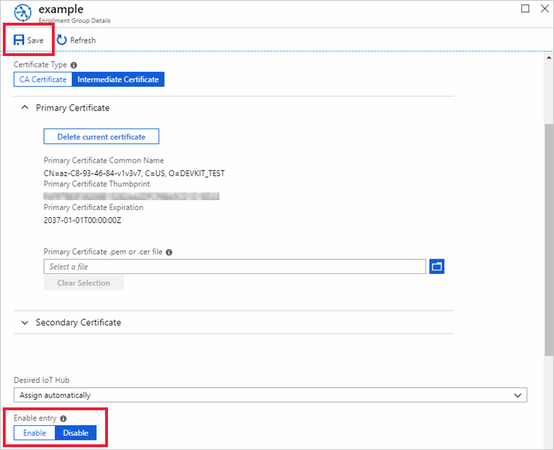
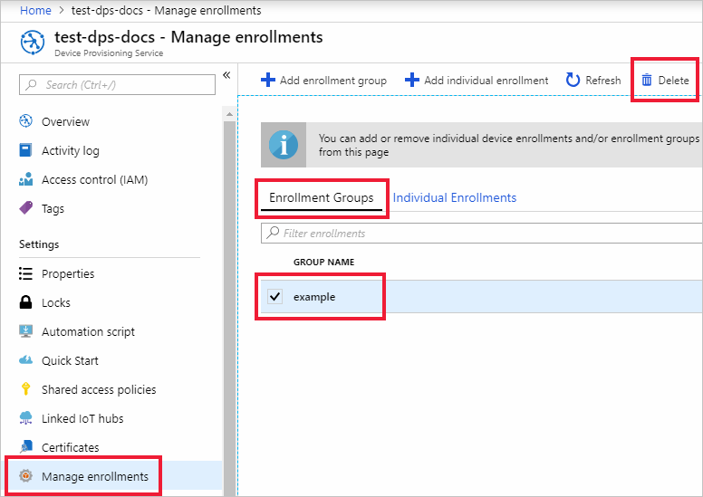

# How to revoke device access to your provisioning service in the Azure Portal

Proper management of device credentials is crucial for high-profile systems like IoT solutions. A best practice for such systems is to have a clear plan of how to revoke access for devices in cases where their credentials, whether a SAS token or an X.509 certificate, may be compromised. This article describes how to revoke device access at the provisioning step.

To learn about revoking device access to an IoT hub after the device has been provisioned. see [Disable Devices](https://docs.microsoft.com/en-us/azure/iot-hub/iot-hub-devguide-identity-registry#disable-devices).

> [!NOTE] 
> Be aware of the retry policy of devices that you revoke access for. For example, a device with an infinite retry policy may continuously try to register with the provisioning service, consuming service resources and possibly impacting performance.

## Blacklist devices with an individual enrollment entry

Individual enrollments apply to a single device and may use either X.509 certificates or SAS tokens (in a real or virtual TPM) as the attestation mechanism. (Devices that use SAS tokens as their attestation mechanism can only be provisioned through an individual enrollment.) To blacklist a device that has an individual enrollment, you can either disable or delete its enrollment entry: 

- To temporarily blacklist the device, you can disable its enrollment entry. 

    1. Log in to the Azure portal and click **All resources** from the left-hand menu.
    2. Click the provisioning service you want to blacklist your device from in the list of resources.
    3. In your provisioning service, click **Manage enrollments**, then select **Individual Enrollments** tab.
    4. Click the enrollment entry for the device you want to blacklist to open it. 
    5. Click **Disable** at the bottom of the enrollment list entry, then click **Save**.  

        
    
- To permanently blacklist the device, you can delete its enrollment entry.

    1. Log in to the Azure portal and click **All resources** from the left-hand menu.
    2. Click the provisioning service you want to blacklist your device from in the list of resources.
    3. In your provisioning service, click **Manage enrollments**, then select **Individual Enrollments** tab.
    4. Check the box next to the enrollment entry for the device you want to blacklist. 
    5. Click **Delete** at the top of the window, then click **Yes** to confirm that you want to remove the enrollment. 

        
    
    6. Once the action is completed, you will see your entry removed from the list of individual enrollments.  

## Blacklist an X.509 intermediate or root CA certificate using an enrollment group

X.509 certificates are typically arranged in a certificate chain of trust. If a certificate at any stage in a chain becomes compromised, trust is broken, and the certificate must be blacklisted to prevent devices down stream in any chain that contains that certificate from being provisioned by the Device Provisioning Service. To learn more about X.509 certificates and how they are used with the provisioning service, see [X.509 certificates](./concepts-security.md#x509-certificates). 

An enrollment group is an entry for devices that share a common attestation mechanism of X.509 certificates signed by the same intermediate or root CA. The enrollment group entry is configured with the X.509 certificate associated with the intermediate or root CA, as well as any configuration values, such as twin state and IoT hub connection, that are shared by devices with that certificate in their certificate chain. To blacklist the certificate, you can either disable or delete its enrollment group:

- To temporarily blacklist the certificate, you can disable its enrollment group. 

    1. Log in to the Azure portal and click **All resources** from the left-hand menu.
    2. Click the provisioning service you want to blacklist the signing certificate from in the list of resources.
    3. In your provisioning service, click **Manage enrollments**, then select **Enrollment Groups** tab.
    4. Click the enrollment group for the certificate you want to blacklist to open it.
    5. Click **Edit group** at the top-left of the enrollment group entry.
    6. To disable the enrollment entry, select **Disable** on the **Enable entry** switch, then click **Save**.  

        

    
- To permanently blacklist the certificate, you can delete its enrollment group.

    1. Log in to the Azure portal and click **All resources** from the left-hand menu.
    2. Click the provisioning service you want to blacklist your device from in the list of resources.
    3. In your provisioning service, click **Manage enrollments**, then select **Enrollment Groups** tab.
    4. Check the box next to the enrollment group for the certificate you want to blacklist. 
    5. Click **Delete** at the top of the window, then click **Yes** to confirm that you want to remove the enrollment group. 

        

    6. Once the action is completed, you will see your entry removed from the list of enrollment groups.  

> [!NOTE]
> If you delete an enrollment group for a certificate, devices that have that certificate in their certificate chain may still be able to enroll if an enabled enrollment group for the root certificate or another intermediate certificate higher up in their certificate chain exists.

## Blacklist specific devices in an enrollment group

Devices that implement the X.509 attestation mechanism use the device's certificate chain and private key to authenticate. When a device connects and authenticates with the Device Provisioning Service, the service first looks for an individual enrollment matching the device's credentials before searching enrollment groups to determine whether the device can be provisioned. If the service finds a disabled individual enrollment for the device, it prevents the device from connecting, even if an enabled enrollment group for an intermediate or root CA in the device's certificate chain exists. To blacklist an individual device in an enrollment group, follow these steps:

1. Log in to the Azure portal and click **All resources** from the left hand menu.
2. From the list of resources, click the provisioning service that contains the enrollment group for the device you want to blacklist.
3. In your provisioning service, click **Manage enrollments**, then select **Individual Enrollments** tab.
4. Click the **Add** button at the top. 
5. Select **X.509** as the security mechanism for the device and upload the device certificate. This is the signed end-entity certificate installed on the device, which it uses to generate certificates for authentication.
6. Enter the **IoT Hub device ID** for the device. 
7. To disable the enrollment entry, select **Disable** on the **Enable entry** switch. 
8. Click **Save**. On successful creation of your enrollment, you should see your device appear under the **Individual Enrollments** tab. 

    

