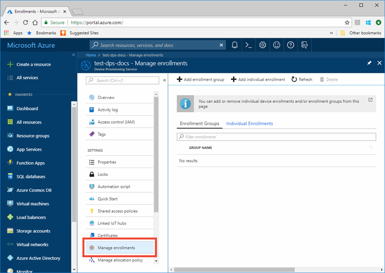
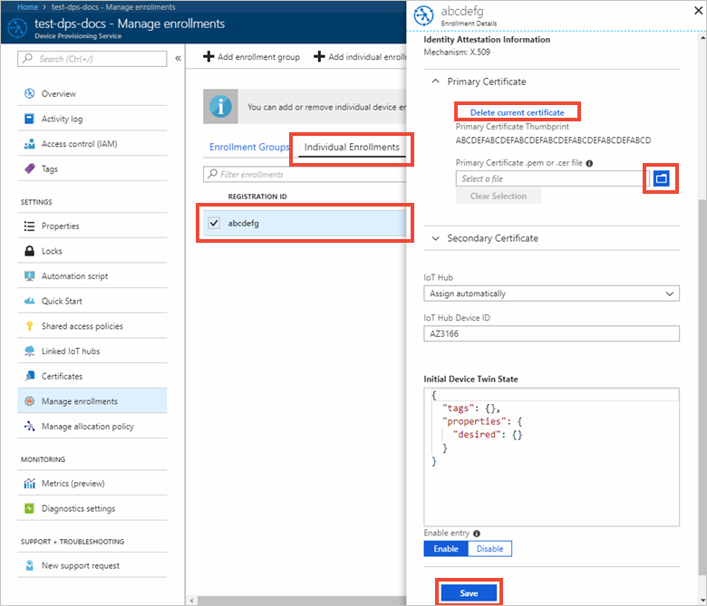
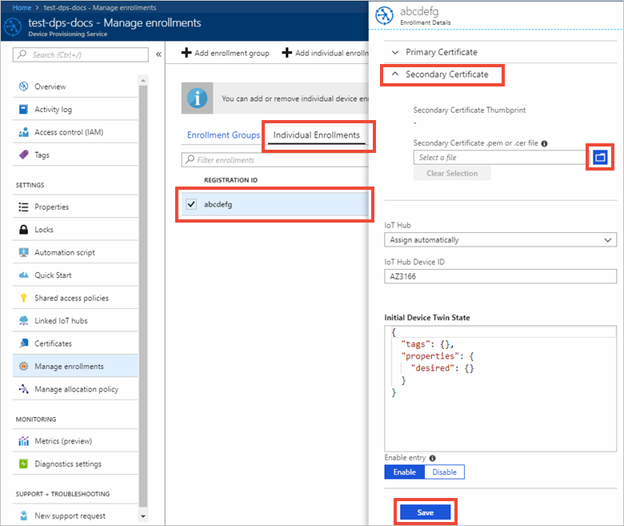
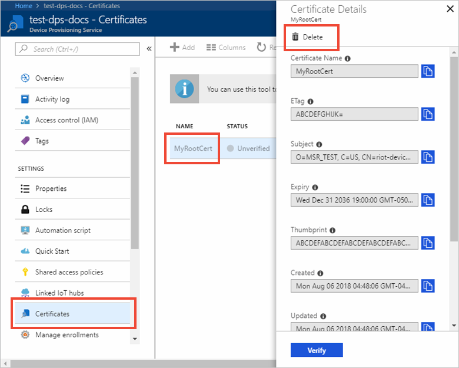
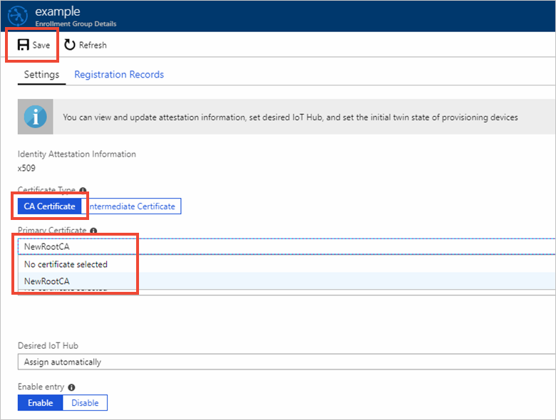
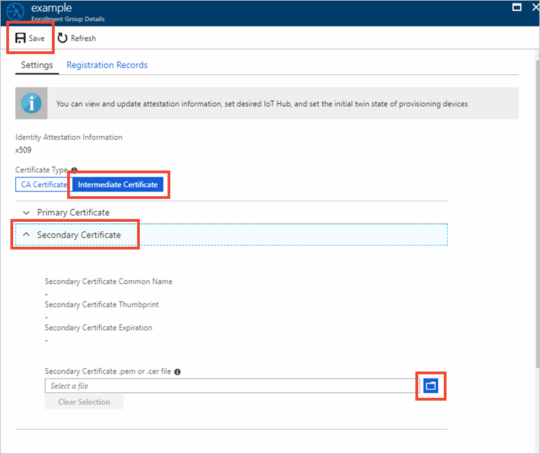

# How to roll X.509 device certificates

During the lifecycle of your IoT solution, you will need to roll certificates. Two of the main reasons for rolling certificates would be to address a security breach, and to address certificate expirations. 

Rolling certificates is a security best practice to help secure your system in case of a breach. As part of [Assume Breach Methodology](http://download.microsoft.com/download/C/1/9/C1990DBA-502F-4C2A-848D-392B93D9B9C3/Microsoft_Enterprise_Cloud_Red_Teaming.pdf), Microsoft advocates the need for having reactive security processes in place in addition to preventative measures. Rolling your device certificates should be included as part of these reactive security processes. The frequency in which you roll your certificates will depend on the security needs of your solution. Customers with solutions involving highly sensitive data may roll certificate daily, while others roll their certificates every couple years.

Rolling device certificates will involve updating the certificate stored on the device and the IoT hub. Afterwards, the device can reprovision itself with the IoT hub using normal [auto-provisioning](concepts-auto-provisioning.md) with the Device Provisioning Service.

## Rolling the certificate on the device

Certificates on a device should always be stored in a safe place like a [hardware security module (HSM)](concepts-device.md#hardware-security-module). The way you roll device certificates will depend on how they were created and installed in the devices in the first place. If you got your certificates from a third party, you must look into how they roll their certificates. The process may be included in your arrangement with them, or it may be a separate service they offer. If you are managing your own device certificates, you will have to build your own pipeline for updating certificates. Make sure both old and new leaf certificates have the same common name (CN). By having the same CN, the device can reprovision itself without creating a duplicate registration record.

## Rolling the certificate in the IoT hub

The device certificate can be manually added to an IoT hub. The certificate can also be automated using a Device Provisioning Service instance. In this article, we will assume a provisioning service instance is being used to support auto-provisioning.

When a device is initially provisioned through auto-provisioning, it boots-up, and contacts the provisioning service. The provisioning service responds by performing an identity check before creating a device identity in an IoT hub using the device’s [leaf certificate](concepts-security.md#end-entity-leaf-certificate) as the credential. The provisioning service then tells the device which IoT hub it is assigned to, and the device then uses its leaf certificate to authenticate and connect to the IoT hub. 

Once a new leaf certificate has been rolled to the device, it will no longer be able to connect to the IoT hub because it’s attempting to use a new certificate to connect and the IoT hub only recognizes the device with the old certificate. The result of the device's connection attempt will be an "unauthorized" connection error. To resolve this, you must update the enrollment entry for the device to account for the device's new leaf certificate. Then the provisioning service can update the IoT Hub device registry information as needed when the device is reprovisioned. 

One possible exception to this connection failure would be a scenario where you have created an [Enrollment Group](concepts-service.md#enrollment-group) for your device in the provisioning service. In this case, if you are not rolling the root or intermediate certificates in the device's certificate chain of trust, then the device will be recognized if the new certificate is part of the chain of trust defined in the enrollment group. If this scenario arises as a reaction to a security breach, you should at least blacklist the specific device certificates in the group that are considered to be breached. For more information, see [Blacklist specific devices in an enrollment group](https://docs.microsoft.com/en-us/azure/iot-dps/how-to-revoke-device-access-portal#blacklist-specific-devices-in-an-enrollment-group).

Updating enrollment entries for rolled certificates is accomplished on the **Manage enrollments** page. To access that page, follow these steps:

1. Sign in to the [Azure portal](https://portal.azure.com) and navigate to the IoT Hub Device Provisioning Service instance that contains the enrollment entry for your device.

2. Click **Manage enrollments**.

   

How you handle updating the enrollment entry will depend on whether you are using individual enrollments, or group enrollments. Also the recommended procedures differ depending on whether you are rolling certificates because of a security breach, or certificate expirations. The following sections describe how to handle these updates.

## Updating individual enrollments for security breaches

If you are rolling certificates in response to a security breach, you should use the following approach that deletes the current certificate immediately:

1. Click **Individual Enrollments**, and click the registration ID entry in the list. 

2. Click the **Delete current certificate** button and then, click the folder icon to select the new certificate to be uploaded for the enrollment entry. This should be performed for both the primary and secondary certificate, if both are compromised. Click **Save** when finished.

   

3. Once the compromised certificate has been removed from the provisioning service, navigate to your IoT hub and remove the device registration associated with the compromised certificate.     

    

## Updating individual enrollments for certificate expirations

If you are rolling certificates to handle certificate expirations, you should use the secondary certificate configuration as follows to ensure no downtime for devices attempting to provision:

1. Click **Individual Enrollments**, and click the registration ID entry in the list. 

2. Click **Secondary Certificate** and then, click the folder icon to select the new certificate to be uploaded for the enrollment entry. Click **Save**.

   

3. Later when the primary certificate has actually expired, come back and delete that primary certificate. 

When the secondary certificate nears expiration, and needs to be rolled, you can rotate to use the primary configuration. Rotating the primary and secondary certificates in this way ensures no downtime for devices attempting to provision. 

## Updating enrollment groups for security breaches

To update a group enrollment in response to a security breach, you should use one of the following approaches that will delete the current root CA, or intermediate certificate immediately.

#### Updating compromised root CA certificates

1. Click the **Certificates** tab for your provisioning service instance.

2. Click the compromised certificate in the list, and then click the **Delete** button. Confirm the delete by entering the certificate name and click **OK**. Repeat this process for all compromised certificates.

    

3. Click the **Add** button. Enter a name for your new certificate and click the folder icon to locate and upload the certificate file. Then click **Save**.

    

4. Click the **Manage enrollments** tab and the **Enrollment Groups** list. Click your enrollment group name in the list.

5. Click **CA Certificate**, and select your new root CA certificate. Then click **Save**. 

    

6. Once the compromised certificate has been removed from the provisioning service, navigate to the linked IoT hub that contains  the compromised device registrations and remove the registrations associated with the compromised certificate.

    

#### Updating compromised intermediate certificates

1. Click **Enrollment Groups**, and then click the group name in the list. 

2. Click **Intermediate Certificate**, and **Delete current certificate**. Click the folder icon to navigate to the new intermediate certificate to be uploaded for the enrollment group. This should be performed for both the primary and secondary certificate, if both are compromised. Click **Save** when you are finished.

   

3. Once the compromised certificate has been removed from the provisioning service, navigate to the linked IoT hub that contains  the device registration and remove the registration associated with the compromised certificate.

    

## Updating enrollment groups for certificate expirations

If you are rolling certificates to handle certificate expirations, you should use the secondary certificate configuration as follows to ensure no downtime for devices attempting to provision.

Later when the secondary certificate also nears expiration, and needs to be rolled, you can rotate to using the primary configuration. Rotating between the primary and secondary certificates in this way ensures no downtime for devices attempting to provision. 

#### Updating expiring root CA certificates

1. Click the **Certificates** tab for your provisioning service instance.

2. Click the **Add** button. Enter a name for your new certificate and click the folder icon to locate and upload the certificate file. Then click **Save**.

    

3. Click **CA Certificate**, and select your new root CA certificate. Then click **Save**. 

    

#### Updating expiring intermediate certificates

1. Click **Enrollment Groups**, and click the group name in the list. 

2. Click **Secondary Certificate** and then, click the folder icon to select the new certificate to be uploaded for the enrollment entry. Click **Save**.

   

## Device reprovisioning

Once the certificate is rolled on both the device, and the Device Provisioning Service, the device can reprovision itself by contacting the Device Provisioning Service. 

One easy way of programming devices to reprovision is to program the device to contact the provisioning service to go through the provisioning flow if the device receives an “unauthorized” error from attempting to connect to the IoT hub.

Another way is for both the old and the new certificates to be valid for a short overlap, and use the IoT hub to send a command to devices to have them re-register via the provisioning service to update their IoT Hub connection information. Because each device can process commands differently, you will have to program your device to know what to do when the command is invoked. There are several ways you can command your device via IoT Hub, and we recommend using [direct methods](../iot-hub/iot-hub-devguide-direct-methods.md) or [jobs](../iot-hub/iot-hub-devguide-jobs.md) to initiate the process.

Once reprovisioning is complete, devices will be able to connect to IoT Hub using their new certificates.

## Blacklisting certificates

To blacklist a device certificate, simply disable the enrollment entry for the target device/certificate. For more information, see blacklisting devices in the [Manage disenrollment](how-to-revoke-device-access-portal.md) article.

Once a certificate is included as part of a disabled enrollment entry, any attempts to register with an IoT hub using that certificates will fail even if it is part of another enabled enrollment entry.
 

## Next steps

- To learn more about X.509 certificates in the Device Provisioning Service, see [Security](concepts-security.md) 
- To learn about how to do proof-of-possession for X.509 CA certificates with the Azure IoT Hub Device Provisioning Service, see [How to verify certificates](how-to-verify-certificates.md)
- To learn about how to use the portal to create an enrollment group, see [Managing device enrollments with Azure portal](how-to-manage-enrollments.md).

