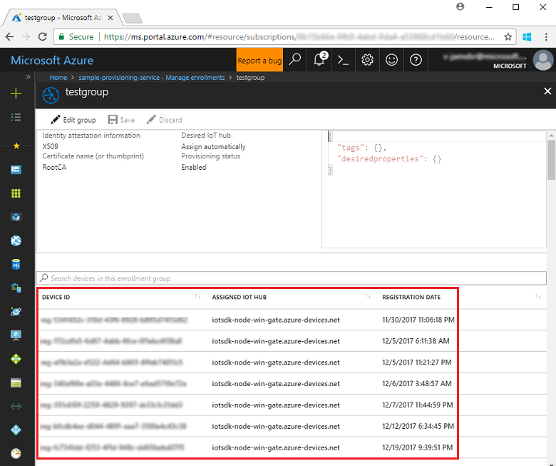

# How to do proof-of-possession on X.509 CA certificates with your provisioning service

With enrollment groups, you can enroll multiple devices that share the same X.509 root or intermediate CA certificate in their certificate chain through a single enrollment entry. You can create an enrollment group for any X.509 CA certificate whose public part has been previously uploaded and verified with your provisioning service. The process of verifying the certificate is called proof-of-possession. It involves creating an X.509 certificate with a unique verification code obtained from the service as its subject and signing the certificate with the private key associated with the CA certificate to be verified. You then upload this signed verification certificate to the service which validates it using the public portion of the CA certificate to be verified, thus proving that you are in possession of the CA certificate's private key. 

 

A root (intermediate root) CA will be generated.
The Portal will be used to upload the public part of the X509 certificate
The private part of the X509 will be used to sign a leaf certificate with a name specified by the service. This is required to ensure that the user owns the private key. The public part of this leaf certificate will be uploaded to the service.
Service SDK will be used to create a Group Enrollment that allows devices to authenticate with X.509 certs issued by the root CA. The Group allows the user to set policies and specify where devices having these certificates get provisioned and is bound to the CA certificate.
## Individual enrollments
Devices that use TPM attestation or X.509 attestation with a leaf certificate are provisioned through an individual enrollment entry. 

To unprovision a device that has an individual enrollment: 
1. For devices that use TPM attestation, delete the individual enrollment entry to permanently revoke the device's access to the provisioning service or disable the entry to temporarily revoke its access. For devices that use X.509 attestation, you can either delete or disable the entry. Be aware, though, that if you delete an individual enrollment for a device that uses X.509 attestation and an enabled enrollment group exists for a signing certificate in that device's certificate chain, the device can re-enroll. For such devices, it may be safer to disable the enrollment entry. Doing so prevents the device from re-enrolling, regardless of whether an enabled enrollment group exists for one of its signing certificates.
2. Disable or delete the device in the identity registry of the IoT hub that it was provisioned to. 

## Enrollment groups
With X.509 attestation, devices can also be provisioned through an enrollment group. Enrollment groups are configured with a signing certificate, either an intermediate or root CA certificate, and control access to the provisioning service for devices with that certificate in their certificate chain. To learn more about enrollment groups and X.509 certificates with the provisioning service, see [X.509 certificates](concepts-security.md#x509-certificates). 

To see a list of devices that have been provisioned through an enrollment group, you can view the enrollment group's details. This is an easy way to understand which IoT hub each device has been provisioned to. To view the device list: 

1. Log in to the Azure portal and click **All resources** on the left-hand menu.
2. Click your provisioning service in the list of resources.
3. In your provisioning service, click **Manage enrollments**, then select **Enrollment Groups** tab.
4. Click the enrollment group to open it.

   

With enrollment groups, there are two scenarios to consider:

- To unprovision all of the devices that have been provisioned through an enrollment group:
  1. Disable the enrollment group to blacklist its signing certificate. 
  2. Use the list of provisioned devices for that enrollment group to disable or delete each device from the identity registry of its respective IoT hub. 
  3. After disabling or deleting all devices from their respective IoT hubs, you can optionally delete the enrollment group. Be aware, though, that, if you delete the enrollment group and there is an enabled enrollment group for a signing certificate higher up in the certificate chain of one or more of the devices, those devices can re-enroll. 
- To unprovision a single device from an enrollment group:
  1. Create a disabled individual enrollment for its leaf (device) certificate. This revokes access to the provisioning service for that device while still permitting access for other devices that have the enrollment group's signing certificate in their chain. Do not delete the disabled individual enrollment for the device. Doing so will allow the device to re-enroll through the enrollment group. 
  2. Use the list of provisioned devices for that enrollment group to find the IoT hub that the device was provisioned to and disable or delete it from that hub's identity registry. 
  
  

