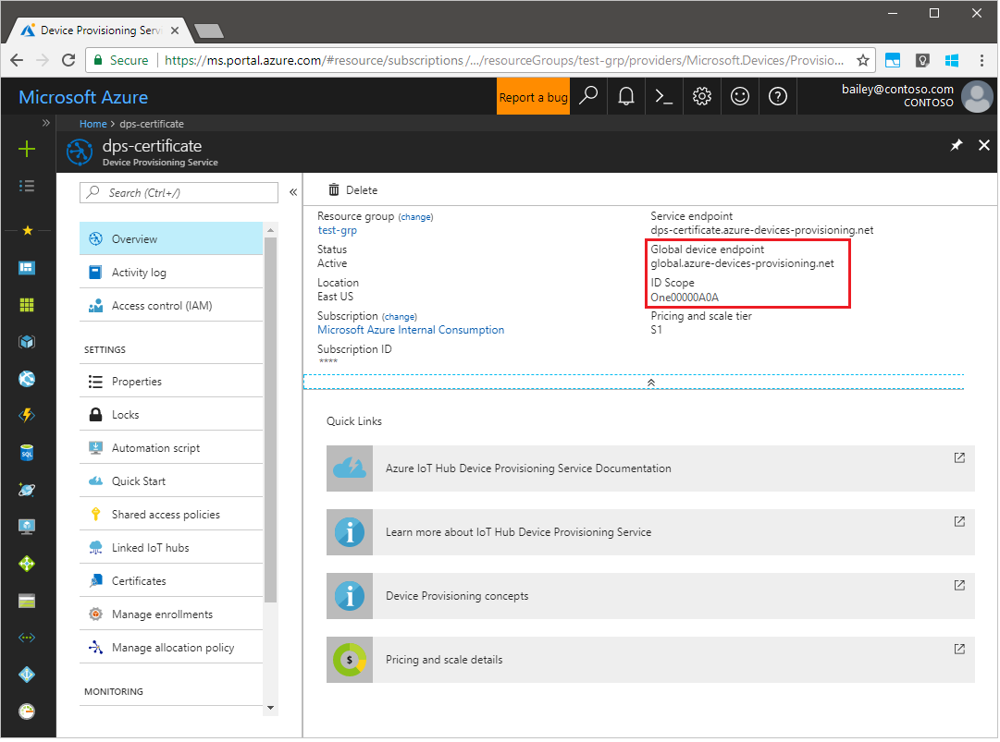
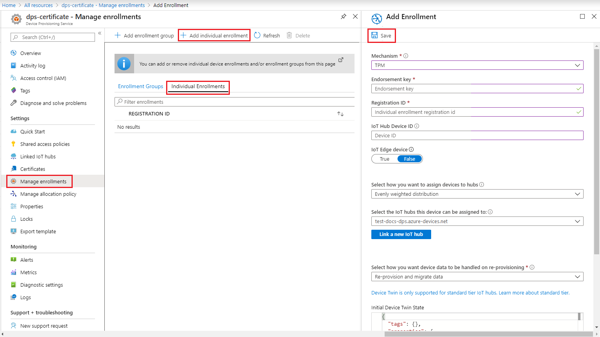

# Quickstart: Create and provision a simulated TPM device using Java device SDK for Azure IoT Hub Device Provisioning Service

[!INCLUDE [iot-dps-selector-quick-create-simulated-device-tpm](../../includes/iot-dps-selector-quick-create-simulated-device-tpm.md)]

In this quickstart, you create a simulated device on a Windows computer, run the Windows TPM simulator as the Hardware Security Module (HSM) of the device, and use a code sample to connect this simulated device with the Device Provisioning Service and your IoT hub.

## Prerequisites

- Review of [Auto-provisioning concepts](concepts-auto-provisioning.md).
- Completion of [Set up IoT Hub Device Provisioning Service with the Azure portal](./quick-setup-auto-provision.md).
- An Azure account with an active subscription. [Create one for free](https://azure.microsoft.com/free/?ref=microsoft.com&utm_source=microsoft.com&utm_medium=docs&utm_campaign=visualstudio).
- [Java SE Development Kit 8](https://aka.ms/azure-jdks).
- [Maven](https://maven.apache.org/install.html).
- [Latest version of git tools](https://git-scm.com/download/).

[!INCLUDE [IoT Device Provisioning Service basic](../../includes/iot-dps-basic.md)]

## Prepare the environment 

1. Make sure you have [Java SE Development Kit 8](https://aka.ms/azure-jdks) installed on your machine.

1. Download and install [Maven](https://maven.apache.org/install.html).

1. Make sure `git` is installed on your machine and is added to the environment variables accessible to the command window. See [Software Freedom Conservancy's Git client tools](https://git-scm.com/download/) for the latest version of `git` tools to install, which includes the **Git Bash**, the command-line app that you can use to interact with your local Git repository. 

1. Open a command prompt. Clone the GitHub repo for device simulation code sample.
    
    ```cmd/sh
    git clone https://github.com/Azure/azure-iot-sdk-java.git --recursive
    ```

1. Run the [TPM](https://docs.microsoft.com/windows/device-security/tpm/trusted-platform-module-overview) simulator. Click **Allow access** to allow changes to _Windows Firewall_ settings. It listens over a socket on ports 2321 and 2322. Do not close this window; you need to keep this simulator running until the end of this quickstart guide. 

    ```cmd/sh
    .\azure-iot-sdk-java\provisioning\provisioning-tools\tpm-simulator\Simulator.exe
    ```

    

1. In a separate command prompt, navigate to the root folder and build the sample dependencies.

    ```cmd/sh
    cd azure-iot-sdk-java
    mvn install -DskipTests=true
    ```

1. Navigate to the sample folder.

    ```cmd/sh
    cd provisioning/provisioning-samples/provisioning-tpm-sample
    ```

1. Sign in to the Azure portal, select the **All resources** button on the left-hand menu and open your Device Provisioning service. Note your _ID Scope_ and _Provisioning Service Global Endpoint_.

    

1. Edit `src/main/java/samples/com/microsoft/azure/sdk/iot/ProvisioningTpmSample.java` to include your _ID Scope_ and _Provisioning Service Global Endpoint_ as noted before.  

    ```java
    private static final String idScope = "[Your ID scope here]";
    private static final String globalEndpoint = "[Your Provisioning Service Global Endpoint here]";
    private static final ProvisioningDeviceClientTransportProtocol PROVISIONING_DEVICE_CLIENT_TRANSPORT_PROTOCOL = ProvisioningDeviceClientTransportProtocol.HTTPS;
    ```
    Save the file.

1. Use the following commands to build the project, navigate to the target folder, and execute the created .jar file. Replace the `version` placeholder with your version of Java.

    ```cmd/sh
    mvn clean install
    cd target
    java -jar ./provisioning-tpm-sample-{version}-with-deps.jar
    ```

1. The program begins running. Note the _Endorsement key_ and _Registration ID_ for the next section and leave the program running.

    
    

## Create a device enrollment entry

The Azure IoT Device Provisioning Service supports two types of enrollments:

- [Enrollment groups](concepts-service.md#enrollment-group): Used to enroll multiple related devices.
- [Individual Enrollments](concepts-service.md#individual-enrollment): Used to enroll a single device.

This article demonstrates individual enrollments.

1. Sign in to the Azure portal, select the **All resources** button on the left-hand menu and open your Device Provisioning service.

1. From the Device Provisioning Service menu, select **Manage enrollments**. Select **Individual Enrollments** tab and select the **Add individual enrollment** button at the top. 

1. In the **Add Enrollment** panel, enter the following information:
   - Select **TPM** as the identity attestation *Mechanism*.
   - Enter the *Registration ID* and *Endorsement key* for your TPM device from the values you noted previously.
   - Select an IoT hub linked with your provisioning service.
   - Optionally, you may provide the following information:
       - Enter a unique *Device ID*. Make sure to avoid sensitive data while naming your device. If you choose not to provide one, the registration ID will be used to identify the device instead.
       - Update the **Initial device twin state** with the desired initial configuration for the device.
   - Once complete, press the **Save** button. 

       

   On successful enrollment, the *Registration ID* of your device appears in the list under the *Individual Enrollments* tab. 


## Simulate the device

1. On the command window running the Java sample code on your machine, press *Enter* to continue running the application. Notice the messages that simulate the device booting and connecting to the Device Provisioning Service to get your IoT hub information.  

    

1. On successful provisioning of your simulated device to the IoT hub linked with your provisioning service, the device ID appears on the hub's **IoT devices** blade.

     

    If you changed the *initial device twin state* from the default value in the enrollment entry for your device, it can pull the desired twin state from the hub and act accordingly. For more information, see [Understand and use device twins in IoT Hub](../iot-hub/iot-hub-devguide-device-twins.md).


## Clean up resources

If you plan to continue working on and exploring the device client sample, do not clean up the resources created in this quickstart. If you do not plan to continue, use the following steps to delete all resources created by this quickstart.

1. Close the device client sample output window on your machine.
1. Close the TPM simulator window on your machine.
1. From the left-hand menu in the Azure portal, select **All resources** and then select your Device Provisioning service. Open the **Manage Enrollments** blade for your service, and then select the **Individual Enrollments** tab. Select the check box next to the *REGISTRATION ID* of the device you enrolled in this quickstart, and press the **Delete** button at the top of the pane. 
1. From the left-hand menu in the Azure portal, select **All resources** and then select your IoT hub. Open the **IoT devices** blade for your hub, select the check box next to the *DEVICE ID* of the device you registered in this quickstart, and then press the **Delete** button at the top of the pane.

## Next steps

In this quickstart, you’ve created a TPM simulated device on your machine and provisioned it to your IoT hub using the IoT Hub Device Provisioning Service. To learn how to enroll your TPM device programmatically, continue to the quickstart for programmatic enrollment of a TPM device. 

> [!div class="nextstepaction"]
> [Azure quickstart - Enroll TPM device to Azure IoT Hub Device Provisioning Service](quick-enroll-device-tpm-java.md)
