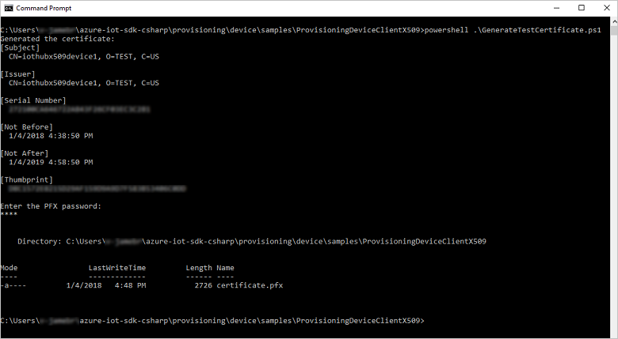

# Create and provision a simulated X.509 device using C# device SDK for IoT Hub Device Provisioning Service
[!INCLUDE [iot-dps-selector-quick-create-simulated-device-x509](../../includes/iot-dps-selector-quick-create-simulated-device-x509.md)]

These steps show you how to build the [Azure IoT Hub C# SDK](https://github.com/Azure/azure-iot-sdk-csharp) simulated X.509 device sample on a development machine running Windows OS and connect the simulated device with the Device Provisioning Service and your IoT hub.

If you're unfamiliar with the process of auto-provisioning, be sure to also review [Auto-provisioning concepts](concepts-auto-provisioning.md). Also make sure you've completed the steps in [Set up IoT Hub Device Provisioning Service with the Azure portal](./quick-setup-auto-provision.md) before continuing. 

<a id="setupdevbox"></a>
## Prepare the development environment 

1. Make sure you have the [.NET core SDK](https://www.microsoft.com/net/download/windows) installed on your machine. 

1. Make sure `git` is installed on your machine and is added to the environment variables accessible to the command window. See [Software Freedom Conservancy's Git client tools](https://git-scm.com/download/) for the latest version of `git` tools to install, which includes the **Git Bash**, the command-line app that you can use to interact with your local Git repository. 

4. Open a command prompt or Git Bash. Clone the [Azure IoT SDK for C#](https://github.com/Azure/azure-iot-sdk-csharp) GitHub repo:
    
    ```cmd
    git clone --recursive https://github.com/Azure/azure-iot-sdk-csharp.git
    ```

## Create a self-signed X.509 device certificate and individual enrollment entry

1. In a command prompt, change directories to the project directory for the X.509 device provisioning sample.

    ```cmd
    cd .\azure-iot-sdk-csharp\provisioning\device\samples\ProvisioningDeviceClientX509
    ```

2. The sample code is set up to use X.509 certificates stored within a password-protected PKCS12 formatted file (certificate.pfx). Additionally, you need a public key certificate file (certificate.cer) to create an individual enrollment later in this Quickstart. To generate a self-signed certificate and its associated .cer and .pfx files, run the following command:

    ```cmd
    powershell .\GenerateTestCertificate.ps1
    ```

3. The script prompts you for a PFX password. Remember this password, you must use it when you run the sample.

      


4. Log in to the Azure portal, click on the **All resources** button on the left-hand menu and open your provisioning service.

5. On the Device Provisioning Service summary blade, select **Manage enrollments**. Select **Individual Enrollments** tab and click the **Add** button at the top. 

6. Under the **Add enrollment** panel, enter the following information:
    - Select **X.509** as the identity attestation *Mechanism*.
    - Under the *Primary certificate .pem or .cer file*, click *Select a file* to select the certificate file **certificate.cer** created in the previous steps.
    - Leave **Device ID** blank. Your device will be provisioned with its device ID set to the common name (CN) in the X.509 certificate, **iothubx509device1**. This will also be the name used for the registration ID for the individual enrollment entry. 
    - Optionally, you may provide the following information:
        - Select an IoT hub linked with your provisioning service.
        - Update the **Initial device twin state** with the desired initial configuration for the device.
    - Once complete, click the **Save** button. 

    [](./media/how-to-manage-enrollments/individual-enrollment.png#lightbox)
    
   On successful enrollment, your X.509 enrollment entry appears as **iothubx509device1** under the *Registration ID* column in the *Individual Enrollments* tab. 

## Provision the simulated device

1. From the **Overview** blade for your provisioning service, note down the **_ID Scope_** value.

     


2. Type the following command to build and run the X.509 device provisioning sample. Replace the `<IDScope>` value with the ID Scope for your provisioning service. 

    ```cmd
    dotnet run <IDScope>
    ```

3. When prompted enter the password for the PFX file that you created previously. Notice the messages that simulate the device booting and connecting to the Device Provisioning Service to get your IoT hub information. 

     

4. Verify that the device has been provisioned. On successful provisioning of the simulated device to the IoT hub linked with your provisioning service, the device ID appears on the hub's **Iot Devices** blade. 

     

    If you changed the *initial device twin state* from the default value in the enrollment entry for your device, it can pull the desired twin state from the hub and act accordingly. For more information, see [Understand and use device twins in IoT Hub](../iot-hub/iot-hub-devguide-device-twins.md)


## Clean up resources

If you plan to continue working on and exploring the device client sample, do not clean up the resources created in this Quickstart. If you do not plan to continue, use the following steps to delete all resources created by this Quickstart.

1. Close the device client sample output window on your machine.
1. Close the TPM simulator window on your machine.
1. From the left-hand menu in the Azure portal, click **All resources** and then select your Device Provisioning service. At the top of the **All resources** blade, click **Delete**.  
1. From the left-hand menu in the Azure portal, click **All resources** and then select your IoT hub. At the top of the **All resources** blade, click **Delete**.  

## Next steps

In this Quickstart, you’ve created a simulated X.509 device on your Windows machine and provisioned it to your IoT hub using the Azure IoT Hub Device Provisioning Service on the portal. To learn how to enroll your X.509 device programmatically, continue to the Quickstart for programmatic enrollment of X.509 devices. 

> [!div class="nextstepaction"]
> [Azure Quickstart - Enroll X.509 devices to Azure IoT Hub Device Provisioning Service](quick-enroll-device-x509-node.md)
