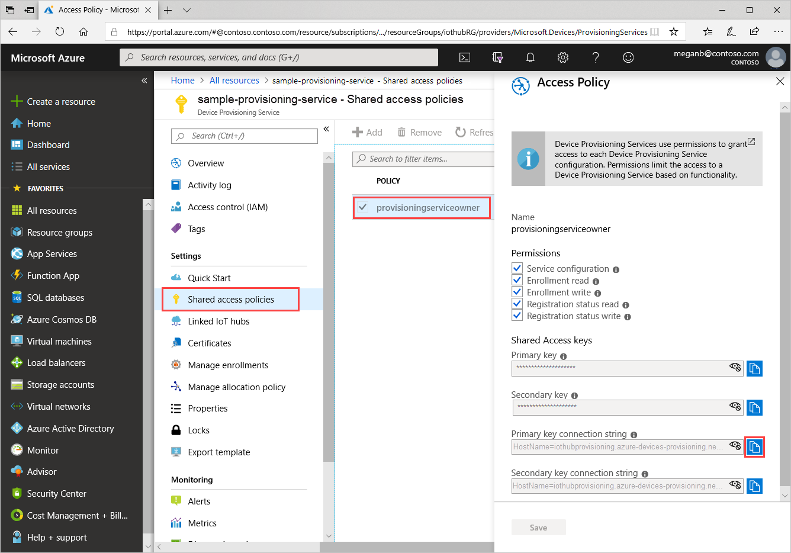
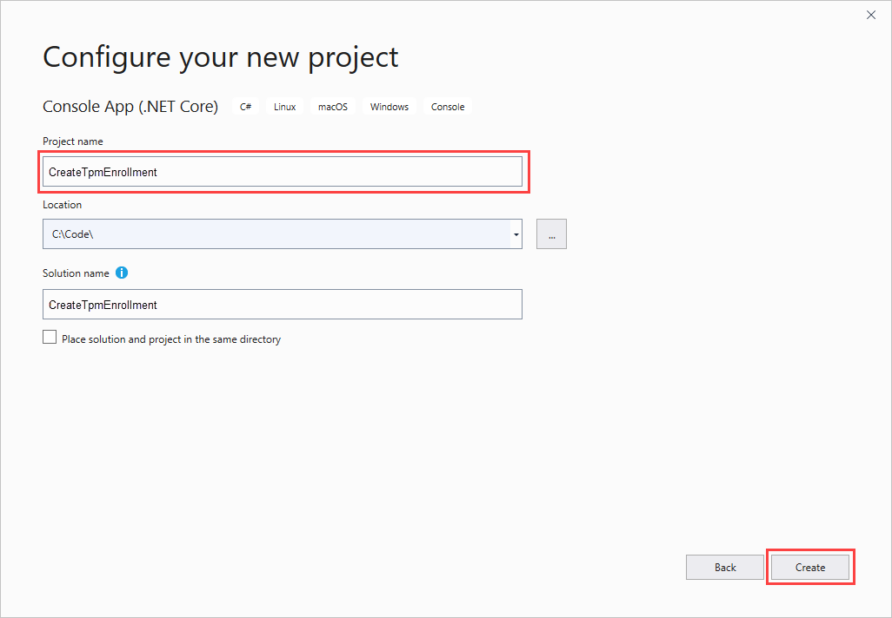
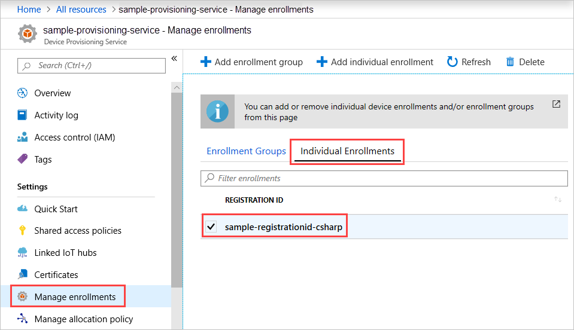

 
# Quickstart: Enroll TPM device to IoT Hub Device Provisioning Service using C# service SDK

[!INCLUDE [iot-dps-selector-quick-enroll-device-tpm](../../includes/iot-dps-selector-quick-enroll-device-tpm.md)]

This article shows how to programmatically create an individual enrollment for a TPM device in the Azure IoT Hub Device Provisioning Service by using the [C# Service SDK](https://github.com/Azure/azure-iot-sdk-csharp) and a sample C# .NET Core application. You can optionally enroll a simulated TPM device to the provisioning service by using this individual enrollment entry. Although these steps work on both Windows and Linux computers, this article uses a Windows development computer.

## Prepare the development environment

1. Verify you have [Visual Studio 2019](https://www.visualstudio.com/vs/) installed on your computer.

1. Verify you have the [.NET Core SDK](https://www.microsoft.com/net/download/windows) installed on your computer.

1. Complete the steps in [Set up the IoT Hub Device Provisioning Service with the Azure portal](./quick-setup-auto-provision.md) before you continue.

1. (Optional) If you want to enroll a simulated device at the end of this quickstart, follow the procedure in [Create and provision a simulated TPM device using C# device SDK](quick-create-simulated-device-tpm-csharp.md) up to the step where you get an endorsement key for the device. Save the endorsement key, registration ID, and, optionally, the device ID, because you need to use them later in this quickstart.

   > [!NOTE]
   > Don't follow the steps to create an individual enrollment by using the Azure portal.

## Get the connection string for your provisioning service

For the sample in this quickstart, you need the connection string for your provisioning service.

1. Sign in to the Azure portal, select **All resources**, and then your Device Provisioning Service.

1. Choose **Shared access policies**, then select the access policy you want to use to open its properties. In **Access Policy**, copy and save the primary key connection string.

    

## Create the individual enrollment sample

This section shows how to create a .NET Core console app that adds an individual enrollment for a TPM device to your provisioning service. With some modification, you can also follow these steps to create a [Windows IoT Core](https://developer.microsoft.com/en-us/windows/iot) console app to add the individual enrollment. To learn more about developing with IoT Core, see [Windows IoT Core developer documentation](https://docs.microsoft.com/windows/iot-core/).

1. Open Visual Studio and select **Create a new project**. In **Create a new project**, choose the **Console App (.NET Core)** project template for C# and select **Next**.

1. Name the project *CreateTpmEnrollment*, and press **Create**.

    

1. When the solution opens in Visual Studio, in the **Solution Explorer** pane, right-click the **CreateTpmEnrollment** project. Select **Manage NuGet Packages**.

1. In **NuGet Package Manager**, select **Browse**, search for and choose **Microsoft.Azure.Devices.Provisioning.Service**, and then press **Install**.

   

   This step downloads, installs, and adds a reference to the [Azure IoT Provisioning Service Client SDK](https://www.nuget.org/packages/Microsoft.Azure.Devices.Provisioning.Service/) NuGet package and its dependencies.

1. Add the following `using` statements after the other `using` statements at the top of `Program.cs`:
  
   ```csharp
   using System.Threading.Tasks;
   using Microsoft.Azure.Devices.Provisioning.Service;
   ```

1. Add the following fields to the `Program` class, making the changes listed below.

   ```csharp
   private static string ProvisioningConnectionString = "{ProvisioningServiceConnectionString}";
   private const string RegistrationId = "sample-registrationid-csharp";
   private const string TpmEndorsementKey =
       "AToAAQALAAMAsgAgg3GXZ0SEs/gakMyNRqXXJP1S124GUgtk8qHaGzMUaaoABgCAAEMAEAgAAAAAAAEAxsj2gUS" +
       "cTk1UjuioeTlfGYZrrimExB+bScH75adUMRIi2UOMxG1kw4y+9RW/IVoMl4e620VxZad0ARX2gUqVjYO7KPVt3d" +
       "yKhZS3dkcvfBisBhP1XH9B33VqHG9SHnbnQXdBUaCgKAfxome8UmBKfe+naTsE5fkvjb/do3/dD6l4sGBwFCnKR" +
       "dln4XpM03zLpoHFao8zOwt8l/uP3qUIxmCYv9A7m69Ms+5/pCkTu/rK4mRDsfhZ0QLfbzVI6zQFOKF/rwsfBtFe" +
       "WlWtcuJMKlXdD8TXWElTzgh7JS4qhFzreL0c1mI0GCj+Aws0usZh7dLIVPnlgZcBhgy1SSDQMQ==";
       
   // Optional parameters
   private const string OptionalDeviceId = "myCSharpDevice";
   private const ProvisioningStatus OptionalProvisioningStatus = ProvisioningStatus.Enabled;
   ```

   * Replace the `ProvisioningServiceConnectionString` placeholder value with the connection string of the provisioning service that you want to create the enrollment for.

   * You may optionally change the registration ID, endorsement key, device ID, and provisioning status.

   * If you're using this quickstart together with the [Create and provision a simulated TPM device using C# device SDK](quick-create-simulated-device-tpm-csharp.md) quickstart to provision a simulated device, replace the endorsement key and registration ID with the values that you noted in that quickstart. You can replace the device ID with the value suggested in that quickstart, use your own value, or use the default value in this sample.

1. Add the following method to the `Program` class.  This code creates individual enrollment entry and then calls the `CreateOrUpdateIndividualEnrollmentAsync` method on the `ProvisioningServiceClient` to add the individual enrollment to the provisioning service.

   ```csharp
   public static async Task RunSample()
   {
       Console.WriteLine("Starting sample...");

       using (ProvisioningServiceClient provisioningServiceClient =
               ProvisioningServiceClient.CreateFromConnectionString(ProvisioningConnectionString))
       {
           #region Create a new individualEnrollment config
           Console.WriteLine("\nCreating a new individualEnrollment...");
           Attestation attestation = new TpmAttestation(TpmEndorsementKey);
           IndividualEnrollment individualEnrollment =
                   new IndividualEnrollment(
                           RegistrationId,
                           attestation);

           // The following parameters are optional. Remove them if you don't need them.
           individualEnrollment.DeviceId = OptionalDeviceId;
           individualEnrollment.ProvisioningStatus = OptionalProvisioningStatus;
           #endregion

           #region Create the individualEnrollment
           Console.WriteLine("\nAdding new individualEnrollment...");
           IndividualEnrollment individualEnrollmentResult =
               await provisioningServiceClient.CreateOrUpdateIndividualEnrollmentAsync(individualEnrollment).ConfigureAwait(false);
           Console.WriteLine("\nIndividualEnrollment created with success.");
           Console.WriteLine(individualEnrollmentResult);
           #endregion
        
       }
   }
   ```

1. Finally, replace the `Main` method with the following lines:

   ```csharp
    static async Task Main(string[] args)
    {
        await RunSample();
        Console.WriteLine("\nHit <Enter> to exit ...");
        Console.ReadLine();
    }
   ```

1. Build the solution.

## Run the individual enrollment sample
  
Run the sample in Visual Studio to create the individual enrollment for your TPM device.

A Command Prompt window will appear and start showing confirmation messages. On successful creation, the Command Prompt window displays the properties of the new individual enrollment.

You can verify that the individual enrollment has been created. Go to the Device Provisioning Service summary, and select **Manage enrollments**, then select **Individual Enrollments**. You should see a new enrollment entry that corresponds to the registration ID you used in the sample.



Select the entry to verify the endorsement key and other properties for the entry.

If you've been following the steps in the [Create and provision a simulated TPM device using C# device SDK](quick-create-simulated-device-tpm-csharp.md) quickstart, you can continue with the remaining steps in that quickstart to enroll your simulated device. Be sure to skip the steps to create an individual enrollment using the Azure portal.

## Clean up resources

If you plan to explore the C# service sample, don't clean up the resources created in this quickstart. Otherwise, use the following steps to delete all resources created by this quickstart.

1. Close the C# sample output window on your computer.

1. Navigate to your Device Provisioning service in the Azure portal, select **Manage enrollments**, and then select the **Individual Enrollments** tab. Select the check box next to the *Registration ID* for the enrollment entry you created using this quickstart, and press the **Delete** button at the top of the pane.

1. If you followed the steps in [Create and provision a simulated TPM device using C# device SDK](quick-create-simulated-device-tpm-csharp.md) to create a simulated TPM device, do the following steps:

    1. Close the TPM simulator window and the sample output window for the simulated device.

    1. In the Azure portal, navigate to the IoT Hub where your device was provisioned. In the menu under **Explorers**, select **IoT devices**, select the check box next to the *DEVICE ID* of the device you registered in this quickstart, and then press the **Delete** button at the top of the pane.

## Next steps

In this quickstart, you’ve programmatically created an individual enrollment entry for a TPM device. Optionally, you created a TPM simulated device on your computer and provisioned it to your IoT hub using the Azure IoT Hub Device Provisioning Service. To learn about device provisioning in depth, continue to the tutorial for the Device Provisioning Service setup in the Azure portal.

> [!div class="nextstepaction"]
> [Azure IoT Hub Device Provisioning Service tutorials](./tutorial-set-up-cloud.md)
