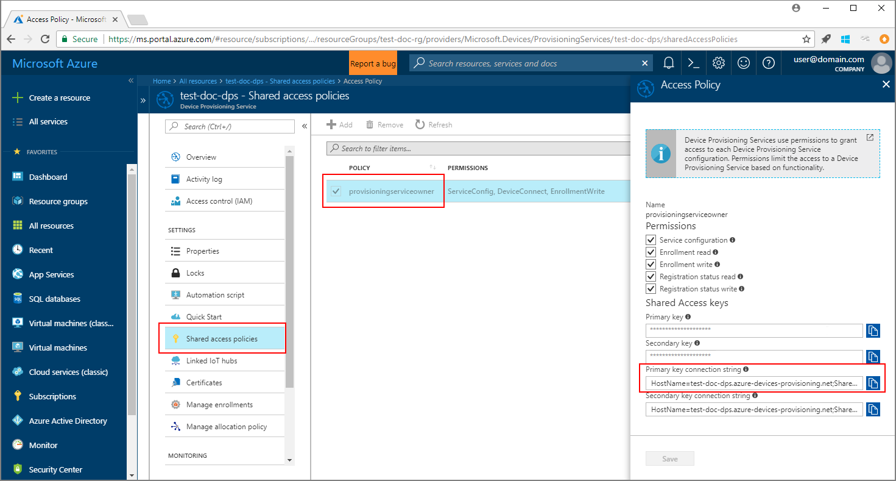
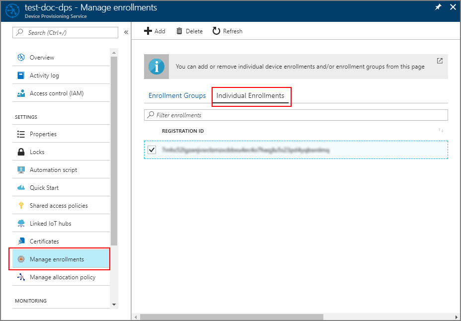

# Enroll TPM device to IoT Hub Device Provisioning Service using Java service SDK
> [!div class="op_single_selector"]
> * [Java](quick-enroll-device-tpm-java.md)
<!-- 
> * [Node.js](quick-enroll-device-tpm-node.md)
-->
These steps show how to enroll a simulated TPM device programmatically to the Azure IoT Hub Device Provisioning Services, using the [Java Service SDK](https://azure.github.io/azure-iot-sdk-java/service/) with the help of a sample Java application. Although the Java Service SDK works on both Windows and Linux machines, this article uses a Windows development machine to walk through the enrollment process.

Make sure to [set up IoT Hub Device Provisioning Service with the Azure portal](./quick-setup-auto-provision.md), as well as [simulate a TPM device](quick-create-simulated-device.md#simulatetpm) before you proceed.

<a id="setupdevbox"></a>

## Prepare the development environment 

1. Make sure you have [Java SE Development Kit 8](http://www.oracle.com/technetwork/java/javase/downloads/jdk8-downloads-2133151.html) installed on your machine. 

2. Set up environment variables for your Java installation. The `PATH` variable should include the full path to *jdk1.8.x\bin* directory. If this is your machine's first Java installation, then create a new environment variable named `JAVA_HOME` and point it to the full path to the *jdk1.8.x* directory. On Windows machine, this directory is usually found in the *C:\\Program Files\\Java\\* folder, and you can create or edit environment variables by searching for **Edit the system environment variables** on the **Control panel** of your Windows machine. 

  You may check if Java is successfully set up on your machine by running the following command on your command window:

    ```cmd\sh
    java -version
    ```

3. Download and extract [Maven 3](https://maven.apache.org/download.cgi) on your machine. 

4. Edit environment variable `PATH` to point to the *apache-maven-3.x.x\\bin* folder inside the folder where Maven is extracted. You may confirm that Maven is successfully installed by running this command your command window:

    ```cmd\sh
    mvn --version
    ```

5. Make sure [git](https://git-scm.com/download/) is installed on your machine and is added to the environment variable `PATH`. 


<a id="downloadjava"></a>

## Download the Java source code

1. Open a command prompt. Clone the GitHub repo for device enrollment code sample using the Java Service SDK:
    
    ```cmd/sh
    git clone https://github.com/Azure/azure-iot-sdk-java.git --recursive
    ```

2. Get the Maven package `com.microsoft.azure.sdk.iot.provisioning.service` on your machine by:
    - compiling the source code using *Maven* to create the package:

        ```cmd/sh
        cd azure-iot-sdk-java
        mvn install -DskipTests=true
        ```

    - OR, by downloading the [`com.microsoft.azure.sdk.iot.provisioning.service`](https://www.mvnrepository.com/artifact/com.microsoft.azure.sdk.iot.provisioning/provisioning-service-client) package to your machine. 


<a id="javasample"></a>

## Modify the Java sample code

This section shows how to add the provisioning details of your TPM device to the sample code. In the Java source code, navigate to the sample folder **_azure-iot-sdk-java/provisioning/provisioning-samples/service-enrollment-sample_**. Open the file **_/src/main/java/samples/com/microsoft/azure/sdk/iot/ServiceEnrollmentSample.java_** in an editor of your choice, and add the following details:

1. Add the `[Provisioning Connection String]` for your provisioning service, from the portal as following:
    1. Navigate to your provisioning service in the [Azure portal](https://portal.azure.com). 
    2. Open the **Shared access policies**, and select a policy which has the *EnrollmentWrite* permission.
    3. Copy the **Primary key connection string**. 

          

    4. In the sample code file **_ServiceEnrollmentSample.java_**, replace the `[Provisioning Connection String]` with the **Primary key connection string**.

        ```Java
        private static final String PROVISIONING_CONNECTION_STRING = "[Provisioning Connection String]";
        ```

2. Add the TPM device details:
    1. Get the *Registration ID* and the *TPM endorsement key* for a TPM device simulation, by following the steps leading to the section [Simulate TPM device](quick-create-simulated-device.md#simulatetpm).
    2. Use the **_Registration ID_** and the **_Endorsement Key_** from the output of the preceding step, to replace the `[RegistrationId]` and `[TPM Endorsement Key]` in the sample code file **_ServiceEnrollmentSample.java_**:
        
        ```Java
        private static final String REGISTRATION_ID = "[RegistrationId]";
        private static final String TPM_ENDORSEMENT_KEY = "[TPM Endorsement Key]";
        ```

3. Optionally, you may configure your provisioning service through the sample code:
    - To add this configuration to the sample, follow these steps:
        1. Navigate to the IoT hub linked to your provisioning service in the [Azure portal](https://portal.azure.com). Open the **Overview** tab for the hub, and copy the **Hostname**. Assign this **Hostname** to the *IOTHUB_HOST_NAME* parameter.
            ```Java
            private static final String IOTHUB_HOST_NAME = "[Host name].azure-devices.net";
            ```
        2. Assign a friendly name to the *DEVICE_ID* parameter, and keep the *PROVISIONING_STATUS* as the default *ENABLED* value. 
    
    - OR, if you choose not to configure your provisioning service, make sure to comment out or delete the following statements in the _ServiceEnrollmentSample.java_ file:
        ```Java
        // The following parameters are optional. Remove it if you don't need.
        individualEnrollment.setDeviceId(DEVICE_ID);
        individualEnrollment.setIotHubHostName(IOTHUB_HOST_NAME);
        individualEnrollment.setProvisioningStatus(PROVISIONING_STATUS);
        ```

4. Study the sample code. It creates, updates, queries and deletes an individual TPM device enrollment. To verify successful enrollment in portal, temporarily comment out the following lines of code at the end of the _ServiceEnrollmentSample.java_ file:
    
    ```Java
    // *********************************** Delete info of individualEnrollment ************************************
    System.out.println("\nDelete the individualEnrollment...");
    provisioningServiceClient.deleteIndividualEnrollment(REGISTRATION_ID);
    ```

5. Save the file _ServiceEnrollmentSample.java_.

<a id="runjavasample"></a>

## Build and run the Java sample code

1. Open a command window, and navigate to the folder **_azure-iot-sdk-java/provisioning/provisioning-samples/service-enrollment-sample_**.

2. Build the sample code by using this command:

    ```cmd\sh
    mvn install -DskipTests
    ```

3. Run the sample by using these commands at the command window:

    ```cmd\sh
    cd target
    java -jar ./service-enrollment-sample-{version}-with-deps.jar
    ```

4. Observe the output window for successful enrollment. 

5. Navigate to your provisioning service in the Azure portal. Click **Manage enrollments**, and select the **Individual Enrollments** tab. Notice that the *Registration ID* of your simulated TPM device is now listed. 

      

## Clean up resources
If you plan to explore the Java service sample, do not clean up the resources created in this Quickstart. If you do not plan to continue, use the following steps to delete all resources created by this Quickstart.

1. Close the Java sample output window on your machine.
1. Close the TPM simulator window that you may have created to simulate your TPM device.
1. Navigate to your Device Provisioning service in the Azure portal, click **Manage enrollments** and then select the **Individual Enrollments** tab. Select the *Registration ID* of the device you enrolled using this Quickstart, and click the **Delete** button at the top of the blade. 

## Next steps
In this Quickstart, you enrolled a simulated TPM device to your Device Provisioning service. To learn about device provisioning in depth, continue to the tutorial for the Device Provisioning Service setup in the Azure portal. 

> [!div class="nextstepaction"]
> [Azure IoT Hub Device Provisioning Service tutorials](./tutorial-set-up-cloud.md)
