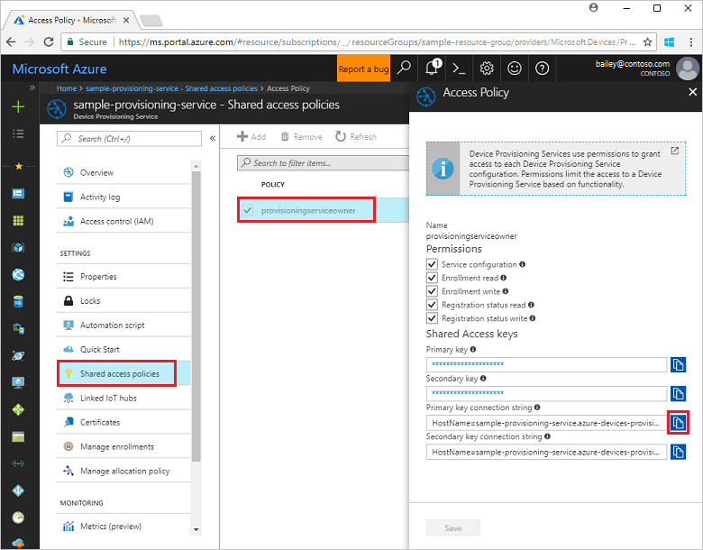
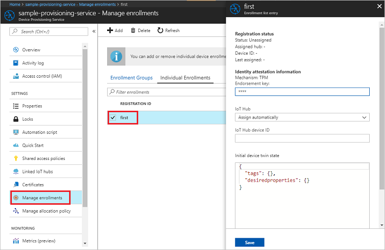

 
 # Enroll X.509 devices to IoT Hub Device Provisioning Services
 > [!div class="op_single_selector"]
 > * [TPM](quick-enroll-device-tpm.md)
 > * [X.509](quick-enroll-device-x509.md)
 
 These steps show how to enroll TPM simulated devices programmatically to the Azure IoT Hub Device Provisioning Service, using the [Node.js Service SDK](https://github.com/Azure/azure-iot-sdk-node) with the help of a sample Node.js application. Although these steps will work on both Windows and Linux machines, we will use a Windows development machine for the purpose of this article.
 
 Make sure to complete the steps in the [Set up IoT Hub Device Provisioning Service with the Azure portal](./quick-setup-auto-provision.md) before you proceed. If you want to enroll a simulated device at the end of this tutorial, follow the steps in [Create and provision a simulated device](quick-create-simulated-device.md) up until the step where you get an endorsement key for the device. Note down the endorsement key, you will use it later in this quickstart. **Do not follow the steps to create an individual enrollment using the Azure portal.**
 
<a id="setupdevbox"></a>
 
## Prepare the development environment 
 
1. Make sure you have [Node.js v4.0 or above](https://nodejs.org) installed on your machine. 
 
5. Make sure [git](https://git-scm.com/download/) is installed on your machine and is added to the environment variable `PATH`. 
 
 
<a id="downloadnode"></a>
 
## Download the Node.js source code
 
1. Open a command prompt. Clone the GitHub repo for the Node.js SDK:
     
    ```cmd/sh
    git clone https://github.com/Azure/azure-iot-sdk-java.git --recursive
    ```
 
2. Copy the following files from the `azure-iot-sdk-node\provisioning\service\samples` folder to a working folder where you want to run the sample:

    - packages.json
    - create_individual_enrollment.js
 
## Build and run sample enrollment
 
1. From a command window in your working folder, run:
  
     ```cmd\sh
     npm install
     ```  
 
2. To run the sample, you need the connection string for your provisioning service. 
    1. Log in to the Azure portal, click on the **All resources** button on the left-hand menu and open your Device Provisioning service. 
    2. Click **Shared access policies**, then click the access policy you want to use to open its properties. In the **Access Policy** window, copy and note down the primary key connection string. 

     


3. You also need the endorsement key for your device. If you have followed the [Create and provision a simulated device](quick-create-simulated-device.md) quickstart to create a simulated TPM device, use the key created for that device. Otherwise, to create a sample individual enrollment, you can use the following endorsement key supplied with the SDK:

    ```
    AToAAQALAAMAsgAgg3GXZ0SEs/gakMyNRqXXJP1S124GUgtk8qHaGzMUaaoABgCAAEMAEAgAAAAAAAEAxsj2gUScTk1UjuioeTlfGYZrrimExB+bScH75adUMRIi2UOMxG1kw4y+9RW/IVoMl4e620VxZad0ARX2gUqVjYO7KPVt3dyKhZS3dkcvfBisBhP1XH9B33VqHG9SHnbnQXdBUaCgKAfxome8UmBKfe+naTsE5fkvjb/do3/dD6l4sGBwFCnKRdln4XpM03zLpoHFao8zOwt8l/uP3qUIxmCYv9A7m69Ms+5/pCkTu/rK4mRDsfhZ0QLfbzVI6zQFOKF/rwsfBtFeWlWtcuJMKlXdD8TXWElTzgh7JS4qhFzreL0c1mI0GCj+Aws0usZh7dLIVPnlgZcBhgy1SSDQMQ==
    ```

1. To create an individual enrollment for your TPM device, run the following command (include the quotes around the command arguments):
 
     ```cmd\sh
     node create_individual_enrollment.js "<the connection string for your provisioning service>" "<endorsement key>"
     ```
 
3. On successful creation, the command window displays the properties of the new individual enrollment.

     

4. Verify that an individual enrollment has been created. In the Azure portal, on the Device Provisioning Service summary blade, select **Manage enrollments**. Select the **Individual Enrollments** tab and click the new enrollment entry (*first*) to verify the endorsement key and other properties for the entry.

     
 
## Clean up resources
**TBD**
If you plan to continue working on and exploring the device client sample, do not clean up the resources created in this Quickstart. If you do not plan to continue, use the following steps to delete all resources created by this Quickstart.
 
1. From the left-hand menu in the Azure portal, click **All resources** and then select your Device Provisioning service. At the top of the **All resources** blade, click **Delete**.  
4. From the left-hand menu in the Azure portal, click **All resources** and then select your IoT hub. At the top of the **All resources** blade, click **Delete**.  
 
 ## Next steps
 **TBD**
 In this Quickstart, you’ve created a TPM simulated device on your machine and provisioned it to your IoT hub using the Azure IoT Hub Device Provisioning Service. To learn about device provisioning in depth, continue to the tutorial for the Device Provisioning Service setup in the Azure portal. 
 
 > [!div class="nextstepaction"]
 > [Azure IoT Hub Device Provisioning Service tutorials](./tutorial-set-up-cloud.md)