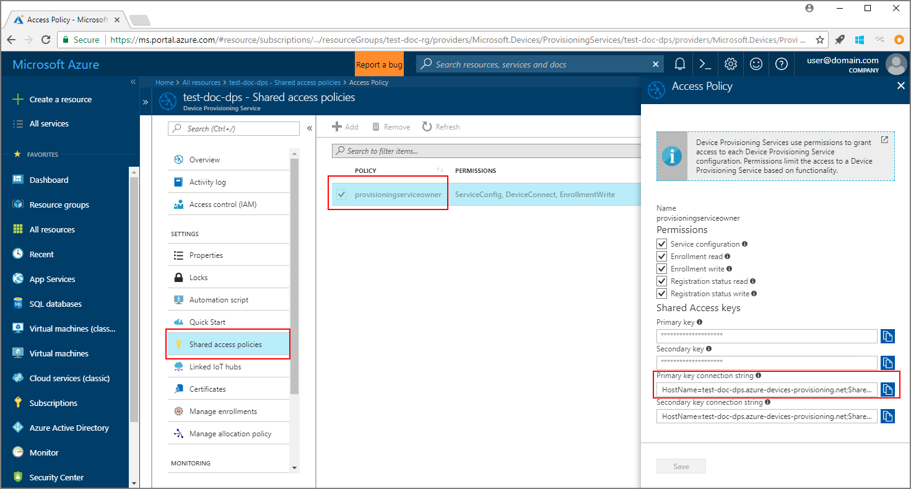
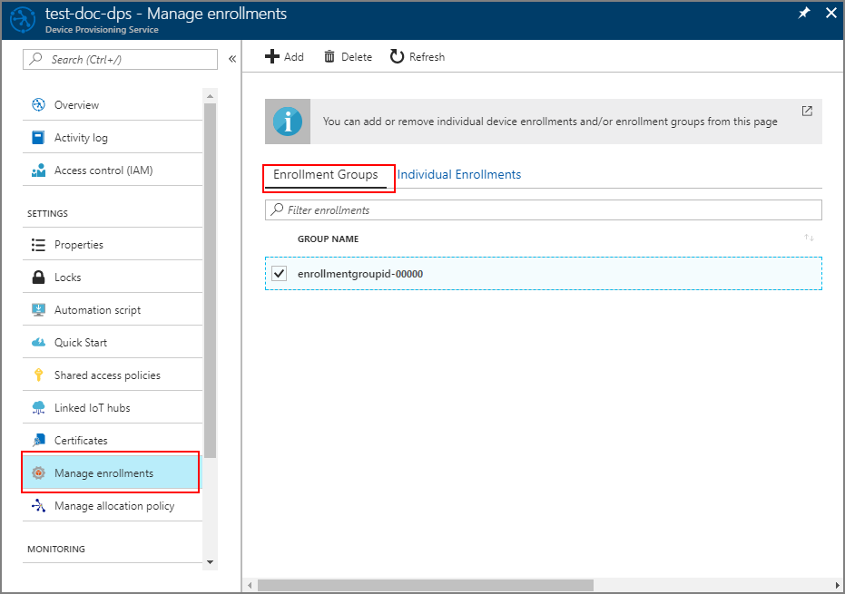

# Enroll X.509 devices to IoT Hub Device Provisioning Services using Java service SDK
> [!div class="op_single_selector"]
> * [TPM](quick-enroll-device-tpm-java.md)
> * [X.509](quick-enroll-device-x509-java.md)

These steps show how to enroll X.509 simulated devices programmatically to the Azure IoT Hub Device Provisioning Services, using the [Java Service SDK](https://azure.github.io/azure-iot-sdk-java/service/) with the help of a sample Java application. Although these steps will work on both Windows as well as Linux machines, we will use a Windows development machine for the purpose of this article.

Make sure to [set up IoT Hub Device Provisioning Service with the Azure portal](./quick-setup-auto-provision.md) before you proceed.

<a id="setupdevbox"></a>

## Prepare the development environment 

1. Make sure you have [Java SE Development Kit 8](http://www.oracle.com/technetwork/java/javase/downloads/jdk8-downloads-2133151.html) installed on your machine. 

2. Set up environment variables for your Java installation. The `PATH` variable should include the full path to *jdk1.8.x\bin* directory. If this is your machine's first Java installation, then create a new environment variable named `JAVA_HOME` and point it to the full path to the *jdk1.8.x* directory. On Windows machine, this directory is usually found in the *C:\\Program Files\\Java\\* folder, and you can create or edit environment variables by searching for **Edit the system environment variables** on the **Control panel** of your Windows machine. 

  You may check if Java is successfully set up on your machine by running the following command on your command window:

    ```cmd\sh
    java -version
    ```

3. Download and extract [Maven 3](https://maven.apache.org/download.cgi) on your machine. 

4. Edit environment variable `PATH` to point to the *apache-maven-3.x.x\\bin* folder inside the folder where Maven is extracted. You may confirm that Maven is succesfully installed by running this command your command window:

    ```cmd\sh
    mvn --version
    ```

5. Make sure [git](https://git-scm.com/download/) is installed on your machine and is added to the environment variable `PATH`. 


<a id="downloadjava"></a>

## Download the Java source code

1. Open a command prompt. Clone the GitHub repo for device enrollment code sample using the Java Service SDK:
    
    ```cmd/sh
    git clone https://github.com/Azure/azure-iot-sdk-java.git --recursive
    ```

2. Compile the source code using *Maven*. 

    ```cmd/sh
    cd azure-iot-sdk-java
    mvn install -DskipTests=true
    ```
   
   This step creates the Maven package `com.microsoft.azure.sdk.iot.provisioning.service` on your machine.

<a id="javasample"></a>

## Modify the Java sample code

This section shows how to add the provisioning details of your TPM device to the sample code. In the Java source code, navigate to the sample folder **_azure-iot-sdk-java/provisioning/provisioning-samples/service-enrollment-group-sample_**. Open the file **_/src/main/java/samples/com/microsoft/azure/sdk/iot/ServiceEnrollmentGroupSample.java_** in an editor of your choice, and add the following details:

1. Add the *Provisioning Connection String* for your provisioning service:
    1. Navigate to your provisioning service in the [Azure portal](portal.azure.com). 
    2. Open the **Shared access policies**, and select a policy which has the *EnrollmentWrite* permission.
    3. Copy the **Primary key connection string**. 

          

    4. In the sample code file **_ServiceEnrollmentGroupSample.java_**, replace the *[Provisioning Connection String]* with the **Primary key connection string**.

        ```Java
        private static final String PROVISIONING_CONNECTION_STRING = "[Provisioning Connection String]";
        ```

2. Add the root certificate for the group of devices:
    1. In a command window, navigate to the _X509 Cert Generator_ folder **_azure-iot-sdk-java/provisioning/provisioning-tools/provisioning-x509-cert-generator_**.
    2. Build the tool by running the following command:
        ```cmd\sh
        mvn clean install
        ```
    3. Run the tool using the following commands:
        ```cmd\sh
        cd target
        java -jar ./provisioning-x509-cert-generator-{version}-with-deps.jar
        ```
    4. When prompted, you may optionally enter a _Common Name_ for your certificates.
    5. The tool locally generates a **Client Cert**, the **Client Cert Private Key**, and the **Root Cert**.
    6. Copy the **Root Cert**, including the lines **_-----BEGIN CERTIFICATE-----_** and **_-----END CERTIFICATE-----_**. 
    7. Assign the value of the **Root Cert** to the parameter **PUBLIC_KEY_CERTIFICATE_STRING** as shown below:
        ```Java
        private static final String PUBLIC_KEY_CERTIFICATE_STRING =
                "-----BEGIN CERTIFICATE-----\n" +
                "XXXXXXXXXXXXXXXXXXXXXXXXXXXXXXXXXXXXXXXXXXXXXXXXXXXXXXXXXXXXXXXX\n" +
                "XXXXXXXXXXXXXXXXXXXXXXXXXXXXXXXXXXXXXXXXXXXXXXXXXXXXXXXXXXXXXXXX\n" +
                "XXXXXXXXXXXXXXXXXXXXXXXXXXXXXXXXXXXXXXXXXXXXXXXXXXXXXXXXXXXXXXXX\n" +
                "XXXXXXXXXXXXXXXXXXXXXXXXXXXXXXXXXXXXXXXXXXXXXXXXXXXXXXXXXXXXXXXX\n" +
                "XXXXXXXXXXXXXXXXXXXXXXXXXXXXXXXXXXXXXXXXXXXXXXXXXXXXXXXXXXXXXXXX\n" +
                "XXXXXXXXXXXXXXXXXXXXXXXXXXXXXXXXXXXXXXXXXXXXXXXXXXXXXXXXXXXXXXXX\n" +
                "XXXXXXXXXXXXXXXXXXXXXXXXXXXXXXXXXXXXXXXXXXXXXXXXXXXXXXXXXXXXXXXX\n" +
                "XXXXXXXXXXXXXXXXXXXXXXXXXXXXXXXXXXXXXXXXXXXXXXXXXXXXXXXXXXXXXXXX\n" +
                "XXXXXXXXXXXXXXXXXXXXXXXXXXXXXXXXXXXXXXXXXXXXXXXXXXXXXXXXXXXXXXXX\n" +
                "XXXXXXXXXXXXXXXXXXXXXXXXXXXXXXXXXXXXXXXXXXXXXXXXXXXXXXXXXXXXXXXX\n" +
                "-----END CERTIFICATE-----\n";
        ```
 
3. Optionally, you may choose to configure your provisioning service through the sample code:
    - To add this configuration to the sample, follow these steps:
        1. Navigate to the IoT hub linked to your provisioning service in the [Azure portal](portal.azure.com). Open the **Overview** tab for the hub, and copy the **Hostname**. Assign this **Hostname** to the *IOTHUB_HOST_NAME* parameter.
            ```Java
            private static final String IOTHUB_HOST_NAME = "[Host name].azure-devices.net";
            ```
        2. Assign a friendly name to the *DEVICE_ID* parameter, and keep the *PROVISIONING_STATUS* as the default *ENABLED* value. 

    - OR, if you choose not to configure your provisioning service, make sure to comment out or delete the following statements in the _ServiceEnrollmentGroupSample.java_ file:
        ```Java
        enrollmentGroup.setIotHubHostName(IOTHUB_HOST_NAME);                // Optional parameter.
        enrollmentGroup.setProvisioningStatus(ProvisioningStatus.ENABLED);  // Optional parameter.
        ```

4. Study the sample code. It creates, updates, queries and deletes a group enrollment for X.509 devices. To verify successful enrollment in portal, temporarily comment out the following lines of code at the end of the _ServiceEnrollmentGroupSample.java_ file:
    ```Java
    // ************************************** Delete info of enrollmentGroup ***************************************
    System.out.println("\nDelete the enrollmentGroup...");
    provisioningServiceClient.deleteEnrollmentGroup(enrollmentGroupId);
    ```

5. Save the file _ServiceEnrollmentGroupSample.java_. 
 

<a id="runjavasample"></a>

## Build and run sample enrollment

1. Open a command window, and navigate to the folder **_azure-iot-sdk-java/provisioning/provisioning-samples/service-enrollment-group-sample_**.

2. Build the sample code by using this command:

    ```cmd\sh
    mvn install -DskipTests
    ```

3. Run the sample by using these commands at the command window:

    ```cmd\sh
    cd target
    java -jar ./service-enrollment-group-sample-{version}-with-deps.jar
    ```

4. Observe the output window for successful enrollment.

5. Navigate to your provisioning service in the Azure portal. Click **Manage enrollments**. Notice that your group of X.509 devices appears under the **Enrollment Groups** tab, with an auto-generated *GROUP NAME*. 

      


## Clean up resources
If you plan to explore the Jave service sample, do not clean up the resources created in this Quickstart. If you do not plan to continue, use the following steps to delete all resources created by this Quickstart.

1. Close the Java sample output window on your machine.
1. Close the _X509 Cert Generator_ window on your machine.
1. Navigate to your Device Provisioning service in the Azure portal, click **Manage enrollments** and then select the **Enrollment Groups** tab. Select the *GROUP NAME* for the X.509 devices you enrolled using this Quickstart, and click the **Delete** button at the top of the blade.  

## Next steps
In this Quickstart, you’ve enrolled a simulated group of X.509 devices to your Device Provisioning service. To learn about device provisioning in depth, continue to the tutorial for the Device Provisioning Service setup in the Azure portal. 

> [!div class="nextstepaction"]
> [Azure IoT Hub Device Provisioning Service tutorials](./tutorial-set-up-cloud.md)
