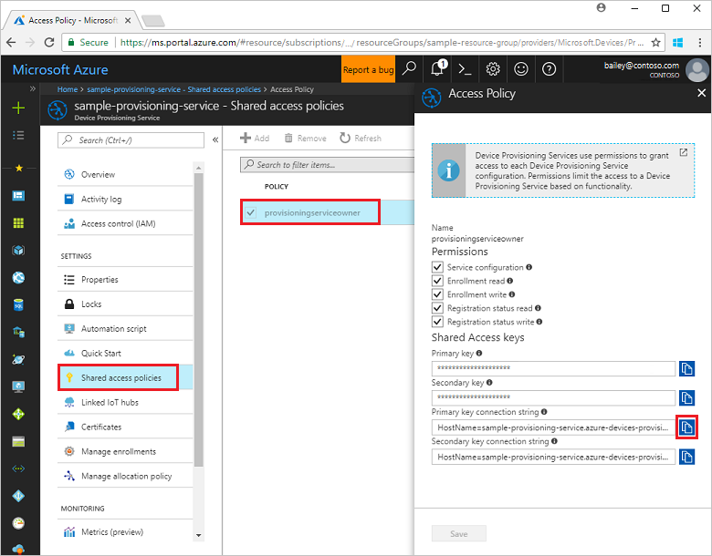
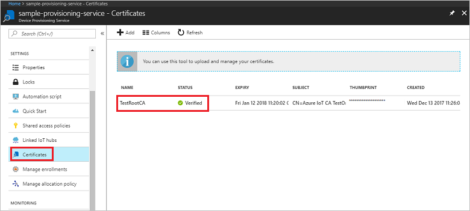
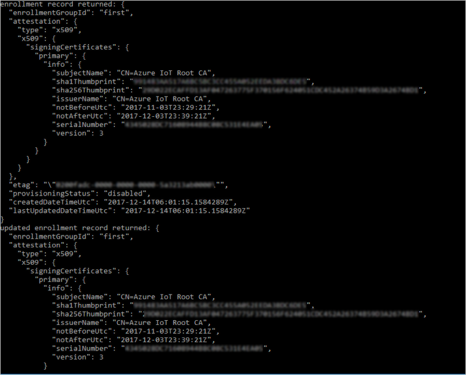

 
# Enroll X.509 devices to IoT Hub Device Provisioning Services
> [!div class="op_single_selector"]
> * [TPM](quick-create-simulated-device.md)
> * [X.509](quick-create-simulated-device-x509.md)
 
These steps show how to programmatically create an enrollment group for an intermediate or root CA X.509 certificate using sample code available in the [Node.js Service SDK](https://github.com/Azure/azure-iot-sdk-node). Although these steps will work on both Windows and Linux machines, we will use a Windows development machine for this article.
 
Before you proceed, make sure to complete the steps in [Set up IoT Hub Device Provisioning Service with the Azure portal](./quick-setup-auto-provision.md). 

To complete this Quickstart, you need a .pem file that contains an intermediate or root CA X.509 certificate that has been uploaded to and verified with your provisioning service. The [Azure IoT c SDK](https://github.com/Azure/azure-iot-sdk-c) contains tooling that can help you create an X.509 certificate chain, upload a certificate, and perform proof-of-possession with the service to verify the certificate. To use this tooling, clone the IoT c SDK and follow the steps in the `azure-iot-sdk-c\tools\CACertificates\CACertificateOverview.md` file.

<a id="setupdevbox"></a>
 
## Prepare the development environment 
 
1. Make sure you have [Node.js v4.0 or above](https://nodejs.org) installed on your machine. 
 
5. Make sure [git](https://git-scm.com/download/) is installed on your machine and is added to the environment variable `PATH`. 
 
 
<a id="downloadnode"></a>
 
## Download the Node.js source code
 
1. Open a command prompt. Clone the GitHub repo for the IoT Node.js SDK:
     
    ```cmd/sh
    git clone https://github.com/Azure/azure-iot-sdk-java.git --recursive
    ```
 
2. Copy the following files from the `azure-iot-sdk-node\provisioning\service\samples` folder to a working folder where you want to run the sample:

    - packages.json
    - create_enrollment_group.js
 
## Build and run sample enrollment
 
1. From a command window in your working folder, run:
  
     ```cmd\sh
     npm install
     ```  
 
2. To run the sample, you need the connection string for your provisioning service. 
    1. Log in to the Azure portal, click on the **All resources** button on the left-hand menu and open your Device Provisioning service. 
    2. Click **Shared access policies**, then click the access policy you want to use to open its properties. In the **Access Policy** window, copy and note down the primary key connection string. 

     


3. You also need a .pem file that contains an X.509 intermediate or root CA certificate that has been previously uploaded and verified with your provisioning service. To check that your certificate has been uploaded and verified, on the Device Provisioning Service summary page in the Azure portal, click  **Certificates**. Find the certificate that you want to use for the group enrollment and ensure that its status value is *verified*.

     

1. To create an enrollment group for your certificate, run the following command (include the quotes around the command arguments):
 
     ```cmd\sh
     node create_enrollment_group.js "<the connection string for your provisioning service>" "<your certificate's .pem file>"
     ```
 
3. On successful creation, the command window displays the properties of the new enrollment group.

     

4. Verify that the enrollment group has been created. In the Azure portal, on the Device Provisioning Service summary blade, select **Manage enrollments**. Select the **Enrollment Groups** tab and verify that the new enrollment entry (*first*) is present.

     
 
## Clean up resources
If you plan to continue working on and exploring enrollment groups, do not clean up the resources created in this Quickstart. If you do not plan to continue, use the following steps to delete all Azure resources created by this Quickstart.
 
1. From the left-hand menu in the Azure portal, click **All resources** and then select your Device Provisioning service. At the top of the **All resources** blade, click **Delete**.  
4. From the left-hand menu in the Azure portal, click **All resources** and then select your IoT hub. At the top of the **All resources** blade, click **Delete**.  
 
## Next steps
**TBD**
In this Quickstart, you created a group enrollment for an X.509 intermediate or root CA certificate using the Azure IoT Hub Device Provisioning Service. To learn about device provisioning in depth, continue to the tutorial for the Device Provisioning Service setup in the Azure portal. 
 
> [!div class="nextstepaction"]
> [Azure IoT Hub Device Provisioning Service tutorials](./tutorial-set-up-cloud.md)