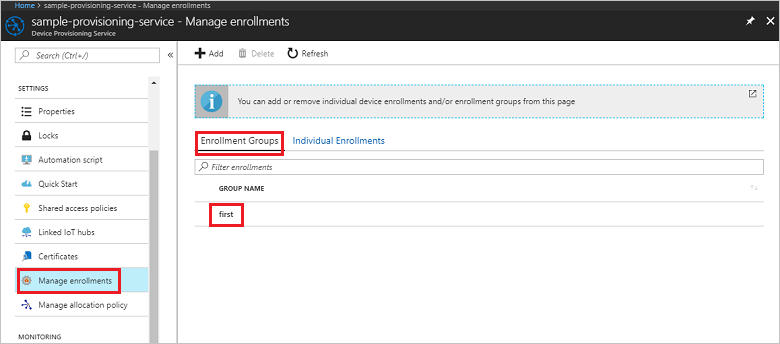

 
# Enroll X.509 devices to IoT Hub Device Provisioning Services
> [!div class="op_single_selector"]
> * [TPM](quick-create-simulated-device.md)
> * [X.509](quick-create-simulated-device-x509.md)
 
These steps show how to programmatically create an enrollment group for an intermediate or root CA X.509 certificate using the [Node.js Service SDK](https://github.com/Azure/azure-iot-sdk-node) and a Node.js sample. Although these steps work on both Windows and Linux machines, this article uses a Windows development machine.
 

## Prerequisites

- Make sure to complete the steps in [Set up the IoT Hub Device Provisioning Service with the Azure portal](./quick-setup-auto-provision.md). 

 
- Make sure you have [Node.js v4.0 or above](https://nodejs.org) installed on your machine.


- You need a .pem file that contains an intermediate or root CA X.509 certificate that has been uploaded to and verified with your provisioning service. The **Azure IoT c SDK** contains tooling that can help you create an X.509 certificate chain, upload a root or intermediate certificate from that chain, and perform proof-of-possession with the service to verify the certificate. To use this tooling, clone the [Azure IoT c SDK](https://github.com/Azure/azure-iot-sdk-c) and follow the steps in [azure-iot-sdk-c\tools\CACertificates\CACertificateOverview.md](https://github.com/Azure/azure-iot-sdk-c/blob/master/tools/CACertificates/CACertificateOverview.md) on your machine.

## Create the enrollment group sample 

 
1. From a command window in your working folder, run:
  
     ```cmd\sh
     npm install azure-iot-provisioning-service
     ```  

2. Using a text editor, create a **create_enrollment_group.js** file in your working folder. Add the following code to the file and save:

    ```
    'use strict';
    var fs = require('fs');

    var provisioningServiceClient = require('azure-iot-provisioning-service').ProvisioningServiceClient;

    var serviceClient = provisioningServiceClient.fromConnectionString(process.argv[2]);

    var enrollment = {
      enrollmentGroupId: 'first',
      attestation: {
        type: 'x509',
        x509: {
          signingCertificates: {
            primary: {
              certificate: fs.readFileSync(process.argv[3], 'utf-8').toString()
            }
          }
        }
      },
      provisioningStatus: 'disabled'
    };

    serviceClient.createOrUpdateEnrollmentGroup(enrollment, function(err, enrollmentResponse) {
      if (err) {
        console.log('error creating the group enrollment: ' + err);
      } else {
        console.log("enrollment record returned: " + JSON.stringify(enrollmentResponse, null, 2));
        enrollmentResponse.provisioningStatus = 'enabled';
        serviceClient.createOrUpdateEnrollmentGroup(enrollmentResponse, function(err, enrollmentResponse) {
          if (err) {
            console.log('error updating the group enrollment: ' + err);
          } else {
            console.log("updated enrollment record returned: " + JSON.stringify(enrollmentResponse, null, 2));
          }
        });
      }
    });
    ````

## Run the enrollment group sample
 
1. To run the sample, you need the connection string for your provisioning service. 
    1. Log in to the Azure portal, click on the **All resources** button on the left-hand menu and open your Device Provisioning service. 
    2. Click **Shared access policies**, then click the access policy you want to use to open its properties. In the **Access Policy** window, copy and note down the primary key connection string. 

     


3. As stated in [Prerequisites](#prerequisites), you also need a .pem file that contains an X.509 intermediate or root CA certificate that has been previously uploaded and verified with your provisioning service. To check that your certificate has been uploaded and verified, on the Device Provisioning Service summary page in the Azure portal, click  **Certificates**. Find the certificate that you want to use for the group enrollment and ensure that its status value is *verified*.

     

1. To create an enrollment group for your certificate, run the following command (include the quotes around the command arguments):
 
     ```cmd\sh
     node create_enrollment_group.js "<the connection string for your provisioning service>" "<your certificate's .pem file>"
     ```
 
3. On successful creation, the command window displays the properties of the new enrollment group.

     

4. Verify that the enrollment group has been created. In the Azure portal, on the Device Provisioning Service summary blade, select **Manage enrollments**. Select the **Enrollment Groups** tab and verify that the new enrollment entry (*first*) is present.

     
 
## Clean up resources
If you plan to explore the Node.js service samples, do not clean up the resources created in this Quickstart. If you do not plan to continue, use the following steps to delete all Azure resources created by this Quickstart.
 
1. Close the Node.js sample output window on your machine.
2. Navigate to your Device Provisioning service in the Azure portal, click **Manage enrollments**, and then select the **Enrollment Groups** tab. Select the *Registration ID* for the enrollment entry you created using this Quickstart and click the **Delete** button at the top of the blade.  
3. From your Device Provisioning service in the Azure portal, click **Certificates**, click the certificate you uploaded for this Quickstart, and click the **Delete** button at the top of the **Certificate Details** window.  
 
## Next steps
In this Quickstart, you created a group enrollment for an X.509 intermediate or root CA certificate using the Azure IoT Hub Device Provisioning Service. To learn about device provisioning in depth, continue to the tutorial for the Device Provisioning Service setup in the Azure portal. 
 
> [!div class="nextstepaction"]
> [Azure IoT Hub Device Provisioning Service tutorials](./tutorial-set-up-cloud.md)