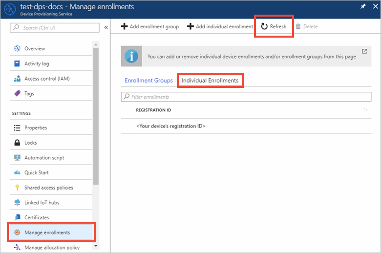

# Provision the device to an IoT hub using the Azure IoT Hub Device Provisioning Service

In the previous tutorial, you learned how to set up a device to connect to your DPS service. In this tutorial, you will learn how to provision this device to a single IoT hub using the DPS service. The DPS service allows you provision devices to your hub using **_enrollment lists_**. This tutorial shows you how to:

> [!div class="checklist"]
> * Enroll the device
> * Start the device
> * Verify the device is registered

## Prerequisites

Before you proceed, make sure to configure your device and its *Hardware Security Module* as discussed in the tutorial [Set up device for IoT DPS](./tutorial-set-up-device.md).

## Enroll the device

This step involves adding the device's unique security artifacts to the DPS service. These security artifacts are as follows:

- For TPM-based devices:
    - The *Endorsement Key* that is unique to each TPM chip or simulation. Read the [Understand TPM Endorsement Key](https://technet.microsoft.com/library/cc770443.aspx) for more information.
    - The *Registration ID* that is used to uniquely identify a device in the namespace/scope. This may or may not be the same as the device ID. The ID is mandatory for every device. For TPM-based devices, the registration ID may be derived from the TPM itself, for example, an SHA-256 hash of the TPM Endorsement Key.

    

- For X.509 based devices:
    - The [certificate issued to the X.509](https://msdn.microsoft.com/library/windows/desktop/bb540819.aspx) chip or simulation, in the form of either a *.pem* or a *.cer* file. For individual enrollment, you need to use the *signer certificate* for your X.509 system, while for enrollment groups, you need to use the *root certificate*.

    

There are two ways to enroll the device to the DPS service:

- **Enrollment Groups**
    This represents a group of devices that share a specific attestation mechanism. We recommend using an enrollment group for a large number of devices, which share a desired initial configuration, or for devices all going to the same tenant.

    

- **Individual Enrollments**
    This represents an entry for a single device that may register with the DPS. Individual enrollments may use either x509 certificates or SAS tokens (in a real or virtual TPM) as attestation mechanisms. We recommend using individual enrollments for devices which require unique initial configurations, or for devices which can only use SAS tokens via TPM or virtual TPM as the attestation mechanism. Individual enrollments may have the desired IoT hub device ID specified.

The following are the steps to enroll the device in the portal:

1. Note the security artifacts for the HSM on your device. You might need to use the APIs mentioned in the section titled [Extract security artifacts](./tutorial-set-up-device.md#extractsecurity) of the previous tutorial, in a development environment.

1. Log in to the Azure portal, click on the **All resources** button on the left-hand menu and open your DPS service.

1. On the DPS summary blade, select **Manage enrollments**. Select either **Individual Enrollments** tab or the **Enrollment Groups** tab as per your device setup. Click the **Add** button at the top. Select **TPM** or **X.509** as the identity attestation *Mechanism*, and enter the appropriate security artifacts as discussed previously. You may enter a new **IoT Hub device ID**. Once complete, click the **Save** button. 

1. When the device is successfully enrolled, you should see it displayed in the portal as following:

    

## Start the device

At this point, the following setup is ready for device registration:

1. Your device or group of devices are enrolled to your DPS service, and 
2. Your device is ready with the HSM chip configured and accessible through the application using the DPS client SDK.

Start the device to allow your DPS client application to start the registration with your DPS service.  

## Verify the device is registered

Once your device boots, the following actions should take place. See the TPM simulator sample application [dps_client_sample](https://github.com/Azure/azure-iot-device-auth/blob/master/dps_client/samples/dps_client_sample/dps_client_sample.c) for more details. 

1. The device sends a registration request to your DPS service.
2. For TPM devices, DPS sends back a registration challenge to which your device responds. 
3. On successful registration, DPS sends the IoT hub URI, device id and the encrypted key back to the device. 
4. The IoT Hub client application on the device then connects to your hub. 
5. On successful connection to the hub, you should see the device appear in the IoT hub's **Device Explorer**. 

    

## Next steps
In this tutorial, you learned how to:

> [!div class="checklist"]
> * Enroll the device
> * Start the device
> * Verify the device is registered

Advance to the next tutorial to learn how to provision multiple devices across load-balanced hubs. 

> [!div class="nextstepaction"]
> [Use DPS to provision devices across load balanced IoT hubs](./tutorial-provision-multiple-hubs.md)
