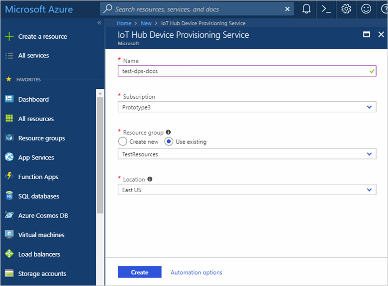

# Set up cloud for device provisioning

This tutorial shows how to set up the cloud for automatic device provisioning using the Device Provisioning Service (DPS). In this tutorial, you learn how to:

> [!div class="checklist"]
> * Use the Azure portal to create a DPS and get the scope ID
> * Create an IoT hub
> * Link the IoT hub to DPS
> * Set the allocation policy on the DPS

If you don't have an Azure subscription, create a [free account](https://azure.microsoft.com/free/) before you begin.

## Log in to the Azure portal

Log in to the [Azure portal](https://portal.azure.com/).

## Create a DPS and get the scope ID

Follow these steps to create a new DPS.

1. In the upper left-hand corner of the Azure portal, click **New**.
2. In the Search box, type **device provisioning**. 
3. Click **IoT Device Provisioning Service**.
4. Fill out the **IoT Device Provisioning Service** form with the following information:
	
   | Setting       | Suggested value | Description | 
   | ------------ | ------------------ | ------------------------------------------------- | 
   | **Name** | Any unique name | -- | 
   | **Subscription** | Your subscription  | For details about your subscriptions, see [Subscriptions](https://account.windowsazure.com/Subscriptions). |
   | **Resource group** | myResourceGroup | For valid resource group names, see [Naming rules and restrictions](https://docs.microsoft.com/azure/architecture/best-practices/naming-conventions). |
   | **Location** | Any valid location | For information about regions, see [Azure Regions](https://azure.microsoft.com/regions/). |   

   

5. Click **Create**.
6. The *scope ID* is used to identify registration IDs, and provides a guarantee that the registration ID is unique. To obtain this value, click **Overview** to open the **Essentials** page for the DPS. Copy the **Origin namespace** value, which is used as the scope ID, to a temporary location for later use.
7. Also make a note of the **Service endpoint** value, or copy it to a temporary location for later use. 

[!INCLUDE [iot-hub-get-started-create-hub](../../includes/iot-hub-get-started-create-hub.md)]

You have now created your IoT hub, and you have the host name and IoT Hub connection string that you need to complete the rest of this tutorial.

## Link the DPS to an IoT hub

The next step is to link the DPS and IoT hub so that DPS can register devices to that hub. The service can only provision devices to IoT hubs that have been linked to the DPS. Follow these steps.

1. In the **All resources** page, click the DPS you created previously.
2. In the DPS page, click **Linked IoT hubs**.
3. Click **Add**.
4. In the **Add link to IoT hub** page, use the radio buttons to specify whether the linked IoT hub is located in the current subscription, or in a different subscription. Then, choose the name of the IoT hub from the **IoT hub** box.
5. Click **Save**.

   

## Set the allocation policy on DPS

The allocation policy is a DPS setting that determines how devices are assigned to an IoT hub. There are three supported allocation policies: 

1. **Lowest latency**: Devices are provisioned to an IoT hub based on the hub with the lowest latency to the device.
2. **Evenly weighted distribution** (default): Linked IoT hubs are equally likely to have devices provisioned to them. This is the default setting. If you are provisioning devices to only one IoT hub, you can keep this setting. 
3. **Static configuration via the enrollment list**: Specification of the desired IoT hub in the enrollment list takes priority over the DPS-level allocation policy.

To set the allocation policy, in the DPS page click **Manage allocation policy**. Make sure the allocation policy is set to **Evenly weighted distribution** (the default).

## Clean up resources

Other tutorials in this collection build upon this tutorial. If you plan to continue on to work with subsequent quick starts or with the tutorials, do not clean up the resources created in this tutorial. If you do not plan to continue, use the following steps to delete all resources created by this tutorial in the Azure portal.

1. From the left-hand menu in the Azure portal, click **All resources** and then select your DPS instance. At the top of the **All resources** page, click **Delete**.  
2. From the left-hand menu in the Azure portal, click **All resources** and then select your IoT hub. At the top of the **All resources** page, click **Delete**.
 
## Next steps

In this tutorial, you learned how to:

> [!div class="checklist"]
> * Use the Azure portal to create a DPS and get the scope ID
> * Create an IoT hub
> * Link the IoT hub to DPS
> * Set the allocation policy on the DPS

Advance to the next tutorial to learn how to set up your device for provisioning.

> [!div class="nextstepaction"]
> [Set up device for provisioning](tutorial-set-up-device.md)
