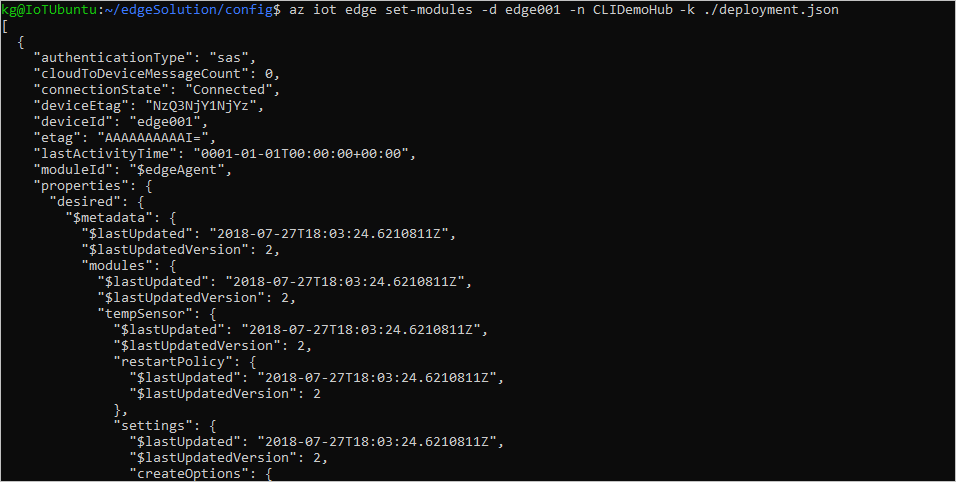

# Deploy Azure IoT Edge modules with Azure CLI

Once you create IoT Edge modules with your business logic, you want to deploy them to your devices to operate at the edge. If you have multiple modules that work together to collect and process data, you can deploy them all at once and declare the routing rules that connect them.

[Azure CLI](https://docs.microsoft.com/cli/azure?view=azure-cli-latest) is an open-source cross platform command-line tool for managing Azure resources such as IoT Edge. It enables you to manage Azure IoT Hub resources, device provisioning service instances, and linked-hubs out of the box. The new IoT extension enriches Azure CLI with features such as device management and full IoT Edge capability.

This article shows how to create a JSON deployment manifest, then use that file to push the deployment to an IoT Edge device. For information about creating a deployment that targets multiple devices based on their shared tags, see [Deploy and monitor IoT Edge modules at scale](how-to-deploy-cli-at-scale.md)

## Prerequisites

* An [IoT hub](../iot-hub/iot-hub-create-using-cli.md) in your Azure subscription.
* An IoT Edge device

  If you don't have an IoT Edge device set up, you can create one in an Azure virtual machine. Follow the steps in one of the quickstart articles to [Create a virtual Linux device](quickstart-linux.md) or [Create a virtual Windows device](quickstart.md).

* [Azure CLI](https://docs.microsoft.com/cli/azure/install-azure-cli) in your environment. At a minimum, your Azure CLI version must be 2.0.70 or above. Use `az --version` to validate. This version supports az extension commands and introduces the Knack command framework.
* The [IoT extension for Azure CLI](https://github.com/Azure/azure-iot-cli-extension).

## Configure a deployment manifest

A deployment manifest is a JSON document that describes which modules to deploy, how data flows between the modules, and desired properties of the module twins. For more information about how deployment manifests work and how to create them, see [Understand how IoT Edge modules can be used, configured, and reused](module-composition.md).

To deploy modules using the Azure CLI, save the deployment manifest locally as a .json file. You will use the file path in the next section when you run the command to apply the configuration to your device.

Here's a basic deployment manifest with one module as an example:

```json
{
  "content": {
    "modulesContent": {
      "$edgeAgent": {
        "properties.desired": {
          "schemaVersion": "1.0",
          "runtime": {
            "type": "docker",
            "settings": {
              "minDockerVersion": "v1.25",
              "loggingOptions": "",
              "registryCredentials": {}
            }
          },
          "systemModules": {
            "edgeAgent": {
              "type": "docker",
              "settings": {
                "image": "mcr.microsoft.com/azureiotedge-agent:1.0",
                "createOptions": "{}"
              }
            },
            "edgeHub": {
              "type": "docker",
              "status": "running",
              "restartPolicy": "always",
              "settings": {
                "image": "mcr.microsoft.com/azureiotedge-hub:1.0",
                "createOptions": "{\"HostConfig\":{\"PortBindings\":{\"5671/tcp\":[{\"HostPort\":\"5671\"}],\"8883/tcp\":[{\"HostPort\":\"8883\"}],\"443/tcp\":[{\"HostPort\":\"443\"}]}}}"
              }
            }
          },
          "modules": {
            "SimulatedTemperatureSensor": {
              "version": "1.0",
              "type": "docker",
              "status": "running",
              "restartPolicy": "always",
              "settings": {
                "image": "mcr.microsoft.com/azureiotedge-simulated-temperature-sensor:1.0",
                "createOptions": "{}"
              }
            }
          }
        }
      },
      "$edgeHub": {
        "properties.desired": {
          "schemaVersion": "1.0",
          "routes": {
            "upstream": "FROM /messages/* INTO $upstream"
          },
          "storeAndForwardConfiguration": {
            "timeToLiveSecs": 7200
          }
        }
      },
      "SimulatedTemperatureSensor": {
        "properties.desired": {
          "SendData": true,
          "SendInterval": 5
        }
      }
    }
  }
}
```

## Deploy to your device

You deploy modules to your device by applying the deployment manifest that you configured with the module information.

Change directories into the folder where your deployment manifest is saved. If you used one of the VS Code IoT Edge templates, use the `deployment.json` file in the **config** folder of your solution directory and not the `deployment.template.json` file.

Use the following command to apply the configuration to an IoT Edge device:

   ```azurecli
   az iot edge set-modules --device-id [device id] --hub-name [hub name] --content [file path]
   ```

The device ID parameter is case-sensitive. The content parameter points to the deployment manifest file that you saved.

   

## View modules on your device

Once you've deployed modules to your device, you can view all of them with the following command:

View the modules on your IoT Edge device:

   ```azurecli
   az iot hub module-identity list --device-id [device id] --hub-name [hub name]
   ```

The device ID parameter is case-sensitive.

   

## Next steps

Learn how to [Deploy and monitor IoT Edge modules at scale](how-to-deploy-at-scale.md)
