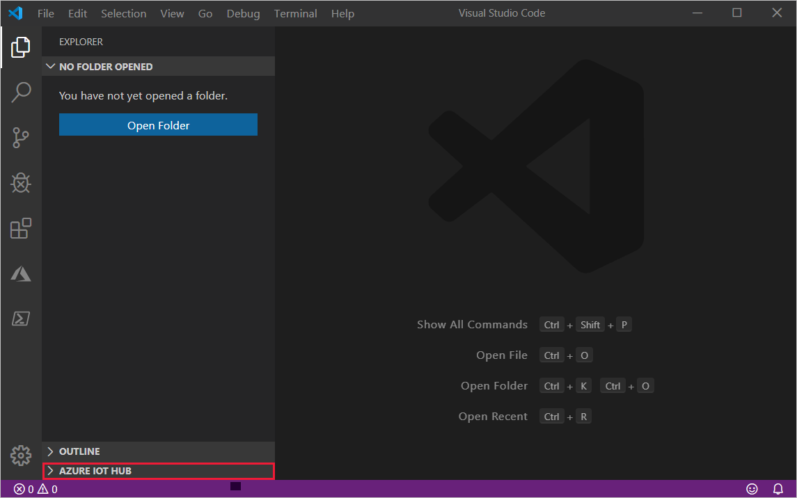
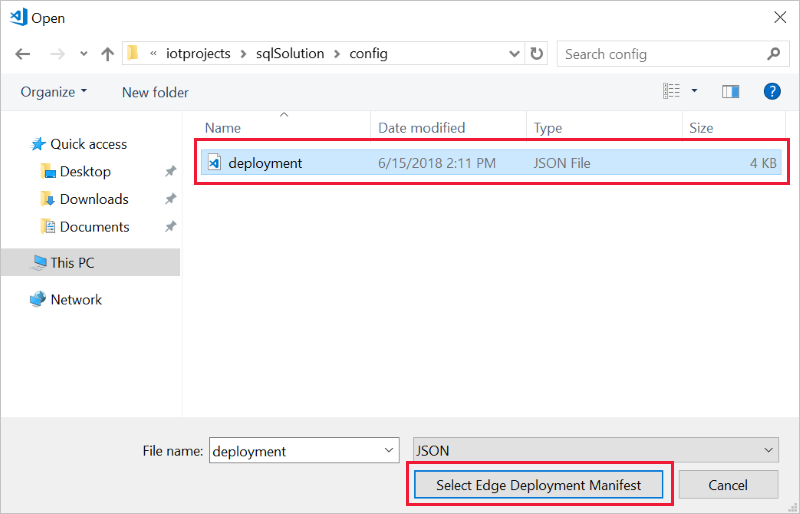

# Deploy Azure IoT Edge modules from Visual Studio Code

Once you create IoT Edge modules with your business logic, you want to deploy them to your devices to operate at the edge. If you have multiple modules that work together to collect and process data, you can deploy them all at once and declare the routing rules that connect them.

This article shows how to create a JSON deployment manifest, then use that file to push the deployment to an IoT Edge device. For information about creating a deployment that targets multiple devices based on their shared tags, see [Deploy and monitor IoT Edge modules at scale using Visual Studio Code](how-to-deploy-monitor-vscode.md).

## Prerequisites

* An [IoT hub](../iot-hub/iot-hub-create-through-portal.md) in your Azure subscription.
* An [IoT Edge device](how-to-register-device.md#register-with-visual-studio-code) with the IoT Edge runtime installed.
* [Visual Studio Code](https://code.visualstudio.com/).
* [Azure IoT Tools](https://marketplace.visualstudio.com/items?itemName=vsciot-vscode.azure-iot-tools#overview) for Visual Studio Code.

## Configure a deployment manifest

A deployment manifest is a JSON document that describes which modules to deploy, how data flows between the modules, and desired properties of the module twins. For more information about how deployment manifests work and how to create them, see [Understand how IoT Edge modules can be used, configured, and reused](module-composition.md).

To deploy modules using Visual Studio Code, save the deployment manifest locally as a .JSON file. You will use the file path in the next section when you run the command to apply the configuration to your device.

Here's a basic deployment manifest with one module as an example:

   ```json
   {
     "modulesContent": {
       "$edgeAgent": {
         "properties.desired": {
           "schemaVersion": "1.0",
           "runtime": {
             "type": "docker",
             "settings": {
               "minDockerVersion": "v1.25",
               "loggingOptions": "",
               "registryCredentials": {}
             }
           },
           "systemModules": {
             "edgeAgent": {
               "type": "docker",
               "settings": {
                 "image": "mcr.microsoft.com/azureiotedge-agent:1.0",
                 "createOptions": "{}"
               }
             },
             "edgeHub": {
               "type": "docker",
               "status": "running",
               "restartPolicy": "always",
               "settings": {
                 "image": "mcr.microsoft.com/azureiotedge-hub:1.0",
                 "createOptions": "{}"
               }
             }
           },
           "modules": {
             "SimulatedTemperatureSensor": {
               "version": "1.0",
               "type": "docker",
               "status": "running",
               "restartPolicy": "always",
               "settings": {
                 "image": "mcr.microsoft.com/azureiotedge-simulated-temperature-sensor:1.0",
                 "createOptions": "{}"
               }
             }
           }
         }
       },
       "$edgeHub": {
         "properties.desired": {
           "schemaVersion": "1.0",
           "routes": {
               "route": "FROM /* INTO $upstream"
           },
           "storeAndForwardConfiguration": {
             "timeToLiveSecs": 7200
           }
         }
       },
       "SimulatedTemperatureSensor": {
         "properties.desired": {}
       }
     }
   }
   ```

## Sign in to access your IoT hub

You can use the Azure IoT extensions for Visual Studio Code to perform operations with your IoT hub. For these operations to work, you need to sign in to your Azure account and select the IoT hub that you are working on.

1. In Visual Studio Code, open the **Explorer** view.

1. At the bottom of the Explorer, expand the **Azure IoT Hub** section.

   

1. Click on the **...** in the **Azure IoT Hub** section header. If you don't see the ellipsis, hover over the header.

1. Choose **Select IoT Hub**.

1. If you are not signed in to your Azure account, follow the prompts to do so.

1. Select your Azure subscription.

1. Select your IoT hub.

## Deploy to your device

You deploy modules to your device by applying the deployment manifest that you configured with the module information.

1. In the Visual Studio Code explorer view, expand the **Azure IoT Hub** section, and then expand the **Devices** node.

1. Right-click on the IoT Edge device that you want to configure with the deployment manifest.

    > [!TIP]
    > To confirm that the device you've chosen is an IoT Edge device, select it to expand the list of modules and verify the presence of **$edgeHub** and **$edgeAgent**. Every IoT Edge device includes these two modules.

1. Select **Create Deployment for Single Device**.

1. Navigate to the deployment manifest JSON file that you want to use, and click **Select Edge Deployment Manifest**.

   

The results of your deployment are printed in the VS Code output. Successful deployments are applied within a few minutes if the target device is running and connected to the internet.

## View modules on your device

Once you've deployed modules to your device, you can view all of them in the **Azure IoT Hub** section. Select the arrow next to your IoT Edge device to expand it. All the currently running modules are displayed.

If you recently deployed new modules to a device, hover over the **Azure IoT Hub Devices** section header and select the refresh icon to update the view.

Right-click the name of a module to view and edit the module twin.

## Next steps

Learn how to [Deploy and monitor IoT Edge modules at scale using Visual Studio Code](how-to-deploy-monitor.md)
