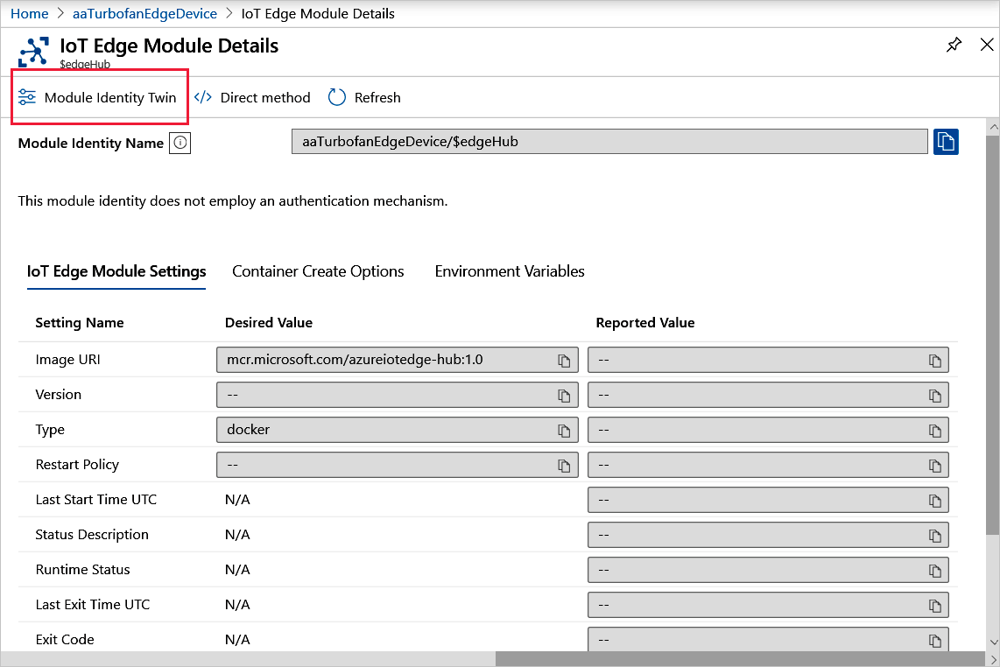

# Monitor using device and module twins

Azure IoT Edge provides reporting on the data collected from the device and module twins on the various states that devices and modules may have, as described in [Monitor IoT Edge deployments](how-to-monitor-iot-edge-deployments.md). This information enables you to monitor the status, conditions, and configurations you set for modules be deployed to IoT Edge devices and how reported property values compare with their desired property counterparts.

Going beyond the reporting capabilities in Azure IoT Hub, you may at times need to examine the device and module twins themselves. A device twin and a module twin are both JSON documents maintained in your IoT hub. 

Device twins are implicitly created and deleted when a device identity is created or deleted in IoT Hub. Similarly, once a module identity is created, a module twin is implicitly created in IoT Hub.

Device twins store device state information including metadata, configurations, and conditions. You can use a device twin to monitor:

* The synchronization of device conditions and configuration.
* Query long-running operations from the solution back end.

Module twins store module-related information that allows you to monitor:

* The operations that the modules and back ends can perform on module twins.
* Runtime data from the edgeHub and edgeAgent system modules.

A module twin defines capabilities for individual components of a device. On devices with multiple components, such as operating system-based devices or firmware devices, module twins allow for isolated configuration and conditions for each component.

For in-depth overviews, see [Understand and use device twins in IoT Hub](../iot-hub/iot-hub-devguide-device-twins.md) and [Understand and use module twins in IoT Hub](../iot-hub/iot-hub-devguide-module-twins.md).

## Monitoring the device and module twins in the Azure portal

To view the JSON for the device and module twins:

1. Sign in to the [Azure portal](https://portal.azure.com) and navigate to your IoT hub.
1. Select **IoT Edge** from the left pane menu.
1. On the **IoT Edge devices** tab, select the **Device ID** of device with the modules you want to monitor.

    * To view the device twin, select **Device Twin** from the upper menu bar.

        

    * To view the module twin, select the module name from the **Modules** tab and then select **Module Identity Town** from the upper menu bar.

        

    If you see the message "A module identity does not exist for this module", this error indicates that the back end solution is no longer available that originally created the identity.

## Pertinent device twin values to monitor

## Pertinent module twin values to monitor

## Next steps

Learn how to [communicate with EdgeAgent using built-in direct methods](how-to-edgeagent-direct-method.md).
