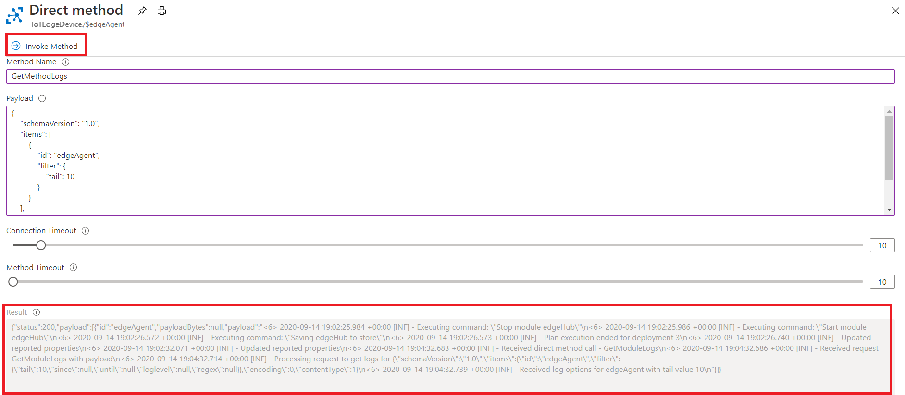
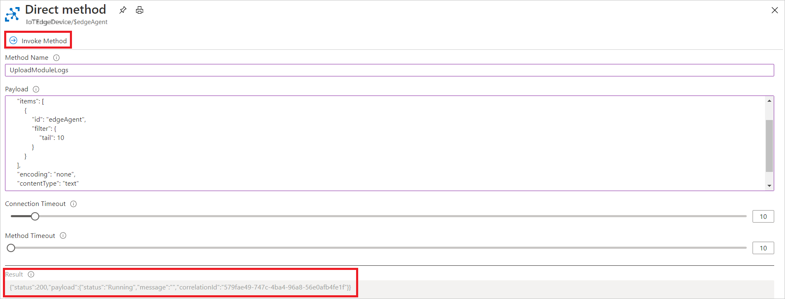
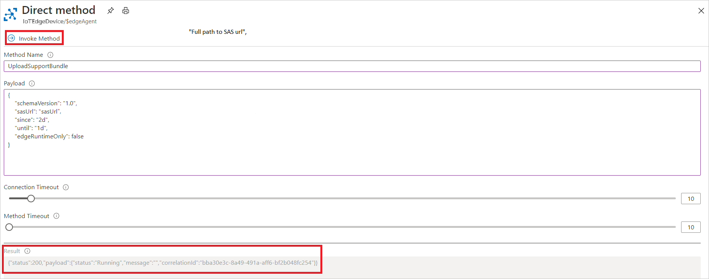
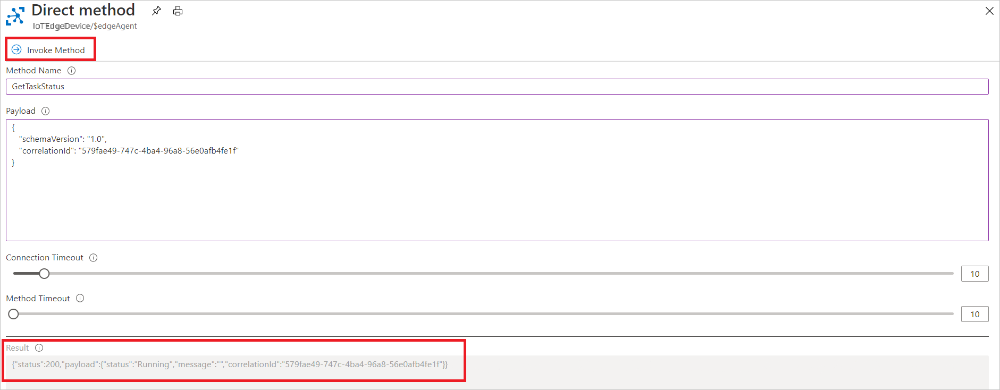

# Retrieve logs from IoT Edge deployments

Retrieve logs from your IoT Edge deployments without needing physical or SSH access to the device by using the direct methods included in the IoT Edge agent module. Direct methods are implemented on the device, and then can be invoked from the cloud. The IoT Edge agent includes direct methods that help you monitor and manage your IoT Edge devices remotely. The direct methods discussed in this article are generally available with the 1.0.10 release.

For more information about direct methods, how to use them, and how to implement them in your own modules, see [Understand and invoke direct methods from IoT Hub](../iot-hub/iot-hub-devguide-direct-methods.md).

The names of these direct methods are handled case-sensitive.

## Recommended logging format

While not required, for best compatibility with this feature, the recommended logging format is:

```
<{Log Level}> {Timestamp} {Message Text}
```

`{Log Level}` should follow the [Syslog severity level format](https://wikipedia.org/wiki/Syslog#Severity_lnevel) and `{Timestamp}` should be formatted as `yyyy-mm-dd hh:mm:ss.fff zzz`.

The [Logger class in IoT Edge](https://github.com/Azure/iotedge/blob/master/edge-util/src/Microsoft.Azure.Devices.Edge.Util/Logger.cs) serves as a canonical implementation.

## Retrieve module logs

Use the **GetModuleLogs** direct method to retrieve the logs of an IoT Edge module.

This method accepts a JSON payload with the following schema:

```json
    {
       "schemaVersion": "1.0",
       "items": [
          {
             "id": "regex string",
             "filter": {
                "tail": int,
                "since": int,
                "until": int,
                "loglevel": int,
                "regex": "regex string"
             }
          }
       ],
       "encoding": "gzip/none",
       "contentType": "json/text" 
    }
```

| Name | Type | Description |
|-|-|-|
| schemaVersion | string | Set to `1.0` |
| items | JSON array | An array with `id` and `filter` tuples. |
| ID | string | A regular expression that supplies the module name. It can match multiple modules on an edge device. [.NET Regular Expressions](/dotnet/standard/base-types/regular-expressions) format is expected. |
| filter | JSON section | Log filters to apply to the modules matching the `id` regular expression in the tuple. |
| tail | integer | Number of log lines in the past to retrieve starting from the latest. OPTIONAL. |
| since | integer | Only return logs since this time, as a duration (1 d, 90 m, 2 days 3 hours 2 minutes), rfc3339 timestamp, or UNIX timestamp.  If both `tail` and `since` are specified, the logs are retrieved using the `since` value first. Then, the `tail` value is applied to the result, and the final result is returned. OPTIONAL. |
| until | integer | Only return logs before the specified time, as an rfc3339 timestamp, UNIX timestamp, or duration (1 d, 90 m, 2 days 3 hours 2 minutes). OPTIONAL. |
| log level | integer | Filter log lines less than or equal to specified log level. Log lines should follow recommended logging format and use [Syslog severity level](https://en.wikipedia.org/wiki/Syslog#Severity_level) standard. OPTIONAL. |
| regex | string | Filter log lines that have content that match the specified regular expression using [.NET Regular Expressions](/dotnet/standard/base-types/regular-expressions) format. OPTIONAL. |
| encoding | string | Either `gzip` or `none`. Default is `none`. |
| contentType | string | Either `json` or `text`. Default is `text`. |

> [!NOTE]
> If the logs content exceeds the response size limit of direct methods, which is currently 128 KB, the response returns an error.

A successful retrieval of logs returns a **"status": 200** followed by a payload containing the logs retrieved from the module, filtered by the settings you specify in your request.

For example:

```azurecli
az iot hub invoke-module-method --method-name 'GetModuleLogs' -n <hub name> -d <device id> -m '$edgeAgent' --method-payload \
'
    {
       "schemaVersion": "1.0",
       "items": [
          {
             "id": "edgeAgent",
             "filter": {
                "tail": 10
             }
          }
       ],
       "encoding": "none",
       "contentType": "text"
    }
'
```

In the Azure portal, invoke the method with the method name `GetModuleLogs` and the following JSON payload:

```json
    {
       "schemaVersion": "1.0",
       "items": [
          {
             "id": "edgeAgent",
             "filter": {
                "tail": 10
             }
          }
       ],
       "encoding": "none",
       "contentType": "text"
    }
```



You can also pipe the CLI output to Linux utilities, like [gzip](https://en.wikipedia.org/wiki/Gzip), to process a compressed response. For example:

```azurecli
az iot hub invoke-module-method \
  --method-name 'GetModuleLogs' \
  -n <hub name> \
  -d <device id> \
  -m '$edgeAgent' \
  --method-payload '{"contentType": "text","schemaVersion": "1.0","encoding": "gzip","items": [{"id": "edgeHub","filter": {"since": "2d","tail": 1000}}],}' \
  -o tsv --query 'payload[0].payloadBytes' \
  | base64 --decode \
  | gzip -d
```

## Upload module logs

Use the **UploadModuleLogs** direct method to send the requested logs to a specified Azure Blob Storage container.

<!-- 1.2.0 -->
::: moniker range=">=iotedge-2020-11"

> [!NOTE]
> If you wish to upload logs from a device behind a gateway device, you will need to have the [blob storage module](https://docs.microsoft.com/azure/iot-edge/how-to-configure-api-proxy-module) configured on the top layer device.

::: moniker-end

This method accepts a JSON payload similar to **GetModuleLogs**, with the addition of the "sasUrl" key:

```json
    {
       "schemaVersion": "1.0",
       "sasUrl": "Full path to SAS URL",
       "items": [
          {
             "id": "regex string",
             "filter": {
                "tail": int,
                "since": int,
                "until": int,
                "loglevel": int,
                "regex": "regex string"
             }
          }
       ],
       "encoding": "gzip/none",
       "contentType": "json/text" 
    }
```

| Name | Type | Description |
|-|-|-|
| sasURL | string (URI) | [Shared Access Signature URL with write access to Azure Blob Storage container](/archive/blogs/jpsanders/easily-create-a-sas-to-download-a-file-from-azure-storage-using-azure-storage-explorer). |

A successful request to upload logs returns a **"status": 200** followed by a payload with the following schema:

```json
    {
        "status": "string",
        "message": "string",
        "correlationId": "GUID"
    }
```

| Name | Type | Description |
|-|-|-|
| status | string | One of `NotStarted`, `Running`, `Completed`, `Failed`, or `Unknown`. |
| message | string | Message if error, empty string otherwise. |
| correlationId | string   | ID to query to status of the upload request. |

For example:

The following invocation uploads the last 100 log lines from all modules, in compressed JSON format:

```azurecli
az iot hub invoke-module-method --method-name UploadModuleLogs -n <hub name> -d <device id> -m \$edgeAgent --method-payload \
'
    {
        "schemaVersion": "1.0",
        "sasUrl": "<sasUrl>",
        "items": [
            {
                "id": ".*",
                "filter": {
                    "tail": 100
                }
            }
        ],
        "encoding": "gzip",
        "contentType": "json"
    }
'
```

The following invocation uploads the last 100 log lines from edgeAgent and edgeHub with the last 1000 log lines from tempSensor module in uncompressed text format:

```azurecli
az iot hub invoke-module-method --method-name UploadModuleLogs -n <hub name> -d <device id> -m \$edgeAgent --method-payload \
'
    {
        "schemaVersion": "1.0",
        "sasUrl": "<sasUrl>",
        "items": [
            {
                "id": "edge",
                "filter": {
                    "tail": 100
                }
            },
            {
                "id": "tempSensor",
                "filter": {
                    "tail": 1000
                }
            }
        ],
        "encoding": "none",
        "contentType": "text"
    }
'
```

In the Azure portal, invoke the method with the method name `UploadModuleLogs` and the following JSON payload after populating the sasURL with your information:

```json
    {
       "schemaVersion": "1.0",
       "sasUrl": "<sasUrl>",
       "items": [
          {
             "id": "edgeAgent",
             "filter": {
                "tail": 10
             }
          }
       ],
       "encoding": "none",
       "contentType": "text"
    }
```



## Upload support bundle diagnostics

Use the **UploadSupportBundle** direct method to bundle and upload a zip file of IoT Edge module logs to an available Azure Blob Storage container. This direct method runs the [`iotedge support-bundle`](./troubleshoot.md#gather-debug-information-with-support-bundle-command) command on your IoT Edge device to obtain the logs.

<!-- 1.2.0 -->
::: moniker range=">=iotedge-2020-11"

> [!NOTE]
> If you wish to upload logs from a device behind a [gateway device](iot-edge-as-gateway.md), you will need to have the [blob storage module](https://docs.microsoft.com/azure/iot-edge/how-to-deploy-blob?view=iotedge-2018-06) configured on the top layer device.

::: moniker-end

This method accepts a JSON payload with the following schema:

```json
    {
        "schemaVersion": "1.0",
        "sasUrl": "Full path to SAS url",
        "since": "2d",
        "until": "1d",
        "edgeRuntimeOnly": false
    }
```

| Name | Type | Description |
|-|-|-|
| schemaVersion | string | Set to `1.0` |
| sasURL | string (URI) | [Shared Access Signature URL with write access to Azure Blob Storage container](/archive/blogs/jpsanders/easily-create-a-sas-to-download-a-file-from-azure-storage-using-azure-storage-explorer) |
| since | integer | Only return logs since this time, as a duration (1 d, 90 m, 2 days 3 hours 2 minutes), rfc3339 timestamp, or UNIX timestamp. OPTIONAL. |
| until | integer | Only return logs before the specified time, as an rfc3339 timestamp, UNIX timestamp, or duration (1 d, 90 m, 2 days 3 hours 2 minutes). OPTIONAL. |
| edgeRuntimeOnly | boolean | If true, only return logs from Edge Agent, Edge Hub, and the Edge Security Daemon. Default: false.  OPTIONAL. |

> [!IMPORTANT]
> IoT Edge support bundle may contain Personally Identifiable Information.

A successful request to upload logs returns a **"status": 200** followed by a payload with the same schema as the **UploadModuleLogs** response:

```json
    {
        "status": "string",
        "message": "string",
        "correlationId": "GUID"
    }
```

| Name | Type | Description |
|-|-|-|
| status | string | One of `NotStarted`, `Running`, `Completed`, `Failed`, or `Unknown`. |
| message | string | Message if error, empty string otherwise. |
| correlationId | string   | ID to query to status of the upload request. |

For example:

```azurecli
az iot hub invoke-module-method --method-name 'UploadSupportBundle' -n <hub name> -d <device id> -m '$edgeAgent' --method-payload \
'
    {
        "schemaVersion": "1.0",
        "sasUrl": "Full path to SAS url",
        "since": "2d",
        "until": "1d",
        "edgeRuntimeOnly": false
    }
'
```

In the Azure portal, invoke the method with the method name `UploadSupportBundle` and the following JSON payload after populating the sasURL with your information:

```json
    {
        "schemaVersion": "1.0",
        "sasUrl": "Full path to SAS url",
        "since": "2d",
        "until": "1d",
        "edgeRuntimeOnly": false
    }
```



## Get upload request status

Use the **GetTaskStatus** direct method to query the status of an upload logs request. The **GetTaskStatus** request payload uses the `correlationId` of the upload logs request to get the task's status. The `correlationId` is returned in response to the **UploadModuleLogs** direct method call.

This method accepts a JSON payload with the following schema:

```json
    {
      "schemaVersion": "1.0",
      "correlationId": "<GUID>"
    }
```

A successful request to upload logs returns a **"status": 200** followed by a payload with the same schema as the **UploadModuleLogs** response:

```json
    {
        "status": "string",
        "message": "string",
        "correlationId": "GUID"
    }
```

| Name | Type | Description |
|-|-|-|
| status | string | One of `NotStarted`, `Running`, `Completed`, `Failed`, or `Unknown`. |
| message | string | Message if error, empty string otherwise. |
| correlationId | string   | ID to query to status of the upload request. |

For example:

```azurecli
az iot hub invoke-module-method --method-name 'GetTaskStatus' -n <hub name> -d <device id> -m '$edgeAgent' --method-payload \
'
    {
      "schemaVersion": "1.0",
      "correlationId": "<GUID>"
    }
'
```

In the Azure portal, invoke the method with the method name `GetTaskStatus` and the following JSON payload after populating the GUID with your information:

```json
    {
      "schemaVersion": "1.0",
      "correlationId": "<GUID>"
    }
```



## Next steps

[Properties of the IoT Edge agent and IoT Edge hub module twins](module-edgeagent-edgehub.md)
