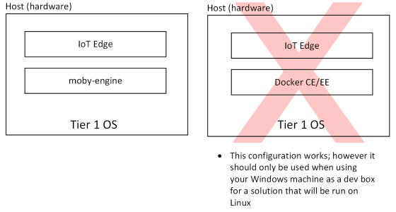
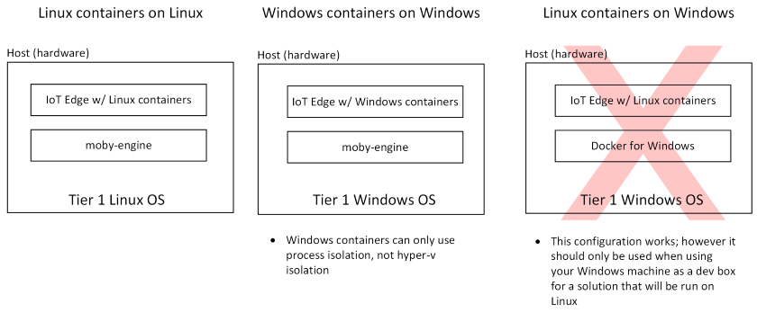
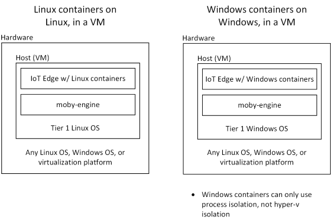

# Azure IoT Edge supported systems

There are a variety of ways to seek support for the Azure IoT Edge product.

**Reporting bugs** – The majority of development that goes into the Azure IoT Edge product happens in the IoT Edge open-source project. Bugs can be reported on the [issues page](https://github.com/azure/iotedge/issues) of the project. Fixes rapidly make their way from the project in to product updates.

**Microsoft Customer Support team** – Users who have a [support plan](https://azure.microsoft.com/support/plans/) can engage the Microsoft Customer Support team by creating a support ticket directly from the [Azure portal](https://ms.portal.azure.com/signin/index/?feature.settingsportalinstance=mpac).

**Feature requests** – The Azure IoT Edge product tracks feature requests via the product’s [User Voice page](https://feedback.azure.com/forums/907045-azure-iot-edge).

## Container engines
Azure IoT Edge needs a container engine to launch modules since they are implemented as containers. Microsoft provides a container engine, moby-engine, to fulfill this requirement. It is based on the Moby open-source project. Docker CE and Docker EE are other popular container engines. They are also based on the Moby open-source project and are compatible with Azure IoT Edge. Microsoft provides best effort support for systems using those container engines; however, Microsoft does not have the ability to ship fixes for issues in them. For this reason, Microsoft recommends using moby-engine on production systems.

 

## Operating systems
Azure IoT Edge runs on most operating systems that can run containers; however, all of these are not equally supported. Operating systems are grouped into tiers that represent the level of support users can expect.
* Tier 1 systems can be thought of as officially supported. This means that Microsoft:
    * has this operating system in automated tests
    * provides installation packages for them
* Tier 2 systems can be thought of as compatible with Azure IoT Edge and can be used relatively easily. This means that:
    * Microsoft has done ad hoc testing on the platforms or knows of a partner successfully running Azure IoT Edge on the platform
    * Installation packages for other platforms may work on these platforms
    
The family of the host OS must always match the family of the guest OS used inside a module's container. In other words, you can only use Linux containers on Linux and Windows containers on Windows. When using Windows, only process isolated containers are supported, not hyper-v isolated containers.  

 

### Tier 1
Generally available
| Operating System | AMD64 | ARM32v7 |
| ---------------- | ----- | ----- |
| Raspbian-stretch | No | Yes|
| Ubuntu Server 16.04 | Yes | No |
| Ubuntu Server 18.04 | Yes | No |

Public preview
| Operating System | AMD64 | ARM32v7 |
| ---------------- | ----- | ----- |
| Windows 10 IoT Core build 17763 | Yes | No |
| Windows 10 IoT Enterprise build 17763 | Yes | No |
| Windows Server 2019 | Yes | No |

The Windows OSes above are the requirements for devices which run Windows containers on Windows. This is the only supported configuration for production. The Azure IoT Edge installation packages for Windows allow the use of Linux containers on Windows; however, this is for development and testing only. Use of Linux containers on Windows is not a supported configuration for production. Any version of Windows 10 build 14393 or newer and Windows Server 2016 or newer can be used for this development scenario.

### Tier 2

| Operating System | AMD64 | ARM32v7 |
| ---------------- | ----- | ----- |
| CentOS 7.5 | Yes | Yes |
| Debian 8 | Yes | Yes |
| Debian 9 | Yes | Yes |
| RHEL 7.5 | Yes | Yes |
| Ubuntu 18.04 | Yes | Yes |
| Ubuntu 16.04 | Yes | Yes |
| Wind River 8 | Yes | No |
| Yocto | Yes | No |

## Virtual Machines
Azure IoT Edge can be run in virtual machines. This is common when customers want to augment existing infrastructure with edge intelligence. The family of the host VM OS must match the family of the guest OS used inside a module's container. This is the same requirement when Azure IoT Edge is run directly on a device. Azure IoT Edge is agnostic of the underlying virtualization technology and works in VMs powered by platforms like Hyper-V and vSphere.

 

## Minimum system requirements
Azure IoT Edge runs great on devices as small as a Raspberry Pi3 to server grade hardware. Choosing the right hardware for your scenario is very dependent on the workloads that you want to run. Making the final device decision can be complicated; however, you can easily start prototyping a solution on traditional laptops or desktops.

Experience while prototyping will help guide your final device selection. Questions you should consider include: how many modules comprise your workload, how many layers do your modules’ containers share, in what language are your modules written, how much data will your modules be processing, do your modules need any specialized hardware for accelerating their workloads, what are the desired performance characteristics of your solution, what is your hardware budget?
