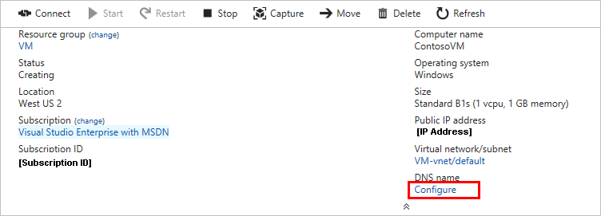
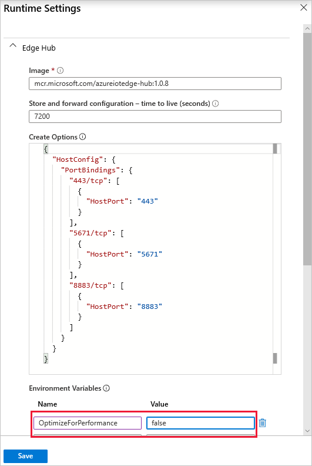

# Common issues and resolutions for Azure IoT Edge

Use this article to find steps to resolve common issues encountered when deploying IoT Edge solutions. If you need to learn how to find logs and errors from your IoT Edge device, see [Troubleshoot your IoT Edge device](troubleshoot.md).

## IoT Edge agent stops after about a minute

**Observed behavior:**

The edgeAgent module starts and runs successfully for about a minute, then stops. The logs indicate that the IoT Edge agent attempts to connect to IoT Hub over AMQP, and then attempts to connect using AMQP over WebSocket. When that fails, the IoT Edge agent exits.

Example edgeAgent logs:

```output
2017-11-28 18:46:19 [INF] - Starting module management agent.
2017-11-28 18:46:19 [INF] - Version - 1.0.7516610 (03c94f85d0833a861a43c669842f0817924911d5)
2017-11-28 18:46:19 [INF] - Edge agent attempting to connect to IoT Hub via AMQP...
2017-11-28 18:46:49 [INF] - Edge agent attempting to connect to IoT Hub via AMQP over WebSocket...
```

**Root cause:**

A networking configuration on the host network is preventing the IoT Edge agent from reaching the network. The agent attempts to connect over AMQP (port 5671) first. If the connection fails, it tries WebSockets (port 443).

The IoT Edge runtime sets up a network for each of the modules to communicate on. On Linux, this network is a bridge network. On Windows, it uses NAT. This issue is more common on Windows devices using Windows containers that use the NAT network.

**Resolution:**

Ensure that there is a route to the internet for the IP addresses assigned to this bridge/NAT network. Sometimes a VPN configuration on the host overrides the IoT Edge network.

## IoT Edge hub fails to start

**Observed behavior:**

The edgeHub module fails to start. You may see a message like one of the following errors in the logs:

```output
One or more errors occurred.
(Docker API responded with status code=InternalServerError, response=
{\"message\":\"driver failed programming external connectivity on endpoint edgeHub (6a82e5e994bab5187939049684fb64efe07606d2bb8a4cc5655b2a9bad5f8c80):
Error starting userland proxy: Bind for 0.0.0.0:443 failed: port is already allocated\"}\n)
```

Or

```output
info: edgelet_docker::runtime -- Starting module edgeHub...
warn: edgelet_utils::logging -- Could not start module edgeHub
warn: edgelet_utils::logging -- 	caused by: failed to create endpoint edgeHub on network nat: hnsCall failed in Win32:  
        The process cannot access the file because it is being used by another process. (0x20)
```

**Root cause:**

Some other process on the host machine has bound a port that the edgeHub module is trying to bind. The IoT Edge hub maps ports 443, 5671, and 8883 for use in gateway scenarios. The module fails to start if another process has already bound one of those ports.

**Resolution:**

You can resolve this issue two ways:

If the IoT Edge device is functioning as a gateway device, then you need to find and stop the process that is using port 443, 5671, or 8883. If the error specifies port 443, then the other process is usually a web server.

If you don't need to use the IoT Edge device as a gateway, then you can remove the port bindings from edgeHub's module create options. You can change the create options in the Azure portal or directly in the deployment.json file.

In the Azure portal:

1. Navigate to your IoT hub and select **IoT Edge**.

2. Select the IoT Edge device that you want to update.

3. Select **Set Modules**.

4. Select **Runtime Settings**.

5. In the **Edge Hub** module settings, delete everything from the **Create Options** text box.

6. Save your changes and create the deployment.

In the deployment.json file:

1. Open the deployment.json file that you applied to your IoT Edge device.

2. Find the `edgeHub` settings in the edgeAgent desired properties section:

   ```json
   "edgeHub": {
       "settings": {
           "image": "mcr.microsoft.com/azureiotedge-hub:1.0",
           "createOptions": "{\"HostConfig\":{\"PortBindings\":{\"8883/tcp\":[{\"HostPort\":\"8883\"}],\"443/tcp\":[{\"HostPort\":\"443\"}]}}}"
       },
       "type": "docker",
       "status": "running",
       "restartPolicy": "always"
   }
   ```

3. Remove the `createOptions` line, and the trailing comma at the end of the `image` line before it:

   ```json
   "edgeHub": {
       "settings": {
           "image": "mcr.microsoft.com/azureiotedge-hub:1.0"
       },
       "type": "docker",
       "status": "running",
       "restartPolicy": "always"
   }
   ```

4. Save the file and apply it to your IoT Edge device again.

## IoT Edge agent can't access a module's image (403)

A container fails to run, and the edgeAgent logs show a 403 error.

**Root cause:**

The IoT Edge agent doesn't have permissions to access a module's image.

**Resolution:**

Make sure that your registry credentials are correctly specified in your deployment manifest

## IoT Edge security daemon fails with an invalid hostname

**Observed behavior:**

The command `sudo journalctl -u iotedge` fails and prints the following message:

```output
Error parsing user input data: invalid hostname. Hostname cannot be empty or greater than 64 characters
```

**Root cause:**

The IoT Edge runtime can only support hostnames that are shorter than 64 characters. Physical machines usually don't have long hostnames, but the issue is more common on a virtual machine. The automatically generated hostnames for Windows virtual machines hosted in Azure, in particular, tend to be long.

**Resolution:**

When you see this error, you can resolve it by configuring the DNS name of your virtual machine, and then setting the DNS name as the hostname in the setup command.

1. In the Azure portal, navigate to the overview page of your virtual machine.
2. Select **configure** under DNS name. If your virtual machine already has a DNS name configured, you don't need to configure a new one.

   

3. Provide a value for **DNS name label** and select **Save**.
4. Copy the new DNS name, which should be in the format **\<DNSnamelabel\>.\<vmlocation\>.cloudapp.azure.com**.
5. Inside the virtual machine, use the following command to set up the IoT Edge runtime with your DNS name:

   * On Linux:

      ```bash
      sudo nano /etc/iotedge/config.yaml
      ```

   * On Windows:

      ```cmd
      notepad C:\ProgramData\iotedge\config.yaml
      ```

## Stability issues on smaller devices

**Observed behavior:**

You may encounter stability problems on constrained devices like the Raspberry Pi, especially when used as a gateway. Symptoms include out of memory exceptions in the edge hub module, downstream devices cannot connect or the device stops sending telemetry messages after a few hours.

**Root cause:**

The IoT Edge hub, which is part of the IoT Edge runtime, is optimized for performance by default and attempts to allocate large chunks of memory. This optimization is not ideal for constrained edge devices and can cause stability problems.

**Resolution:**

For the IoT Edge hub, set an environment variable **OptimizeForPerformance** to **false**. There are two ways to set environment variables:

In the Azure portal:

In your IoT Hub, select your IoT Edge device and from the device details page and select **Set Modules** > **Runtime Settings**. Create an environment variable for the Edge Hub module called *OptimizeForPerformance* that is set to *false*.



In the deployment manifest:

```json
"edgeHub": {
  "type": "docker",
  "settings": {
    "image": "mcr.microsoft.com/azureiotedge-hub:1.0",
    "createOptions": <snipped>
  },
  "env": {
    "OptimizeForPerformance": {
      "value": "false"
    }
  },
...
```

## Can't get the IoT Edge daemon logs on Windows

**Observed behavior:**

If you get an EventLogException when using `Get-WinEvent` on Windows, check your registry entries.

**Root cause:**

The `Get-WinEvent` PowerShell command relies on a registry entry to be present to find logs by a specific `ProviderName`.

**Resolution:**

Set a registry entry for the IoT Edge daemon. Create a **iotedge.reg** file with the following content, and import in to the Windows Registry by double-clicking it or using the `reg import iotedge.reg` command:

```reg
Windows Registry Editor Version 5.00

[HKEY_LOCAL_MACHINE\SYSTEM\CurrentControlSet\Services\EventLog\Application\iotedged]
"CustomSource"=dword:00000001
"EventMessageFile"="C:\\ProgramData\\iotedge\\iotedged.exe"
"TypesSupported"=dword:00000007
```

## IoT Edge module fails to send a message to the edgeHub with 404 error

**Observed behavior:**

A custom IoT Edge module fails to send a message to the edgeHub with a 404 `Module not found` error. The IoT Edge daemon prints the following message to the logs:

```output
Error: Time:Thu Jun  4 19:44:58 2018 File:/usr/sdk/src/c/provisioning_client/adapters/hsm_client_http_edge.c Func:on_edge_hsm_http_recv Line:364 executing HTTP request fails, status=404, response_buffer={"message":"Module not found"}u, 04 )
```

**Root cause:**

The IoT Edge daemon enforces process identification for all modules connecting to the edgeHub for security reasons. It verifies that all messages being sent by a module come from the main process ID of the module. If a message is being sent by a module from a different process ID than initially established, it will reject the message with a 404 error message.

**Resolution:**

As of version 1.0.7, all module processes are authorized to connect. If upgrading to 1.0.7 isn't possible, complete the following steps. For more information, see the [1.0.7 release changelog](https://github.com/Azure/iotedge/blob/master/CHANGELOG.md#iotedged-1).

Make sure that the same process ID is always used by the custom IoT Edge module to send messages to the edgeHub. For instance, make sure to `ENTRYPOINT` instead of `CMD` command in your Docker file, since `CMD` will lead to one process ID for the module and another process ID for the bash command running the main program whereas `ENTRYPOINT` will lead to a single process ID.

## Edge Agent module continually reports 'empty config file' and no modules start on the device

**Observed behavior:**

The device has trouble starting modules defined in the deployment. Only the edgeAgent is running but continually reporting 'empty config file...'.

**Root cause:**

By default, IoT Edge starts modules in their own isolated container network. The device may be having trouble with DNS name resolution within this private network.

**Resolution:**

**Option 1: Set DNS server in container engine settings**

Specify the DNS server for your environment in the container engine settings, which will apply to all container modules started by the engine. Create a file named `daemon.json` specifying the DNS server to use. For example:

```json
{
    "dns": ["1.1.1.1"]
}
```

The above example sets the DNS server to a publicly accessible DNS service. If the edge device cannot access this IP from its environment, replace it with DNS server address that is accessible.

Place `daemon.json` in the right location for your platform:

| Platform | Location |
| --------- | -------- |
| Linux | `/etc/docker` |
| Windows host with Windows containers | `C:\ProgramData\iotedge-moby\config` |

If the location already contains `daemon.json` file, add the **dns** key to it and save the file.

Restart the container engine for the updates to take effect.

| Platform | Command |
| --------- | -------- |
| Linux | `sudo systemctl restart docker` |
| Windows (Admin Powershell) | `Restart-Service iotedge-moby -Force` |

**Option 2: Set DNS server in IoT Edge deployment per module**

You can set DNS server for each module's *createOptions* in the IoT Edge deployment. For example:

```json
"createOptions": {
  "HostConfig": {
    "Dns": [
      "x.x.x.x"
    ]
  }
}
```

Be sure to set this configuration for the *edgeAgent* and *edgeHub* modules as well.

## Next steps

Do you think that you found a bug in the IoT Edge platform? [Submit an issue](https://github.com/Azure/iotedge/issues) so that we can continue to improve.

If you have more questions, create a [Support request](https://portal.azure.com/#create/Microsoft.Support) for help.
