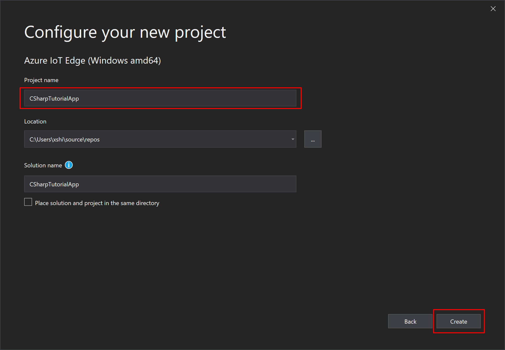
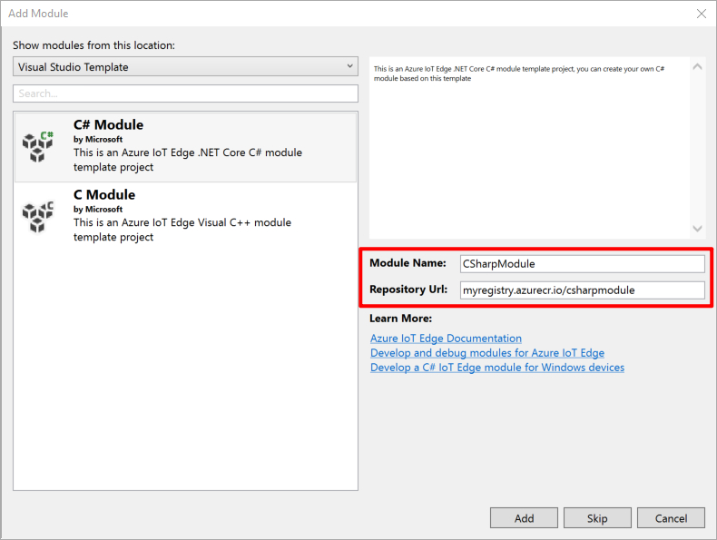
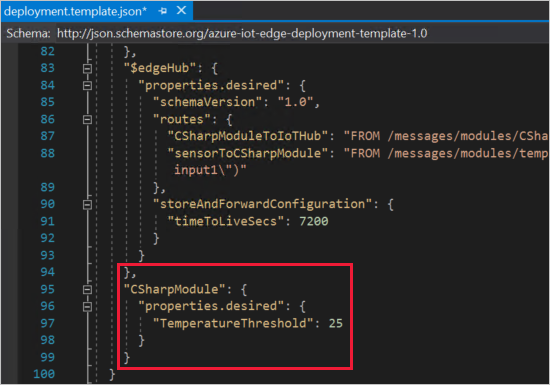
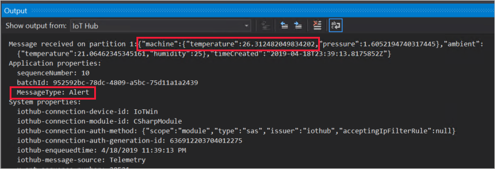

# Tutorial: Develop C# IoT Edge modules for Windows devices

This article shows you how to use Visual Studio to develop C# code and deploy it to a Windows device that's running Azure IoT Edge.

You can use Azure IoT Edge modules to deploy code that implements your business logic directly in your IoT Edge devices. This tutorial walks you through creating and deploying an IoT Edge module that filters sensor data. 

In this tutorial, you learn how to:

> [!div class="checklist"]
>
> * Use Visual Studio to create an IoT Edge module that's based on the C# SDK.
> * Use Visual Studio and Docker to create a Docker image and publish it to your registry.
> * Deploy the module to your IoT Edge device.
> * View generated data.

The IoT Edge module that you create in this tutorial filters the temperature data that's generated by your device. The module sends messages upstream only if the temperature exceeds a specified threshold. This type of analysis at the edge is useful for reducing the amount of data that's communicated to and stored in the cloud.

[!INCLUDE [quickstarts-free-trial-note](../../includes/quickstarts-free-trial-note.md)]

## Prerequisites

This tutorial demonstrates how to develop a module in C# by using Visual Studio 2019 and then deploy it to a Windows device. If you're developing modules for Linux devices, go to [Develop C# IoT Edge modules for Linux devices](tutorial-csharp-module.md) instead.

To understand your options for developing and deploying C# modules to Windows devices, refer to the following table:

| C# | Visual&nbsp;Studio&nbsp;Code | Visual Studio 2017&nbsp;and&nbsp;2019 |
| -- | :------------------: | :------------------: |
| Windows AMD64 develop |  |  |
| Windows AMD64 debug |   |  |

Before you begin this tutorial, set up your development environment by following the instructions in the [Develop IoT Edge modules for Windows devices](tutorial-develop-for-windows.md) tutorial. After you complete it, your environment will contain the following prerequisites:

* A free or standard-tier [IoT hub](../iot-hub/iot-hub-create-through-portal.md) in Azure.
* A [Windows device that's running Azure IoT Edge](quickstart.md).
* A container registry, such as [Azure Container Registry](../container-registry/index.yml).
* [Visual Studio 2019](/visualstudio/install/install-visual-studio), configured with the [Azure IoT Edge Tools](https://marketplace.visualstudio.com/items?itemName=vsc-iot.vs16iotedgetools) extension.
* [Docker Desktop](https://docs.docker.com/docker-for-windows/install/), configured to run Windows containers.

> [!TIP]
> If you're using Visual Studio 2017 (version 15.7 or later), download and install Azure IoT Edge Tools for Visual Studio 2017 from [Visual Studio Marketplace](https://marketplace.visualstudio.com/items?itemName=vsc-iot.vsiotedgetools).

## Create a module project

In this section, you create an IoT Edge module project by using Visual Studio and the Azure IoT Edge Tools extension. After you create a project template, you'll add new code so that the module filters out messages based on their reported properties.

### Create a new project

Azure IoT Edge Tools provides project templates for all supported IoT Edge module languages in Visual Studio. These templates have all the files and code that you need to deploy a working module for testing IoT Edge. They can also give you a starting point for customizing them with your own business logic.

1. Open Visual Studio 2019, and then select **Create New Project**.

1. On the **Create a new project** pane, search for **IoT Edge** and then, in the results list, select the **Azure IoT Edge (Windows amd64)** project.

   

1. Select **Next**.

    The **Configure your new project** pane opens.

   

1. On the **Configure your new project** pane, rename the project and solution to something more descriptive, such as **CSharpTutorialApp**. 

1. Select **Create** to create the project.

   The **Add Module** pane opens.

   

1. On the **Configure your new project** page, do the following:

   a. On the left pane, select the **C# Module** template.  
   b. In the **Module Name** box, enter **CSharpModule**.  
   c. In the **Repository Url** box, replace **localhost:5000** with the **Login server** value from your Azure container registry, in the following format: `<registry name>.azurecr.io/csharpmodule`

    > [!NOTE]
    > An image repository includes the name of your container registry and the name of your container image. Your container image is prepopulated from the module project-name value.  You can retrieve the login server from the overview page of your container registry in the Azure portal.

1. Select **Add** to create the project.

### Add your registry credentials

The deployment manifest shares the credentials for your container registry with the IoT Edge runtime. The runtime needs these credentials to pull your private images onto the IoT Edge device. Use the credentials from the **Access keys** section of your Azure container registry.

1. In Visual Studio Solution Explorer, open the *deployment.template.json* file.

1. Look for the **registryCredentials** property in the $edgeAgent desired properties. The registry address of the property should be autofilled with the information you provided when you created the project. The username and password fields should contain variable names. For example:

   ```json
   "registryCredentials": {
     "<registry name>": {
       "username": "$CONTAINER_REGISTRY_USERNAME_<registry name>",
       "password": "$CONTAINER_REGISTRY_PASSWORD_<registry name>",
       "address": "<registry name>.azurecr.io"
     }
   }
   ```

1. Open the environment (ENV) file in your module solution. By default, the file is hidden in Solution Explorer, so you might need to select the **Show All Files** button to display it. The ENV file should contain the same username and password variables that you saw in the *deployment.template.json* file.

1. Add the **Username** and **Password** values from your Azure container registry.

1. Save your changes to the ENV file.

### Update the module with custom code

The default module code receives messages in an input queue and passes them along through an output queue. Let's add some additional code so that the module processes the messages at the edge before forwarding them to your IoT hub. Update the module so that it analyzes the temperature data in each message and sends the message to the IoT hub only if the temperature exceeds a certain threshold.

1. In Visual Studio, select **CSharpModule** > **Program.cs**.

1. At the top of the **CSharpModule** namespace, add three **using** statements for types that are used later:

    ```csharp
    using System.Collections.Generic;     // For KeyValuePair<>
    using Microsoft.Azure.Devices.Shared; // For TwinCollection
    using Newtonsoft.Json;                // For JsonConvert
    ```

1. Add the **temperatureThreshold** variable to the **Program** class after the counter variable. The temperatureThreshold variable sets the value that the measured temperature must exceed for the data to be sent to the IoT hub.

    ```csharp
    static int temperatureThreshold { get; set; } = 25;
    ```

1. Add the **MessageBody**, **Machine**, and **Ambient** classes to the **Program** class after the variable declarations. These classes define the expected schema for the body of incoming messages.

    ```csharp
    class MessageBody
    {
        public Machine machine {get;set;}
        public Ambient ambient {get; set;}
        public string timeCreated {get; set;}
    }
    class Machine
    {
        public double temperature {get; set;}
        public double pressure {get; set;}
    }
    class Ambient
    {
        public double temperature {get; set;}
        public int humidity {get; set;}
    }
    ```

1. Look for the **Init** method. This method creates and configures a **ModuleClient** object, which allows the module to connect to the local Azure IoT Edge runtime to send and receive messages. The code also registers a callback to receive messages from an IoT Edge hub via the **input1** endpoint.

   Replace the entire Init method with the following code:

   ```csharp
   static async Task Init()
   {
       AmqpTransportSettings amqpSetting = new AmqpTransportSettings(TransportType.Amqp_Tcp_Only);
       ITransportSettings[] settings = { amqpSetting };

       // Open a connection to the Edge runtime.
       ModuleClient ioTHubModuleClient = await ModuleClient.CreateFromEnvironmentAsync(settings);
       await ioTHubModuleClient.OpenAsync();
       Console.WriteLine("IoT Hub module client initialized.");

       // Read the TemperatureThreshold value from the module twin's desired properties.
       var moduleTwin = await ioTHubModuleClient.GetTwinAsync();
       await OnDesiredPropertiesUpdate(moduleTwin.Properties.Desired, ioTHubModuleClient);

       // Attach a callback for updates to the module twin's desired properties.
       await ioTHubModuleClient.SetDesiredPropertyUpdateCallbackAsync(OnDesiredPropertiesUpdate, null);

       // Register a callback for messages that are received by the module.
       await ioTHubModuleClient.SetInputMessageHandlerAsync("input1", FilterMessages, ioTHubModuleClient);
   }
   ```

   This updated Init method still sets up the connection to the IoT Edge runtime with the ModuleClient, but it also adds new functionality. It reads the module twin's desired properties to retrieve the **temperatureThreshold** value. It then creates a callback that listens for any future updates to the module twin's desired properties. With this callback, you can update the temperature threshold in the module twin remotely, and the changes will be incorporated into the module.

   The updated Init method also changes the existing **SetInputMessageHandlerAsync** method. In the sample code, incoming messages on *input1* are processed with the *PipeMessage* function, but we want to change that to use the *FilterMessages* function that we'll create in the following steps.

1. Add a new **onDesiredPropertiesUpdate** method to the **Program** class. This method receives updates on the desired properties from the module twin, and it updates the **temperatureThreshold** variable to match. All modules have their own module twin, which lets you configure the code that's running inside a module directly from the cloud.

    ```csharp
    static Task OnDesiredPropertiesUpdate(TwinCollection desiredProperties, object userContext)
    {
        try
        {
            Console.WriteLine("Desired property change:");
            Console.WriteLine(JsonConvert.SerializeObject(desiredProperties));

            if (desiredProperties["TemperatureThreshold"]!=null)
                temperatureThreshold = desiredProperties["TemperatureThreshold"];

        }
        catch (AggregateException ex)
        {
            foreach (Exception exception in ex.InnerExceptions)
            {
                Console.WriteLine();
                Console.WriteLine("Error when receiving desired property: {0}", exception);
            }
        }
        catch (Exception ex)
        {
            Console.WriteLine();
            Console.WriteLine("Error when receiving desired property: {0}", ex.Message);
        }
        return Task.CompletedTask;
    }
    ```

1. Remove the sample **PipeMessage** method and replace it with a new **FilterMessages** method. This method is called whenever the module receives a message from the IoT Edge hub. It filters out messages that report temperatures below the temperature threshold that's set via the module twin. The method also adds the **MessageType** property to the message with the value set to **Alert**.

    ```csharp
    static async Task<MessageResponse> FilterMessages(Message message, object userContext)
    {
        var counterValue = Interlocked.Increment(ref counter);
        try
        {
            ModuleClient moduleClient = (ModuleClient)userContext;
            var messageBytes = message.GetBytes();
            var messageString = Encoding.UTF8.GetString(messageBytes);
            Console.WriteLine($"Received message {counterValue}: [{messageString}]");

            // Get the message body.
            var messageBody = JsonConvert.DeserializeObject<MessageBody>(messageString);

            if (messageBody != null && messageBody.machine.temperature > temperatureThreshold)
            {
                Console.WriteLine($"Machine temperature {messageBody.machine.temperature} " +
                    $"exceeds threshold {temperatureThreshold}");
                using(var filteredMessage = new Message(messageBytes))
                {
                    foreach (KeyValuePair<string, string> prop in message.Properties)
                    {
                        filteredMessage.Properties.Add(prop.Key, prop.Value);
                    }

                    filteredMessage.Properties.Add("MessageType", "Alert");
                    await moduleClient.SendEventAsync("output1", filteredMessage);
                }
            }

            // Indicate that the message treatment is completed.
            return MessageResponse.Completed;
        }
        catch (AggregateException ex)
        {
            foreach (Exception exception in ex.InnerExceptions)
            {
                Console.WriteLine();
                Console.WriteLine("Error in sample: {0}", exception);
            }
            // Indicate that the message treatment is not completed.
            var moduleClient = (ModuleClient)userContext;
            return MessageResponse.Abandoned;
        }
        catch (Exception ex)
        {
            Console.WriteLine();
            Console.WriteLine("Error in sample: {0}", ex.Message);
            // Indicate that the message treatment is not completed.
            ModuleClient moduleClient = (ModuleClient)userContext;
            return MessageResponse.Abandoned;
        }
    }
    ```

1. Save the *Program.cs* file.

1. Open the *deployment.template.json* file in your IoT Edge solution. This file tells the IoT Edge agent which modules to deploy and tells the IoT Edge hub how to route messages between them. Here, the modules to deploy are **SimulatedTemperatureSensor** and **CSharpModule**.

1. Add the **CSharpModule** module twin to the deployment manifest. Insert the following JSON content at the bottom of the `modulesContent` section, after the **$edgeHub** module twin:

    ```json
       "CSharpModule": {
           "properties.desired":{
               "TemperatureThreshold":25
           }
       }
    ```

    

1. Save the *deployment.template.json* file.

## Build and push your module

In the preceding section, you created an IoT Edge solution and added code to the **CSharpModule** module twin to filter out messages where the reported machine temperature is below the acceptable threshold. Now you need to build the solution as a container image and push it to your container registry.

### Sign in to Docker

1. Use the following command to sign in to Docker on your development machine. Use the username, password, and login server from your Azure container registry. You can retrieve these values from the **Access keys** section of your registry in the Azure portal.

   ```cmd
   docker login -u <ACR username> -p <ACR password> <ACR login server>
   ```

   You might receive a security warning that recommends the use of `--password-stdin`. Although we recommend this as a best practice for production scenarios, it's outside the scope of this tutorial. For more information, see the [docker login reference](https://docs.docker.com/engine/reference/commandline/login/#provide-a-password-using-stdin).

### Build and push

1. In Visual Studio Solution Explorer, right-click the name of the project that you want to build. The default name is **AzureIotEdgeApp1** and, because you're building a Windows module, the extension should be **Windows.Amd64**.

1. Select **Build and Push IoT Edge Modules**.

   The build and push command starts three operations:
   * First, it creates a new folder in the solution named *config*, which holds the full deployment manifest. It's built from information in the deployment template and other solution files. 
   * Second, it runs `docker build` to build the container image, based on the appropriate Dockerfile for your target architecture. 
   * Finally, it runs `docker push` to push the image repository to your container registry.

   This process might take several minutes the first time, but it will go faster the next time you run the commands.

## Deploy modules to the device

Use Visual Studio Cloud Explorer and the Azure IoT Edge Tools extension to deploy the module project to your IoT Edge device. You've already prepared a deployment manifest for your scenario, the *deployment.windows-amd64.json* file in the *config* folder. All you need to do now is select a device to receive the deployment.

Make sure that your IoT Edge device is up and running.

1. In Visual Studio Cloud Explorer, expand the resources to view your list of IoT devices.

1. Right-click the name of the IoT Edge device that you want to receive the deployment.

1. Select **Create Deployment**.

1. In Visual Studio File Explorer, select the *deployment.windows-amd64.json* file in the *config* folder of your solution.

1. Refresh Cloud Explorer to view the deployed modules that are listed under your device.

## View generated data

After you apply the deployment manifest to your IoT Edge device, the IoT Edge runtime on the device collects the new deployment information and starts executing on it. Any modules that are running on the device but not included in the deployment manifest are stopped. Any modules that are missing from the device are started.

You can use the IoT Edge Tools extension to view messages as they arrive at your IoT hub.

1. In Visual Studio Cloud Explorer, select the name of your IoT Edge device.

1. In the **Actions** list, select **Start Monitoring Built-in Event Endpoint**.

1. View the messages that are arriving at your IoT hub. It might take a while for the messages to arrive, because the IoT Edge device has to receive its new deployment and start all the modules. The changes to the CSharpModule code must wait until the machine temperature reaches 25 degrees before the messages can be sent. The code also adds the message type **Alert** to any messages that reach that temperature threshold.

   

## Edit the module twin

You used the CSharpModule module twin to set the temperature threshold at 25 degrees. You can use the module twin to change the functionality without having to update the module code.

1. In Visual Studio, open the *deployment.windows-amd64.json* file. 

   Do *not* open the *deployment.template* file. If you don't see the deployment manifest in the *config* file in Solution Explorer, select the **Show all files** icon in the Solution Explorer toolbar.

1. Look for the CSharpModule twin, and change the value of the **temperatureThreshold** parameter to a new temperature that's 5 to 10 degrees higher than the latest reported temperature.

1. Save the *deployment.windows-amd64.json* file.

1. Follow the deployment instructions again to apply the updated deployment manifest to your device.

1. Monitor the incoming device-to-cloud messages. The messages should stop until the new temperature threshold is reached.

## Clean up resources

If you plan to continue to the next recommended article, you can keep and reuse the resources and configurations that you created in this tutorial. You can also keep using the same IoT Edge device as a test device.

Otherwise, to avoid incurring charges, you can delete the local configurations and the Azure resources that you used here.

[!INCLUDE [iot-edge-clean-up-cloud-resources](../../includes/iot-edge-clean-up-cloud-resources.md)]

## Next steps

In this tutorial, you created an IoT Edge module with code to filter raw data that's generated by your IoT Edge device.

To learn how Azure IoT Edge can help you deploy Azure cloud services to process and analyze data at the edge, continue on to the next tutorials.

> [!div class="nextstepaction"]
> [Azure Functions](tutorial-deploy-function.md)
> [Azure Stream Analytics](tutorial-deploy-stream-analytics.md)
> [Azure Machine Learning](tutorial-deploy-machine-learning.md)
> [Custom Vision service](tutorial-deploy-custom-vision.md)
