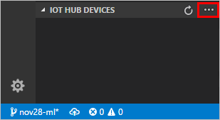
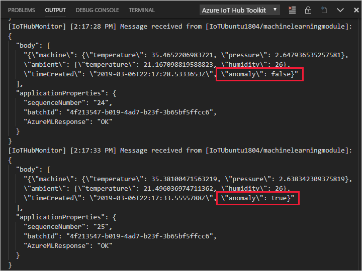

# Deploy Azure Machine Learning as an IoT Edge module

You can use IoT Edge modules to deploy code that implements your business logic directly to your IoT Edge devices. This tutorial walks you through deploying an Azure Machine Learning module that predicts when a device fails based on sensor data on the simulated IoT Edge device that you created in the [Deploy Azure IoT Edge on a simulated device on Windows][lnk-tutorial1-win] or [Linux][lnk-tutorial1-lin] tutorials.

In this tutorial, you learn how to:

> [!div class="checklist"]
> * Create an Azure Machine Learning module
> * Push a module container to an Azure container registry
> * Deploy an Azure Machine Learning module to your IoT Edge device
> * View generated data

The Azure Machine Learning module that you create in this tutorial reads the environmental data generated by your device and labels the messages as anomalous or not.

## Prerequisites

* The Azure IoT Edge device that you created in the quickstart or first tutorial.
* The IoT Hub connection string for the IoT hub that your IoT Edge device connects to.
* An Azure Machine Learning account. To create an account, follow the instructions in [Create Azure Machine Learning accounts and install Azure Machine Learning Workbench](../machine-learning/service/quickstart-installation.md#create-azure-machine-learning-services-accounts). You do not need to install the workbench application for this tutorial. 
* Module Management for Azure ML on your machine. To set up your environment and create an account, follow the instructions in [Model management setup](../machine-learning/desktop-workbench/deployment-setup-configuration.md).

The Azure Machine Learning module does not support ARM processors.

## Create the Azure ML container
In this section, you download the trained model files and convert them into an Azure ML container.

On the machine running Module Management for Azure ML, download and save [iot_score.py](https://github.com/Azure/ai-toolkit-iot-edge/blob/master/IoT%20Edge%20anomaly%20detection%20tutorial/iot_score.py) and [model.pkl](https://github.com/Azure/ai-toolkit-iot-edge/blob/master/IoT%20Edge%20anomaly%20detection%20tutorial/model.pkl) from the Azure ML IoT Toolkit on GitHub. These files define the trained machine learning model that you will deploy to your Iot Edge device.

Use the trained model to create a container that can be deployed to IoT Edge devices. Use the following command to:

   * Register your model.
   * Create a manifest.
   * Create a Docker container image named *machinelearningmodule*.
   * Deploy the image to your Azure Kubernetes Service (AKS) cluster.

```cmd
az ml service create realtime --model-file model.pkl -f iot_score.py -n machinelearningmodule -r python
```

### View the container repository

Check that your container image was successfully created and stored in the Azure container repository that is associated with your machine learning environment.

1. On the [Azure portal](https://portal.azure.com), go to **All Services** and Select **Container registries**.
2. Select your registry. The name should start with **mlcr** and it belongs to the resource group, location, and subscription that you used to set up Module Management.
3. Select **Access keys**
4. Copy the **Login server**, **Username**, and **Password**.  You need these to access the registry from your Edge devices.
5. Select **Repositories**
6. Select **machinelearningmodule**
7. You now have the full image path of the container. Take note of this image path for the next section. It should look like this:  **<registry_name>.azureacr.io/machinelearningmodule:1**

## Add registry credentials to your Edge device

Add the credentials for your registry to the Edge runtime on the computer where you are running your Edge device. This command gives the runtime access to pull the container.

Linux:
   ```cmd
   sudo iotedgectl login --address <registry-login-server> --username <registry-username> --password <registry-password>
   ```

Windows:
   ```cmd
   iotedgectl login --address <registry-login-server> --username <registry-username> --password <registry-password>
   ```

## Run the solution

1. On the [Azure portal](https://portal.azure.com), navigate to your IoT hub.
1. Go to **IoT Edge** and select your IoT Edge device.
1. Select **Set modules**.
1. If you've previously deployed the tempSensor module to your IoT Edge device, it may autopopulate. If it's not already in your list of modules, add it.
    1. Select **Add IoT Edge Module**.
    2. In the **Name** field, enter `tempSensor`.
    3. In the **Image URI** field, enter `microsoft/azureiotedge-simulated-temperature-sensor:1.0-preview`.
    4. Select **Save**.
1. Add the machine learning module that you created.
    1. Select **Add IoT Edge Module**.
    1. In the **Name** field, enter `machinelearningmodule`
    1. In the **Image** field, enter your image address; for example `<registry_name>.azurecr.io/machinelearningmodule:1`.
    1. Select **Save**.
1. Back in the **Add Modules** step, select **Next**.
1. In the **Specify Routes** step, copy the JSON below into the text box. The first route transports messages from the temperature sensor to the machine learning module via the "amlInput" endpoint, which is the endpoint that all Azure Machine Learning modules use. The second route transports messages from the machine learning module to IoT Hub. In this route, ''amlOutput'' is the endpoint that all Azure Machine Learning modules use to output data, and ''$upstream'' denotes IoT Hub.

    ```json
    {
        "routes": {
            "sensorToMachineLearning":"FROM /messages/modules/tempSensor/outputs/temperatureOutput INTO BrokeredEndpoint(\"/modules/machinelearningmodule/inputs/amlInput\")",
            "machineLearningToIoTHub": "FROM /messages/modules/machinelearningmodule/outputs/amlOutput INTO $upstream"
        }
    }
    ```

1. Select **Next**.
1. In the **Review Template** step, select **Submit**.
1. Return to the device details page and select **Refresh**.  You should see the new **machinelearningmodule** running along with the **tempSensor** module and the IoT Edge runtime modules.

## View generated data

You can view the device-to-cloud messages that your IoT Edge device sends by using the [IoT Hub explorer](https://github.com/azure/iothub-explorer) or the Azure IoT Toolkit extension for Visual Studio Code.

1. In Visual Studio Code, select **IoT Hub Devices**.
2. Select **...** then select **Set IoT Hub Connection String** from the menu.

   

3. In the text box that opens at the top of the page, enter the iothubowner connection string for your IoT Hub. Your IoT Edge device should appear in the IoT Hub Devices list.
4. Select **...** again then select **Start monitoring D2C message**.
5. Observe the messages coming from tempSensor every five seconds. The message body contains a property called **anomaly** which the machinelearningmodule provides with a true or false value. The **AzureMLResponse** property contains the value "OK" if the model ran successfully.

   

## Next steps

In this tutorial, you deployed an IoT Edge module powered by Azure Machine Learning. You can continue on to any of the other tutorials to learn about other ways that Azure IoT Edge can help you turn data into business insights at the edge.

> [!div class="nextstepaction"]
> [Filter sensor data using C# code](tutorial-csharp-module.md)

<!--Links-->
[lnk-tutorial1-win]: quickstart.md
[lnk-tutorial1-lin]: quickstart-linux.md
