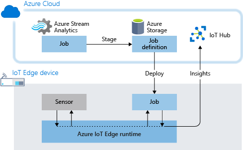
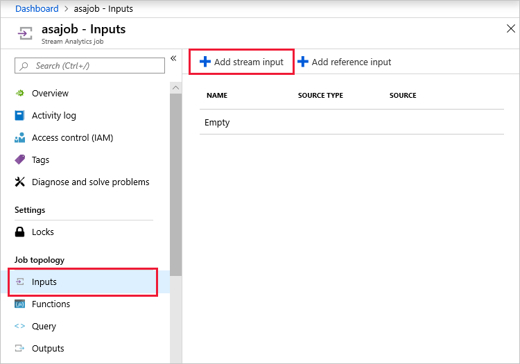
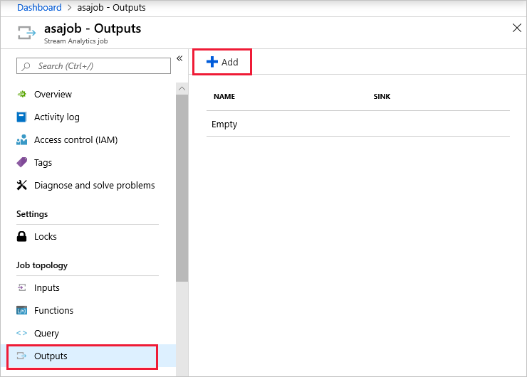
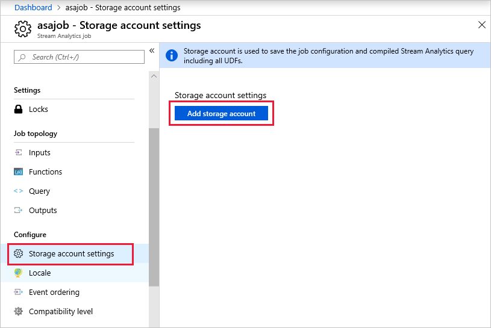
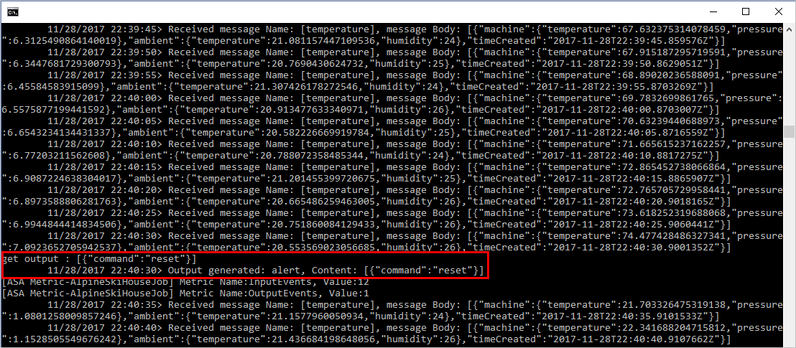

# Tutorial: Deploy Azure Stream Analytics as an IoT Edge module

Many IoT solutions use analytics services to gain insight about data as it arrives in the cloud from IoT devices. With Azure IoT Edge, you can take [Azure Stream Analytics](https://docs.microsoft.com/azure/stream-analytics/) logic and move it onto the device itself. By processing telemetry streams at the edge, you can reduce the amount of uploaded data and reduce the time it takes to react to actionable insights.

Azure IoT Edge and Azure Stream Analytics are integrated so that you can create an Azure Stream Analytics job in the Azure portal and then deploy it as an IoT Edge module with no additional code.  

Azure Stream Analytics provides a richly structured query syntax for data analysis, both in the cloud and on IoT Edge devices. For more information, see [Azure Stream Analytics documentation](../stream-analytics/stream-analytics-edge.md).

The Stream Analytics module in this tutorial calculates the average temperature over a rolling 30-second window. When that average reaches 70, the module sends an alert for the device to take action. In this case, that action is to reset the simulated temperature sensor. In a production environment, you might use this functionality to shut off a machine or take preventative measures when the temperature reaches dangerous levels. 

In this tutorial, you learn how to:

> [!div class="checklist"]
> * Create an Azure Stream Analytics job to process data on the edge.
> * Connect the new Azure Stream Analytics job with other IoT Edge modules.
> * Deploy the Azure Stream Analytics job to an IoT Edge device from the Azure portal.

<center>


</center>


[!INCLUDE [quickstarts-free-trial-note](../../includes/quickstarts-free-trial-note.md)]

## Prerequisites

An Azure IoT Edge device:

* You can use an Azure virtual machine as an IoT Edge device by following the steps in the quickstart for [Linux](quickstart-linux.md) or [Windows devices](quickstart.md).

Cloud resources:

* A free or standard-tier [IoT Hub](../iot-hub/iot-hub-create-through-portal.md) in Azure. 


## Create an Azure Stream Analytics job

In this section, you create an Azure Stream Analytics job that will do the following steps:
* Receive data from your IoT Edge device.
* Query the telemetry data for values outside a set range.
* Take action on the IoT Edge device based on the query results. 

### Create a storage account

When you create an Azure Stream Analytics job to run on an IoT Edge device, it needs to be stored in a way that can be called from the device. You can use an existing Azure storage account, or create a new one now. 

1. In the Azure portal, go to **Create a resource** > **Storage** > **Storage account**. 

1. Provide the following values to create your storage account:

   | Field | Value |
   | ----- | ----- |
   | Subscription | Choose the same subscription as your IoT hub. |
   | Resource group | We recommend that you use the same resource group for all of the test resources that you create during the IoT Edge quickstarts and tutorials. For example, **IoTEdgeResources**. |
   | Name | Provide a unique name for your storage account. | 
   | Location | Choose a location close to you. |


1. Keep the default values for the other fields and select **Review + Create**.

1. Review your settings then select **Create**.

### Create a new job

1. In the Azure portal, go to **Create a resource** > **Internet of Things** > **Stream Analytics job**.

1. Provide the following values to create your job:

   | Field | Value |
   | ----- | ----- |
   | Job name | Provide a name for your job. For example, **IoTEdgeJob** | 
   | Subscription | Choose the same subscription as your IoT hub. |
   | Resource group | We recommend that you use the same resource group for all of the test resources that you create during the IoT Edge quickstarts and tutorials. For example, **IoTEdgeResources**. |
   | Location | Choose a location close to you. | 
   | Hosting environment | Select **Edge**. |
 
1. Select **Create**.

### Configure your job

Once your Stream Analytics job is created in the Azure portal, you can configure it with an input, an output, and a query to run on the data that passes through. 

Using the three elements of input, output, and query, this section creates a job that receives temperature data from the IoT Edge device. It analyzes that data in a rolling 30-second window. If the average temperature in that window goes over 70 degrees, then an alert is sent to the IoT Edge device. You'll specify exactly where the data comes from and goes in the next section when you deploy the job.  

1. Navigate to your Stream Analytics job in the Azure portal. 

1. Under **Job Topology**, select **Inputs** then **Add stream input**.

   

1. Choose **Edge Hub** from the drop-down list.

1. In the **New input** pane, enter **temperature** as the input alias. 

1. Keep the default values for the other fields, and select **Save**.

1. Under **Job Topology**, open **Outputs** then select **Add**.

   

1. Choose **Edge Hub** from the drop-down list.

1. In the **New output** pane, enter **alert** as the output alias. 

1. Keep the default values for the other fields, and select **Save**.

1. Under **Job Topology**, select **Query**.

1. Replace the default text with the following query. The SQL code sends a reset command to the alert output if the average machine temperature in a 30-second window reaches 70 degrees. The reset command has been pre-programmed into the sensor as an action that can be taken. 

    ```sql
    SELECT  
        'reset' AS command 
    INTO 
       alert 
    FROM 
       temperature TIMESTAMP BY timeCreated 
    GROUP BY TumblingWindow(second,30) 
    HAVING Avg(machine.temperature) > 70
    ```

1. Select **Save**.

### Configure IoT Edge settings

To prepare your Stream Analytics job to be deployed on an IoT Edge device, you need to associate the job with a container in a storage account. When you go to deploy your job, the job definition is exported to the storage container. 

1. Under **Configure**, select **Storage account settings** then select **Add storage account**. 

   

1. Select the **Storage account** that you created at the beginning of this tutorial from the drop-down menu.

1. For the **Container** field, select **Create new** and provide a name for the storage container. 

1. Select **Save**. 

## Deploy the job

You are now ready to deploy the Azure Stream Analytics job on your IoT Edge device. 

In this section, you use the **Set Modules** wizard in the Azure portal to create a *deployment manifest*. A deployment manifest is a JSON file that describes all the modules that will be deployed to a device, the container registries that store the module images, how the modules should be managed, and how the modules can communicate with each other. Your IoT Edge device retrieves its deployment manifest from IoT Hub, then uses the information in it to deploy and configure all of its assigned modules. 

For this tutorial, you deploy two modules. The first is **SimulatedTemperatureSensor**, which is a module that simulates a temperature and humidity sensor. The second is your Stream Analytics job. The sensor module provides the stream of data that your job query will analyze. 

1. In the Azure portal, navigate to your IoT hub.

1. Go to **IoT Edge**, and then open the details page for your IoT Edge device.

1. Select **Set modules**.  

1. If you previously deployed the SimulatedTemperatureSensor module on this device, it might autopopulate. If it does not, add the module with the following steps:

   1. Click **Add** and select **IoT Edge Module**.
   1. For the name, type **SimulatedTemperatureSensor**.
   1. For the image URI, enter **mcr.microsoft.com/azureiotedge-simulated-temperature-sensor:1.0**. 
   1. Leave the other settings unchanged and select **Save**.

1. Add your Azure Stream Analytics Edge job with the following steps:

   1. Click **Add** and select **Azure Stream Analytics Module**.
   1. Select your subscription and the Azure Stream Analytics Edge job that you created. 
   1. Select **Save**.

   Once you save your changes, the details of your Stream Analytics job are published to the storage container that you created. 

1. When the Stream Analytics module is added to the list of modules, select **Configure** to see how it's structured. 

   The image URI points to a standard Azure Stream Analytics image. This one image is used for every Stream Analytics module that gets deployed to an IoT Edge device. 

   The module twin is configured with a desired property called **ASAJobInfo**. The value of that property points to the job definition in your storage container. This property is how the Stream Analytics image is configured with your specific job details. 

   By default, the Stream Analytics module takes the same name as the job it's based on. You can change the module name on this page if you like, but it's not necessary. 

1. Close the module configuration page.

1. Make a note of the name of your Stream Analytics module because you'll need it in the next step, then select **Next** to continue.

1. Replace the default value in **Routes** with the following code. Update all three instances of _{moduleName}_ with the name of your Azure Stream Analytics module. 

    ```json
    {
        "routes": {
            "telemetryToCloud": "FROM /messages/modules/SimulatedTemperatureSensor/* INTO $upstream",
            "alertsToCloud": "FROM /messages/modules/{moduleName}/* INTO $upstream",
            "alertsToReset": "FROM /messages/modules/{moduleName}/* INTO BrokeredEndpoint(\"/modules/SimulatedTemperatureSensor/inputs/control\")",
            "telemetryToAsa": "FROM /messages/modules/SimulatedTemperatureSensor/* INTO BrokeredEndpoint(\"/modules/{moduleName}/inputs/temperature\")"
        }
    }
    ```

   The routes that you declare here define the flow of data through the IoT Edge device. The telemetry data from tempSensor are sent to IoT Hub and to the **temperature** input that was configured in the Stream Analytics job. The **alert** output messages are sent to IoT Hub and to the tempSensor module to trigger the reset command. 

1. Select **Next**.

1. In the **Review Deployment** step, you can see how the information you provided in the wizard is converted into a JSON deployment manifest. When you're done reviewing the manifest, select **Submit**.

1. Return to the device details page, and then select **Refresh**.  

    You should see the new Stream Analytics module running, along with the IoT Edge agent and IoT Edge hub modules. It may take a few minutes for the information to reach your IoT Edge device, and then for the new modules to start. If you don't see the modules running right away, continue refreshing the page.

    

## View data

Now you can go to your IoT Edge device to check out the interaction between the Azure Stream Analytics module and the tempSensor module.

1. Check that all the modules are running in Docker:

   ```cmd/sh
   iotedge list  
   ```
   <!--
   
   -->
1. View all system logs and metrics data. Use the Stream Analytics module name:

   ```cmd/sh
   iotedge logs -f {moduleName}  
   ```

1. View the reset command affect the SimulatedTemperatureSensor by viewing the sensor logs:

   ```cmd/sh
   iotedge logs SimulatedTemperatureSensor
   ```

   You can watch the machine's temperature gradually rise until it reaches 70 degrees for 30 seconds. Then the Stream Analytics module triggers a reset, and the machine temperature drops back to 21. 

   

## Clean up resources 

If you plan to continue to the next recommended article, you can keep the resources and configurations that you created and reuse them. You can also keep using the same IoT Edge device as a test device. 

Otherwise, you can delete the local configurations and the Azure resources that you used in this article to avoid charges. 
 
[!INCLUDE [iot-edge-clean-up-cloud-resources](../../includes/iot-edge-clean-up-cloud-resources.md)]


## Next steps

In this tutorial, you configured an Azure Streaming Analytics job to analyze data from your IoT Edge device. You then loaded this Azure Stream Analytics module on your IoT Edge device to process and react to temperature increase locally, as well as sending the aggregated data stream to the cloud. To see how Azure IoT Edge can create more solutions for your business, continue on to the other tutorials.

> [!div class="nextstepaction"] 
> [Deploy an Azure Machine Learning model as a module](tutorial-deploy-machine-learning.md)
