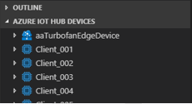
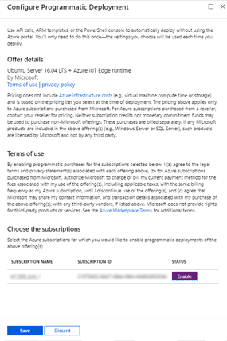
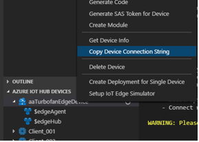

# Tutorial: Configure an IoT Edge device

In this section we configure an Azure Virtual Machine running Linux as an Azure IoT Edge device. We set up the device to act as a transparent gateway. The transparent gateway configuration allows devices to connect to Azure IoT Hub through the gateway without being aware that the gateway exists. At the same time, a user interacting with the devices in IoT Hub is unaware of the intermediate gateway device. Ultimately, we will use the transparent gateway to add edge analytics to our system by adding edge modules to the gateway.

The steps in this section are typically performed by a cloud developer.

### 1.3 Generate certificates

For a device to function as a gateway it needs to be able to securely connect to downstream devices. Azure IoT Edge allows you to use a public key infrastructure (PKI) to set up secure connections between devices. In this case, we’re allowing a downstream device to connect to an IoT Edge device acting as a transparent gateway. To maintain reasonable security, the downstream device should confirm the identity of the Edge device. A detailed explanation of certificate use in IoT Edge can be found in this [document](iot-edge-certs.md).

In this section, we create the self-signed certificates using a Docker image that we will build and run. We chose to use a Docker image to complete this step as it significantly reduced the number of steps needed to create the certificates on the Windows development machine. See [Generate certificates with Windows](how-to-create-transparent-gateway.md#generate-certificates-with-windows) for the details on how to produce the certificates without using a container. [Generate certificates with Linux](how-to-create-transparent-gateway.md#generate-certificates-with-linux) has the set of instructions that we automated with the Docker image.

1.  Sign in to your development virtual machine.

2.  Open a command line prompt and run the following command to create a directory on the VM. 
    
    ```cmd
    mkdir c:\\edgecertificates
    ```

3.  Start **Docker for Windows** from the Windows Start menu.

4.  Open Visual Studio Code.

5.  Select **File** > **Open Folder…** and choose **C:\\source\\IoTEdgeAndMlSample\\CreateCertificates**.

6.  Right-click on the dockerfile and choose **Build Image**.

7.  In the dialog accept the default value for the image name and tag, **createcertificates:latest**.

8.  Wait for the build to complete.

    > [!NOTE]
    > You may see a warning for about a missing public key, it is safe to ignore this warning. Likewise, you will see a security warning that recommends you check/reset permissions on you image, which is safe to ignore for this image.

9.  In the Visual Studio Code terminal window, run the createcertificates container.

    ```
    docker run --name createcertificates --rm -v
    c:\\edgeCertificates:/edgeCertificates createcertificates
    /edgeCertificates
    ```

10. Docker will prompt for access to the **C:\\** drive. Select **Share it**.

11. Provide your credentials when prompted.

12. Once the container finishes running check for the following files in **c:\\edgecertificates**:
    
    * **C:\\edgeCertificates\\certs\\azure-iot-test-only.root.ca.cert.pem**
    * **C:\\edgeCertificates\\certs\\new-edge-device-full-chain.cert.pem**
    * **C:\\edgeCertificates\\certs\\new-edge-device.cert.pem**
    * **C:\\edgeCertificates\\certs\\new-edge-device.cert.pfx**
    * **C:\\edgeCertificates\\private\\new-edge-device.key.pem**
    
### 1.4 Upload certificates to Azure Key Vault

To store our certificates securely and to make them accessible from multiple devices we will upload the certificates into Azure Key Vault. As you can see from the list above, we have 2 types of certificate files. We will treat the PFX\[1\] as Key Vault Certificates to be uploaded to Key Vault. The PEM\[2\] files are plain text and we will treat them as Key Vault Secrets. We will use the Key Vault associated with the Azure Machine Learning service workspace we created by running the [Azure Notebooks](#configure-iot-edge-device).

1.  Navigate to the [Azure portal](https://portal.azure.com) and navigate to your Machine Learning service workspace.

2.  From the overview page of the Machine Learning service workspace, copy the name of the Key Vault.

    

3.  On your development machine, upload the certificates to Key Vault. Replace **\<subscriptionId\>** and **\<keyvaultname\>** with your resource information.

    ```powershell
    C:\\source\\IoTEdgeAndMlSample\\CreateCertificates\\upload-keyvaultcerts.ps1
    -SubscriptionId \<subscriptionId\> -KeyVaultName \<keyvaultname\>
    ```

4.  If prompted, sign in to Azure.

5.  The script will run for few minutes with output like:  

    

### 1.5 Create Azure IoT Hub Edge device

To connect an Azure IoT Edge device to an IoT Hub, we first create a representation of the edge device in the hub. We take the connection string from the hub device representation and use it to configure the runtime on our edge device. Once the edge device has been configured and connects to the hub, we are able to deploy modules and send messages. We can also change the configuration of the edge device by changing the configuration of the corresponding device representation in IoT hub.

You can create an Azure IoT Edge device in the hub in multiple ways including creating using the [Azure portal](how-to-register-device-portal.md), using [Azure CLI](how-to-register-device-cli.md), or, as we do here, using Visual Studio Code.

1.  On your development machine open Visual Studio Code.

2.  Open the **Azure IoT Hub devices** frame from the Visual Studio Code explorer view.

3.  Click on the ellipsis and select **Create IoT Edge Device**.

4.  Give the device a name. For convenience, we use **aaTurbofanEdgeDevice** so it sorts ahead of all of the client devices we created earlier through the device harness to send the test data.

5.  The new device will appear in the devices view.  

    

### 1.6 Deploy Azure VM

We use the [Azure IoT Edge on Ubuntu](https://azuremarketplace.microsoft.com/marketplace/apps/microsoft_iot_edge.iot_edge_vm_ubuntu?tab=Overview) image from the Azure Marketplace to create our edge device for this walk-through. The Azure IoT Edge on Ubuntu image installs the latestAzure IoT Edge runtime and its dependencies on startup. We will deploy the VM using a PowerShell script, `Create-EdgeVM.ps1`; an ARM template, `IoTEdgeVMTemplate.json`; and a shell script, `install packages.sh`.

#### 1.6.1 Enable programmatic deployment

To use the image from the marketplace in a scripted deployment we need to enable programmatic deployment for the image.

1.  Sign in to the Azure portal.

2.  Select **All services**.

3.  In the search bar, enter and select **Marketplace**.

4.  In the search bar, enter and select **Ubuntu Server 16.04 LTS + Azure IoT Edge runtime**.

6.  Select the hyperlink, **Want to deploy programmatically? Get started**.

7.  Select the **Enable** button, then **Save**.

    

8.  You will see a success notification.

#### 1.6.2 Create virtual machine

Next run the script to create the edge device virtual machine.

1.  Open a PowerShell window and navigate to the **EdgeVM** directory.

    ```powershell
    cd C:\\source\\IoTEdgeAndMlSample\\EdgeVM”
    ```

2.  Run the script to create the virtual machine.

    ```powershell
    .\\Create-EdgeVm.ps1
    ```

3.  When prompted, provide values for each parameter. For subscription, resource group, and location we recommend you use the same as you have for all resources throughout this tutorial.
    
    * **Azure Subscription ID**: found in the Azure portal
    * **Resource Group Name**: memorable name for grouping the resources for your walk-through
    * **Location**: Azure location where the virtual machine will be created. For example, westus2 or northeurope. For more, see all [Azure locations](https://azure.microsoft.com/global-infrastructure/locations/)
    * **AdminUsername**: the name for the admin account you will use to sign in to the virtual machine
    * **AdminPassword**: the password to set for the AdminUsername on the virtual machine

4.  For the script to be able to set up the VM, you need to login to Azure with the credentials associated with the Azure Subscription you are using.

5.  The script confirms the information for the creation of your VM. Press `y` or `Enter` to continue.

6.  The script will run for several minutes as it executes the following steps:
    
    * Create the resource group if it does not exist already
    * Create the virtual machine
    * Add NSG exceptions for the VM for ports 22 (SSH), 5671 (AMQP), 5672 (AMPQ), and 443 (SSL)
    * Install the [Azure CLI](https://docs.microsoft.com/cli/azure/install-azure-cli-apt?view=azure-cli-latest))

7.  The script outputs the SSH connection string for connecting to the VM. Copy the connection string for the next step.

    

### 1.7 Connect to the VM using SSH

The next several steps will be configuring the Azure VM we just created. The first step is to get connected to the virtual machine.

1.  Open a command prompt and paste the SSH connection string you copied from the script output. Enter your own information for username, suffix, and region according to the values you supplied to the powershell script in the previous section.

    ```cmd
    ssh -l \<username\> iotedge-\<suffix\>.\<region\>.cloudapp.azure.com
    ```

2.  When prompted to validate the authenticity of the host, type **yes** and hit `enter`.

3.  When prompted, provide your password.

4.  Ubuntu displays a welcome message and then you should see a prompt like `<username>@<machinename>:~$`.

### 1.8 Download Key Vault certificates

We [uploaded the certificates](#upload-certificates-to-azure-key-vault) to Key Vault to make them available for our edge device and our leaf device, which is a downstream device that uses the edge device as a gateway to communicate with IoT Hub. We will deal with the leaf device later in the walkthrough. In this step, we will download the certificates to the edge device.

1.  From the SSH session on the Linux virtual machine, sign in to Azure with the Azure CLI. 

    ```bash
    az login
    ```

2.  You will be prompted to open a browser to <https://microsoft.com/devicelogin> and provide a unique code. You can perform these steps on your local machine. Close the browser window when you're done authenticating. 

3.  When you complete the login, the remote VM will login and list your Azure subscriptions.

4.  At the SSH prompt, set the Azure subscription that you want to use for Azure CLI commands. 

    ```bash
    az account set --subscription \<subscription id\>
    ```
    
5.  Create a directory on the VM for the certificates.

    ```bash
    sudo mkdir /edgeMlCertificates
    ```

8.  Download the certificates that you stored in the key vault: new-edge-device-full-chain.cert.pem, new-edge-device.key.pem and azure-iot-test-only.root.ca.cert.pem

    ```bash
    key\_vault\_name="\<key vault name\>"
    ```

### 1.9 Update the IoT Edge device configuration

The Edge runtime uses the file /etc/iotedge/config.yaml to persist its configuration. We need to update 3 pieces of information in this file:

* **Device connection string**: the device connection string for this device needs to be set to the value of the connection string for the device we created in the hub
* **Certificates:** the IoT Edge runtime needs to be told which certificates it should use for connections made with downstream devices
* **Hostname:** the hostname needs to exactly match the fully qualified domain name (FQDN) of the VM IoT Edge device.

The *Ubuntu Server 16.04 LTS + Azure IoT Edge runtime* image that we used to create the Edge VM comes with a shell script that updates the config.yaml with the connection string.

1.  In Visual Studio Code right-click on the IoT Edge device, then select **Copy Device Connection String**.

    

2.  In your SSH session run the command to update the config.yaml file with your device connection string.

    ```bash
    sudo /etc/iotedge/configedge.sh "<your_iothub_edge_device_connection_string>"
    ```

Next we will update the certificates and hostname by directly editing the config.yaml.

1.  Open the config.yaml file.

    ```bash
    sudo nano /etc/iotedge/config.yaml
    ```

2.  Update the certificates section of the config.yaml by removing the leading **#** and setting the path so this (right-click in the Linux terminal to paste copied text):

    ```yaml
    \# certificates:
    \#   device\_ca\_cert: "\<ADD PATH TO DEVICE CA CERTIFICATE HERE\>"
    \#   device\_ca\_pk: "\<ADD PATH TO DEVICE CA PRIVATE KEY HERE\>"
    \#   trusted\_ca\_certs: "\<ADD PATH TO TRUSTED CA CERTIFICATES HERE\>"
    ```

    Becomes:

    ```yaml
    certificates:
      device\_ca\_cert: "/edgeMlCertificates/new-edge-device-full-chain.cert.pem"
      device\_ca\_pk: "/edgeMlCertificates/new-edge-device.key.pem"
      trusted\_ca\_certs: "/edgeMlCertificates/azure-iot-test-only.root.ca.cert.pem"
    ```

    Note: it is important to make sure the “certificates:” has no preceding whitespace and that each of the certificates is preceded by 2 spaces.
        
    Note: right clicking in nano will paste the contents of your clipboard to the current cursor position. So replace the string use your keyboard arrows to navigate to the string you want to replace, delete the string, then right-click to paste from the buffer.

3.  In the Azure portal, navigate to your virtual machine. Copy the DNS name (FQDN of the machine) from the **Overview** section.

4.  Paste the FQDN into the hostname section of the config.yml. Make sure that the name is all lowercase.

    ```yaml
    hostname: '\<machinename\>.\<region\>.cloudapp.azure.com'
    ```

5.  Save and close the file (`Ctrl + X`, `Y`, `Enter`).

6.  Restart the iotedge daemon.

    ```bash
    sudo systemctl restart iotedge
    ```

7.  Check the status of the IoT Edge Daemon (after the command, type “:q” to exit).

    ```bash
    systemctl status iotedge
    ```

8.  If you see errors (colored text prefixed with “\[ERROR\]”) in the status Examine daemon logs for detailed error information.

    ```bash
    journalctl -u iotedge --no-pager --no-full
    ```

### 1.10 Disable process identification

While in preview, Azure Machine Learning does not support the process identification security feature enabled by default with IoT Edge. Below are the steps to disable it. This is, however, not suitable for use in production.

1.  On your edge device vm get the ipaddress for the docker0 interface and note the inet ipaddress.

    ```bash
    ifconfig docker0
    ```

2.  Open config.yaml for editing.

    ```bash
    sudo nano /etc/iotedge/config.yaml
    ```

3.  Update the connect section, for example if you docker0 ip is 172.17.0.1:

    ```yaml
    connect:
      management\_uri: "http://172.17.0.1:15580"
      workload\_uri: "http://172.17.0.1:15581"
    ```

4.  Enter the same addresses in the listen section of the configuration. For example:

    ```yaml
    listen:
      management\_uri: "http://172.17.0.1:15580"
      workload\_uri: "http://172.17.0.1:15581
    ```

5.  Save and exit the config.yaml file (`Ctrl + X`, `Y`, `Enter`).

6.  Create an environment variable IOTEDGE\_HOST with the management\_uri address

    ```bash
    export IOTEDGE\_HOST="http://172.17.0.1:15580"
    ```

7.  To make it persistent, open /etc/environment,

    ```bash
    sudo nano /etc/environment
    ```

8.  Add the environment variable to the end of the file.

    ```env
    IOTEDGE\_HOST="http://172.17.0.1:15580"
    ```

9.  Save and exit the environment file (`Ctrl + X`, `Y` , `Enter`).

10. Restart the iotedge daemon.

    ```bash
    sudo systemctl restart iotedge
    ```

11. Check the status of the IoT Edge Daemon.

    ```bash
    systemctl status iotedge
    ```

### 1.11 Summary

We just completed configuring an Azure VM as Azure IoT Edge Transparent Gateway. We started by generating test certificates, which we uploaded to Azure Key Vault. Next, we used a script and ARM template to deploy the VM with the “Ubuntu Server 16.04 LTS + Azure IoT Edge runtime” image from the Azure marketplace. The script took the extra step of installing the Azure CLI ([Install Azure CLI with apt](https://docs.microsoft.com/cli/azure/install-azure-cli-apt)). With the VM up and running we connected via SSH, logged into azure, downloaded certificates from Key Vault, and made several updates to the configuration of the IoT Edge Runtime by updating the config.yaml file. For more information about using IoT Edge as a gateway see [How an IoT Edge device can be used as a gateway](iot-edge-as-gateway.d). For more details on how to configure an IoT Edge device as a transparent gateway see [Configure an IoT Edge device to act as a transparent gateway](how-to-create-transparent-gateway.md).